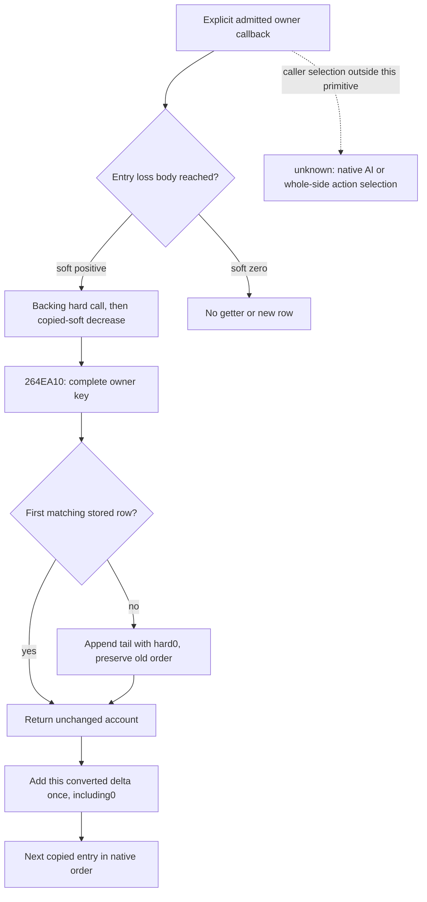

# Selected-owner H58 first-row creation — exact 1.20.0.3

2026-10-05 / ISO week 2026-W41. This increment lets an admitted owner-subset
retreat attribute loss to an owner that has no existing H58 row. The primitive
uses the existing complete, ordered participant ledger; it needs no new query,
DTO field or public function argument. Readiness is **static-ready conditional
primitive** after the new focused result recorded in the delivery packet.

The exact source is CK3 1.20.0.3, Steam build 25652598, EXE SHA-256
`94B55397ABB687A3DCD436805A5D885E6BE90FA6C693FEB44A9E3BBEEADE02A6`.
The previously sealed cache contained the numerical caller, but lacked
`264EA10`. Root authorized only this missing split function. Three contiguous
`.pdata` bodies at `264EA10..264EA7B`, `264EA7B..264EB53` and
`264EB53..264EB8D` captured **381 code bytes**; small PE and `.pdata` reads
bring the recorded total to **2673 bytes**. The combined code SHA-256 is
`72f14945c19cd2aca1705a27ca70e7b13fa97f1376cbd99a162554f2b53613d5`.
The frozen full-image SHA was reused; there was no full-image hash or scan.
Actual spans, file-offset read logs, disassembly and pins are under
`Z:/ck3_mod_rewrite_process_assets/g2-resume-20261005/battle-selected-owner-h58-append-v63/source-lane/`.
Its `TREE.md` and `API.json` were sealed before the projection was written.

`264EA10` receives the actual Side and the complete signed int32 owner key.
It scans Side+58, count at Side+64, stride24, comparing row+8 in stored order.
The first equal key returns directly, preserving the row's hard account,
position and other payload. It neither resolves a Character nor masks its
generation, checks death, deduplicates keys or sorts the ledger.

When no key matches, it appends at old count. The native tail receives the row
vtable at+0, the original key at+8, auxiliary int32 zero at+C and raw hard
int64 zero at+10. Both capacity paths retain the existing row order and return
the appended tail. The observable projection creates exactly
`{row_index: old_count, participant_character_id: full_owner, hard_casualties_raw: 0}`;
vtable and auxiliary memory are outside the published DTO. The generic native
allocator and header-commit helper are recorded by their direct operands; the
pure list operation projects the resulting ordered rows.

The getter has no hard-loss predicate. In the sealed numerical caller, each
reached soft-positive row performs backing hard apply, copied-soft decrease,
then `26528DA` or `2652AD4` calls the getter; `26528E4` or `2652AD9` adds that
row's converted hard quantity once. Legal hard0 still creates a missing row
and adds0. Soft0 skips the loss body and makes no getter call. Three reached
rows for a missing owner create one tail row, then find it for the second and
third increments without resetting the first delta.

The adopted `battle_selected_owner_subset_retreat_12003.py` public signatures
stay unchanged. Its per-entry owner writer now follows first-match/get-or-append
and records `owner_hard_writebacks_in_native_order`: stored ordinal, full owner
key, whether the row was created, zero initialization, prior hard, delta and
resulting hard. Existing row dictionaries retain metadata and order. The
account receives no second component or whole-census debit. Qualified-knight
backing bypass from V62 still reaches this owner writer; phase, date, draw
stream, winner, initial baselines and copied current retain their prior rules.

The sole new focused scenario distinguishes positive converted hard, positive
soft with hard0, and soft0. It checks first creation followed by same-owner
reuse, preserved unrelated ledger metadata and logical Q loss separately from
integer backing loss. The adopted V61 51 checks and V62 57 checks remain
historical and are not rerun for this increment. Exact counts, execution flags
and result pins are recorded in the adjacent external `ROOT-DELIVERY.json` and
`fixture-lane/attempt-01/RESULT.json`.

This package performs no native process, SDK, GUI, game-day or live action.
Actual horizon scheduling and native AI owner selection, invalid/fallback
graphs, whole-side retreat, C8 result attribution and movement/calendar remain
separate work. It does not infer a death or detach action from casualty values.
