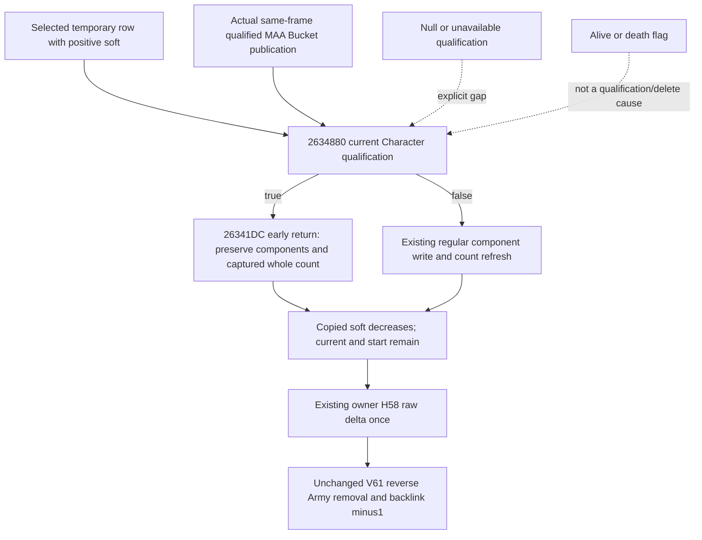

# Qualified knight backing branch in selected-owner retreat

This extends the adopted [V61 selected-owner retreat primitive](battle-selected-owner-subset-retreat-12003.md) so an explicitly qualified positive-soft knight can complete the modeled retreat account transform. Copied soft and owner hard change; knight components and captured whole backing remain. Native AI selection and actual game execution remain external.

Exact source is **CK3 1.20.0.3 / Steam25652598 / EXE SHA-256 `94B55397ABB687A3DCD436805A5D885E6BE90FA6C693FEB44A9E3BBEEADE02A6`**. Source caches were reused without EXE reread. The Oct5/W41 package is `Z:/ck3_mod_rewrite_process_assets/g2-resume-20261005/battle-selected-owner-knight-retreat-v62/`; `SOURCE-TREE-SEAL.json` was sealed before projection. V61's original 2/51 checks remain historical evidence and were not run again.

## Native branch and continued Q writeback

`2634880` checks Regiment+148 is not native -1, then resolves the current full Character generation and checks Character+1C `Char` magic and non-sentinel Character+18. Its complete leaf does not read alive, death, injuries, prowess or a Court Regiment backlink. Positive raw ID metadata alone does not establish the result.

`26341B0 ->26341D5 ->2634880` true branches at `26341DC` to `26344A7`, bypassing component soldier writers `2634374/2634467` and `26344A2 ->2633340` count reaggregation. This preserves the captured whole count; it neither recomputes a component sum nor substitutes 1 at this boundary.

The pursuit caller `2652420` has no return-value gate after this call. It continues with copied soft decrement at `2652832/2652A49`, then matching existing owner H58 addition at `26528E4/2652AD9`. Copied current/start and cached attributes remain. Q100000 hard attribution is not an additional whole-soldier loss and is not a named death/delete operation.

## Minimal input and observation seam

`KnightBackingHardQualification12003(knight_getter_result, source_context)` represents true, false or unavailable. The existing `SelectedOwnerSubsetPursuitInputs12003` appends optional `knight_backing_qualifications_by_regiment`, keyed by `(native_carmy_id, regiment_id)`. Existing positional numeric/context operands remain compatible. A caller-conditional future predicate outcome has its own provenance and is not relabelled as an actual originating frame.

`current_bucket_knight_backing_qualifications_12003(condition)` adapts the existing query's MAA rows. Actual same-frame published positive binding already required strict Character identity/magic plus reciprocal Court+F8 Regiment binding, which is stronger than `2634880`. Matching full Regiment/Army and source frame coordinates therefore provide true with provenance `current_bucket_qualified_knight_binding`. A declared native -1 supplies false. Null or absent publication remains unavailable; the stronger backlink query can fail while the weaker native predicate is true. A same-frame validated positive publication and a claimed actual false result are not one consistent source assertion.

The existing coefficient adapter automatically includes these witnesses. No new MCP, DTO, callback or actual frame field is required. The current source proof can be used as an explicitly frozen future assumption until the external timeline supplies an identity change.

The conditional kernel gives a qualified row no backing receiver during Q allocation, then restores its untouched original components. Character ID, Regiment/Army identity, bucket, current/start and cached stats are not rewritten to bypass a check. Qualified writeback records the early return and `backing_reaggregation_called=false`; captured whole backing is preserved separately. False uses the existing regular path. Positive unavailable qualification leaves that callback uninstalled. Zero-soft rows bypass the native loss body and require no witness.

The original selected pools/divisor1, owner callback order, reverse bucket copying, cached membership debits, reverse Army removal, H58 single delta and independent complete backing census are reused. Missing-H58 construction, invalid native mappings, whole-side retreat, C8 attribution, actual movement and AI/scheduler selection remain separate unimplemented domains.

## Focused evidence and readiness

Only two new focused cases ran once with `-B -O`: **FIRST GREEN, 57 checks, exit0**, without a failed attempt, fix or rerun. The final result and hashes are recorded in `ROOT-DELIVERY.json`. One combines ordinary levy soft250000/225000 and qualified MAA soft350000/275000. The hand-expected hard total is550000 Q100000; ordinary components lose2 integer soldiers while qualified components stay7/6 and their independently captured whole counts stay1/1. This distinguishes the bypass of component writes and count reaggregation from logical casualty conversion. The other distinguishes true/explicit conditional false/unavailable qualification, zero-soft bypass, callback order and preserved unknown rows. These are synthesized conditional inputs, not new native reachability or live-query evidence.

Readiness is **static-ready for the qualified-knight subset account branch**. All game days, SDK/pipe/GUI calls, actions, live queries and production loop credits are0. Complete retreat/native transition, full future calendar, Monte Carlo and win odds remain false. Root owns shared adoption, report/index integration and commit/push.
