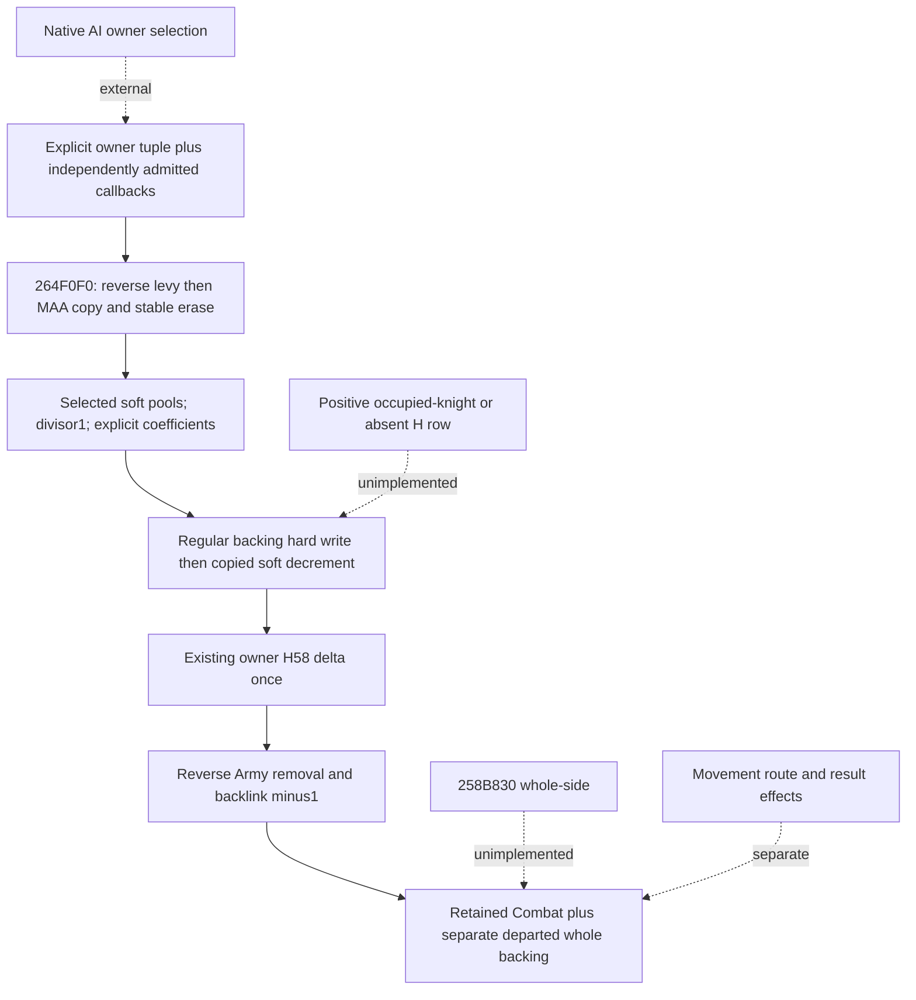

# Selected owner subset retreat and normal writeback, CK3 1.20.0.3

This **static-ready** primitive composes an externally selected tuple of owner CharacterIDs into conditional Combat membership and casualty consequences. It can estimate the selected owner's retreat loss while retaining allies and supplies a `CarriedBattleCondition` for subsequent battle kernels. It does not select the owner tuple or execute a game command.

Source: **1.20.0.3 / Steam25652598 / EXE SHA-256 `94B55397ABB687A3DCD436805A5D885E6BE90FA6C693FEB44A9E3BBEEADE02A6`**. Source bodies were reused from sealed caches; no EXE reread occurred. The tree/API were sealed before implementation in `Z:/ck3_mod_rewrite_process_assets/g2-resume-20261004/battle-selected-owner-subset-retreat-v61/SOURCE-TREE-SEAL.json`. Native runtime g63 was untouched.

## Native order and quantity domains

The actual mixed-owner move call at `258B25E ->258B281 ->264F0F0` supplies fifth flag true. The native AI owner selection and outer whole-side branch `258B830` are separate. Each input tuple member explicitly declares its own admitted callback; tuple order is preserved without sorting or deduplication. An owner CharacterID is not an ArmyID.

`264F0F0` copies selected levy in reverse native bucket order, then selected MAA in reverse bucket order. It stably erases those originals, debiting selected levy current from A0/98 and selected MAA current from98. Retained Entry payload and relative order remain. Initial A8/B0 baselines remain.

Before removing Armies, `264F7FD ->26520A0` receives the temporary selected buckets and their selected pre-loss soft sums for both pool operands. Its duration divisor is **1**, loaded at `26522D4`. Combat6E8/6F0 ordinary pursuit pools, runtime pursuit duration, phase-day manager increments, winner selection and SideC2 skip flags are not substituted. The runtime conversion is the corrected signed Q100000 slot **5C69B98**, not the superseded BB0 claim in older source artifacts.

The selected temporary buckets are processed forward, preserving reverse selection order. For regular backing, native order is hard backing write through `26341B0`, copied soft decrement, then existing owner H58 row increment. Copied current/start remain. H58 is not another whole loss debit. The low-level `apply_pursuit_day` arithmetic is reused with all coefficients explicit and divisor1; `run_current_pursuit_ticks` is not called.

After pursuit, the Army list is owner-filtered in reverse native order. `264F8BA ->264E180` removes each selected Army stably; `264F918` sets its Combat backlink to **-1**. Its persistent Regiment membership remains. Previously erased Combat entries are not debited again. Remaining Combat ID, phase/day/winner, commander/roll fields, draw stream and unrelated owners' accounts remain.

The independent all-Army backing census retains Regiments absent from Combat entries. Regular component after-values update each matching Regiment once. The current count uses native ordered signed32 component sums and kind3/current0 maximum fallback from `2633340`. Departed backing is retained separately from the surviving Combat census. Whole counts are scale1; current/soft/hard accounts are Q100000. No fractional remainder is converted into another integer census deduction.

## Pure interface and existing observations

`AdmittedSelectedOwnerRetreat12003` supplies Combat/side, ordered owner IDs, target Province, explicit `mixed_owner_branch_admitted`, flag and per-owner numeric context. `apply_selected_owner_subset_retreats_12003(carried, events, backing_by_army=...)` returns retained carry, per-owner native-order ledger, copied departed entries, independent whole backing views and typed gaps.

`selected_owner_pursuit_inputs_from_current_condition_12003` copies coefficients, corrected conversion and full-side modifiers from the existing condition's same-query blocks. It does not copy ordinary pools/duration/C2. These remain frozen conditional operands until the external timeline supplies a change. Existing `battle_control_snapshot_v1` identities, ordered buckets/Armies, current/soft/stats/H58; current pursuit/loss/modifier blocks; and the independent complete backing census cover this normal interface. No new MCP or DTO is added.

Missing positive numerical operands leave that callback uninstalled and its loss unavailable. A known zero-soft or nonpositive toughness branch closes to actual numerical **0** without inventing coefficients. Missing independent backing operands keep the affected after-census **None**, even if the Q loss is known. An empty census tuple is a real empty list. Native -1 backlinks are not null. No alive/dead flag deletes a row.

The normal positive-loss scope has regular non-knight components and an existing owner H58 row. Occupied-knight backing early-return/count qualification, absent-owner H58 construction/order, invalid native mapping fallback, C8 result attribution, whole-side retreat, final movement route/state and future admission remain explicitly unimplemented. Zero-soft knight rows bypass the loss body and can leave without attributing character death. Complete native transition, Monte Carlo and win odds remain false.

## Validation and integration boundary

Exactly two new focused cases ran once with `-B -O`: **GREEN, 51 checks, exit0, 0.1540875 seconds**. The execution result and exact source/module/test hashes are pinned in the package's `ROOT-DELIVERY.json`. They cover reverse bucket/Army order, owner-vs-Army identity, selected pools/divisor1, fractional Q versus integer backing losses, retained allies and extra census Regiments, callback tuple order, literal zero versus missing inputs, and typed partial branches. The independent hand vector produces **350000 Q100000 hard** and **2 whole soldiers lost**. No older suite or native/full build is repeated.

The adopted conditional horizon's selected action stage can consume `result.carried` and its separate backing views once the external timeline declares that source-ordered action. Its AI selection/scheduler placement is not fabricated as `action_selected=False`. This package supplies the typed primitive and leaves Root ownership of any shared horizon integration hunk.

Evidence and report fields: `Z:/ck3_mod_rewrite_process_assets/g2-resume-20261004/battle-selected-owner-subset-retreat-v61/`. New actual game days, SDK/pipe calls, actions, live queries, production loops and family credits are all **0**. This delivery adds conditional numerical value, not new live credit.
