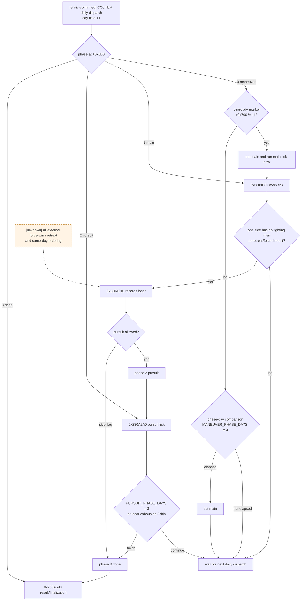
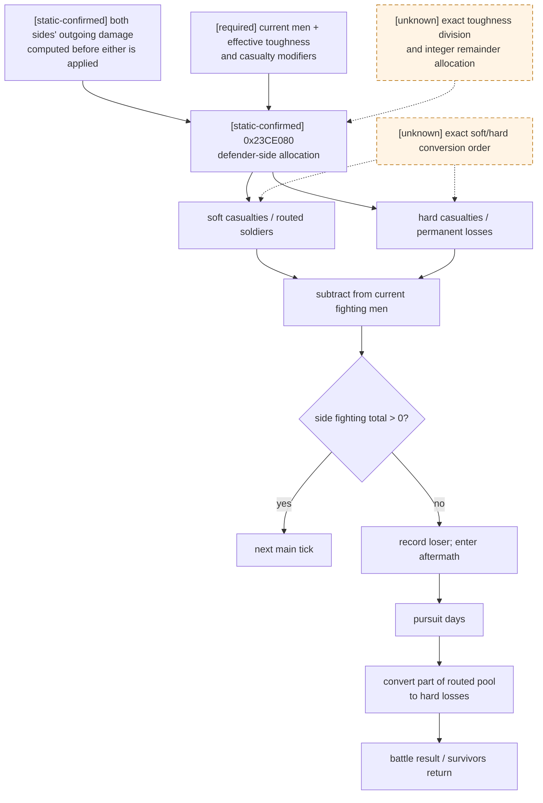
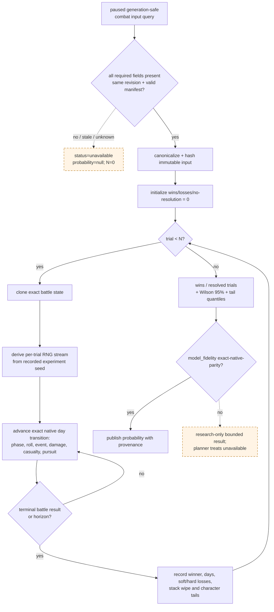

# CK3 1.19.0.6 原生战斗结算与 Monte Carlo 边界

## 当前结论

- [static-confirmed] 本文只绑定 CK3 `1.19.0.6` 的 `Crusader Kings III/binaries/ck3.exe`；文件大小
  `95,206,008` bytes，preferred image base `0x140000000`，SHA-256 为
  `2D00FF3101EF70B566F2FCBAE292F09263199C80E9DC8F139B82D7D96F83DB86`。下文地址均为 RVA。
- [static-confirmed] 原版的**确定性战斗预测器**与**真实战斗逐日结算器**是两条独立路径。RTTI 中存在
  `CalcCombatPredictionAndEdgesChangingAdvantage(...)`，而实际战斗由 `CCombat` phase/day dispatcher
  调用 main/pursuit tick。预测器返回的 ratio 不是胜率，也不是一次随机战斗样本；其调用者和 AI 阈值见
  [combat-prediction.md](combat-prediction.md)。
- [static-confirmed] 真实主阶段至少在 commander roll 和 combat phase event 路径消费随机数。对冻结输入而言，
  当日基础 damage/casualty 分配主体没有发现直接 RNG 调用，但这不等于整场战斗确定：每三日重掷和每五日
  phase event 会改变后续状态。
- [static-confirmed] **当前局没有做出合法的胜率模拟。** 当前 native bridge 连 army soldier aggregate 都明确
  unsupported，更缺双方 regiment/MAA 构成、有效属性、commander、knights、terrain/入场边、advantage、phase、
  soft/hard casualty、增援时序和 RNG/event 模型。因此当前结果必须是
  `win_probability.status = unavailable`、`value = null`、`sample_count = 0`。
- [counter-policy] 当前既不能证明“能打赢”，也不能证明“数学上不可战胜”。在 planner 的 fail-closed 语义中，
  它只能被当成**未证明安全的接战**；人数比、原生 prediction ratio 或战争分都不得填进 probability 字段。

证据标签沿用本目录约定：`static-confirmed` 是 exact-build EXE/同安装包原版数据直接支持；`inference` 是由
已证调用链推得但尚无完整 ABI/golden trace；`unknown` 以及 Mermaid 虚线均表示未闭合。

## 原版逐日状态机

### CCombat / CCombatSide 已闭合布局

| 字段或函数 | exact-build 证据 | 当前语义边界 |
|---|---|---|
| `CCombat+0x20` / `+0x368` | [static-confirmed] 两个相隔 `0x348` bytes 的 side base；`CCombatSide` RTTI/vtable 为 `0x54A3E10` / `0x4307940` | 左右 side；攻守角色由其它字段决定，不能仅由物理顺序猜 |
| `CCombat+0x6B0` | [static-confirmed] dispatcher `0x27FB6CE..0x27FB717` 分派 `0/1/2/3`；已见 phase transition 都向 `+0x6B0` 写 qword | low dword 是 `maneuver/main/pursuit/done`，同一 qword 写入会把 high dword phase-day 清零 |
| `CCombat+0x6B4` | [static-confirmed] `0x27FB6BA..0x27FB6C8` 每次 dispatcher 增一；phase code 用它比较阶段期限 | 当前 phase-day counter，切换 phase 时归零 |
| `CCombat+0x6C0/+0x6C4` | [static-confirmed] `0x2305580..0x2305824` 维护 base/final combat width；main damage 读取 `+0x6C4` | 最终战宽是 `int32` |
| `CCombat+0x6D0/+0x6D4` | [static-confirmed] `0x2309F09..0x2309F37` 写入两侧 roll | 当前 commander rolls |
| `CCombat+0x6D8` | [static-confirmed] `0x23053B0..0x230557B` 写 advantage damage multiplier | CFixedPoint，scale `100000` |
| `CCombat+0x6E0` | [static-confirmed] `0x230A010..0x230A080` 写 loser side index；pursuit tick 只接受 `0/1` | 败方 side index；`-1` 表示尚未确定 |
| `CCombat+0x6E4` | [static-confirmed] main tick 自增后对 `COMBAT_ROLL_DAYS` 取模 | roll cadence counter |
| `CCombat+0x6C8` | [static-confirmed] `0x23045F0..0x23046EF` 对增减后的值 clamp 到 `[-100,+100]` | base/static signed advantage accumulator |
| `CCombat+0x710` | [static-confirmed] `0x2308D50..0x2308DCE` 以 `+0x6C8 + side[0] contribution - side[1] contribution` 重算；main tick 以正负选择哪一侧得到 bonus | 当前 resolved signed advantage；未证明最终值另有 `[-100,+100]` clamp |
| `CCombatSide+0x98` | [static-confirmed] `0x23CB840..0x23CB8C4` 汇总两个 `0x60`-byte entry array 的 `+0x18` | main tick 的 still-fighting/参与规模内部总量；与 GUI `GetCurrentFightingMen` 的 exact reflection thunk 尚未闭合 |
| `CCombatSide+0xA0` | [static-confirmed] 同一函数只汇总第一组 entries | 第一组 subtotal；精确 troop-kind 名称未完全闭合 |

### 每日 phase dispatcher



- [static-confirmed] phase dispatcher 是 `0x27FB617..0x27FB76B`；phase `1` 调 `0x2309E80`，phase `2`
  调 `0x230A2A0`，phase `3` 调 `0x230A590`。
- [static-confirmed] maneuver 使用 `MANEUVER_PHASE_DAYS=3`；main 没有固定天数，直到一侧的汇总 fighting
  population 不再为正，或外部 retreat/forced-result 路径确定 loser。
- [static-confirmed] `MIN_DAYS_BEFORE_MANUAL_RETREAT=14` 是同版本原版 define；EXE RTTI 还证明
  `CSetCombatSideAllowEarlyRetreat`、`CSetCombatSideDisallowRetreat`、`CSetCombatSideSkipPursuit` 和
  `CForceCombatSideWinEffect` 存在。
- [unknown] 手动/AI retreat 的完整 validator、十四日门槛与 allow/disallow override 的先后次序尚未闭合，
  Monte Carlo 不能擅自假设“永不撤退”或“第十四日必撤”。

## 参战者与战宽

### 参战集合不是静态人数

- [static-confirmed] side 内至少有两组 `0x60`-byte entry arrays；`0x23CB840` 每日重新汇总它们，证明伤亡或
  participant 变化会进入下一 tick，而不是开战时只读一次总人数。
- [static-confirmed] `0x2305580` 在 participant 变化路径重算 combat width。以两个 side 内部总量记作
  `S_left`、`S_right`，该 helper 的算术骨架为：先对 `(S_left + S_right)` 除二，再乘 `BASE_WIDTH_RATIO`；
  base width 只增不减；之后乘 province 已解析的 terrain width，最后 clamp 到
  `MINIMUM_COMBAT_WIDTH=100`。用内部整数/CFixedPoint 顺序表示为：

  ```text
  base_candidate = trunc(((S_left + S_right) / 2) * BASE_WIDTH_RATIO)
  W_base         = max(previous_W_base, max(1, base_candidate))
  W_final        = max(MINIMUM_COMBAT_WIDTH, trunc(W_base * terrain_width))
  ```

  `00_defines.txt:597` 的注释仍说“defender size”；上式记录的是该 exact EXE helper 的实际加法、除二、
  max 与 terrain 顺序。`S_left/right` 到公开 GUI soldier count 的语义桥尚未闭合，不能用 UI 目测人数替换。
- [static-confirmed] `terrain_types/_terrains.info:8` 定义 `combat_width` 为 terrain multiplier；例如 hills `0.8`、
  mountains/desert mountains `0.5`、wetlands `0.6`。terrain 还可分别给 attacker/defender modifier 和 combat
  effect，不能只带一个 width 数字。
- [unknown] 增援恰在 roll/event 同日加入时的完整先后次序、离场/第三方敌对 participant policy、跨军 owner
  modifier 合并顺序尚未闭合。只要战斗期间可能到达的增援 ETA 未知，pre-contact forecast 就必须 unavailable。

## 主阶段：roll、advantage、兵种与 damage

### 已闭合的 tick 骨架

`0x2309E80..0x230A007` 对每个 main tick 按下列顺序执行：

1. [static-confirmed] 调 `0x23CB840` 重算两侧 totals；任一侧不再为正则进入 loser/phase transition。
2. [static-confirmed] 对两侧调用 `0x23CA2F0` 刷新 combat-side/regiment 状态。
3. [static-confirmed] 当 `+0x6E4==0` 时，对两侧调用 `0x23CBFA0` 生成 commander roll，写入
   `+0x6D0/+0x6D4`；随后 cadence counter 对 `COMBAT_ROLL_DAYS=3` 取模。
4. [static-confirmed] 调 `0x23053B0` 从 signed advantage 计算 damage multiplier。
5. [static-confirmed] 对两侧都调用 `0x23CB1D0`，先计算双方 outgoing damage 和 regiment attribution；两边都
   算完之后，才分别调用 `0x23CE080` 把预先算好的伤害施加给对方。这防止先结算的一侧在同一日失去其已经
   计算出的反击伤害。

### Commander roll 与 advantage

- [static-confirmed] `0x23CBFA0..0x23CC188` 解析 commander/side modifiers，读取两个 modifier slot
  `0x108/0x109` 及 combat effect slot `+0x76E/+0x770`，再叠加默认 `COMMANDER_MIN_ROLL=0`、
  `COMMANDER_MAX_ROLL=10`。
- [static-confirmed] 有效区间长度为 `abs(max-min)+1`；`0x23CC150` 调全局 random 入口 `0x356A0A0`，对
  区间长度做有符号 remainder 修正并加下界。因此每次 roll 是有效闭区间上的离散均匀整数；modifier 可能改变
  两个边界，不能固定采样 `0..10`。
- [static-confirmed] `0x23045F0..0x23046EF` 把 base/static advantage accumulator `+0x6C8` clamp 到
  `[-100,+100]`；`0x2308D50..0x2308DCE` 再加入一侧 contribution、减去另一侧 contribution，写入
  resolved `+0x710`。`0x23053B0` 对 resolved 值计算：

  ```text
  advantage_damage_multiplier = 1 + abs(advantage) * ADVANTAGE_DAMAGE_SCALING_FACTOR / 100
  ```

  该版本 `ADVANTAGE_DAMAGE_SCALING_FACTOR=5`。main tick 依据 `+0x710` 正负，只把 multiplier 给占优侧；
  另一侧使用 `1.0`。
- [unknown] terrain、river/strait、defender、commander traits、supply/debt/disembark、动态 combat effects 和
  两侧 rolls 如何按确切顺序进入 `+0x710` 尚未完全闭合。Monte Carlo 不能仅采样 roll 差后漏掉其它来源。

### MAA、counter、knights 与攻击聚合

- [static-confirmed] `men_at_arms_types/_men_at_arms_types.info:25-50` 规定每种 MAA 至少有 `damage`、
  `toughness`、`pursuit`、`screen`、`fights_in_main_phase`、terrain bonus、counter archetypes/effectiveness 和
  sub-regiment `stack`。
- [static-confirmed] levy 基础值为 damage/toughness `10/10`，pursuit/screen `0/0`；knight 每点 prowess
  提供 base damage/toughness `50/10`。这是基础数据库值，不是 live effective stat。
- [static-confirmed] `0x23CF1B0..0x23CF96C` 先按 archetype 累计 opposing counter pressure 与本侧有效
  regiment chunks，再输出每个 archetype 的 damage multiplier。其顶层关系与 defines 一致：

  ```text
  counter_multiplier[a]
    = 1 - MEN_AT_ARMS_MAX_COUNTER
          * min(1, effective_counter_pressure[a]
                   / (own_effective_chunks[a] * RATIO_FOR_MAX_COUNTER))
  ```

  该版本 cap 为 `0.9`，max-counter ratio 为 `2.0`；零 own chunks 直接保留 `1.0`。
- [static-confirmed] `0x23CAE70..0x23CB1C8` 把该 per-archetype multiplier 施加到 regiment attack-like
  contribution，并生成 per-regiment attribution；`0x23CB1D0` 还通过 `0x23DB1C0` 等 helper 加入 knights 和
  character/army modifiers。
- [unknown] depleted regiment 如何变成 effective chunks、counter effectiveness/resistance 的全部 modifier
  聚合、同 archetype 多来源的 fixed-point 截断点，以及 knight effectiveness/伤残状态的完整 helper 语义尚未
  闭合。因此上式能证明 counter 的顶层形状，不能单靠 stock type 表复刻 live `effective_counter_pressure`。

### Outgoing damage 的闭合外壳

`0x23CB1D0..0x23CB7BD` 先计算战宽参与比例，再将有效攻击聚合依次乘 damage scaling、advantage 和战宽：

```text
width_fraction = min(1, W_final / side_current_fighting_men)
outgoing_damage = effective_attack_after_counter_and_modifiers
                  * DAMAGE_SCALING_FACTOR
                  * advantage_damage_multiplier_for_this_side
                  * width_fraction
```

- [static-confirmed] 该版本 `DAMAGE_SCALING_FACTOR=0.03`；乘除均走 CFixedPoint scale `100000` 的
  overflow-safe 路径，顺序和 truncation 不能换成浮点“一次乘完”。
- [static-confirmed] `fights_in_main_phase=no` 的类型不能被当作普通主阶段 damage unit；它仍可能贡献 pursuit/
  screen。
- [unknown] `effective_attack_after_counter_and_modifiers` 的所有 stationing/building/culture/accolade/army/
  commander/terrain modifier source 尚未完整枚举。任何一个 base stat 乘人数的简化都只能叫 approximation，
  不能叫 native parity。

## Casualty、路由与追击

### 不是独立的“士气条”模型

- [static-confirmed] 原版 combat GUI 暴露的是 `GetCurrentFightingMen`、`GetSoftCasualties` 和
  `GetHardCasualties`；本版本 main tick 以 side fighting total 是否仍为正决定继续或落败。已闭合路径中没有
  发现一个与 soldier casualties 分离、归零即败的 classic morale meter。
- [static-confirmed] 原文本把 soft casualties 称为 routed soldiers：战后能返回，但可在 aftermath/pursuit
  被转成 hard casualties；hard casualties 是永久死亡/重伤损失。`BASE_RATIO_CASUALTIES_CONVERSION=0.3`
  是 main phase 的基础 soft-to-hard conversion 参数。
- [static-confirmed] `0x23CE080..0x23CEA01` 把预先计算的 outgoing damage 分配到 defending side entries，
  调 `0x23DB230`、`0x23DB660`、`0x23CDF70` 更新 attribution 与 casualty state。此函数主体没有直接调用
  global random `0x356A0A0`。
- [inference] 对冻结 effective toughness、modifier 和两侧预先计算 damage 而言，该日 numeric casualty
  allocation 是确定性的；这尚不是整场确定性，因为 roll/phase event 会改变后续输入，且被调 helper 的完整
  transitive RNG audit 尚未形成 golden trace。
- [unknown] damage 到 soft/hard casualty 的完整 per-entry 配额、toughness 除法、余数分配、clamp/round 顺序、
  `hard_casualty_modifier`/enemy modifier 的作用点尚未闭合。不得用社区公式或连续浮点近似填补。



### Pursuit / screen

- [static-confirmed] loser index `+0x6E0` 选择撤退侧；`0x230A2A0..0x230A58A` 选择相反 side 为 pursuer，
  检查胜方/pursuer 对应的 skip-pursuit flag，并以 `PURSUIT_PHASE_DAYS=3` 为期限。
- [static-confirmed] pursuit tick 汇总 winner 的 pursuit-like entries 和 loser 的 screen-like entries，再调用
  `0x23CD2E0`。该 helper 读取双方 combat modifiers、调用 `0x23CC3D0/0x23CC5D0/0x23CC830/
  0x23CCA00`，最后通过 `0x23CD660` 更新 casualty entries。
- [static-confirmed] 原版 defines 给出 `BASE_RATIO_CASUALTIES_CONVERSION_PURSUIT=1`、
  `PURSUIT_STAT_TO_PURSUIT_DAMAGE=0.5`、`BASE_TOUGHNESS_TO_PURSUIT=0.05` 和
  `MINIMUM_PURSUIT_DAMAGE=0.01`。其注释明确说 pursuit 与 screen 的差会改变 routed-to-hard conversion，且
  高 screen 也不能低于 `1%` floor。
- [unknown] 上述四个 define 在 helper 中的逐步乘除、按三日分摊和 remainder 分配尚未全部命名闭合；只能把
  注释语义与调用链作为静态输入，不能宣称已经复刻 exact pursuit 公式。

## 随机性与 PRNG 边界

### 已发现的 random 入口

| RVA | [static-confirmed] 所在路径 | 对 Monte Carlo 的含义 |
|---:|---|---|
| `0x23CC150` | commander roll；对 effective inclusive range 取 remainder | 已闭合为离散均匀 roll，但 seed/state/stream 未闭合 |
| `0x23C9957` | `CCombatSide` phase-event 路径；一次 engine random 后又执行确定性 hash 混合 | 不能把所有 knights/events 当独立同分布 coin flip |
| `0x23042D4` | combat event/context 构造路径 | conditional draw schedule 仍需命名 |
| `0x2307B23` | combat phase-event/context 构造路径 | 与脚本 weighted event 求值的完整消费次序 unknown |
| `0x230AFBD`, `0x230B07C` | battle finish/result 两侧事件 envelope | 影响结果事件/展示及可能的角色后果；完整语义 unknown |

- [static-confirmed] 上述 call 都进入 exact-build 全局 random helper `0x356A0A0`。这份 bounded scan 只证明
  已定位 combat/combat-side 路径的直接 calls，不证明 CK3 全局没有其它可重入随机源。
- [static-confirmed] `combat_phase_events/_combat_phase_events.info:1-22` 规定 commander 或每名 knight 每
  `COMBAT_EVENT_DAYS` 求值；valid entries 以脚本 `chance` 权重竞争，选中后运行 `effect`。该版本 interval 为
  `5` 日，stock scripts 包含 none、wound、maim、death 等事件，且 chance 会读 prowess、兵力比、traits、
  culture/accolade 等状态。
- [unknown] `0x356A0A0` 的 PRNG 算法、state owner、save/load serialization、不同 subsystem stream、同日
  roll/event/伤亡的完整 draw order 均未闭合。没有这些证据，不能声称对当前 CK3 timeline 做 seed-exact replay。

### 三个容易混淆的量

| 名称 | 性质 | 能否称为胜率 |
|---|---|---|
| native combat prediction ratio | [static-confirmed] 独立 predictor helper 对冻结军队/province 输入给出的确定性评分量；AI 用阈值比较 | 否；没有概率标定证据 |
| real battle result | [static-confirmed] actual phase/day state machine 在真实 RNG、events、retreat、reinforcement 下得到的一次结果 | 否；这是一次样本 |
| offline Monte Carlo estimate | [future] 对 exact transition 和正确随机分布重复 `N` 次后的 `wins/N` 与区间 | 是，但只有输入和模型 parity 完整时 |

即使未来能调用 native predictor，也不能把 ratio `0.75` 写成 `75%`。相反，Monte Carlo 不要求知道当前
timeline 的唯一 engine seed 才能估计分布，但必须知道每个随机入口的**分布、条件和消费次序**；若要复现当前
timeline，则还必须闭合 seed/state/stream。

## Monte Carlo 所需的完整输入

权威的只读查询/schema/fail-closed 契约见
[combat-simulation-inputs.md](combat-simulation-inputs.md)。下面是 actual transition 不能缺少的输入全集；任一项
无法在同一 paused revision 原子观测，结果必须整体 `unavailable`，不能把未知写成零、默认值或人数比。

| 输入组 | 每次 forecast 必需字段 |
|---|---|
| provenance / rules | game version、EXE SHA、所有实际加载的 defines/MAA/terrain/combat effects/phase events/modifier 数据 deterministic manifest、simulator build、CFixedPoint scale 与每个 trunc/clamp 顺序 |
| encounter identity | encounter ProvinceID、attacker/defender、入场 adjacency（none/river/large river/strait）、开始 date/tick、pre-contact 或 ongoing 模式、明确的 victory/stack-wipe/no-resolution 定义 |
| participant set | 两侧每个 full-generation Army/CUnit ID、owner/war side、开始时是否已加入、可在战斗期间加入/离开的 army、逐日 ETA 与同日 join order；未知增援不得静默排除 |
| every regiment | regiment full ID、kind（levy/MAA/event/siege-only 等）、MAA type/archetype、current/max soldiers、soft/hard casualty state、stack/chunk size、`fights_in_main_phase`、是否仍 active |
| effective combat stats | 每个 regiment 在该 battle context 下已聚合的 damage/toughness/pursuit/screen、terrain bonus、counter targets/effectiveness、counter resistance/efficiency，以及 owner/army/stationing/building/culture/accolade/winter/holding 的最终有效结果 |
| terrain / status | resolved terrain 与 combat-width multiplier、两侧 terrain modifiers/effects、holding defender、river/strait、supply state、debt tier、recently disembarked days、gathering、其它 active combat effects |
| commander | 两侧 CharacterID、是否有效/在场、martial/prowess、traits/modifiers、effective min/max roll、base advantage/effects、可能死亡/受伤/替换的逐日状态转移 |
| knights | 每位 knight CharacterID、prowess、knight effectiveness、traits/health、参战 eligibility、damage/toughness contribution、每个 phase-event 的 trigger/weight/effect 以及受伤/致残/死亡后移除时点 |
| advantage / width | 开始时每个 advantage source、当前 signed advantage、current rolls 与 cadence、base/final combat width、width 更新历史，以及动态 effect 的增删时点 |
| ongoing state | exact phase、phase-day/counters、loser index、current fighting men、两组 side entries、soft/hard casualties、per-regiment attribution、still-fighting flags、已选/待选 events |
| retreat policy | manual retreat 最早日、allow/disallow/skip-pursuit/force-win flags、玩家/AI 在每个可决策 tick 的 deterministic policy 或抽样 policy、retreat destination 对 participant/追击的影响 |
| randomness | commander roll 的 effective distribution、所有 phase/result event 的 valid set 与权重、条件 draw schedule、独立 sampler 的明确算法与 seed；若声称 timeline replay，另需 exact engine PRNG state/stream |
| experiment | canonical input hash、sample count `N`、simulation horizon/no-resolution rule、seed、player-win definition、需统计的 hard/soft loss、battle days、stack wipe、commander/knight wound/death tail outcomes |

## Monte Carlo 执行逻辑



执行契约：

1. [counter-policy] 默认建议 `N=100000`，记录 64-bit experiment seed；同一 input hash、simulator build、seed、
   `N` 必须复现相同摘要。
2. [counter-policy] 每个 trial 必须从同一 immutable initial state 开始，按原程序同日顺序推进，不能每个阶段
   重新从均值初始化。
3. [counter-policy] 输出至少包含 `wins/losses/no_resolution`、point estimate、Wilson 95% interval、battle-day
   与双方 hard-casualty quantiles、stack-wipe probability、commander/knight death or injury probability。
4. [counter-policy] Wilson interval 只衡量有限样本误差，不覆盖模型缺字段/公式错误；`model_fidelity` 不是
   `exact-native-parity` 时，planner 不得用该区间授权接战。
5. [counter-policy] 若使用独立 sampler，必须明确写出它估计的是同规则分布，不是当前 CK3 timeline 的唯一
   未来；若要 seed-exact timeline replay，则 PRNG state/stream 和所有 conditional draws 都必须闭合。

## 当前局的 fail-closed 审计

当前 adapter 的证据在 `ck3_autonomous_player/native_bridge/research/README.md` 明确写着
`army soldier count: unsupported`。Python 规范化层兼容一个可选 `soldiers` 字段，不代表 exact-build native
producer 已发布该字段。

| 当前局所需信息 | 当前是否可得 | 结论 |
|---|---:|---|
| player/hostile army identity、Province、route、combat/retreat state | 是 | 只够定位和动作状态机 |
| 每军 current soldiers | 否 | 连总人数都不能作为 exact input |
| levy/MAA/event troop/regiment 构成与 effective stats/counters | 否 | main damage 不可算 |
| commander、effective roll bounds、knights/prowess/events | 否 | 随机分布与战力不可算 |
| terrain、attacker/defender、river/strait、supply/debt/disembark | 否 | width/advantage 不可算 |
| current phase/day、roll、advantage、soft/hard casualties | 否 | ongoing battle 无法续算 |
| reinforcement join/leave schedule | 否 | participant set 不闭合 |
| exact casualty/pursuit parity 与 phase-event RNG schedule | 否 | simulator transition 不闭合 |

因此当前局的唯一诚实输出是：

```json
{
  "status": "unavailable",
  "model_fidelity": "not-simulated",
  "player_win_probability": null,
  "sample_count": 0,
  "can_prove_player_wins": false,
  "can_prove_opponent_unbeatable": false,
  "planner_engagement_gate": "fail-closed"
}
```

这也回答“对手是否根本不可战胜”：**未查明**。`null` 不是 `0%`；它表示输入和原生 transition 都不完整。
在这些缺口关闭前，任何“按人数看大概能赢”或“prediction ratio 看起来安全”的说法都不是模拟结果。

## 静态闭合账本

### 已闭合，可做 golden trace 的外壳

- [static-confirmed] 四阶段 enum、daily dispatcher、main/pursuit/finalize 调用边。
- [static-confirmed] 两侧 total 的逐日重算、零 fighting-total 触发 loser transition。
- [static-confirmed] commander roll 每三日重掷、effective inclusive integer range 与直接 RNG 入口。
- [static-confirmed] base advantage clamp、resolved side-difference，以及只给占优侧的
  `1 + abs(A)*5/100` damage multiplier。
- [static-confirmed] combat width helper 的 average/base-ratio/max-history/terrain/minimum 外壳。
- [static-confirmed] counter cap/ratio 的 per-archetype multiplier 外壳。
- [static-confirmed] main outgoing damage 的 `effective attack × 0.03 × advantage × width_fraction` 顺序。
- [static-confirmed] 双方 outgoing damage 先全部计算再施加、pursuit loser/skip/duration 主干。

### 未闭合，禁止标记 exact-native-parity

- [unknown] 每个 `0x60`-byte combat entry 的完整字段命名、CArmy/CRegiment live container 与 generation ABI。
- [unknown] 所有 effective stat/modifier 聚合、depleted chunks/counter resistance 的精确求值与截断。
- [unknown] advantage source 的完整集合、优先级、同日 roll/effect/reinforcement 顺序。
- [unknown] damage→toughness→soft/hard casualties 的 per-entry 分配与 rounding golden trace。
- [unknown] pursuit 四个 define 的完整逐指令公式、三日 remainder 分摊与 retreat-loss modifiers。
- [unknown] manual/AI retreat、allow/disallow/force-win 与 skip-pursuit 的完整 validator/order。
- [unknown] commander/knight phase event 的全部 trigger/chance/effect、角色状态反馈与 draw schedule。
- [unknown] engine PRNG algorithm/state/stream ownership，以及 save/load 后的 deterministic replay ABI。
- [unknown] 动态增援、离场、第三方敌对与同日到达的 participant policy。

### 可施工的最短闭合顺序

当前不能达到 exact-native-parity Monte Carlo。后续实现应按依赖顺序关闭下列 ABI/golden-trace gate；前一项
未通过时不得通过后一项“猜一个值”绕开：

1. `combat-simulation-input-v1` 原子快照：paused 同一 revision 内 generation-safe 解析
   `CUnit -> CArmy -> CCombat`，发布 attacker/defender、participant ArmyIDs、
   `+0x6B0/+0x6B4/+0x6C0/+0x6C4/+0x6C8/+0x6D0/+0x6D4/+0x6E0/+0x6E4/+0x710`
   以及两个 side 的完整 entry arrays；任一链接失效则
   整体 unavailable。
2. Regiment ABI：闭合 CArmy regiment containers 和每个 CRegiment 的 full ID、type/archetype、current/max、
   main-phase eligibility、soft/hard state、stack/chunk；以原生 helper 的 effective damage/toughness/pursuit/
   screen 和 counter multiplier 输出为边界，禁止进程外重猜 modifier 聚合。
3. Encounter ABI：从 CProvince/入场 edge 发布 terrain key/width、attacker/defender modifiers、river/large-river/
   strait、holding、winter、supply/debt/disembark/gathering 及全部 active combat effects。
4. Character ABI：发布两侧 commander、effective min/max roll 与 advantage contributions，以及每名 knight 的
   ID/prowess/effectiveness/health/event eligibility；事件造成伤残/死亡或 commander replacement 后必须能在
   下一 tick 更新。
5. Numeric golden traces：用原程序 trace 固定 equal-levy、mixed MAA counter、terrain/width、knight、
   casualty conversion、pursuit/screen 和 ongoing-resume vectors，逐指令锁定 CFixedPoint truncation、clamp 与
   remainder；不能用待测模拟器自己生成 expected。
6. Participant/retreat traces：锁定 same-day reinforcement join order、leave/third-party cases、manual/AI retreat、
   allow/disallow/force-win/skip-pursuit 和 pursuit transition。
7. RNG/event parity：闭合 `0x356A0A0` 的所需分布与 conditional call schedule，完整执行 stock + loaded
   commander/knight event triggers/weights/effects。分布型 Monte Carlo 至少需要等价 sampler；timeline replay
   还需 engine seed/state/stream。
8. 只有上述 fixture 全部与 exact-build original trace 对齐，才能把输出从 `research-only` 升级为
   `exact-native-parity`；在此之前 planner 始终读取 unavailable。

## 复现入口与原版证据

只读反汇编可从仓库根目录复现，例如：

```powershell
& "tools/.venv/Scripts/python.exe" ck3_autonomous_player/native_bridge/research/disasm_ck3.py 0x27FB617 --size 0x160
& "tools/.venv/Scripts/python.exe" ck3_autonomous_player/native_bridge/research/disasm_ck3.py 0x2309E80 --size 0x190
& "tools/.venv/Scripts/python.exe" ck3_autonomous_player/native_bridge/research/disasm_ck3.py 0x23CBFA0 --size 0x1E8
& "tools/.venv/Scripts/python.exe" ck3_autonomous_player/native_bridge/research/disasm_ck3.py 0x23CB1D0 --size 0x5F0
& "tools/.venv/Scripts/python.exe" ck3_autonomous_player/native_bridge/research/disasm_ck3.py 0x230A2A0 --size 0x2EB
```

同版本原版数据锚点：

- `Crusader Kings III/game/common/defines/00_defines.txt:578-626`
- `Crusader Kings III/game/common/men_at_arms_types/_men_at_arms_types.info:25-53`
- `Crusader Kings III/game/common/terrain_types/_terrains.info:1-9`
- `Crusader Kings III/game/common/terrain_types/00_terrains.txt`
- `Crusader Kings III/game/common/combat_effects/00_combat_effects.txt`
- `Crusader Kings III/game/common/combat_phase_events/_combat_phase_events.info:1-24`
- `Crusader Kings III/game/common/combat_phase_events/00_commander_phase_events.txt`
- `Crusader Kings III/game/common/combat_phase_events/00_knight_phase_events.txt`

本次工作仅离线读取原版文件/EXE；没有启动、暂停、恢复、注入、调用或操作 CK3，也没有修改自动玩家生产代码。
