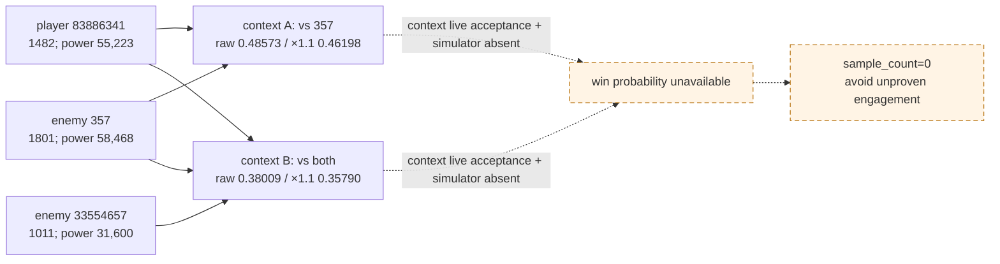
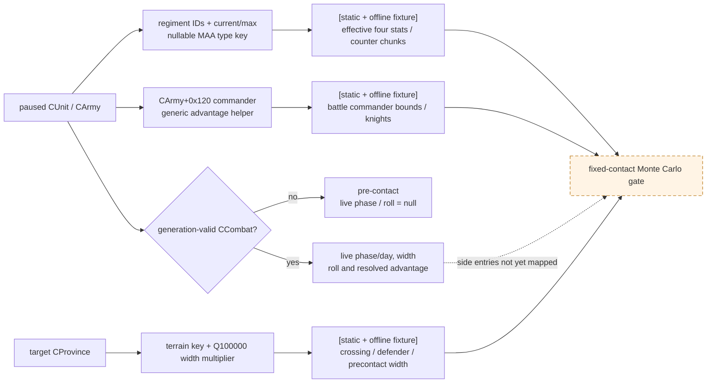
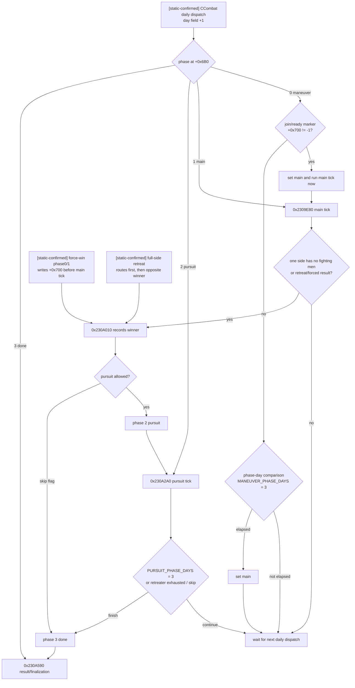
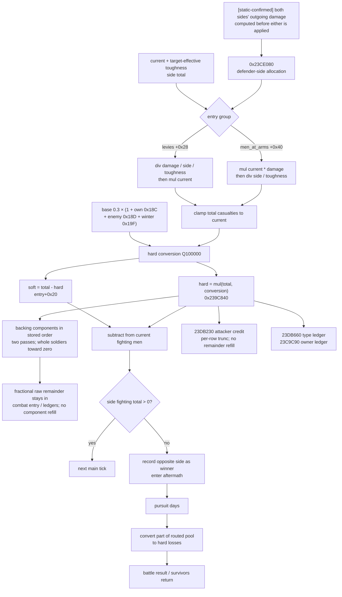
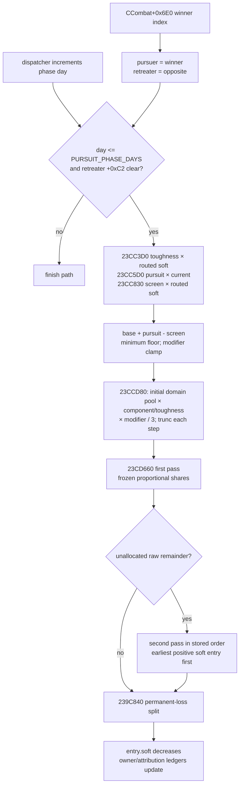
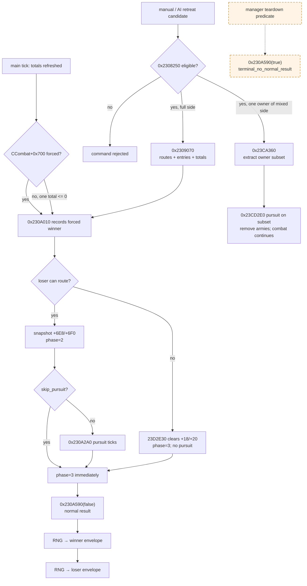
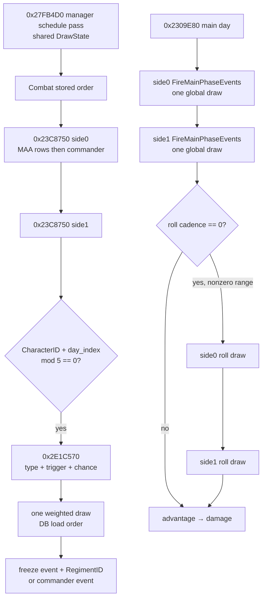
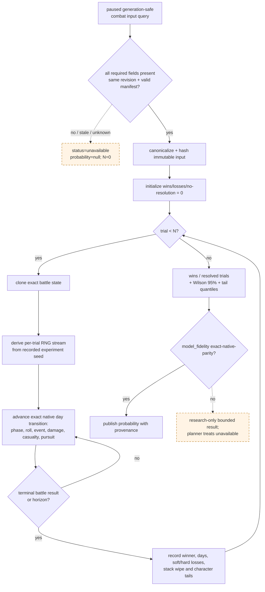

# CK3 1.19.0.6 原生战斗结算与 Monte Carlo 边界

## 当前结论

- [static-confirmed] 本文只绑定 CK3 `1.19.0.6` 的 `Crusader Kings III/binaries/ck3.exe`；文件大小
  `95,206,008` bytes，preferred image base `0x140000000`，SHA-256 为
  `2D00FF3101EF70B566F2FCBAE292F09263199C80E9DC8F139B82D7D96F83DB86`。下文地址均为 RVA。
- [static-confirmed] 原版的**确定性战斗预测器**与**真实战斗逐日结算器**是两条独立路径。RTTI 中存在
  `CalcCombatPredictionAndEdgesChangingAdvantage(...)`，而实际战斗由 `CCombat` phase/day dispatcher
  调用 main/pursuit tick。预测器返回的 ratio 不是胜率，也不是一次随机战斗样本；其调用者和 AI 阈值见
  [combat-prediction.md](combat-prediction.md)。
- [static-confirmed] 真实主阶段在 commander roll 和 combat phase event 路径消费随机数；当日基础
  damage/casualty 分配主体不直接消费 RNG。每三日 roll、每五日 phase-event selection/schedule、核心 draw31 和
  同日消费顺序已经闭合；stock candidate 的 13-row 表和主要状态转移也已整理，但 actual loaded evaluator 与
  original effect trace 仍会改变后续角色/side 状态。
- [live-confirmed] **当前局仍没有做出合法的胜率模拟。** `army-strength-v1` 已在 paused revision `4` 发布并
  实机返回玩家/敌军 current/max soldiers、regiment count 与 AI base-power aggregate；士兵 aggregate 不再
  “不可观测”。下一层 `combat-simulation-inputs-v2` 的 per-regiment/effective stats、commander/knights、
  terrain/crossing/roles/width 已有 production offline fixture，但 paused live acceptance 尚未完成；transition
  simulator、loaded effect evaluator/original trace、battle-end/retreat 也尚未完成。因此当前结果必须是
  `win_probability.status = unavailable`、`value = null`、`sample_count = 0`。
- [live-blocker → superseded] 旧 `combat-simulation-inputs-v1` 需要调用前已经存在可匹配的 current
  position/move-to-target 接触形状；当前玩家 `83886341@2596` 与两敌 `357/33554657@2581` 无法构造同一个
  v1 三军 gate。生产 v2 改为显式 target、attacker final-edge entry 与有序 A/D partitions，不依赖先下 move；
  其 conditional request order 也不冒充真实 arrival/Province full-CUnitID 数值序与 daily contact queue。详见
  [combat-simulation-inputs.md](combat-simulation-inputs.md)。
- [counter-policy] 当前既不能证明“能打赢”，也不能证明“数学上不可战胜”。在 planner 的 fail-closed 语义中，
  它只能被当成**未证明安全的接战**；人数比、原生 prediction ratio 或战争分都不得填进 probability 字段。

### 当前战局的 live strength 边界（paused revision 4）

| ArmyID | side | current / max soldiers | regiments | AI base power（raw / 100000） |
|---:|---|---:|---:|---:|
| `83886341` | player | `1482 / 2243` | `38` | `5522300000 / 55223` |
| `33554657` | active-war enemy | `1011 / 1011` | `22` | `3160000000 / 31600` |
| `357` | active-war enemy | `1801 / 3751` | `23` | `5846800000 / 58468` |
| combined enemies | diagnostic sum | `2812 / 4762` | `45` | `9006800000 / 90068` |

- [live-confirmed] 上表来自同一 paused revision 的 `ck3_query_army_strengths`，不是屏幕估算。
- [inference] 只用 base aggregate，player vs `357` 的 raw diagnostic share 是 `0.48573`，若单独施加已证
  enemy-lane `×1.1` 是 `0.46198`；player vs 两敌合流分别是 `0.38009` / `0.35790`。两种 participant set
  必须是两个独立 pre-contact context，不能缓存复用。
- [counter-policy] base-power share 没有 terrain、crossing、commander、knights、MAA counter、战宽、伤亡与
  RNG/event，因此不是概率。敌军合计 current soldiers 约为玩家 `1.90×`、base power 约 `1.63×`，足以要求
  当前策略避免两敌合流接战；却不足以宣称对 `357` 或两敌“绝对不可能获胜”。



证据标签沿用本目录约定：`static-confirmed` 是 exact-build EXE/同安装包原版数据直接支持；`inference` 是由
已证调用链推得但尚无完整 ABI/golden trace；`unknown` 以及 Mermaid 虚线均表示未闭合。

## 原版逐日状态机

### CCombat / CCombatSide 已闭合布局

| 字段或函数 | exact-build 证据 | 当前语义边界 |
|---|---|---|
| `CCombat+0x20` / `+0x368` | [static-confirmed] 两个相隔 `0x348` bytes 的 side base；`CCombatSide` RTTI/vtable 为 `0x54A3E10` / `0x4307940` | 左右 side；攻守角色由其它字段决定，不能仅由物理顺序猜 |
| `CCombat+0x6B0` | [static-confirmed] dispatcher `0x27FB6CE..0x27FB717` 分派 `0/1/2/3`；已见 phase transition 都向 `+0x6B0` 写 qword | low dword 是 `maneuver/main/pursuit/done`，同一 qword 写入会把 high dword phase-day 清零 |
| `CCombat+0x6B4` | [static-confirmed] `0x27FB6BA..0x27FB6C8` 每次 dispatcher 增一；phase code 用它比较阶段期限 | 当前 phase-day counter，切换 phase 时归零 |
| `CCombat+0x6B8` | [static-confirmed] `0x2305749..0x2305758` 解引用其 `CProvince+0x20 → +0xB8` terrain chain；serializer 的 `CCombat+0x10` base-subobject 视图也把对应字段按 Province reference 处理 | 当前 encounter Province；只有 live CCombat 存在时可读 |
| `CCombat+0x6C0/+0x6C4` | [static-confirmed] `0x2305580..0x2305824` 维护 base/final combat width；main damage 读取 `+0x6C4` | 最终战宽是 `int32` |
| `CCombat+0x6D0/+0x6D4` | [static-confirmed] `0x2309F09..0x2309F37` 写入两侧 roll | 当前 commander rolls |
| `CCombat+0x6D8` | [static-confirmed] `0x23053B0..0x230557B` 写 advantage damage multiplier | CFixedPoint，scale `100000` |
| `CCombat+0x6E0` | [static-confirmed] `0x230A010..0x230A080` 写 winner side index；`0x230A2A0` 只接受 `0/1`，并显式选择相反 side 作为 retreater | 胜方 side index；`-1` 表示尚未确定。旧稿把它误写成 loser index，已由 pursuit caller 的双侧选择纠正 |
| `CCombat+0x6E4` | [static-confirmed] main tick 自增后对 `COMBAT_ROLL_DAYS` 取模 | roll cadence counter |
| `CCombat+0x6C8` | [static-confirmed] `0x23045F0..0x23046EF` 对增减后的值 clamp 到 `[-100,+100]` | base/static signed advantage accumulator |
| `CCombat+0x710` | [static-confirmed] `0x2308D50..0x2308DCE` 以 `+0x6C8 + side[0] contribution - side[1] contribution` 重算；main tick 以正负选择哪一侧得到 bonus | 当前 resolved signed advantage；未证明最终值另有 `[-100,+100]` clamp |
| `CCombatSide+0x98` | [static-confirmed] `0x23CB840..0x23CB8C4` 汇总两个 `0x60`-byte entry array 的 `+0x18` | main tick 的 still-fighting/参与规模内部总量；与 GUI `GetCurrentFightingMen` 的 exact reflection thunk 尚未闭合 |
| `CCombatSide+0xA0` | [static-confirmed] 同一函数只汇总第一组 entries | 第一组 subtotal；精确 troop-kind 名称未完全闭合 |

### 未接战可读 vs live CCombat-only

本轮沿 GUI reflection callback 与战宽 helper 把输入生命周期拆开。下表只绑定页首 exact build：

| 输入 | paused、未接战 | live CCombat | exact ABI / 边界 |
|---|---:|---:|---|
| 每 regiment current/max | 是 | 是 | `CArmy+0x38/+0x44` full CRegimentID array；generation-valid object `+0x38/+0x3C` |
| nullable MAA type key | 是 | 是 | `CRegiment+0x118` `CMenAtArmsType*`；validity vcall 后读 type `+0x18`；null-object 只表示 absent，不能直接命名 levy |
| target-effective damage/toughness/pursuit/screen | 是，exact ABI 已闭合；MCP 待发布 | 是 | `0x239CAE0(CRegiment*,Stats38*,CProvince*)`；四维在 output `+0x18/+0x20/+0x28/+0x30`，signed Q100000；raw soldier/power 字段不是四维属性 |
| raised-army commander | 是 | 是，但不保证等于 battle-side commander | `0x2278F70(CArmy*)`：`CArmy+0x120` full CharacterID → storage `base+0x570C130` → `CCharacter+0x18` 回读；fallback 必须拒绝 |
| generic commander advantage | 是 | 是 | `int32 0xBC5410(CCharacter*,-1,false)`；是 GUI canonical generic points，不是最终 encounter advantage |
| terrain key / width multiplier | 是 | 是 | `0x220D940(CProvince*)=[[province+0x20]+0xB8]`；`CTerrainType+0x18` key、`+0x58` signed Q100000 width multiplier |
| crossing / defender role | 是，显式 target + participant set | 是 | contact constructor `0x2209C45..0x2209D0F` 的 origin→target adjacency scan；`side0=attacker`、`side1=defender`，kind `0/1/2/3=normal/strait/river/large_river`；严格失败边界见 [combat-simulation-inputs.md](combat-simulation-inputs.md) |
| pre-contact initial base/final width | 是，显式 participant set | 是 | v2 严格镜像 contact constructor 的双方 total→average→ratio→terrain→minimum 顺序；与已有 CCombat 当前 width 是不同字段 |
| phase/day、live current base/final width、roll、resolved advantage | 否，必须 `null` | 是 | generation-valid CCombat 的 `+0x6B0/+0x6B4`、`+0x6C0/+0x6C4`、`+0x6D0/+0x6D4`、`+0x710` |
| knights / combat-side commander bounds | 是，显式 participant armies | 是 | knight list core `0x19DD670` / pre-contact `CRegiment+0x148` full CharacterID；roll helper `0x23CBFA0` 只作逆向证据，paused query 镜像 bounds、不得消费其 RNG |



### 每日 phase dispatcher



- [static-confirmed] phase dispatcher 是 `0x27FB617..0x27FB76B`；phase `1` 调 `0x2309E80`，phase `2`
  调 `0x230A2A0`，phase `3` 调 `0x230A590`。
- [static-confirmed] maneuver 使用 `MANEUVER_PHASE_DAYS=3`；main 没有固定天数，直到一侧的汇总 fighting
  population 不再为正，或外部 retreat/forced-result 路径确定 winner。
- [static-confirmed] `MIN_DAYS_BEFORE_MANUAL_RETREAT=14` 与 `0x2308250` 的机器分支共同证明：未获 early override
  时 elapsed whole days 必须严格 `>14`，第十四日仍拒绝；disallow、early、phase 与 landless gate 的顺序，以及
  allow/disallow/skip-pursuit/force-win effect writer 均已闭合，详见下文 battle-end section。
- [unknown] AI 的主动撤退 policy 与 destination selection 仍未闭合；共享 validator 只证明“何时合法”，不证明
  “何时一定执行”。Monte Carlo 必须显式冻结 policy，不能擅自假设永不撤退或第十五日必撤。

## 参战者与战宽

### 参战集合不是静态人数

- [static-confirmed] side 内至少有两组 `0x60`-byte entry arrays；`0x23CB840` 每日重新汇总它们，证明伤亡或
  participant 变化会进入下一 tick，而不是开战时只读一次总人数。
- [static-confirmed] `0x2305580` 在 participant 变化路径重算 combat width。以两个 side 内部总量记作
  `S_left`、`S_right`，该 helper 的算术骨架为：先对 `(S_left + S_right)` 除二，再乘 `BASE_WIDTH_RATIO`；
  base width 只增不减；之后乘 province 已解析的 terrain width，最后 clamp 到
  `MINIMUM_COMBAT_WIDTH=100`。用内部整数/CFixedPoint 顺序表示为：

  ```text
  base_candidate = trunc(((S_left + S_right) / 2) * BASE_WIDTH_RATIO)
  W_base         = max(previous_W_base, max(1, base_candidate))
  W_final        = max(MINIMUM_COMBAT_WIDTH, trunc(W_base * terrain_width))
  ```

  `00_defines.txt:597` 的注释仍说“defender size”；上式记录的是该 exact EXE helper 的实际加法、除二、
  max 与 terrain 顺序。`S_left/right` 到公开 GUI soldier count 的语义桥尚未闭合，不能用 UI 目测人数替换。
- [static-confirmed] `terrain_types/_terrains.info:8` 定义 `combat_width` 为 terrain multiplier；例如 hills `0.8`、
  mountains/desert mountains `0.5`、wetlands `0.6`。terrain 还可分别给 attacker/defender modifier 和 combat
  effect，不能只带一个 width 数字。
- [static-confirmed] exact helper 在 `0x2305749..0x2305758` 从 `CCombat+0x6B8` 取 Province，经
  `CProvince+0x20 → +0xB8` 得 `CTerrainType*`，再读 `CTerrainType+0x58` signed qword；default 分支使用
  `100000`。随后 `0x2305760..0x2305824` 按 CFixedPoint scale `100000` 乘 base width 并 clamp。因此
  `query-combat-simulation-inputs-v2` 可以在 pre-contact 复用 `0x220D940(CProvince*)` 发布 terrain key 和该
  multiplier。pre-contact v2 已以显式 final-edge entry、target 与 fixed participant totals 镜像 constructor 并发布 initial
  `W_base/W_final`；不能把这组初始 width 冒充 live CCombat 经动态 join/history 更新后的当前 width。
- [unknown] 增援恰在 roll/event 同日加入时的完整先后次序、离场/第三方敌对 participant policy、跨军 owner
  modifier 合并顺序尚未闭合。它们不阻塞显式
  `participant_policy=explicit_hypothetical_fixed_at_contact_no_reinforcements` 的条件 v2 输入；但只要真实动态 forecast 要覆盖
  路线上可能到达的军队，就必须使用独立 route-timing port，不能把 fixed-contact 结果直接外推。

## 主阶段：roll、advantage、兵种与 damage

### 已闭合的 tick 骨架

`0x2309E80..0x230A007` 对每个 main tick 按下列顺序执行：

1. [static-confirmed] 调 `0x23CB840` 重算两侧 totals；任一侧不再为正则记录相反侧 winner 并进入 phase transition。
2. [static-confirmed] 对两侧调用 `0x23CA2F0` 刷新 combat-side/regiment 状态。
3. [static-confirmed] 当 `+0x6E4==0` 时，对两侧调用 `0x23CBFA0` 生成 commander roll，写入
   `+0x6D0/+0x6D4`；随后 cadence counter 对 `COMBAT_ROLL_DAYS=3` 取模。
4. [static-confirmed] 调 `0x23053B0` 从 signed advantage 计算 damage multiplier。
5. [static-confirmed] 对两侧都调用 `0x23CB1D0`，先计算双方 outgoing damage 和 regiment attribution；两边都
   算完之后，才分别调用 `0x23CE080` 把预先算好的伤害施加给对方。这防止先结算的一侧在同一日失去其已经
   计算出的反击伤害。

### Commander roll 与 advantage

- [static-confirmed] `0x23CBFA0..0x23CC188` 解析 commander/side modifiers，读取两个 modifier slot
  `0x108/0x109` 及 combat effect slot `+0x76E/+0x770`，再叠加默认 `COMMANDER_MIN_ROLL=0`、
  `COMMANDER_MAX_ROLL=10`。
- [static-confirmed] 有效区间长度为 `abs(max-min)+1`；`0x23CC150` 调全局 random 入口 `0x356A0A0`，对
  区间长度做有符号 remainder 修正并加下界。因此每次 roll 是有效闭区间上的离散均匀整数；modifier 可能改变
  两个边界，不能固定采样 `0..10`。
- [static-confirmed] `0x23045F0..0x23046EF` 把 base/static advantage accumulator `+0x6C8` clamp 到
  `[-100,+100]`；`0x2308D50..0x2308DCE` 再加入一侧 contribution、减去另一侧 contribution，写入
  resolved `+0x710`。`0x23053B0` 对 resolved 值计算：

  ```text
  advantage_damage_multiplier = 1 + abs(advantage) * ADVANTAGE_DAMAGE_SCALING_FACTOR / 100
  ```

  该版本 `ADVANTAGE_DAMAGE_SCALING_FACTOR=5`。main tick 依据 `+0x710` 正负，只把 multiplier 给占优侧；
  另一侧使用 `1.0`。
- [unknown] terrain、river/strait、defender、commander traits、supply/debt/disembark、动态 combat effects 和
  两侧 rolls 如何按确切顺序进入 `+0x710` 尚未完全闭合。Monte Carlo 不能仅采样 roll 差后漏掉其它来源。

### MAA、counter、knights 与攻击聚合

- [static-confirmed] `men_at_arms_types/_men_at_arms_types.info:25-50` 规定每种 MAA 至少有 `damage`、
  `toughness`、`pursuit`、`screen`、`fights_in_main_phase`、terrain bonus、counter archetypes/effectiveness 和
  sub-regiment `stack`。
- [static-confirmed] levy 基础值为 damage/toughness `10/10`，pursuit/screen `0/0`；knight 每点 prowess
  提供 base damage/toughness `50/10`。这是基础数据库值，不是 live effective stat。
- [static-confirmed] `0x23CF1B0..0x23CF96C` 先按 archetype 累计 opposing counter pressure 与本侧有效
  regiment chunks，再输出每个 archetype 的 damage multiplier。其顶层关系与 defines 一致：

  ```text
  counter_multiplier[a]
    = 1 - MEN_AT_ARMS_MAX_COUNTER
          * min(1, effective_counter_pressure[a]
                   / (own_effective_chunks[a] * RATIO_FOR_MAX_COUNTER))
  ```

  该版本 cap 为 `0.9`，max-counter ratio 为 `2.0`；零 own chunks 直接保留 `1.0`。
- [static-confirmed] wrapper 的 direct ABI 已闭合为
  `0x23CF1B0(countered_entries RCX, countering_entries RDX, out_by_class R8, context_scale R9)`；每个 input
  是 `data +0/count +0xC` 的 array header，entry stride `0x60`，只消费 full CRegimentID `+0x08` 与 current
  soldiers Q100000 `+0x18`。`0x23D2B90` 把 current 除以 inner type `+0x68` stack size得到 depleted chunk；
  inner type `+0x270` 是 class，`+0x2B8/+0x2C4` 是 `{class,effectiveness}` target array。
- [static-confirmed] `0x2946B50` 组合被克制侧 owner 的 counter resistance enum `0x107` 与实施克制侧 owner 的
  efficiency enum `0x106`：`max(0,1-resistance)*(1+efficiency)`；该值作为 R9，helper 再 clamp 到非负。
  输出长度来自 `0x82DC40()+0xF14` class count，元素是 damage retention Q100000；`0x23CAE70` 随后按
  countered regiment class 读取并乘 `entry+0x40` effective damage。
- [static-confirmed] target-effective四维的 canonical pre-contact evaluator 是
  `Stats38* 0x239CAE0(CRegiment*,Stats38* out,CProvince* target)`。live side helper `0x23D2CE0` 调它并把
  `Stats38 +0x18/+0x20/+0x28/+0x30` 复制到 combat entry `+0x40/+0x48/+0x50/+0x58`，所以显式 target
  Province 可在没有 CCombat 时复用同一原生聚合，不能再以“只能接战后读取”为由留空。
- [static-confirmed] `0x23CAE70..0x23CB1C8` 把该 per-archetype multiplier 施加到 regiment attack-like
  contribution，并生成 per-regiment attribution。此前把 `0x23DB1C0` 写成 knight helper 是错误的：它只向
  side/ledger 的 `0x50`-byte `{type pointer, int32 variant, int64 contribution}` row 查找或累加贡献，不能用来
  枚举骑士。真正的 live knight list core 是 `0x19DD670`，来源为 combat-side MAA entries 指向的
  `CRegiment+0x148` full CharacterID；pre-contact 也从 participant army 的同一 regiment 字段读取。
- [static-confirmed] pre-contact knight effectiveness/贡献与 regiment levy/MAA 分类已闭合。counter wrapper 的
  modifier-owner 不再是无来源 unknown：`0x23C9361..0x23C93E7` 令 `CCombatSide+0x70` 采用首个插入 CArmy 的
  owner。真实 native contact 的 mixed-owner defenders 由 target Province `+0x748/+0x754` CUnitID stored order
  形成；v2 conditional query 则以 caller 的有序 attacker/defender arrays 作为 synthetic insertion order，并固定
  `defender_insertion_order_policy=explicit_request_order_hypothetical`。因此“玩家单军 vs 两敌合流”可按条件 request
  order 首军 owner 施工最终 defender counter multiplier；但该结果不得声称复刻真实 arrival/Province order。

### Outgoing damage 的闭合外壳

`0x23CB1D0..0x23CB7BD` 先计算战宽参与比例，再将有效攻击聚合依次乘 damage scaling、advantage 和战宽：

```text
width_fraction = min(1, W_final / side_current_fighting_men)
outgoing_damage = effective_attack_after_counter_and_modifiers
                  * DAMAGE_SCALING_FACTOR
                  * advantage_damage_multiplier_for_this_side
                  * width_fraction
```

- [static-confirmed] 该版本 `DAMAGE_SCALING_FACTOR=0.03`；乘除均走 CFixedPoint scale `100000` 的
  overflow-safe 路径，顺序和 truncation 不能换成浮点“一次乘完”。
- [static-confirmed] `fights_in_main_phase=no` 的类型不能被当作普通主阶段 damage unit；它仍可能贡献 pursuit/
  screen。
- [unknown] `effective_attack_after_counter_and_modifiers` 的所有 stationing/building/culture/accolade/army/
  commander/terrain modifier source 尚未完整枚举。任何一个 base stat 乘人数的简化都只能叫 approximation，
  不能叫 native parity。

## Casualty、路由与追击

### 不是独立的“士气条”模型

- [static-confirmed] 原版 combat GUI 暴露的是 `GetCurrentFightingMen`、`GetSoftCasualties` 和
  `GetHardCasualties`；本版本 main tick 以 side fighting total 是否仍为正决定继续或落败。已闭合路径中没有
  发现一个与 soldier casualties 分离、归零即败的 classic morale meter。
- [static-confirmed] 原文本把 soft casualties 称为 routed soldiers：战后能返回，但可在 aftermath/pursuit
  被转成 hard casualties；hard casualties 是永久死亡/重伤损失。`BASE_RATIO_CASUALTIES_CONVERSION=0.3`
  是 main phase 的基础 soft-to-hard conversion 参数。
- [static-confirmed] `CCombatSide+0x28/+0x34` 是 serializer key `levies`，`+0x40/+0x4C` 是
  `men_at_arms`；两者元素都是 `0x60` bytes 的 `CCombatRegiment`。其 serializer 把 `+0x08/+0x10/+0x18/+0x20`
  分别命名为 `regiment/starting/current/soft_casualties`，四个数量字段中的后三者按 Q100000 保存。
- [static-confirmed] `void 0x23CE080(CCombatSide* defending, int64 incoming_damage_raw,
  CCombatSide* attacking)` 把已经算好的对方 outgoing damage 施加给 defending side。定义
  `mul(a,b)=trunc(a*b/100000)`、`div(a,b)=trunc(a*100000/b)`；它们是原生 signed CFixedPoint 的
  overflow-safe 等价运算，不能合并成一次浮点乘除。对每个 `current>0` 的 levy entry，原生严格按下式逐步截断：

  ```text
  share_raw        = div(incoming_damage_raw, defending.total_fighting_men_raw)
  levy_ratio_raw   = div(share_raw, levy.toughness_raw)
  total_casualties = clamp(mul(levy.current_raw, levy_ratio_raw), 0, levy.current_raw)
  ```

  `toughness_raw==0` 的 levy 分支最终 clamp 为零。对每个 `current>0 && toughness>0` 的 MAA entry，乘除顺序
  刻意不同：

  ```text
  weighted_damage  = mul(maa.current_raw, incoming_damage_raw)
  side_share_raw   = div(weighted_damage, defending.total_fighting_men_raw)
  total_casualties = min(maa.current_raw, div(side_share_raw, maa.toughness_raw))
  ```

- [static-confirmed] hard conversion 的 modifier enum 已由同一 binary metadata 顺序闭合：`0x18C` 是
  `hard_casualty_modifier`，`0x18D` 是 `enemy_hard_casualty_modifier`，`0x19F` 是
  `hard_casualty_winter`。`0x23C8FF0` 分别求 defending 的 `0x18C` 和 attacking 的 `0x18D`；本场 combat
  context 有效时再从 `CCombat+0x30` modifier container 求 `0x19F`。作用点和截断顺序是：

  ```text
  conversion_raw = mul(BASE_RATIO_CASUALTIES_CONVERSION_raw,
                       100000 + defending_hard_modifier_raw
                              + attacking_enemy_hard_modifier_raw
                              + combat_hard_winter_raw)
  hard_raw = mul(total_casualties, conversion_raw)
  soft_raw = total_casualties - hard_raw
  ```

  该函数在 `conversion_raw` 或 `hard_raw` 外没有额外 `clamp(0,1)`；模拟器不得擅自补 clamp。原版数据通常让
  该值处于合理区间，但 fixture 必须保留这一指令边界。
- [static-confirmed] `void 0x23CDF70(CCombatSide* defending, int64 soft_raw, int64 hard_raw,
  CCombatRegiment* entry)` 执行状态写入：`entry+0x20 += soft_raw`、`entry+0x18 -= soft_raw+hard_raw`，再以
  `0x239C840(CRegiment*, hard_raw)` 把永久损失写回底层 regiment。它随后沿
  `CRegiment+0x140 -> CArmy+0x124 -> CUnit+0x174` 取得 owner CharacterID，经 `0x23C9C90` 找/建 defending
  participant row，并令该 row `+0x10 += hard_raw`。callee 在 `0x23CDF7F` 保存的是 `R8=hard_raw`；这里不是
  soft ledger。
- [static-confirmed] 两个 attribution helper 也不抽样。`0x23DB230(attacking+0xC8, hard_raw,
  incoming_damage_raw)` 遍历攻击方 `0x50`-byte attribution rows，把
  `div(mul(row+0x10, hard_raw), incoming_damage_raw)` **逐 row** 加到 `row+0x18`；每 row 截断后的余数不会
  分配给最后一项。`0x23DB660(defending+0xC8, CRegiment+0x18, hard_raw)` 则按 regiment-associated type
  pointer、variant `-1` 找/建 row，并令 `row+0x28 += hard_raw`。
- [static-confirmed] 因而在冻结 entries、effective toughness、四个 conversion 输入和双方 outgoing damage 后，
  这一层 entry casualty 与 attribution 更新是确定性的，函数及上述三个直接 helper 均不调用全局 random
  `0x356A0A0`。
- [static-confirmed] `void 0x239C840(CRegiment* regiment, int64 hard_raw)` 的底层分摊也已闭合。
  函数先要求 `regiment+0x08` 嵌入对象的 `vcall[1]` 为真、`0x239CEB0(regiment)` 为假且
  `regiment+0x38 != 0`；然后按 `regiment+0x20` 容器的存储顺序（count 在 `+0x2C`、descriptor stride
  `0x10`）用 `0x23821B0` 解析每个 backing component。component `+0x00/+0x04` 是 max/current
  int32，`+0x18` 是 kind。对 `kind==3 && current==0` 的特殊编码，本轮容量取 `max`、setter
  基值取 `0`；否则两者都取 `current`。
- [static-confirmed] 第一遍对每个非空、selected-count 非零的 component 严格执行：

  ```text
  cap_raw       = selected_count * 100000
  candidate_raw = div(selected_count * original_hard_raw, cap_raw)
  candidate_raw = min(candidate_raw, cap_raw)
  allocated_raw = min(remaining_raw, candidate_raw)
  whole_soldiers = trunc(allocated_raw / 100000)
  0x23D3090(component, setter_base - whole_soldiers)
  remaining_raw -= allocated_raw
  ```

  其中 `div` 仍是 signed CFixedPoint division，所有 `idiv` 和 reciprocal-multiply 路径都向零截断。
  在正数、不溢出的正常战斗域，`candidate_raw` 数学上等于
  `min(original_hard_raw, cap_raw)`；实现仍不得把中间乘除合并，因为原程序先用 signed
  64-bit `imul` 生成 `selected_count * original_hard_raw`，再进入 CFixedPoint 的 overflow-avoiding
  division 分支。若前一乘法本身超出 int64，x64 结果是低 64 bit；该 helper 不另行拒绝。
- [static-confirmed] 第一遍在 `remaining_raw<=0` 时立即停止。结束后只要
  `remaining_raw>=0`（包含恰好为零），还会按同一容器顺序走第二遍；此遍不再做前述
  fixed division，直接取 `allocated_raw=min(remaining_raw, selected_count*100000)`，再向零截成整数
  soldier 写入。两遍都没有“最后 component 吃 remainder”规则：例如分配 `156516` raw 时，
  backing component 只减 `1` 人，`56516` 不会再写入其它 component；但它仍存在
  `CCombatRegiment` hard casualty 和归因 ledger 中。最后 `0x239BAD0(regiment)` 重算底层聚合。
  这条路径无 RNG。
- [static-confirmed] 该 helper 不在入口 clamp `hard_raw`。负值在 signed 算术下可使
  `whole_soldiers<0`，从而增加 component current；过大正值也可以进入第二遍。这些是原生
  边界而非我方应修正的规则；fixture 需保留 signed/truncation 行为，生产 query 则应原样返回
  native 值而不自行拦截。

最小正数 golden vector（所有值均为 raw Q100000）固定如下；它同时覆盖 levy/MAA 两种截断顺序和 attribution
余数丢弃：

| 输入/输出 | levy entry | MAA entry |
|---|---:|---:|
| `current_raw` | 40000000 | 60000000 |
| `toughness_raw` | 1100000 | 1300000 |
| side total / incoming damage | 100000000 / 31000000 | 同左 |
| total casualties | 1127200 | 1430769 |
| conversion (`base=30000`, summed multiplier `135000`) | 40500 | 40500 |
| hard / soft | 456516 / 670684 | 579461 / 851308 |

若攻击 attribution 的 `row+0x10` 为 `[18000000,13000000]`，两次 hard-credit 增量分别是
`[265073,191442]` 与 `[336461,242999]`；累计 `[601534,434441]`，合计 `1035975`，比实际 hard 总量
`1035977` 少 `2` 个 raw unit。这个 `2` 是逐 row 截断造成的归因 remainder，不得回填到任一 row，也不得反向
改写真实 casualty state。

同一 mixed levy+MAA fixture 再冻结两个底层容器：levy backing current 按存储顺序为
`[3,5]`，MAA backing current 为 `[2,5]`，kind 均不是特殊值 `3`。对上表的 levy hard
`456516`，第一个 component 分得 `300000` 并由 `3 -> 0`，第二个分得 `156516`
但只由 `5 -> 4`；对 MAA hard `579461`，两个 component 分别得 `200000/379461`，
由 `[2,5] -> [0,2]`。因此底层整数永久损失是 `4+5=9` 人，而 combat entry 中的 hard raw
仍是 `456516+579461=1035977`。该向量同时锁定“按存储顺序”、每 component 向零截断、
分数 remainder 不回填和 levy/MAA 两条 entry 公式。



### Pursuit / screen

- [static-confirmed] `CCombat+0x6E0` 是 **winner** side index。`0x230A2A0..0x230A3C7` 令
  `pursuer = side[winner]`、`retreater = side[1-winner]`，读取 retreater `+0xC2` byte，并以
  `PURSUIT_PHASE_DAYS` 比较 `CCombat+0x6B4`。dispatcher `0x27FB6BA..0x27FB6DF` 先把 phase-day 加一；
  phase 切换把 day 清零，故 stock `3` 精确执行 day `1/2/3` 三次 casualty tick，day `4` 进入结束路径。
  `+0xC2` 的脚本/API 名称仍未命名，因此这里只记录实际 receiver，不把它猜成胜方 flag。
- [static-confirmed] `0x23CD2E0` 的 exact ABI 是：

  ```text
  void pursuit_tick(
      CCombatSide* retreater,                 // RCX
      Array60* retreater_levies,              // RDX = retreater+0x28
      Array60* retreater_men_at_arms,         // R8  = retreater+0x40
      int64 initial_levy_soft_raw,            // R9  = CCombat+0x6E8
      int64 initial_maa_soft_raw,             // stack arg5 = CCombat+0x6F0
      int64 current_levy_soft_raw,            // stack arg6
      int64 current_maa_soft_raw,             // stack arg7
      CCombatSide* pursuer,                   // stack arg8
      int32 pursuit_phase_days);              // stack arg9
  ```

  两个 array 均按原生存储顺序、stride `0x60` 遍历；entry `+0x18/+0x20/+0x48/+0x50/+0x58`
  分别是 current、soft casualties、effective toughness、pursuit、screen，数量和四维均是 signed Q100000。
- [static-confirmed] 令 `mul/div` 仍为前文逐步向零的 signed Q100000 运算，原生三个聚合 helper 精确计算：

  ```text
  toughness_soft_raw = sum_entries mul(entry.toughness_raw, entry.soft_raw)
  if toughness_soft_raw > 0:
      toughness_soft_raw = max(toughness_soft_raw, 100000)

  pursuit_raw = mul(
      sum_pursuer_entries mul(entry.pursuit_raw, entry.current_raw),
      PURSUIT_STAT_TO_PURSUIT_DAMAGE_raw)

  screen_raw = sum_retreater_entries mul(entry.screen_raw, entry.soft_raw)
  ```

  对应入口是 `0x23CC3D0`、`0x23CC5D0`、`0x23CC830`；每个 helper 都先遍历 levies、再遍历 MAA，
  每 entry 乘法后立即向零截断再相加。`toughness_soft_raw<=0` 时 `0x23CD2E0` 直接返回。
- [static-confirmed] modifier enum `0x105` 从 pursuer 读取 pursuit efficiency，`0x18B` 从 retreater 读取
  retreat losses；caller 的唯一 clamp 是：

  ```text
  pursuit_modifier_raw = max(0, 100000 + pursuer_mod_0x105 + retreater_mod_0x18B)
  base_raw    = mul(BASE_TOUGHNESS_TO_PURSUIT_raw, toughness_soft_raw)
  minimum_raw = mul(MINIMUM_PURSUIT_DAMAGE_raw, toughness_soft_raw)
  proposed_raw = base_raw - screen_raw + pursuit_raw
  extra_raw = max(0, pursuit_raw - screen_raw)
  floor_component_raw = max(
      extra_raw > 0 ? base_raw : proposed_raw,
      minimum_raw)
  ```

  `0x23CCA00(pursuer,max(proposed_raw,minimum_raw),base_raw,pursuit_raw)` 只重建 pursuer attribution
  ledger；retreater 的真实 casualty state 由后面的两个 component 决定，不能把 attribution rounding 反写伤亡。
- [static-confirmed] `0x23CCD80(out,initial_soft,component,toughness,pursuit_modifier,days)` 对 levy/MAA
  各调用两次，严格执行：

  ```text
  ratio_raw = div(component_raw, toughness_soft_raw)
  daily_raw = mul(initial_domain_soft_raw, ratio_raw)
  daily_raw = mul(daily_raw, pursuit_modifier_raw)
  daily_raw = div(daily_raw, pursuit_phase_days * 100000)
  ```

  两个输出依次是 `extra_raw` 和 `floor_component_raw` 的当日 hard-casualty budget。这里用 phase 开始时冻结在
  `CCombat+0x6E8/+0x6F0` 的 initial soft pool，而不是每天缩小的 current pool；最后分配才以 current soft
  为上限。stock defines 的 raw 值为 conversion `100000`、pursuit-stat multiplier `50000`、base `5000`、
  minimum `1000`、days `3`。
- [static-confirmed] `0x23CD660` 对一个 domain 的两个 budget `A/B` 做 exact allocation。若
  `A+B>current_domain_soft`，它先令 `A=mul(A,div(current,A+B))`，再令 `B=current-A`，因此 cap 的
  最后余数固定进入 B。随后第一遍不递减冻结的 `A/B/current_domain_soft`，对每个 `entry.soft>0` 执行：

  ```text
  proportional(X, entry) = min(entry.soft_raw,
                                div(mul(X, entry.soft_raw), current_domain_soft_raw))
  hard_A = mul(proportional(A, entry), BASE_RATIO_CASUALTIES_CONVERSION_PURSUIT_raw)
  hard_B = mul(proportional(B, entry), BASE_RATIO_CASUALTIES_CONVERSION_PURSUIT_raw)
  hard_entry = hard_A + hard_B
  entry.soft_raw -= hard_entry
  0x239C840(regiment, hard_entry)
  ```

  同一遍另按**未乘 conversion** 的 `proportional(A+B,entry)` 求 expected sum。若
  `A+B-sum(expected)>0`，第二遍从第一个 entry 起依次取
  `take=min(remainder,entry.soft_after_first)`，施加 `mul(take,conversion)`，但以未转换的 `take` 扣 remainder。
  因而正常 stock conversion=1 时，逐 entry 截断余数确定地流向仍有 soft pool 的最早 entry；没有随机挑选、
  也没有“最后 entry 吃余数”。每次 permanent loss 再进入已闭合的 `0x239C840` backing-component 两遍分摊。
- [static-confirmed] 正常域的所有除法分母分别受 `toughness_soft_raw>0`、`current_domain_soft_raw>0`、
  stock `days=3` 保护；generic CFixedPoint helper 在零分母写 `-1`，`days*100000` 本身是 signed `imul`，而
  budget/entry 累加没有饱和。生产 simulator 应锁定 stock/validated nonnegative domain；golden fixture 仍需保存
  signed 向零截断和 int64 wrap 边界，不能改成浮点一次求值或擅自 clamp。

stock mixed levy+MAA golden trace（全部数量为 raw Q100000）如下。Retreater levies 的 soft pool 依次为
`35000000/25000000`，MAA 为 `40000000`；effective toughness 依次为 `1000000/1000000/2000000`，MAA
screen 为 `500000`。Pursuer 有 `30000000` current、`1500000` pursuit 的 MAA，其它 pursuit/screen 为零，
两个 modifier 也为零：

| 截断点 | raw 结果 |
|---|---:|
| `toughness_soft_raw` | `1400000000` |
| pursuit stat sum → `×0.5` | `450000000 → 225000000` |
| retreater screen | `200000000` |
| base / minimum / extra / floor component | `70000000 / 14000000 / 25000000 / 70000000` |
| levy daily A / B | `357000 / 1000000` |
| MAA daily A / B | `238000 / 666666` |
| levy first entry A/B | `208250 / 583333` |
| levy second entry A/B | `148750 / 416666` |
| levy first-pass total / remainder | `1356999 / 1` |
| levy final hard by stored entry | `791584 / 565416` |
| MAA final hard | `904666` |
| 当日总 hard | `2261666` |

levy 的 `1` raw remainder 在第二遍进入第一个 entry；MAA 单 entry 没有 allocation remainder。三日都从冻结的
initial domain pool 重算 budget，但每一日用缩小后的 current soft pool cap/分配，故不能把首日结果简单乘三。



## Winner、撤退与 battle-result finalization

### 受控撤退与战斗结束原生 transition

[static-confirmed] 以下路径绑定本文 exact build；它们是会修改 `CCombat`、`CCombatSide`、CArmy 与 CUnit 的原生
结算路径，只用于离线模拟器 parity，**不得**由只读 MCP 调用。

| state | exact writer / reader | 语义 |
|---|---|---|
| `CCombat+0x6E0` | `0x230A010` 写，`0x230A2A0/0x230A590/0x230AF10` 读 | winner side index；`-1` 尚未确定 |
| `CCombat+0x6E8/+0x6F0` | `0x230A202..0x230A25D` | loser 两组 entry 的初始 `+0x20` soft pools；pursuit 每日 budget 的冻结 domain |
| `CCombat+0x700` | `CForceCombatSideWinEffect` execute RVA `0x2EB4640` 写，main tick `0x2309EA6` 读 | forced winner side index；`-1` 未强制，`0/1` 指定 side |
| `CCombat+0x704` | `0x230A590` 入口写 `1` | finalizer 已进入，防止 manager 重复 finalize |
| `CCombat+0x705` | manager teardown `0x27FBF72` 读 | 正在 tick/finalize 的生命周期 guard；本轮尚未给它更宽泛名字 |
| `CCombatSide+0xC0` | effect `0x2EB46F0` / trigger `0x284FDD0` | `disallow_retreat` byte |
| `CCombatSide+0xC1` | effect `0x2EB4740` / trigger `0x284FDF0` | `allow_early_retreat` byte |
| `CCombatSide+0xC2` | effect `0x2EB4790`，`0x230A26F/0x230A2DF` 读 | `skip_pursuit` byte |

main-phase terminal 的 exact 入口是：

```cpp
void main_phase_tick(CCombat* combat);                  // RVA 0x2309E80
void record_winner_and_route(CCombat* combat,
                             int32_t winner_side);      // RVA 0x230A010
```

1. `0x2309E80` 先对 side0/side1 调 `0x23CB840` 重算 totals；若 `CCombat+0x700 != -1`，forced side
   优先于 zero-total 检查并直接进入 `0x230A010`。否则 side0 fighting total `CCombat+0xB8 <= 0` 时 winner=`1`，
   side1 total `CCombat+0x400 <= 0` 时 winner=`0`；两边均正才继续当日 event/roll/damage。
2. `0x230A010` 先写 `CCombat+0x6E0=winner`，再从 loser side stored ArmyID array 的首项解析 CArmy，调用
   `0x2308250(combat,army,nullptr)` 检查 loser 是否能 route。也就是说，validator 结果决定的是 winner 已确定后
   是否进入 pursuit，不是重新选择 winner。
3. validator 返回 false 时，两个 loser `0x60`-byte entry array 都按 stored order 调 `0x23D2E30`。该 helper
   确切清零 entry `+0x18/+0x20`，并清理其 linked per-type component state；随后 side totals 清零、phase 写 `3`。
   这是**无 route、无 pursuit 的 terminal reset path**。在 serializer/result flag 未完全命名前，模拟器不得只凭
   该调用把业务标签硬编码成 `stack_wipe=true`，但数值终态必须按上述清零实现。
4. validator 返回 true 时，loser 两组 entry `+0x20` 分别汇总到 `+0x6E8/+0x6F0`，phase 写 `2`。若 loser
   `skip_pursuit` 为 true，`0x230A010` 同步调用 `0x230A2A0`；pursuit tick 先读该 byte 并直接走 finish，故不会
   施加当日 pursuit damage，而是把 phase 写 `3`。

### Manual / AI 共用 retreat eligibility

```cpp
bool can_order_combat_retreat(
    CCombat* combat,       // RCX
    CArmy* selected_army,  // RDX；必须属于 combat 某一 side
    ErrorSink* errors);    // R8；可空
// RVA 0x2308250
```

[static-confirmed] boolean gate 的原生求值顺序如下；`errors==nullptr` 时遇到首个失败立即返回 false，有 error sink
时会追加相应 localization reason，继续收集其它失败，最终仍返回全部 gate 的 conjunction：

1. 所属 side `+0xC0 != 0`：拒绝，key `COMBAT_NO_RETREAT_DISALLOWED`。
2. 若 side `+0xC1 == 0`，helper 把当前 date 与 combat 保存的起始记录都换算成 whole days，并与
   `MIN_DAYS_BEFORE_MANUAL_RETREAT=14` 比较。机器分支是 signed `jg`，因此必须 **elapsed > 14**；正好第 `14`
   whole day 仍拒绝，第 `15` 才通过。失败 key 是 `COMBAT_NO_RETREAT_TOO_EARLY`。`allow_early_retreat` 只绕过
   这一个 day gate，不能绕过其它 gate。
3. `CCombat+0x6B0 >= 2`：拒绝，key `COMBAT_NO_RETREAT_PURSUIT`。
4. army owner/land-status chain 命中原版 landless restriction：拒绝，key `COMBAT_NO_RETREAT_LANDLESS`。本轮只
   冻结了该原生 predicate 与错误边，没有把内部 title/land relation 简化成自制 boolean 公式。

AI movement candidate paths `0x18CE3A5` 与 `0x18CFD85` 也直接调用 `0x2308250`，所以 AI 与手动命令共享这些
合法性 gate；这**不等于** AI 的“何时撤退、选哪个目的地”policy 已闭合。Monte Carlo 若模拟 AI 主动撤退，仍须
显式提供 deterministic/stochastic policy；不能把“第 15 日起可撤”误写成“第 15 日一定撤”。

### Full-side 与 mixed-owner partial retreat apply

retreat command 的 apply dispatcher 是：

```cpp
void apply_combat_retreat(CCombat* combat, int32_t public_cunit_id,
                          CProvince* target);            // RVA 0x2308850
void apply_full_side_retreat(CCombat* combat, int32_t side_index,
                             CProvince* target);         // RVA 0x2309070
void apply_owner_subset_retreat(CCombatSide* retreating, int32_t owner_character_id,
                                CCombatSide* opposing, CProvince* target,
                                bool apply_pursuit);      // RVA 0x23CA360
```

- [static-confirmed] full-side `0x2309070` 按 side ArmyID stored order 解析每个 CArmy→CUnit，依次调用
  `0x2247A60(CUnit*,1)` 与 `0x2248170(CUnit*,target,2,0)` 写 retreat state/route。然后按两组 combat entries
  把原生选定的 `+0x10` 或 `+0x18` amount 加到 `+0x20`、令 `+0x18=0`，清 side totals，最后 tail-call
  `0x230A010(combat,1-side_index)`。因此 exact 顺序是**先写 route 和 entry state，再记录对侧 winner**。
- [static-confirmed] mixed-owner side 若只撤选中 CUnit 所属 owner，`0x2308850` 走 `0x23CA360`。它逆 stored
  order 扫两组 entry arrays，沿 Regiment→CArmy→CUnit owner 只抽出匹配 owner 的 rows；累加两组 `entry+0x20`
  soft pools、从 side `+0x98/+0xA0` 扣除匹配的 `entry+0x18` 并原位删除。command 传入
  `apply_pursuit=true`，所以被抽出的 owner 子集在离场前同步调用一次已闭合的 `0x23CD2E0` pursuit transition。
  随后 helper 逆序移除该 owner 的 side ArmyIDs，清 `CArmy+0x128` combat ID，并给相应 CUnit 写 state/target route。
  它**不写** `CCombat+0x6E0`、也不结束仍有其它 owner 的 side；剩余 participants 继续到下一 tick，由 totals 再判胜负。

这条 partial branch 对 `[357,33554657]` mixed-owner 同侧场景是必需的：模拟器不能把一支 owner 撤退自动扩成
整 side 撤退，也不能漏掉离场子集的同步 pursuit。

### Force-win、normal result envelope 与 teardown terminal

RTTI/vtable 已把四个 script effect execute 槽冻结为：`CForceCombatSideWinEffect=0x2EB4640`、
`CSetCombatSideDisallowRetreat=0x2EB46F0`、`CSetCombatSideAllowEarlyRetreat=0x2EB4740`、
`CSetCombatSideSkipPursuit=0x2EB4790`。四者都通过 `0x1977600` 求 bool；后三者写上述 side bytes。force-win
以 `forced = (effect_bool != is_side0)` 写 `CCombat+0x700`，所以在 pre-winner phase `0/1`：

| scoped side | effect bool | `+0x700` / expected winner |
|---:|---:|---:|
| `0` | `yes` | `0` |
| `1` | `yes` | `1` |
| `0` | `no` | `1` |
| `1` | `no` | `0` |

effect 随后同步推进当前 phase：phase `0` 先写 main 再调 `0x2309E80`，phase `1` 直接调 main tick；若终态
phase=`3`，它调用 `0x230A590(combat,false)`。**phase `2` 是例外**：effect 只调用 `0x230A2A0`，而 pursuit
读取既有 `+0x6E0`、不读新写的 `+0x700`；所以模拟器不得在 pursuit 中改写已记录 winner。trigger
`CIsCombatSideForcedWinner=0x284FDA0` 只比较 `+0x700` 与 scoped side，这也不能替代 `+0x6E0` 的最终 winner。

```cpp
void finalize_combat(CCombat* combat,
                     bool suppress_normal_result_envelopes); // RVA 0x230A590
void dispatch_normal_result_envelopes(CCombat* combat,
                                      ResultRecord* result);   // RVA 0x230AF10
```

- [static-confirmed] daily manager `0x27FB5D0` 在 tick 后看到 phase `3`，调用
  `0x230A590(combat,false)`，随后以 `0x27FDC50` 移除 CombatID。false 分支构造 result、调用 `0x230AF10`，
  再以 `0x23C9770` reset 两侧，然后进入 common cleanup。
- [static-confirmed] `0x230AF10` 先按 `CCombat+0x6E0` 选择 winner side，在 `0x230AFBD` 消费一次全局 RNG，
  用 event database `+0x258` 的 definition 调 `0x33F8350`；随后选 opposite loser，在 `0x230B07C` 再消费
  一次全局 RNG，用 database `+0x260` dispatch。冻结顺序是
  **winner draw → winner envelope → loser draw → loser envelope**。这两次是 result-envelope 路径的 direct draws；
  未通过 loaded result-effect trace 前，不声称整个 cleanup 再无其它间接随机副作用。
- [static-confirmed] manager 的另一条 predicate-driven sweep `0x27FBE50` 对未 finalize、未处于 tick guard 的 combat
  调 `0x230A590(combat,true)`，再移除 CombatID。true 分支跳过正常 result construction、`0x230AF10` 两个
  envelopes 与两侧 `0x23C9770` reset，直接进入 common cleanup。离线结果必须把它记为
  `terminal_no_normal_result`，不能伪造 winner/loss sample；当前只把其触发条件命名为 manager teardown predicate，
  不猜成某一种外交原因。



### Battle-end golden vectors

以下向量只锁定本节原生 gate/order；它们不替代 actual loaded effects 或完整逐日 battle trace：

| vector | frozen input | exact expected |
|---|---|---|
| manual day boundary | disallow=`0`、allow-early=`0`、phase=`1`、landless gate clear、elapsed=`14/15` | `false / true`；比较是严格 `>14` |
| early override | allow-early=`1`、elapsed=`0`、phase=`1`、其它 gate clear | `true`；只绕过 day gate |
| gate precedence | disallow=`1`；或 allow-early=`1` 但 phase=`2` | 两者都 `false` |
| no-route terminal | winner=`0`、loser validator=false | loser entries `+0x18=0,+0x20=0`，phase=`3`，pursuit calls=`0` |
| skip pursuit | winner=`0`、loser validator=true、side+`0xC2=1` | snapshot soft pools，phase `2→3` 同步完成，pursuit damage calls=`0` |
| partial owner retreat | side owners `[A,B]`、selected owner `A` | 只抽 A rows/armies；A subset 调一次 pursuit；winner 不写，B 留在 combat |
| forced pre-winner | phase=`1`，四个 side/bool 组合见上表 | `+0x700` 与 expected winner 分别 `0/1/1/0` |
| forced during pursuit | phase=`2`、existing winner=`w`、effect 指向 `1-w` | `+0x700=1-w`，但 `+0x6E0` 仍为 `w` |
| normal finalizer envelope order | phase=`3`、winner=`w`、suppress=`false` | winner definition `+0x258` 先执行，loser `+0x260` 后执行；各自前一 direct RNG draw |
| teardown terminal | suppress=`true` | 不调用 `0x230AF10`，本节两个 result-envelope direct draws 为 `0`，结果分类 `terminal_no_normal_result` |

当前这组 static vectors 足够交给 simulator 实现 battle-end kernel，但只有 simulator tests 与 original CK3 traces 对齐后，manifest
中的 `battle_end_exact` / `retreat_and_forced_result_exact` 才能从 false 改为 true。AI retreat policy、loaded result
effects 与 ongoing mixed-owner resume state 仍是独立门，`monte_carlo_ready` 因此保持 false。

## 随机性、phase event 与 PRNG

### `avalanche32`、全局 draw 与 weighted choice

[static-confirmed] exact build 在 phase-event selection、effect seed 和全局 random wrapper 中复用同一个 32-bit
avalanche。所有算术先按 `uint32` 回绕：

```text
avalanche32(x):
  x ^= x >> 8
  x += 0x68E31DA4
  x ^= x << 8
  x *= 0x1B56C4E9
  x ^= x >> 8
  x *= 0x92D68CA2
  x ^= x >> 8
  return x

draw31({counter, salt}):
  x = salt - counter * 0x4AD685B3
  counter = counter + 1
  return avalanche32(x) & 0x7fffffff
```

- [static-confirmed] 全局入口 `0x356A0A0` 验证 thread RNG wrapper 后进入
  `0x356B770(wrapper,callsite_metadata)`；`*(wrapper)+0x08/+0x0C` 分别是 `uint32 counter/salt`。
  `0x356B770` 精确执行上式、只把 counter 加一，再调用 audit/metadata callback；callback 不改变返回的
  31-bit draw。
- [static-confirmed] `0x3BB6DD0(count,int32_weights,random31,fallback)` 忽略 `weight<=0`，把正权重按输入顺序
  累加为 `uint64 sum`，再以 binary64 计算
  `target=trunc((abs(random31)*2^-31)*sum)`。它返回首个满足 `target<cumulative` 的正权重下标；总正权重为零
  时返回 fallback。phase-event 的 `random31` 已非负，所以这里的 `abs` 不改变它。
- [static-confirmed] 这已经足够为**独立 Monte Carlo 分布**实现等价 sampler；不要求读取当前时间线唯一 seed。
  只有声称 save/load 后逐 draw 复现当前 CK3 timeline 时，才仍需发布全局 wrapper/state 及其它 subsystem 在相同
  stream 上的消费历史。

### phase-event selection 与五日 schedule

[static-confirmed] phase event 不是每个事件各抛一次硬币。selection 的 exact ABI 是：

```cpp
const CCombatPhaseEventType* select_phase_event_1_19_0_6(
    PhaseEventDatabaseContext* context, // RCX; candidate pointer array +0x68, count +0x74
    int32_t type,                       // EDX: 0 commander, 1 knight
    CCombatSide* side,                  // R8
    int32_t character_id,               // R9D, full CharacterID
    DrawState* state);                  // stack arg5; {uint32 counter,uint32 salt}
// RVA 0x2E1C570
```

`0x2E1C683..0x2E1C729` 按 database load order 扫描 candidates：`event+0x1D8` 必须等于 type，
`event+0x38` compiled `is_valid` 由 `0x334C510` 对 Character root + CombatSide scope 求值；`event+0x118`
compiled `chance` 由 `0x337B210` 求得 signed Q100000，并按 signed `/100000` **向零截断**成 int32 weight。
trigger-valid candidate 个数大于零时恰消费一次 `DrawState` draw，再调用 `0x3BB6DD0`；即使全部有效 candidate
的 weight 都不为正也会推进 state。没有 trigger-valid candidate 时不 draw。被选对象的 `event+0x1C4==0`
代表 empty effect，返回全局 null event；它与 `_combat_phase_events.info` 所述“empty effect 内部跳过”一致。

```cpp
void build_phase_event_schedule_1_19_0_6(
    CCombatSide* side, DrawState* state, CProvince* encounter);
// RVA 0x23C8750
```

- [static-confirmed] `base+0x570E068` 的当前 date raw 先换成
  `day_index=trunc_signed((date_raw-0x029C55A8)/24)`。builder 清 `side+0xE4`，按 `side+0x40/+0x4C`
  的 `0x60`-byte MAA combat-entry stored order 扫描；从其 CRegiment `+0x148` 取得 generation-valid/alive
  knight CharacterID。
- [static-confirmed] knight 或 `side+0x74` commander 只有在 unsigned
  `(CharacterID+day_index)%COMBAT_EVENT_DAYS==0` 时进入 selector；stock `COMBAT_EVENT_DAYS=5`。
  knight 选中行以 `0x10` stride 写到 `side+0xD8/+0xE4`，布局是
  `{CCombatPhaseEventType* event, CRegimentID regiment_id}`，**第二项不是 CharacterID**；执行时会重新从
  regiment 读取 participant。commander 选中对象写 `side+0xF0`。
- [static-confirmed] `0x27FB4D0(CCombatManager*,int32 update_seed)` 初始化
  `state={avalanche32(0x5EA6BA9F-update_seed*0x4AD685B3),0}`，然后按 manager `+0x20/+0x2C`
  的 CombatID stored order，依次处理每场 side0 (`CCombat+0x20`)、side1 (`+0x368`)；全批共享同一 mutable
  state。该函数是 `CCombatManager+0x08` secondary `CLegacyGameManagerInterface` vtable 的 slot 2；相邻 slot 3
  是 daily dispatcher `0x27FB5D0`。vtable 位置证明 lifecycle 接口，不单凭槽位臆测引擎跨-manager 调度顺序。

### `FireMainPhaseEvents` 与同日 draw order

[static-confirmed] `0x23C9900(CCombatSide*)` 是原生 `FireMainPhaseEvents`。它在入口**无条件**调用一次
`0x356A0A0`，即使该 side 没有 scheduled knight/commander event；令：

```text
global_draw = draw31(global_state)
base        = avalanche32(0x5EA6BA9F - global_draw * 0x4AD685B3)

executed knight ordinal i:
  effect_seed_i = avalanche32(-((base+i) * 0x4AD685B3)) & 0x7fffffff

after k actually executed knight rows:
  commander_seed = avalanche32((base+k) * 0xB5297A4D) & 0x7fffffff
```

`0xB5297A4D == -0x4AD685B3 (mod 2^32)`，所以 commander 延续同一 ordinal seed 序列。scheduled knight
row 会重新 resolve CRegiment、确认其 CArmy 仍关联当前 CCombat，并从 `CRegiment+0x148` 取得当前
CharacterID；只有 regiment/CArmy association 失效的 row 才在 dispatcher 层不执行、也**不推进** ordinal。
这里没有额外 Character alive gate，不能把“角色已死”本身等同于 dispatcher 必跳过；effect 内 alive 条件和
死亡后关联更新时点见 [combat-phase-events.md](combat-phase-events.md)。有效 knight 依 stored order 执行
`event+0x178` compiled effect，之后 commander 才执行。`0x3380310 → 0x3380A00` 把该 seed 放入
effect-local state；标准 script effect 的后续随机选择由这个 local state 派生，不在此标准路径再直接消费
`0x356A0A0`。自定义 native effect 仍需按其自身实现审计。

[static-confirmed] main tick `0x2309E80` 的条件 draw 顺序是：

1. side0 `0x23CA2F0 → FireMainPhaseEvents` 的无条件全局 draw；
2. side1 的无条件全局 draw；
3. 当 `CCombat+0x6E4==0` 时，side0 commander roll；effective inclusive range 大于零才在
   `0x23CC150` 消费一 draw；
4. 同条件下 side1 commander roll，range 大于零才消费一 draw。

`0x23CA2F0` 对每侧先调用 `0x23CBC20` refresh，再 tail-call `FireMainPhaseEvents`；main tick 完成 side0 的
refresh/events 后才做 side1 refresh/events。因此 side0 effect 可在 side1 本日 refresh 前改变其角色状态，side1
effect 则发生在 side0 已 refresh 之后。之后才重掷 commander roll、算 advantage/outgoing damage，并先算完两侧
damage 再施加。调用顺序已闭合，但死亡 participant 对 cached contribution 的同日/次日数值影响仍须 original trace；
见 [combat-phase-events.md](combat-phase-events.md#同日状态可见性)。phase-event selection 本身在
`0x27FB4D0` 的独立 deterministic state 上完成，不消费全局 RNG。



### Golden vectors 与剩余事件边界

[static-confirmed] 以下是按上式独立计算、可直接放入 simulator fixture 的 exact vectors：

| vector | input | expected |
|---|---|---|
| schedule state | `update_seed=42` | initial `{counter=0x6DA1654D,salt=0}` |
| first schedule draw | 上一 state | `x=0x8E272A29`，`random31=0x226BC740`，next counter `0x6DA1654E` |
| weighted choice | weights `[1000,25,10,5]`，上述 draw | positive sum `1040`，target `279`，index `0` |
| fire seed base | `global_draw=0x12345678` | `base=0xBEA2D282` |
| effect ordinals | 上述 base，ordinal `0/1/2` | `0x30A25E2C / 0x1A6D02EB / 0x0CB9C14A` |

这关闭了 phase-event **排程、加权选择、核心 PRNG 与 main-day 条件消费顺序**。stock candidate 的 13 个
顶层 row、主要 wound/maim/death/prowess 转移已经落成 canonical machine manifest（SHA-256
`91EDCEEDC634C5ACDCFAC8B02F53FE74C4E7A2E1768AAFC12CD0D976E874F2AC`）与独立 golden，见
[combat-phase-events.md](combat-phase-events.md)。实际 playset manifest、v3 raw character/side/accolade/advantage
inputs、进程外 AST evaluator、effect-local `random_side_knight` 候选/抽样和死亡后的同日 recompute 仍须闭合。
battle-result envelope、validator 与静态顺序 core 已闭合；loaded result effects、AI retreat policy、simulator 与
original trace 仍是独立 gate。因此这里仍不能把 Monte Carlo 标为 `exact-native-parity`；但不得再把 selector、
五日 schedule、`0x356B770` 算法、stock 顶层事件表或 battle-result 静态排序列作 unknown。

### 三个容易混淆的量

| 名称 | 性质 | 能否称为胜率 |
|---|---|---|
| native combat prediction ratio | [static-confirmed] 独立 predictor helper 对冻结军队/province 输入给出的确定性评分量；AI 用阈值比较 | 否；没有概率标定证据 |
| real battle result | [static-confirmed] actual phase/day state machine 在真实 RNG、events、retreat、reinforcement 下得到的一次结果 | 否；这是一次样本 |
| offline Monte Carlo estimate | [future] 对 exact transition 和正确随机分布重复 `N` 次后的 `wins/N` 与区间 | 是，但只有输入和模型 parity 完整时 |

即使未来能调用 native predictor，也不能把 ratio `0.75` 写成 `75%`。相反，Monte Carlo 不要求知道当前
timeline 的唯一 engine seed 才能估计分布，但必须知道每个随机入口的**分布、条件和消费次序**；若要复现当前
timeline，则还必须闭合 seed/state/stream。

## Monte Carlo 所需的完整输入

权威的只读查询/schema/fail-closed 契约见
[combat-simulation-inputs.md](combat-simulation-inputs.md)。下面是 actual transition 不能缺少的输入全集；任一项
无法在同一 paused revision 原子观测，结果必须整体 `unavailable`，不能把未知写成零、默认值或人数比。

| 输入组 | 每次 forecast 必需字段 |
|---|---|
| provenance / rules | game version、EXE SHA、所有实际加载的 defines/MAA/terrain/combat effects/phase events/modifier 数据 deterministic manifest、simulator build、CFixedPoint scale 与每个 trunc/clamp 顺序 |
| encounter identity | encounter ProvinceID、attacker/defender、入场 adjacency（none/river/large river/strait）、开始 date/tick、pre-contact 或 ongoing 模式、明确的 victory/stack-wipe/no-resolution 定义 |
| participant set | fixed v2 必须声明 `explicit_hypothetical_fixed_at_contact_no_reinforcements`，给出 final-edge entry、target 与双方有序 Army/CUnit ID；dynamic route-timeline forecast 才额外要求真实 arrival/contact order、可加入/离开的 army、逐日 ETA 与同日 join order，两种 policy 不得混称 |
| every regiment | regiment full ID、kind（levy/MAA/event/siege-only 等）、MAA type/archetype、current/max soldiers、soft/hard casualty state、stack/chunk size、`fights_in_main_phase`、是否仍 active |
| effective combat stats | 每个 regiment 在该 battle context 下已聚合的 damage/toughness/pursuit/screen、terrain bonus、counter targets/effectiveness、counter resistance/efficiency，以及 owner/army/stationing/building/culture/accolade/winter/holding 的最终有效结果 |
| terrain / status | resolved terrain 与 combat-width multiplier、两侧 terrain modifiers/effects、holding defender、river/strait、supply state、debt tier、recently disembarked days、gathering、其它 active combat effects |
| commander | 两侧 CharacterID、是否有效/在场、martial/prowess、traits/modifiers、effective min/max roll、base advantage/effects、可能死亡/受伤/替换的逐日状态转移 |
| knights | 每位 knight CharacterID、prowess、knight effectiveness、traits/health、参战 eligibility、damage/toughness contribution、每个 phase-event 的 trigger/weight/effect 以及受伤/致残/死亡后移除时点 |
| advantage / width | 开始时每个 advantage source、当前 signed advantage、current rolls 与 cadence、base/final combat width、width 更新历史，以及动态 effect 的增删时点 |
| ongoing state | exact phase、phase-day/counters、**winner index**、current fighting men、两组 side entries、soft/hard casualties、per-regiment attribution、still-fighting flags、已选/待选 events |
| retreat policy | manual retreat 最早日、allow/disallow/skip-pursuit/force-win flags、玩家/AI 在每个可决策 tick 的 deterministic policy 或抽样 policy、retreat destination 对 participant/追击的影响 |
| randomness | commander roll 的 effective distribution、所有 phase/result event 的 valid set 与权重、条件 draw schedule、独立 sampler 的明确算法与 seed；若声称 timeline replay，另需 exact engine PRNG state/stream |
| experiment | canonical input hash、sample count `N`、simulation horizon/no-resolution rule、seed、player-win definition、需统计的 hard/soft loss、battle days、stack wipe、commander/knight wound/death tail outcomes |

## Monte Carlo 执行逻辑



执行契约：

1. [counter-policy] 默认建议 `N=100000`，记录 64-bit experiment seed；同一 input hash、simulator build、seed、
   `N` 必须复现相同摘要。
2. [counter-policy] 每个 trial 必须从同一 immutable initial state 开始，按原程序同日顺序推进，不能每个阶段
   重新从均值初始化。
3. [counter-policy] 输出至少包含 `wins/losses/no_resolution`、point estimate、Wilson 95% interval、battle-day
   与双方 hard-casualty quantiles、stack-wipe probability、commander/knight death or injury probability。
4. [counter-policy] Wilson interval 只衡量有限样本误差，不覆盖模型缺字段/公式错误；`model_fidelity` 不是
   `exact-native-parity` 时，planner 不得用该区间授权接战。
5. [counter-policy] 若使用独立 sampler，必须明确写出它估计的是同规则分布，不是当前 CK3 timeline 的唯一
   未来；若要 seed-exact timeline replay，则 PRNG state/stream 和所有 conditional draws 都必须闭合。

## 当前局的 fail-closed 审计

高频 `game.state.snapshot` 的 `ArmySnapshot` 仍不内嵌 soldiers；这不再代表生产不可观测。独立只读
`ck3_query_army_strengths` 已按需发布 exact-build current/max/base aggregate，并在 paused revision `4`
实机验收。下一层 [combat-simulation-inputs.md](combat-simulation-inputs.md) 继续用独立大体积查询发布
per-regiment/context，避免把它们塞进每 250 ms heartbeat。

| 当前局所需信息 | 当前是否可得 | 结论 |
|---|---:|---|
| player/hostile army identity、Province、route、combat/retreat state | 是 | 只够定位和动作状态机 |
| 每军 current/max soldiers 与 AI base power | 是，paused revision `4` live-confirmed | 可作 participant strength 边界与风险诊断；不是 effective combat stats/概率 |
| per-regiment current/type 与 target-effective stats/counter operands | 是；三个 defensive 与两个 offensive v2 paused 场景 live-confirmed | kind/main-phase/effective stats/counter 输入已原子观测；不是胜率 |
| commander roll bounds / knights | 是；五个 v2 paused 场景 live-confirmed | 角色输入、roll 分布、event 排程与 stock transition 表已闭合；loaded evaluator/original trace 仍不可算 |
| terrain / crossing / role / holding / contact width | 是；hills defensive/offensive v2 live-confirmed | 主动攻击时敌 defender `holding=true`；其它动态 advantage sources 仍未闭合 |
| current phase/day、roll、advantage、soft/hard casualties | 否 | ongoing battle 无法续算 |
| reinforcement join/leave schedule | 否 | 不阻塞 explicit hypothetical-contact v2；阻塞真实 dynamic route-timeline 外推 |
| casualty/pursuit/battle-end formulas 与 phase-event RNG schedule | static RE 已闭合 | simulator/original fixture 尚未全部落地；actual loaded evaluator/effect trace 与 AI retreat policy 仍不闭合 |

因此当前局的唯一诚实输出是：

```json
{
  "status": "unavailable",
  "model_fidelity": "not-simulated",
  "player_win_probability": null,
  "sample_count": 0,
  "can_prove_player_wins": false,
  "can_prove_opponent_unbeatable": false,
  "planner_engagement_gate": "fail-closed"
}
```

这也回答“对手是否根本不可战胜”：**未查明**。`null` 不是 `0%`；它表示输入和原生 transition 都不完整。
在这些缺口关闭前，任何“按人数看大概能赢”或“prediction ratio 看起来安全”的说法都不是模拟结果。

## 静态闭合账本

### 已闭合，可做 golden trace 的外壳

- [static-confirmed] 四阶段 enum、daily dispatcher、main/pursuit/finalize 调用边。
- [static-confirmed] 两侧 total 的逐日重算、零 fighting-total 触发相反侧 winner transition。
- [static-confirmed] commander roll 每三日重掷、effective inclusive integer range 与直接 RNG 入口。
- [static-confirmed] base advantage clamp、resolved side-difference，以及只给占优侧的
  `1 + abs(A)*5/100` damage multiplier。
- [static-confirmed] combat width helper 的 average/base-ratio/max-history/terrain/minimum 外壳。
- [static-confirmed] counter cap/ratio 的 per-archetype multiplier 外壳。
- [static-confirmed] main outgoing damage 的 `effective attack × 0.03 × advantage × width_fraction` 顺序。
- [static-confirmed] 双方 outgoing damage 先全部计算再施加；main casualty 的 per-entry frozen share、soft/hard
  split、stored-order remainder 与 backing-component ledger 已有 exact formula/golden trace。
- [static-confirmed] `CCombat+0x6E0` winner 方向、三日 pursuit、pursuit/screen/floor/modifier、soft→hard conversion
  和 stored-order remainder 已有 exact formula/golden trace。
- [static-confirmed] `0x356B770` draw31、phase-event weighted selector、五日 schedule、effect ordinal seeds 及
  main-day conditional draw order；可实现独立分布 sampler。
- [static-confirmed] winner→route/pursuit/done transition、严格 `elapsed>14` retreat gate、full-side 与 mixed-owner
  partial retreat、allow/disallow/skip/force flags、normal winner→loser result-envelope 顺序与 no-result teardown terminal。

### 未闭合，禁止标记 exact-native-parity

- [live-confirmed] CArmy `+0x38/+0x44` CRegimentID container、CRegiment full-generation 回读、identity predicate、
  `+0x38/+0x3C/+0x40` current/max/AI base-power 聚合已由 production query 发布并 paused 实机验收。
- [live-confirmed] pre-contact CRegiment `levy|men_at_arms` kind、`fights_in_main_phase`、target-effective
  damage/toughness/pursuit/screen、depleted chunks、counter、commander、knights 与 contact context 已通过 production
  offline fixture，并在五个 offensive/defensive paused v2 scenarios 验收。
- [unknown] ongoing-resume 所需两个 `0x60`-byte side entry arrays 的余下字段、动态 join/leave 状态与当前
  soft/hard/per-owner ledger 的完整原子发布。
- [unknown] advantage source 的完整集合、优先级、同日 roll/effect/reinforcement 顺序。
- [static-confirmed] manual/AI 共用 retreat validator、full-side/owner-subset apply、allow/disallow/force-win 与
  skip-pursuit 的原生 core/order 已闭合；[unknown] AI 何时撤退/目的地 policy、loaded result effects 与 simulator
  original-trace parity。
- [static-confirmed] stock candidate commander/knight 13-row trigger/chance dependency 与主要
  wound/maim/death/prowess transition 已冻结；actual loaded manifest/AST evaluator、effect-local knight selection、
  participant removal 与同日/下一日 side recompute original trace 仍是未通过 gate。
- [unknown] save/load 后全局 RNG state/跨 subsystem stream 只影响 seed-exact 当前 timeline replay；独立 Monte Carlo
  distribution 不以它为完成门。
- [unknown] 动态增援、离场、第三方敌对与同日到达的 participant policy。

### 可施工的最短闭合顺序

当前不能达到 exact-native-parity Monte Carlo。后续实现应按依赖顺序关闭下列 ABI/golden-trace gate；前一项
未通过时不得通过后一项“猜一个值”绕开：

1. [live-confirmed] `army-strength-v1` 最小 paused 观测已完成：generation-safe 发布 current/max、active
   `CRegiment+0x40` base power 和 regiment count，并通过 revision `4` 双方 live acceptance。
2. [live-confirmed] `query-combat-simulation-inputs-v2` pre-contact 原子切片已在同一 revision 对显式 target、final-edge entry 与有序 participant partitions 分别构造
   “玩家 vs `357`”和“玩家 vs 两敌合流”context；发布 per-regiment current/max/nullable MAA type key、
   CUnit commander/battle roll bounds、knights、target-effective stats/counter、terrain/crossing/defender/holding/
   contact width；任一 exact-build strict gate 失败则对应 subdomain unavailable。若存在 live CCombat，另发布 phase/day、width、roll、
   advantage raw block；未接战时这些值必须 null。defensive/offensive 共五个 live scenarios 均已 available。
3. [live-confirmed] Regiment/encounter/character input ABI、production offline fixture 与 paused live acceptance 均已
   通过：reliable kind/main-phase、四维/counter、crossing/roles/width、commander roll bounds 与 knights 不再是观测缺口。
4. [static-confirmed] Numeric transition RE 已闭合 main casualty 与 pursuit 的 CFixedPoint trunc/clamp/remainder
   和 golden traces；下一门是 simulator 实现与 original-trace fixture，不得用待测模拟器自生成 expected。
5. Loaded phase-event table：selector/schedule/PRNG core 已闭合；把实际加载的 commander/knight
   trigger/chance/effect 转成 simulator 可消费 manifest，并锁定 wound/maim/death、随机 participant 与下一 tick
   移除/重算 golden vectors。
6. [static-confirmed core] Battle-end/retreat RE 已闭合 result envelope 顺序、manual/AI 共用 validator、full-side/
   mixed-owner partial apply、allow/disallow/force-win/skip-pursuit 与 teardown terminal；下一门是 simulator tests、
   CK3 original traces、loaded result effects 与 AI retreat policy，不再猜原生 core 顺序。
7. Dynamic route-timeline 是 fixed v2 外的独立能力：需要时再闭合 same-day reinforcement join order、
   leave/third-party/ETA；不得拿它阻塞 conditional fixed-contact input readiness，也不得省略后外推。
8. 只有上述相应 fixture 与 exact-build original trace 对齐，才能把输出从 `research-only` 升级为
   `exact-native-parity`；在此之前 planner 始终读取 unavailable。

## 复现入口与原版证据

只读反汇编可从仓库根目录复现，例如：

```powershell
& "tools/.venv/Scripts/python.exe" ck3_autonomous_player/native_bridge/research/disasm_ck3.py 0x27FB617 --size 0x160
& "tools/.venv/Scripts/python.exe" ck3_autonomous_player/native_bridge/research/disasm_ck3.py 0x2309E80 --size 0x190
& "tools/.venv/Scripts/python.exe" ck3_autonomous_player/native_bridge/research/disasm_ck3.py 0x23CBFA0 --size 0x1E8
& "tools/.venv/Scripts/python.exe" ck3_autonomous_player/native_bridge/research/disasm_ck3.py 0x23CB1D0 --size 0x5F0
& "tools/.venv/Scripts/python.exe" ck3_autonomous_player/native_bridge/research/disasm_ck3.py 0x230A2A0 --size 0x2EB
```

同版本原版数据锚点：

- `Crusader Kings III/game/common/defines/00_defines.txt:578-626`
- `Crusader Kings III/game/common/men_at_arms_types/_men_at_arms_types.info:25-53`
- `Crusader Kings III/game/common/terrain_types/_terrains.info:1-9`
- `Crusader Kings III/game/common/terrain_types/00_terrains.txt`
- `Crusader Kings III/game/common/combat_effects/00_combat_effects.txt`
- `Crusader Kings III/game/common/combat_phase_events/_combat_phase_events.info:1-24`
- `Crusader Kings III/game/common/combat_phase_events/00_commander_phase_events.txt`
- `Crusader Kings III/game/common/combat_phase_events/00_knight_phase_events.txt`

本次工作仅离线读取原版文件/EXE；没有启动、暂停、恢复、注入、调用或操作 CK3，也没有修改自动玩家生产代码。
