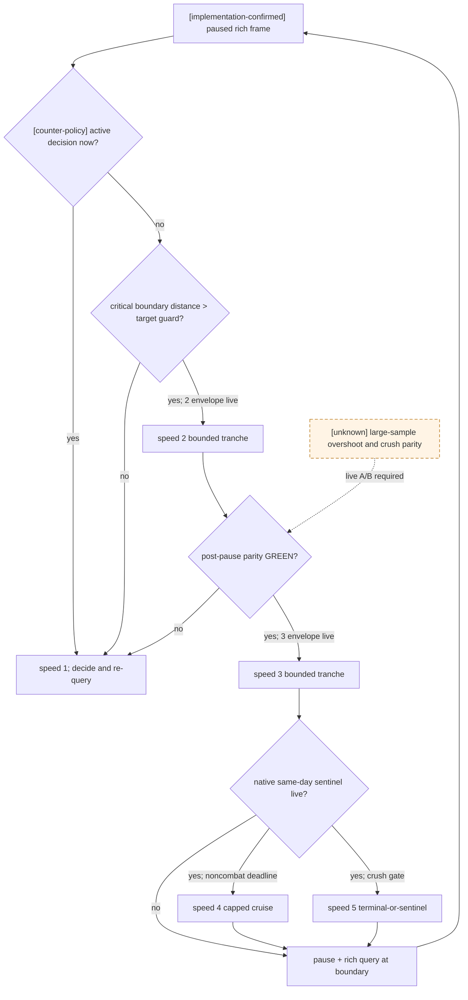

# 战斗推进速度与暂停边界

状态：**exact-build same-day sentinel、完整全军 watch 与普通战 speed-3 production-live / contact-free route speed-3 production-live / full-watch speed-5 terminal primitive live / 玩家胜局 pursuit selector canary 与双重 `4x` matrix 待完成**

冻结构建：CK3 `1.19.0.6`，`ck3.exe` SHA-256
`2D00FF3101EF70B566F2FCBAE292F09263199C80E9DC8F139B82D7D96F83DB86`。

本文使用以下证据标签：

- **[static-confirmed]**：冻结原版 defines、EXE 调用链或 exact-build bridge 代码直接证明；
- **[live-confirmed]**：已经有真实 CK3 artifact；
- **[implementation-confirmed]**：当前生产代码确实这样选择或限制，但不等于相应速度已实机验收；
- **[counter-policy]**：我方准备实测的控制策略；
- **[unknown]**：仍缺 live 分布或原生 stop primitive，不能写成 production-live。

## 直接结论

[static-confirmed] CK3 在 public speed `1/2/3/4/5` 下都逐 native day 执行同一条
`army movement -> contact queue -> CCombat daily state machine`。高倍速不会少算
移动、接敌、伤害或追击；它只缩短 Python 在两个游戏日之间介入的现实时间。

所以：

1. **战斗并不要求每天暂停。** maneuver、没有撤退/改派决策的 main、pursuit 都会由原生日更自动继续；当前
   “推进一天 -> 暂停 -> rich query”是自动玩家的保守事务边界，不是 CK3 的计算要求。
2. **2/3 速的 1 日与 3 日 ongoing battle-frame parity 已在同一 seed 实机全绿，普通战 production 默认档现为 3 速。** 每档两次、升降序平衡；1 日
   六笔与 3 日六笔都得到同一个完整 normalized battle frame。3 日端到端吞吐相对 1 速为 `1.610x / 2.360x`，达到
   既定 `1.5x / 2x` 研究门；1 日只有 `1.422x / 1.947x`，说明短事务固定成本会吃掉收益。随后 native decision
   sentinel 的 production full-watch canary 又一次 resume 连跑 4 日、零 intermediate/external pause、零 running rich query
   与零 overshoot 后在 exact terminal 停住；因此 ordinary combat selector 已开放 speed 3。
3. **4/5 速不能靠 Python 轮询逐日兜底。** 4 速只有 `0.8 heartbeat/day`；5 速是负载相关的无节流档，现实侧
   没有有限的“下一日反应窗口”。战中 4/5 速必须由 CK3 application-main 的同日 sentinel/deadline guard 停住。
4. **“兵力悬殊”不能只由人数比证明。** exact-build 原生 power share、soldier ratio 与
   `side_strength_raw` 都不是胜率。当前最小 admission 用同一 paused frame 的 current fighting 与 native side strength
   双重 `4x` 只筛选真实 checkpoint，再要求该 checkpoint 的 `[1,5,5,1]` terminal matrix；matrix 未完成前 5 速 crush
   仍是 research。完整 Monte Carlo 是后续质量升级，不再作为 G1 前置硬门。
5. **五档都能在这场真实战斗中完成受控停表，但这不是战斗结果等价证明。** [live-confirmed] 同一 active-battle
   episode 的 `1,2,3,4,5,5,4,3,2,1` 矩阵共十个样本，全部精确推进一日、观察/停稳超调均为零，最终
   `paused=true`、`map_ready=true`、checkpoint 不变且 cleanup GREEN。它只证明当前机器/负载的 stop envelope；
   4/5 速任意中途决策仍需 native same-day sentinel。
6. **五档终局的核心结果相同，但严格 warscore parity 仍是 RED-inconclusive。** 十笔平衡复测的 exact terminal date、
   phase/day、winner、Result/wipe、ordered sides 与 removal 全部相同；只有 battle warscore 漂移。1/2/3 在同档两次间
   也漂移；合并前一轮第三样本后 4/5 同样出现同档不同值。因此当前证据证明“不能归因速度”，不能把 RED 写成
   高速少算，也不能把去掉 warscore 后的全等冒充严格 GREEN。
7. **当前 G1 的直接吞吐修复不是把未知接敌日盲跑成多日，而是给现有 exact-day proof 换档。**
   [implementation-confirmed] `one_day_contact_free=true` 且全军 proof conjunction 成立时，production runner 默认选择
   speed 3，并继续要求最终 paused date 严格为 `start+24`；若 proof 是
   `unavoidable_current_province_contact`，仍固定 speed 1 并验证 contact transition。speed 1–5 都有同一 selector arm，
   其中 speed 4–5 只在显式 `--allow-route-contact-high-speed-ab` 下准入 targeted A/B，speed 1/2 保留显式对照。
   当前 checkpoint 的五档 exact-day 配对已经全绿，contact-free route speed 3 为 production-live。

按 defines 计算，连续 15 个纯原生日的理论时间是：1 速 `30s`、2 速 `15s`、3 速 `7.5s`、4 速
`3s`、5 速负载相关。若一次“游戏日”事务现实里接近半分钟，主要成本来自 pause、paused rich query、Python
决策与 driver-state barrier，不是 CK3 每日战斗计算本身。减少不必要暂停比单独提高速度更有价值。

## 五档现实时间与外部反应能力

`Crusader Kings III/game/common/defines/00_defines.txt`（SHA-256
`C1ECA141C71EC1E741CA5336E01BB538EEFAEC05B0684EDEC477CFC9053C3807`）给出如下秒/游戏日。
Bridge heartbeat 名义周期是 250 ms；表中 heartbeat 数量只用于比较反应余量，**不是硬实时保证**。

| 速度 | defines 秒/游戏日 | 名义 heartbeat/日 | Python 在下一日界前的名义窗口 | 当前 composite selector | 战争定位 |
|---:|---:|---:|---:|---|---|
| 1 | `2.0s` | `8` | `2.0s` | tactical route/combat/retreat/Assault | 最宽外部反应窗；决策边界与未知状态回退档 |
| 2 | `1.0s` | `4` | `1.0s` | contact-free exact route 默认；battle 尚未自动选择 | 第一档 route/battle A/B；目标是取代大部分 1 速自动阶段 |
| 3 | `0.5s` | `2` | `0.5s` | 已用于完整且远离玩家的敌军路线 | 第二档 battle A/B；只在 speed-2 envelope 闭合后晋级 |
| 4 | `0.2s` | `0.8` | 小于一个 heartbeat | 尚不自动选择；原生命令已支持 | 只能配 native deadline/sentinel；检验它是否有独立于 5 速的价值 |
| 5 | `0.0s` | 负载相关 | 无有限上界 | route-free bounded slice | 和平、无路线战争、普通围城；战斗只准 crush + native sentinel |

[implementation-confirmed] exact adapter 和 wire 已经发布 `set-speed-1..5`，`SubmitSetSpeed` 也接受完整
`1..5` 并写 native `0..4`；不需要为 2/4 速新增 ABI。当前 Python selector 对普通 bounded slice 使用既有
`1/3/5`，对 proof-bound contact-free exact day 默认 speed 3；controllable combat/retreat、Assault、未知 player route
和 unavoidable contact 仍选择 speed 1。speed 3–5 的 exact-route selector arm 需要显式 high-speed A/B 准入，不能把
“命令存在”或 research arm 写成战斗策略已经 live。

## 采样词汇与 guard

下面矩阵区分两类采样：

- `HB`：running-safe 轻量 snapshot/heartbeat，名义 250 ms；它可发现 date、粗 army state、`in_combat`、
  `retreating` 等变化，但不能代替 paused battle-control query；
- `RQ`：暂停后的 rich query，读取 CombatID、phase/day、ordered participants、ledger、撤退 gate、增援等精确状态。

[counter-policy] 对每个速度 `s`，先用 live 样本建立：

- `E_s = 一次 stop request 最终 paused date 相对目标日期的实测 p100 超调日数`；
- `G_s = E_s + 1` 日的初始 guard；
- `C = 当前 paused frame 能证明的最早关键边界日`，例如接触、可撤退 day 15、增援抵达或事件 deadline；
- 允许的 running tranche 必须满足 `tranche_end <= C - G_s`。若 `E_s` 未知，则该速度不得用于依赖外部
  pause 的硬边界。

[live-confirmed] speed 1 也不是“请求一天就严格一天”：97 个一日切片曾得到
`3 x 1日 / 72 x 2日 / 22 x 3日`，正式战斗出现过同 CombatID `main/32 -> main/34`。speed 3 只有一次
最小非战斗一日链；speed 5 旧事务曾推进两日，另有 12 秒约 35 日的原始移动样本；speed 2/4 仍没有足够大的
live 分布。因此所有速度都必须按最终 paused date 与 rich state 验证，不能信 speed、请求 horizon 或 ACK 本身。

[live-confirmed] 新 research-only harness 在已接战 seed 上关闭了“速度档本身能否停住”这个较窄问题：artifact
`C:\Users\xenoa\AppData\Local\Temp\xar-smx-stop-ae8-20260828-01\artifacts\stop-envelope-active-battle-1to5.json`
SHA-256 为 `0B6818DA2630786A31EE28729694CA911A27781C9E8A60F1955B4F07F0DE6FEA`。每档两个样本，十笔均为
目标 `+1` 日、最终 `+1` 日；观察超调与停稳超调均为 `0`。按 end-to-end 游戏日/秒均值：

| 速度 | 游戏日/秒 | 总耗时均值 | pause settle 均值 | 相对 1 速 |
|---:|---:|---:|---:|---:|
| 1 | `0.317` | `3221 ms` | `501 ms` | `1.000x` |
| 2 | `0.575` | `1740 ms` | `251 ms` | `1.812x` |
| 3 | `0.799` | `1252 ms` | `251 ms` | `2.518x` |
| 4 | `0.998` | `1002 ms` | `252 ms` | `3.147x` |
| 5 | `1.669` | `623 ms` | `246 ms` | `5.261x` |

该矩阵没有每臂恢复，也没有比较 terminal winner/casualty/war score，故不得把它升级为 parity 或 production
授权。它还说明 4 速在当前机器上确有独立于 3/5 的吞吐位置，是否值得长期 selector 分支仍取决于后续等价性与
sentinel 复杂度。

## 行军、接敌与已接战执行矩阵

表中“无需逐日暂停”已经由普通战 speed-3 decision sentinel 实现：运行中只做轻量 status，phase/winner/roster/route/contact/
retreat/terminal/native-pause/date guard 等 semantic epoch 才暂停；paused 后才做 rich query。表中仍标为 crush gate 的 4/5 速
分支继续等待各自 live admission。

| 阶段 | 1 速 | 2 速 | 3 速 | 4 速 | 5 速 | 必须 RQ 的边界与漏过风险 |
|---|---|---|---|---|---|---|
| 远距离行军，离最早接触日 `C` 足够远 | `HB`；`RQ <= min(7, C-G1)` 日；无需逐日暂停 | 显式对照 | production exact-day proof 默认 speed 3；无需逐日暂停 | 仅 research native date/contact guard | 仅 research route/target 完整且 native guard | route/target/current Province、敌军 endpoint epoch 或 earliest contact 改变。漏过会跨过改道/避战点 |
| 接敌 guard 区 `date >= C-Gs` | 当前回 1 速并做 paused one-day contact transaction | 外部 stop envelope 未绿前降 1；未来可由 contact sentinel 保持 2 | 降 1；只有同 tick contact sentinel live 后才保持 3 | 禁止外部轮询；必须 native contact sentinel | 禁止外部轮询；必须 native contact sentinel | 同一 native day 先 movement 后 contact，不能在“抵达”和“接敌”之间插手；晚一日可能已经建战/入旧战 |
| maneuver 与 main、elapsed `<15` | 异常/无 sentinel 回退 | 可作对照 | production 默认：decision sentinel；只在 semantic epoch 或首个 retreat day gate 停 | 仅 crush research | 仅 crush research | 参战者加入、pursuit 重开、事件/人物风险、提前终局。漏过会用旧 roster/forecast 继续跑 |
| main、elapsed `>=15`，撤退已可能合法 | RQ 后预先决定 hold/retreat | 可作对照 | production 默认：decision sentinel；hold 后不逐日停 | 只准 crush research + native sentinel | 只准 crush research + native sentinel | retreat legality、forecast epoch、roster、phase、winner、人物事件。参数化 target 保证首次合法日不会被跨过 |
| pursuit | 异常回退 | 对照 | winner 未锁定或玩家败局仍走普通 decision policy | research | 玩家 side winner 已锁定时的 terminal cruise 已接线；production selector canary 待跑 | 新军加入可把 `pursuit -> main` 并清 winner；完整全军 watch/roster hash 会在重开当日停住 |
| done/finalizer/旧 CombatID 清理 | 1 速最多一个受控 cleanup slice | 只在 speed-1 parity 后 | 暂不需要 | 不准 | 不准 | `phase=done`、`finalized`、Result/terminal journal、CombatID 删除是不同边界；漏过会误报赢家或重复推进 |

补充的非野战边界保持不变：普通围城最适合用 `3/4/5` 做多日 tranche；Assault 先保持 1 速逐日，2 速只做
严格一日 A/B，3/4/5 暂不准入；撤退行军可在落点 guard 之前用 2/3 速，但 target/current Province、
`retreating` 或接触风险变化必须停。

## 2/3 速“实时判定”到底能做到什么

答案分成两层：

| 判定层 | 2 速 | 3 速 | 原因 |
|---|---|---|---|
| 发现 date、`in_combat`/`retreating`，并在 phase/winner/roster/route/contact/retreat/terminal epoch 同日暂停 | **可做 A/B** | **production-live** | application-main daily sentinel 已 live，不依赖 heartbeat 轮询 |
| running 状态下完成完整 participant/ledger/撤退/forecast 判定 | **当前不可** | **当前不可** | rich battle-control mailbox 明确要求 paused owner-verified frame |
| 在已证明“本 tranche 没有玩家决策”的自动阶段连续推进 | **可行对照** | **production-live** | CK3 自己每日计算；sentinel 只在 semantic epoch/deadline 停住 |
| 保证恰好在某个游戏日、接触前或 day-15 停止 | exact-day primitive live | exact-day primitive live；day-15 parameterized consumer static-ready | 使用 application-main native target，不依赖 heartbeat 或异步外部 pause |

因此“2/3 速实时判定”不是让 Python 在地图运行时遍历完整 `CCombat`，而是：running-safe sentinel 负责廉价发现
变化，native stop 或 pause request 负责停表，然后只在真正的决策 epoch 做一次 RQ。近期可以先用 2 速、1–3 日
tranche 得到实际收益；不需要等 4/5 速设施全部完成才开始优化。

## 为什么战斗不需要每天暂停

- [static-confirmed] 原生不存在 `keep_fighting` 动作。没有撤退或外部终止时，战斗每日自动推进。
- [static-confirmed] maneuver 固定自动运行三日；通常 elapsed whole day `15` 才允许主动撤退，live 已证明 day 14
  非法、day 15 合法；pursuit 自动运行三日并在下一日转 done。
- [live-confirmed] production planner 已选择 speed-3 decision composite，并在完整六军 watch 下连续推进四日到 exact terminal；
  运行中没有 external pause 或 rich query。
- [implementation-confirmed] 当前优化只合并**无新决策的连续天数**：maneuver、day-15 以前且 roster 不变的 early battle、
  已预先选择 hold 的 main、以及 outcome-locked pursuit。任何 sentinel 变化仍立即回到 paused RQ。

用这种边界，一个 15 日自动段可以从最多 15 次 pause/RQ/barrier 收缩为开头、变化点、day-14/15 与终局的
2–4 次事务；这是直接减少用户已经观察到的半分钟级事务成本，而不是理论性的优化。

## 4/5 速碾压战斗准入门

[counter-policy] 先把“碾压样本”和“生产授权”分开：

- exact native power share、双方 current fighting totals 或 `>=4:1` 的士兵筛选可以挑选 A/B 场景；
- 这些筛选值不是概率，**无论比率多大都不单独打开 4/5 速生产分支**。

正式第一版 crush gate 至少要求：

1. exact CombatID、participant ordered roster、phase 与所有 active combats 全部绑定同一 paused revision；
2. 同帧玩家侧 `derived_current_fighting_raw` 与 `side_strength_raw` 都至少为对侧 `4x`，只作为候选分类；
3. 没有 active event、pending interaction、Assault 或其它未闭合全局战术动作；所有 controllable player CUnit 都进入 watch；
4. application-main `run-until terminal-or-sentinel` 在 roster/route/contact/retreat/reopen/native-pause/terminal 当日停住；
5. 同一 immutable checkpoint 的 `[1,5,5,1]` terminal 配对中，两条 speed-5 都真正 terminal、玩家获胜、零中途暂停/
   超调，核心 outcome 与 speed-1 同档变异边界一致，cleanup 全绿且 speed 5 至少快 `3x`。

当前第 4 条 primitive 已 full-watch live，第 5 条仍缺 qualifying 双重 `4x` checkpoint，因此 4/5 速 crush 只能作为受控
A/B arm。若 speed 4 相比 speed 3 没有稳定吞吐收益，或其超调/负载波动
没有明显优于 speed 5，就删除独立 speed-4 selector，不为“档位齐全”增加长期复杂度。

## 最小必要的新原语

现有实现已经足够做 2/3 速短 tranche A/B；为 4/5 速增加两个能力有直接必要性：4 速每个 heartbeat 名义跨
`1.25` 个游戏日，5 速无现实日长上界，而 rich query 又要求 paused。预期收益是把每游戏日的暂停/查询/持久化
合并成每个真实决策 epoch 一次。

1. running-safe `tactical_daily_sentinel_v1` 最小切片：date、subject CUnit/CArmy generation-valid backlink、move target、
   CombatID、retreat state，以及 active Combat 的 phase/day、winner/finalized、双方 ordered ArmyID roster count/hash；
   application-main daily hook 只读这个有界图，不让 250 ms worker 遍历完整可变战斗图。retreat legality、forecast 与
   reinforcement ETA 仍由停表后的 paused rich query 提供，不能冒充已经进入 sentinel。
2. `run-until-date-or-sentinel`：设置 absolute date 与 sentinel epoch，在每个原生日更后的稳定边界检查，满足任一
   条件即暂停。ACK 只证明提交，最终仍要求 paused state、actual date delta 与 RQ 后置验证。

### same-day sentinel 的 exact-build 施工入口

[static-confirmed] `CDailyTickCommand` 的 secondary vtable 是 `0x40AAB60`，三级日更函数为
`0x26D3030 / 0x26D3160 / 0x26D3E80`。第一阶段在 `0x26D30A7` 调 `0x204EFC0`，其中
`0x204F0CD` 执行 `date_raw += 0x18`；第二阶段已经读取新日期并运行 managers/tasks。因此不能在 date writer
刚写完时暂停，也不能只钩 `CCombatManager::daily 0x27FB5D0` 后宣称已覆盖当日 movement/contact/reinforcement。

最小首选 detour 是最终/post 阶段 `0x26D3E80`：完整 15-byte prologue 为
`48 89 5C 24 08 48 89 74 24 10 57 48 83 EC 20`，resume `0x26D3E8F`。wrapper 必须先且只调用一次原函数，
再检查有界 arm 状态；命中后在已证明的 application-main owner thread 调原生 pause wrapper
`0x346B910(jomini, true, armed_player_id)`。`0x346B850` 是 core，`0x346B910` 还处理状态差异、pause timestamp 与
解暂停 gates；不得裸写 paused 字段。

现有 PeekMessage rich mailbox 不能直接充当 running sentinel：running pump 会撤销 paused ownership proof。
[implementation-confirmed] 当前 vertical slice 在 suspended startup 安装 final-stage detour；arm 只允许 paused map，复制
player id、start/absolute-target date、requested speed/mode 与最多 64 个 subject ArmyID 的有界 fingerprint。hook 本身只会由
原生 daily final stage 在 application-main 调用，先执行 original 一次，再做固定内存/atomic 判定；它不分配、不运行 rich
query。命中后调用原生 pause wrapper，并同时记录 final paused readback。既有 passive terminal journal/cursor 保持独立，
只在停表后用于终局结果互证。

研究命令是：

```text
research-arm-tactical-daily-sentinel-v1-<start>-to-<absolute-target>-speed-<1..5>-mode-<decision|terminal>-a-<count>-<ArmyID...>
research-query-tactical-daily-sentinel-v1
```

`decision` 在 route target、contact/CombatID、retreat、phase、roster、winner/finalized、army/combat removal、native auto-pause
或 absolute date 变化时停；`terminal` 即 `terminal_or_sentinel`，忽略普通 phase 与 winner 推进，允许 maneuver/main/pursuit
连续通过，只在 roster/retreat/reopen/真正 finalized/removal、native auto-pause、absolute date 或异常时停。后者正是碾压战
speed 5 的“直到终局或真实决策点”合同：成功终局臂必须 `intermediate_pause_count=0`，不能把最终 sentinel pause 算作中途暂停。

query 固定返回 mode、arm/start/target/last/trigger date、speed、tick/army/combat 数、stop flags/reasons、signed target delta、
`overshoot_days`、`intermediate_pause_count`、pause-wrapper/paused readback、`terminal_observed` 与 `abnormal`。首个 live admission
仍须先以 speed 1 证明 post hook 每日恰好一次、delta=24、wrapper 单次暂停与最终 paused 同日，再扩展五档 `+1/+3` 日矩阵。
该 primitive 目前是 static-ready，不是 production-live；正常战争的首个生产候选下限是 speed 3，speed 4/5 只有各自 live
zero-overshoot/同 seed parity gate 通过后才可入 selector。



## 最小 live A/B（ongoing GREEN；terminal strict RED-inconclusive）

[implementation-confirmed] 独立研究入口
`ck3_autonomous_player/native_bridge/research/run_battle_speed_matrix_live_acceptance.py`
已经把五档 stop envelope、same-day sentinel envelope、已接战逐日 parity 与五档 terminal parity 做成可执行矩阵；它直接复用现有 exact-build timeline primitive 和
managed native-session cleanup，不调用 `life-advance`，也不改 `_life_advance_timeline_policy` 或 production selector。
五档 active-battle stop envelope、1/2/3 ongoing parity 与五档 terminal matrix 均已有下文 live artifact；严格证据边界
分别按 GREEN、RED-inconclusive 与未授权生产使用记录。

sentinel 五档串行 A/B 从同一 immutable active-battle checkpoint 运行；每臂只做 pre-arm RQ，随后
`set speed -> arm -> resume -> native stop -> status query/post-stop RQ`，resume 与 native stop 之间不提交外部 pause 或 rich query：
resume 只提交一次；即使 bridge 没来得及发布 running frame 而直接看到更晚日期的 paused frame，也不得对已经触发的 arm 再次
resume。RED 恢复后允许在 paused 状态用新 generation 替换仍为 armed 的旧实验。

```powershell
py ck3_autonomous_player/native_bridge/research/run_battle_speed_matrix_live_acceptance.py `
  --state-dir <disposable-battle-state> --game-dir <CK3-game-dir> `
  --bridge-pipe <unique-pipe> --bridge-dll <sentinel-build-dll> `
  --bridge-injector <injector> --output <sentinel-1to5.json> `
  --cold-start-checkpoint --mode sentinel-envelope `
  --sentinel-mode decision --subject-army-id <ArmyID> `
  --sentinel-army-ids <subject-and-other-watched-ArmyIDs...> `
  --speeds 1 2 3 4 5 --samples-per-speed 2 --target-days 3
```

`--sentinel-army-ids` 默认只监视 subject；同侧存在多支参战军时必须把完整 watch set 显式传入（最多 64 支，去重且必须包含
subject），这样任一 CUnit/CArmy backlink、路线、接战或撤退变化都会在同一日停表。

碾压战把 `--sentinel-mode terminal` 与足够远但有界的 `--target-days` 配对。只有 stop reason 是 terminal、
`terminal_observed=true`、`intermediate_pause_count=0`、`abnormal=false`、`overshoot_days=0`，并由 passive terminal journal
在同一日以 pre-arm cursor 核对结果、且各冷恢复速度臂的非 warscore 核心 outcome 一致的样本，才能算“零中途暂停直到终局”；
date fallback 或 roster/retreat/reopen stop 是诚实的 sentinel stop，但 crush candidate gate 必须为 RED，不能算完整直跑终局。

矩阵使用升序/降序平衡顺序。默认每档六个样本时，完整顺序严格为：

```text
1,2,3,4,5,5,4,3,2,1  × 3
```

三个模式的边界如下：

| 模式 | 当前允许速度 | checkpoint 策略 | 结论边界 |
|---|---|---|---|
| `stop-envelope` | `1 2 3 4 5` | 冷恢复一次；同一 episode 交错采样 | 量化外部 stop 的 empirical max overshoot；不证明战斗安全 |
| `stop-envelope --stop-envelope-scenario active-battle` | `1 2 3 4 5` | 冷恢复一次；要求指定的可控 army 始终在战斗中 | 只量化真实战斗负载下的外部停表能力；仍不授权 4/5 速战斗策略 |
| `battle-parity` | `1 2 3` | 第一 arm 冷恢复；其后每个 arm 都恢复同一 immutable checkpoint | 只比较相同起始 frame、相同实际 elapsed days、相同最终日期的 battle frame |
| `battle-parity` 请求 `4/5` | 明确拒绝 | 不启动 session | 等 application-main `run-until-date-or-battle-sentinel` 真正接线后再开放；不能用 Python polling 冒充 |
| `terminal-parity` | `1 2 3 4 5` | 每个 arm 恢复同一 immutable checkpoint；恢复不会倒退 bridge-owned journal，故每臂先冻结新的全局 cursor | 只比较 passive exact-build journal 记录的精确终局；外部 pause 仅用于恢复查询能力，不授权 4/5 任意中途决策 |

已定位的 exact battle seed 可作为 `battle-parity` 输入源：

- 当前源：`C:\Users\xenoa\AppData\Local\Temp\xar-active-retreat-query-v1-a72f4846fa01477ab26860479927c1b3\profile\last_save.ck3`；
- SHA-256：`9104CCB8AE9D5776166FBBAEDA9B43BD08CBAA2CB5C057332EB8B7A1A212CC63`；
- `date_raw=53178264`，episode character `29829`，subject army `83886341`，CombatID `335544325`，
  Province `2586`，初始 `maneuver/1`；
- 该 seed 是劣势样本，不是 crush：side strength `49787 : 106544`（`0.4673`），derived fighting
  `140300000 : 322100000`（`0.4356`），我方 1 支 army 对敌方 2 支；不得把其 terminal 结果外推成 5 速碾压准入；
- temp 路径不是长期 artifact。实测前必须把它复制到一次性 state，先生成 managed checkpoint，矩阵只对副本做恢复，
  不修改这份源文件。

把上述 `last_save.ck3` 放进一次性 state 后，先用现有单场 probe 在原日期物化 managed checkpoint；2026-08-28 live
矩阵已按此流程完成，下面保留复现实验入口：

```powershell
py ck3_autonomous_player/native_bridge/research/run_battle_control_live_acceptance.py `
  --state-dir <disposable-battle-state> --game-dir <CK3-game-dir> `
  --bridge-pipe <bootstrap-pipe> --bridge-dll <exact-build-dll> `
  --bridge-injector <injector> --output <bootstrap-artifact.json> `
  --subject-army-id 83886341 --save-checkpoint --advance-days 0
```

bootstrap artifact 与生成的 `xar_checkpoint.ck3` SHA-256 审阅一致后，才运行下面的冷恢复矩阵。

五档中性停表包络示例：

```powershell
py ck3_autonomous_player/native_bridge/research/run_battle_speed_matrix_live_acceptance.py `
  --state-dir <disposable-neutral-state> --game-dir <CK3-game-dir> `
  --bridge-pipe <unique-pipe> --bridge-dll <exact-build-dll> `
  --bridge-injector <injector> --output <artifact.json> `
  --cold-start-checkpoint --mode stop-envelope `
  --speeds 1 2 3 4 5 --samples-per-speed 6 --target-days 1
```

从已知 battle seed 量化五档停表包络时，必须显式声明实验场景；默认 `neutral` 仍会拒绝 active war：

```powershell
py ck3_autonomous_player/native_bridge/research/run_battle_speed_matrix_live_acceptance.py `
  --state-dir <disposable-battle-state> --game-dir <CK3-game-dir> `
  --bridge-pipe <unique-pipe> --bridge-dll <exact-build-dll> `
  --bridge-injector <injector> --output <artifact.json> `
  --cold-start-checkpoint --mode stop-envelope `
  --stop-envelope-scenario active-battle --subject-army-id 83886341 `
  --speeds 1 2 3 4 5 --samples-per-speed 2 --target-days 1
```

已接战 1/2/3 parity 示例：

```powershell
py ck3_autonomous_player/native_bridge/research/run_battle_speed_matrix_live_acceptance.py `
  --state-dir <disposable-battle-state> --game-dir <CK3-game-dir> `
  --bridge-pipe <unique-pipe> --bridge-dll <exact-build-dll> `
  --bridge-injector <injector> --output <artifact.json> `
  --cold-start-checkpoint --mode battle-parity --subject-army-id 83886341 `
  --speeds 1 2 3 --samples-per-speed 6 --target-days 1
```

五档终局等价性示例：

```powershell
py ck3_autonomous_player/native_bridge/research/run_battle_speed_matrix_live_acceptance.py `
  --state-dir <disposable-battle-state> --game-dir <CK3-game-dir> `
  --bridge-pipe <unique-pipe> --bridge-dll <exact-build-dll> `
  --bridge-injector <injector> --output <artifact.json> `
  --cold-start-checkpoint --mode terminal-parity --subject-army-id 83886341 `
  --speeds 1 2 3 4 5 --samples-per-speed 1 `
  --terminal-max-days 45 --terminal-max-pause-lag-days 1 `
  --slice-timeout 180 --timeout 1800
```

`terminal-parity` 在每臂恢复后先做两次 paused battle-control query，锁定相同起始 frame 与 exact CombatID；随后
两次查询 terminal journal 并以全局 `latest_sequence` 作为本臂 exclusion cursor。subject 离战后立即请求 pause，
再用 `after_terminal_sequence=cursor` 双采样，只接受新的 `observed` 事件。判等投影包括 exact terminal date、
phase/day、winner/finalized、Result/wipe、两侧 ordered CUnit、battle warscore 与 removal/result retention；排除 journal
sequence、查询 metadata 和晚到的 subject/successor 状态。外部 pause lag 单独报告且默认不得超过一日；终局是否落在
45 日窗口内只看 journal date，不能用外部首次观察日期代替。

### 2026-08-28 live 结果

bootstrap 使用隔离 state `xar-smx-parity-ae8-20260828-01`，artifact
`bootstrap-terminal-fields-v3.json` SHA-256
`2ADB40FE5601429BBAFAFAAE5C93FA5FBA1A6D2CE77A36557A9485DA04AF1B34`；起始 battle frame SHA-256
`C36CA603F28072E89C52A464A8BFADE8B20F1A052D62CEDBA0F3AEAAFE4137FC` 与已知 seed 一致。managed checkpoint
为 `date_raw=53178264`、SHA-256
`F2252BA060EDA701ADC85BBE97894B01A38FC997712A5B7F315F8D3E81F44723`。

#### ongoing 1/2/3：GREEN

| horizon | artifact SHA-256 | 六笔最终 frame | 1/2/3 平均 E2E | 相对 1 速 | 结论 |
|---:|---|---|---|---|---|
| 1 日 | `1148E8DF2904D70C9BF0E1DE574E99295614C8A25CBA42F1306D90B32BEE269A` | `52D3B47A11960BC748A83710FCA6AF10F944A1636B4197FD5B88388098E60E24` | `2.603 / 1.831 / 1.337s` | `1.000 / 1.422 / 1.947x` | 严格 frame parity GREEN；短事务吞吐略低于门 |
| 3 日 | `C7A9E7658C65977523E6586212BC4A563CDC4DE18F73831E3F6D8DD7910EACD5` | `6901E073779807DB3F6FD8C9313F4A35DB6F2B1B5AB4B3756D33C1C7344BC8A7` | `7.605 / 4.722 / 3.222s` | `1.000 / 1.610 / 2.360x` | 严格 frame parity GREEN；达到 2/3 速研究门 |

两轮都是 schedule `1,2,3,3,2,1`，12/12 arm operational；每轮六笔 actual elapsed/final date 完全一致，
checkpoint before/after 哈希不变，managed cleanup 全绿。这证明当前 maneuver seed 上可把三个无新决策的游戏日合并为
2/3 速 tranche；仍需 running sentinel 才能跨越未知 phase/roster/contact/retreat 边界。

#### terminal 1/2/3/4/5：严格 RED，但速度归因不成立

首轮每档一笔 artifact `terminal-parity-1to5-v2.json` SHA-256
`484E8B926DB032BC08326E36DA42142FAA04E840FA671A7B75B94913EC6BD4CE`。五笔都是 exact terminal
`date_raw=53179056`、33 游戏日、pause lag `0`，但 warscore raw 不同，故严格 parity RED。随后运行升降序平衡
`1,2,3,4,5,5,4,3,2,1`；artifact `terminal-parity-1to5-balanced-v3.json` SHA-256
`1C19372B51CDE8A66380F556B51495476A668DD028C705CADC7EE7D51E731103`：

| 速度 | v3 warscore raw Q100000 | 合并 v2 后该档观测集合 | v3 平均 E2E | 相对 1 速 |
|---:|---|---|---:|---:|
| 1 | `2131550, 2133250` | `2131550, 2133250, 2135000` | `76.621s` | `1.000x` |
| 2 | `2137600, 2133250` | `2133250, 2137600` | `43.866s` | `1.747x` |
| 3 | `2133250, 2135850` | `2133250, 2135850, 2137600` | `28.104s` | `2.726x` |
| 4 | `2133250, 2133250` | `2133250, 2140200` | `17.864s` | `4.289x` |
| 5 | `2133250, 2133250` | `2133250, 2135000` | `12.587s` | `6.087x` |

v3 的十笔除 `battle_warscore` 外，终局投影只有一个 SHA-256：
`B846D554B59E48CEE34FEBE8EF6FBCAC17637952BFBBABA9264E8CEB060D1F98`；exact terminal date、phase-day `0`、
winner `1`、ResultID `553648135`、wipe、ordered sides、removal/result retention 全等。十笔都 operational，九笔
pause lag `0`，一笔 speed-5 外部观察/停稳 lag `1` 日，但 journal 仍证明 exact terminal date 相同且在 bound 内；
checkpoint/cleanup 全绿。

因此完整 warscore 不能删出严格判等，v3 仍诚实 RED；但每档合并三笔后都出现同档漂移，当前数据也不能支持
“速度造成差异”。下一次若要回答速度对 warscore 分布是否有统计影响，应在代表性 seed 上预先定义重复数与容差；
在此之前只把五档核心终局一致写为研究证据，不授予 4/5 中途或 crush production 权限。

每个 row 分开记录 set-speed、resume 与 pause 的 submit/ACK/observed 时间，target 首次 observed date、最终 paused
date、heartbeat 与 semantic revision delta、connection generation、游戏日/秒、观察超调和停稳超调。ACK 不算完成；
最终必须再次看到 `paused=true`、`map_ready=true`、请求速度、同一 episode 与同一 connection generation。日期差不是
非负的 24 整数倍时样本直接 RED。harness 不自动处理事件或 pending interaction，遇到它们会暂停并把该 arm 标为污染。
报告同时哈希矩阵前后的 `xar_checkpoint.ck3`；只有 size/SHA-256 均未变化才满足 immutable seed gate。

战斗 frame 比较只剥离 query/transport revision metadata，保留 CombatID、Province、phase/day、winner/finalized、
ordered roster、current/soft/hard ledger 与 side strength。不同实际 elapsed days 记为
`insufficient_matched_elapsed`，不能误报为计算不等价；相同 elapsed/final date 而 normalized frame 不同才记
`mismatch`。完整 session 仍由 managed cleanup 验证进程树退出。

### 当前 route-contact speed-1..5 targeted A/B

[implementation-confirmed] 正式 runner 新增 `--route-contact-speed {1,2,3,4,5}`。默认值为 `3`；speed `4..5`
还必须显式给出 `--allow-route-contact-high-speed-ab`，避免把 research arm 混入默认 G1。selector 只在 fresh
`contact_free` exact-day proof 上消费该档位；unavoidable contact、普通 combat/retreat、Assault 与未知 route
不受参数影响，继续 speed 1。若目标 bridge 没有广告所选 `set-speed-N`，同一 proof 自动回退 speed 1 并在
`timeline_policy` 中留下 `fallback_speed_1`，不会把 ACK 当成提速成功。

同一 checkpoint 的两个隔离 state 分别运行：

```powershell
& '<python>' 'ck3_autonomous_player/agent.py' `
  --state-dir <speed-1-state> --game-dir <CK3-game-dir> `
  --bridge-mode native-headless --bridge-pipe <speed-1-pipe> `
  --bridge-dll <exact-build-dll> --bridge-injector <injector> `
  native-one-generation --max-turns 80 --timeout 1800 `
  --readiness-timeout 300 --checkpoint-every-advances 3 `
  --route-contact-speed 1

& '<python>' 'ck3_autonomous_player/agent.py' `
  --state-dir <speed-3-state> --game-dir <CK3-game-dir> `
  --bridge-mode native-headless --bridge-pipe <speed-3-pipe> `
  --bridge-dll <exact-build-dll> --bridge-injector <injector> `
  native-one-generation --max-turns 80 --timeout 1800 `
  --readiness-timeout 300 --checkpoint-every-advances 3 `
  --route-contact-speed 3
```

两臂必须从 size/SHA/date/history/episode 全同的 checkpoint 开始。最小 GREEN 条件是：两臂都至少完成 10 个
`contact_free` proof-bound advances；每笔 `elapsed_days=1`、`ending_date_raw=starting_date_raw+24`、最终 paused，
没有 contact/route/postcondition blocker；speed-1 的 `timeline_policy=exact_one_day_contact_free_speed_1`，speed-3 为
`...speed_3`；同一 native date 的 ArmyID/current/target/remaining-route 与 hostile scope 投影等价；cleanup 全绿。
吞吐只比较这些配对 advance 的端到端 wall time，speed 3 的中位数至少应快 `2x`。若任一 speed-3 笔超调、状态不等价
或触发 fallback，就维持 speed 1；不能用其它查询/冷启动时间稀释该结果。

当前 native proof 的 `horizon_end_date_raw` 固定为 `start+24`，proof 执行后也强制全部失效。因此这次修复没有假装
支持 route 多日 tranche：要去掉逐日暂停，下一项必须先发布多日 timed-horizon 或 native contact/date sentinel，并重新做
同 checkpoint parity；把一日 proof 重复使用两次没有证据基础。

### A. 五档 stop envelope

1. 选一个无事件、无接触、无人物风险的 immutable checkpoint；在同一个恢复 episode 内交错轮换速度
   `1/2/3/4/5`，每档连续做至少六次“目标一日 -> pause -> paused readback”，避免为每个样本重复冷启动。
2. 每笔记录 target date 首次到达、pause submit/ACK 时间、最终 paused date、elapsed wall time、elapsed game days、
   heartbeat/state frame 数、connection generation 与 cleanup。
3. 分别计算 `E_1..E_5`。5 速若无法得到有限、稳定 envelope，结果就是“external guard 不可用”，不为了凑齐表格
   伪造 p100。

### B. 行军/接触 parity

1. 同一 pre-contact checkpoint 做 speed `1/2/3` 配对：停止目标均为 `C-G_s`，然后统一回 1 速完成最后的
   contact transaction。
2. 核对 actual contact date、CombatID、Province、ordered sides、route endpoint 与接触前事件；不得跨过 `C`。
3. native date/contact sentinel live 后再加 speed `4/5` arm；在此之前不做盲跑接触实验。

### C. 已接战 parity 与逐日暂停消除

1. 同一 maneuver 或 early-main checkpoint，speed 1 baseline 使用当前逐日事务；speed 2 arm 依次试 1 日、2 日、3 日
   tranche。对每个 tranche 核对 CombatID、phase/day 实际 delta、ordered roster 与 casualty ledger。
2. speed 2 全绿后才加 speed 3；两档都必须在 day-14 guard、roster epoch、phase 变化、terminal/reopen 或事件时停。
3. 吞吐门：speed 2 相对当前 speed 1 至少 `1.5x`，speed 3 至少 `2x`；达不到就不增加 selector 分支。
4. passive terminal journal 已允许先从普通 battle checkpoint 做 research-only 五档终局结果配对；它只回答“从这个
   checkpoint 不干预直至终局时，各速度是否得到同一原生结果”。crush forecast 与 native sentinel live 后，仍须从同一
   overwhelming checkpoint 重做 speed `1/4/5` 配对并核对第 4/5 速准入门第 6 条全部结果，才涉及生产授权。
5. 每个 arm 都必须保存请求前 paused artifact、最终 paused artifact、actual date delta、checkpoint 和 managed cleanup；
   harness RED 与 capability/parity RED 分开记录。

## Readiness 边界

本页把以下结论提升为 `production-live`：五档都执行同一逐日 native 计算；contact-free route 默认 speed 3；普通 active
combat 默认 speed-3 decision sentinel；完整 controllable CUnit watch 可跨多日并在 semantic epoch exact-stop。最终 production
artifact 与 hash 见 [battle-decision-epoch-cruise.md](battle-decision-epoch-cruise.md)。

完整全军 speed-5 terminal primitive 也已 live：同一败局 pursuit seed 的 `[5,1]` 两臂 exact terminal core 相同，speed 5
约 `2.00s`、speed 1 约 `10.03s`，均零 intermediate/external pause、零 running rich query 与零 overshoot。它不授权败局
selector，也不替代玩家胜局 pursuit canary 或双重 `4x` matrix。

仍为 `static-ready` / pending 的边界：参数化 day-15 gate 尚缺 live replay；`native_pause` Python consumer 尚缺真实事件样本；
玩家获胜 pursuit selector 尚缺 qualifying offensive checkpoint；speed 4 与双重 `4x` speed-5 crush 均保持 research。
