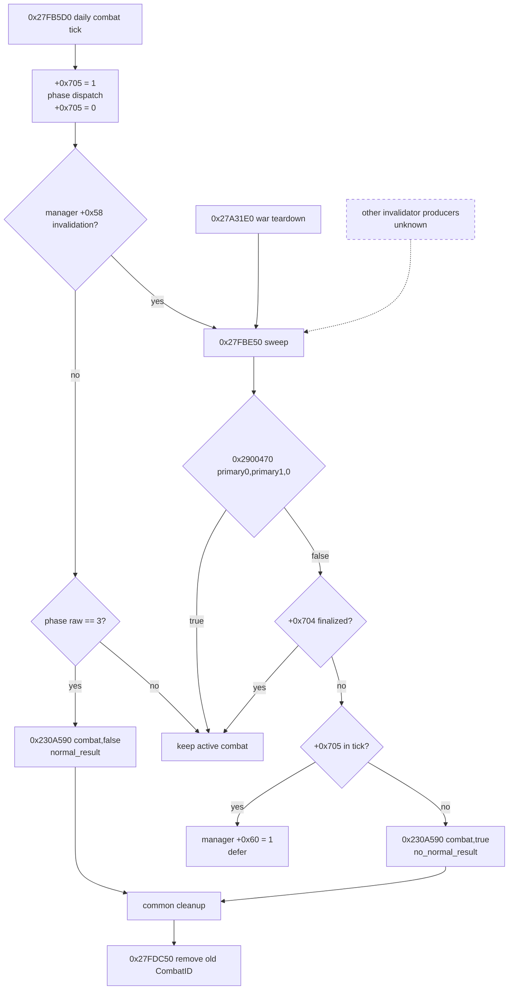
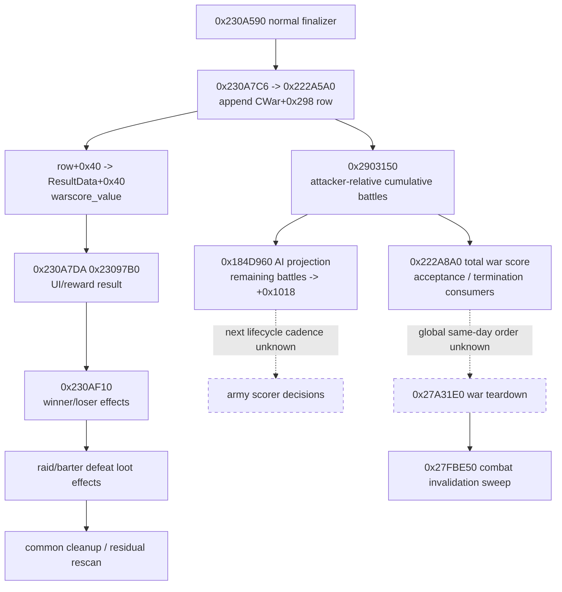
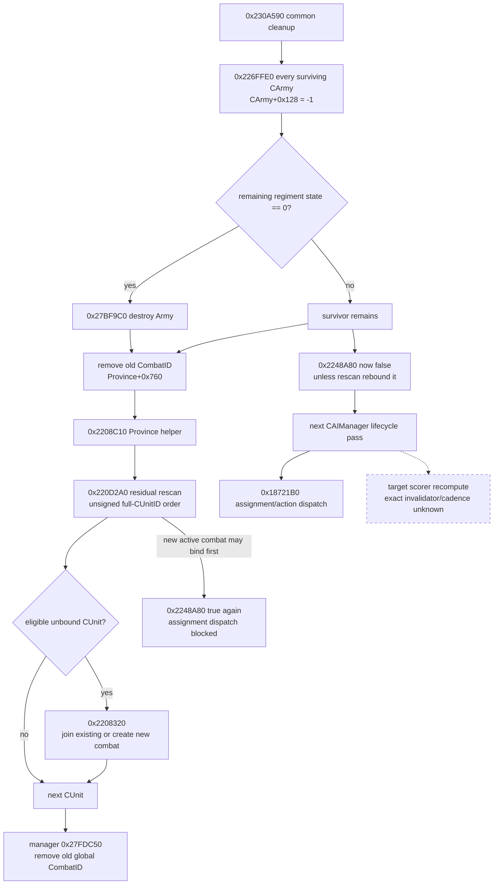

# CK3 1.19.0.6 战斗终局、清理、残余接战与 AI 重入

## 范围、版本与证据边界

- [static-confirmed] 本文只绑定 CK3 `1.19.0.6` 的
  `Crusader Kings III/binaries/ck3.exe`，SHA-256 为
  `2D00FF3101EF70B566F2FCBAE292F09263199C80E9DC8F139B82D7D96F83DB86`；所有地址均为模块基址为零的 RVA。
- [static-confirmed] 原版数据证据来自
  `game/common/on_action/combat_on_actions.txt`，SHA-256
  `B35D696F472E801BB332D7204AA46008349E8AFBFDB38985C781EB099BBFB233`，以及
  `game/common/on_action/knight_on_actions.txt`，SHA-256
  `F7C179D93F24762E3C7FC6002CD988ED0B94ACD5202FB421D34D646454AB48EB`。
- [static-confirmed] 终局 loot dispatcher 的原版数据证据来自
  `game/common/on_action/army_on_actions.txt`，SHA-256
  `61D70DE16951700F961624DF56FFBA4576B887A669CE2F592BF023F541EC54B0`，以及
  `game/common/on_action/barter_on_actions.txt`，SHA-256
  `9FC63FDB284F2E41274BD1384B7394D23FC42907254F91A51845097B45DBC6AB`。战分参数另以
  `game/common/defines/00_defines.txt` SHA-256
  `C1ECA141C71EC1E741CA5336E01BB538EEFAEC05B0684EDEC477CFC9053C3807`
  与 `game/common/casus_belli_types/_casus_belli.info` SHA-256
  `E3BACD9F3360837F6ED7D5F22B937AB7E79CB675AD804819A627CB73970CE699` 互证。
- [static-confirmed] 本轮只做反汇编、RTTI/xref 与原版数据读取；没有启动 CK3、没有调用任何会改变游戏世界的函数，也没有调用战斗构造入口 `0x27FB7C0`。
- [unknown] 本文没有实机终局 trace。`normal_result` / `no_normal_result` 的机器分叉已经闭合，但未来 bridge 的被动观察器仍须在同一 exact build 做 paused/managed acceptance 后，才可把 production readiness 标为 true。
- 本文中的 `CCombatResultData` 是 RTTI 的正式 native 类型名；仓库旧接口中的 `BattleResult` 是同一外层对象的兼容简称。其内嵌的 `CBattleResult`、`CBattleResultSide` 是另外两种 RTTI 类型，不可混为一谈。

## 结论先行

1. [static-confirmed] 普通逐日终局是 `0x27FB5D0 -> 0x230A590(combat,false) -> 0x27FDC50`。它只在 phase raw `3` 且本轮没有先进入 invalidation sweep 时发生。
2. [static-confirmed] `0x27FBE50` 不是按 phase 判定终局。它对 active combat 解析双方 `primary_participant_character_id`，调用
   `0x2900470(side0_primary,side1_primary,false)`；返回 false、`CCombat+0x704==0` 且 `+0x705==0` 时，调用
   `0x230A590(combat,true)`，即 `no_normal_result`。若 `+0x705!=0`，它只置 manager `+0x60=1`，延后清理。
3. [static-confirmed] `0x230A590(...,true)` 首先同样置 `CCombat+0x704=1`，但跳过 `CCombatResultData` 正常构造、winner/loser envelopes 与双方 result-side reset；之后仍进入共同的军队 backlink 清理、空军销毁、Province 脱链与残余接战 rescan。
4. [static-confirmed] 共同清理先把每支 surviving `CArmy+0x128` 写成 `-1`，再从 Province `+0x760` 移除旧 CombatID，执行 `0x220D2A0(Province)`，最后由 manager 调 `0x27FDC50` 从全局 combat storage 移除旧对象。因此同省新 combat 可以在旧 finalized combat 尚存在于全局 storage 时已经建立。
5. [static-confirmed] `0x220D2A0` 按 Province `+0x748/+0x754` 的 unsigned full-CUnitID 顺序扫描。较早 CUnit 创建的新 combat 对较晚 CUnit 立即可见，后者可以在同一 rescan 中加入它。
6. [static-confirmed] finalizer 不直接调用 AI 目标评分或 coordinator 重算。它通过清空 `CArmy+0x128` 打开 `0x18721B0` 的 active-combat blocker；之后 surviving AI subunit 在下一次 `CAIManager` lifecycle pass 中可重新执行已有 assignment。是否重算目标还受独立 timer/invalidation 控制。
7. [static-confirmed] 战后仅看当前对象，不能总是区分 `normal_result` 与 `no_normal_result`：no-normal 一定删掉 ResultID，但 normal 在没有 relevant current player 时也删掉 ResultID。严格判别必须在 `0x230A590` 入口被动记录第二参数，或把终局种类返回为 `unavailable_after_removal`。
8. [static-confirmed] normal finalizer 在 `0x230A7C6` 先调 `0x222A5A0(CWar*,CCombat*)`：它把一个 `0x58`-byte battle-score row 追加到 `CWar+0x298/+0x2A4`，并把 row `+0x40` 原样复制到 `CCombatResultData+0x40`。之后才在 `0x230A7DA` 调 `0x23097B0` 构造 UI/reward result，所以后者不是战分 writer。
9. [static-confirmed] 单场 row `+0x40` 是非负 Q100000 magnitude，row `+0x50` 才记录 winner 是否为 war attacker。`0x2903150` 分别汇总进攻/防守胜场，取 attacker-wins 减 defender-wins，再按 CB 累计 cap 截断。因此 script `warscore_value` 本身不带战争相对正负号。
10. [static-confirmed] `0x23A2360` / `0x2934FE0` 并非 `on_commander_combat_finished` / `on_army_combat_finished`；它们是败北 raid/barter army 的 loot 转移 dispatcher，分别对应 `on_defeat_raid_army` 与 `on_defeat_barter_army`。

## 终局分叉：phase done 与 invalidation sweep

### Daily manager `0x27FB5D0`

[static-confirmed] manager 的 daily loop 读取 `+0x20/+0x2C` CombatID 数组。对 generation-valid 且 active 的 `CCombat`，执行顺序是：

1. `0x27FB67C`：写 `CCombat+0x705=1`，标记本 combat 正在执行 phase tick/finalization window。
2. 把两侧当前 commander snapshot 写入 `+0x94` 与 `+0x3DC`，递增 `+0x6B4` phase-day/cadence raw，然后按 `+0x6B0` 分派 phase helper。
3. `0x27FB717`：清 `CCombat+0x705=0`。
4. 若 manager `+0x58!=0`，`0x27FB729` 先调用 `0x27FBE50`，随后直接跳过本 combat 的普通 phase-done 分支。
5. 否则，若 `CCombat+0x6B0==3`，`0x27FB739..0x27FB74A` 调
   `0x230A590(combat,false)`，再按完整 CombatID 调 `0x27FDC50`。
6. loop 结束后若 manager `+0x58!=0`，`0x27FB780` 再做一次 sweep。

所以 `phase==3` 不是强制 normal-result 的历史证明：同一轮若 invalidation flag 已置位，sweep 会先行并可能用 `true` 分支终局。

### Invalidation sweep `0x27FBE50`

[static-confirmed] sweep 从 manager `+0x28/+0x34` 遍历 CombatID，并在入口清 manager `+0x60=0`。每项严格解析、调用 `CCombat` vtable slot `+0x08` active predicate 后，执行：

1. 从 `CCombat+0x90` 与 `+0x3D8` 读取两侧 primary CharacterID；以低 24 bit 索引 Character store，并要求 `CCharacter+0x18` 回读完整 ID。
2. `0x27FBF61` 调 `0x2900470(side0_primary,side1_primary,0)`。
3. helper 返回 true：保留 combat，继续下一项。
4. helper 返回 false：只有 `CCombat+0x704==0` 才可能继续。
5. 若 `CCombat+0x705!=0`，不递归终局，只在 `0x27FBF7A` 置 manager `+0x60=1`，等待后续 sweep。
6. 若 `+0x705==0`，`0x27FBF80..0x27FBF91` 调
   `0x230A590(combat,true)`，再调 `0x27FDC50`。

[static-confirmed] `0x27FBE50` 的 direct xrefs 是 `0x27A3D56`、`0x27FB729`、`0x27FB780`。其中 `0x27A3D56` 位于 `0x27A31E0..0x27A4036` 的 war-object terminal/teardown routine 中：该 routine 先以对象 `+0x358` 为 guard，再从 game-data `+0x29A10` 取 combat manager 调 sweep。它证明“战争终止会触发 combat invalidation sweep”，但不证明这是唯一上游来源。

[unknown] `0x2900470` 在接战链也承担双方关系/兼容性判定。本文只称它为
`fight-compatibility relation predicate`；当前证据不足以把 false 精确缩减为“战争结束”或某一个 diplomacy enum。角色死亡、联盟变化、第三方战争重组等所有 invalidator 的完整 producer 集仍未闭合。



## `0x230A590`：结果 envelope 与共同清理

### `suppress_normal_result_envelopes` 的精确意义

[static-confirmed] ABI 可保守命名为：

```cpp
void __fastcall FinalizeCombat(CCombat* combat,
                               bool suppress_normal_result_envelopes);
// RVA 0x230A590
```

两条路径都在 `0x230A5C4` 写 `CCombat+0x704=1`。`0x230A654` 检查第二参数：

- `false`：构造/填充结果对象，调用 `0x230AF10`，然后分别调用 `0x23C9770` reset 两侧。
- `true`：直接跳到 `0x230A9BD`，跳过上述整段，进入共同 army cleanup。

这里的参数不能命名为 `aborted`、`war_ended` 或 `no_winner`：它的机器事实只是“抑制正常结果 envelopes”。当前唯一闭合的调用场景是 invalidation relation 失效。

### `CCombatResultData` 外层对象

[static-confirmed] `CCombat+0x708` 是 full-generation ResultID。正数 ID 通过
`module+0x57C0328` storage 解析，并要求对象 `+0x08` 回读完整 ID；`-1` 才是合法 absent sentinel。RTTI 为
`CCombatResultData`（type descriptor `0x54A4888`、primary vtable `0x43084B8`），component storage stride 为 `0x1A0`。

| offset | 证据与可发布语义 |
|---|---|
| `+0x08` | [static-confirmed] full ResultID identity |
| `+0x28` | [static-confirmed] `wipe_raw`；winner/loser scope 与 loser disposition 都读取它 |
| `+0x2C` | [static-confirmed] retreat elapsed gate 使用的 signed date/raw baseline；独立正式业务名 unknown |
| `+0x34` | [static-confirmed] normal finalizer 写入当前 global raw 值；形态像 terminal timestamp/date，但正式名 unknown |
| `+0x40` | [static-confirmed] 单场 battle warscore 的非负 Q100000 magnitude；由 `0x222A5A0` 从新追加的 CWar row `+0x40` 逐字节复制，也是 script `warscore_value` 的直接读值 |
| `+0x48..+0x97` | [static-confirmed] `0x23097B0` 生成的 0x50-byte embedded `CBattleResult` |
| `+0xA0/+0xAC` | [static-confirmed] stride-`0x18` 的 side-associated vector data/count；row 正式名 unknown |
| `+0xB8/+0xC4` | [static-confirmed] relevant current-player CharacterID vector data/count |
| `+0xD0` | [static-confirmed] 与 relevant-player vector 平行追加零值的 vector；业务名 unknown |
| `+0xE8` | [static-confirmed] 第一侧 embedded `CBattleResultSide` |
| `+0x138` | [static-confirmed] 第二侧 embedded `CBattleResultSide` |
| `+0x188` | [implementation-confirmed elsewhere] retained battle-event trace rows；本轮不扩展该 ABI |

[static-confirmed] 内嵌类型的 RTTI 分别是 `CBattleResult` type descriptor `0x54BE540`、vtable `0x431F848`，以及
`CBattleResultSide` type descriptor `0x54BE568`、vtable `0x431F810`。`0x23DB050` 把两侧数据投影到 `+0xE8/+0x138`。

### normal-result 构造顺序

[static-confirmed] `suppress=false` 的主要顺序如下：

1. 写外层 result `+0x34`。
2. 遍历 game-data `+0x1D560/+0x1D56C` 的 current-player CharacterIDs；`0x23C9600` 判定玩家是否属于任一侧。命中者追加到 `+0xB8`，并向 `+0xD0` 平行追加零；因此 `+0xC4` 是 relevant-player count。
3. 由双方 primary participant 在 `0x230A780 -> 0x2610840` 取得共同 WarID，generation-resolve CWar 并检查 active vfunc；通过时，`0x230A7C6` 调 `0x222A5A0`，先追加战分 row 并写 result `+0x40`。
4. 解析 player context（若存在），`0x230A7DA` 调用 `0x23097B0(combat,out,winner-side-selector)`，将 0x50 bytes 写入 `+0x48..+0x97`。
5. 复制 side-associated stride-`0x18` rows 到 `+0xA0`，并用 `0x23DB050` 写两个 embedded side。
6. `0x230A9A3` 调 `0x230AF10(combat)`；随后 `0x230A9AC` 与 `0x230A9B8` 分别调 `0x23C9770` reset 两侧。
7. 进入共同 cleanup。

### winner/loser envelopes 与角色变化

[static-confirmed] `0x230AF10` 从 `CCombat+0x6E0` 选 winner side，按固定顺序：winner RNG draw
`0x230AFBD` -> loaded event/effect database `+0x258`；opposite loser RNG draw `0x230B07C` -> database `+0x260`。
原版 `combat_on_actions.txt` 中对应顶层 envelope 为：

- `on_combat_end_winner`：Root 是胜方 side，带 `scope:wipe`；可触发 commander/knight 俘虏、artifact、harm、legend、glory 等事件/effect。
- `on_combat_end_loser`：Root 是败方 side，带 `scope:wipe`；包含 harm、memory/effect，并在
  `combat = { warscore_value >= 15 }` 条件下处理 legitimacy loss 等结果。

[static-confirmed] 名称字符串 RVA 为 winner `0x4311D28`、loser `0x4311D10`；registration callsite 为
`0x2505294` 与 `0x25052B1`。registration table block `+0x960/+0x980` 与运行时 dispatch projection `+0x258/+0x260` 是不同层，不应混写成同一个偏移。

[static-confirmed] 多数 commander/knight 伤亡不是 terminal finalizer 直接产生，而是在 phase-event 链
`0x27FB4D0 -> 0x23C8750 -> 0x2E1C570` 选 row、随后 `0x23C9900` 执行 script 时产生；详见
[combat-phase-events.md](combat-phase-events.md)。但是 normal terminal envelopes 也可触发 `harm.0012`、俘虏等角色变化，所以终局角色 delta 不能只看 regiment casualty ledger。

[static-confirmed] 共同 cleanup 后确实调用两个 loaded-script dispatcher，但新证据否定它们是 finished hooks：

- `0x230AC7A -> 0x23A2360(side ArmyID vector, primary participant Character*)`：仅对 `CArmy+0x1D4!=0` 的 raid army 进入 dispatch；根 scope 为 Army，命名 scopes 是 `raider` 与 `recipient`，读 runtime database `+0x170`，累加后清零 `CArmy+0x1E0` raid loot。它是 stock `on_defeat_raid_army`：名称字符串 RVA `0x43120B8`、唯一 xref `0x2504F4B`，registration block `+0x5C0`，runtime slot `+0x170`，两者 ordinal 均为 `46`。EXE source literals 是 `raid.cpp` / `HandleRaidArmyDefeat`。
- `0x230AD13 -> 0x2934FE0(side ArmyID vector, first CArmy*, primary participant Character*)`：仅对 `CArmy+0x1EC!=0` 的 barter army 进入 dispatch；通过 `0x2934C10` 构造 Army root 及 `barterer/county/barony`，再加 `recipient/barter_loot`，读 runtime database `+0x610`，累加后清零 `CArmy+0x1F0` barter loot。它是 stock `on_defeat_barter_army`：名称字符串 RVA `0x43125F0`、唯一 xref `0x250600F`，registration block `+0x1840`，runtime slot `+0x610`，两者 ordinal 均为 `194`。EXE source literals 是 `barter_utilities.cpp` / `HandleBarterArmyDefeat`。

精确 registration/runtime projection 链为：

- raid：`0x2504F3A [rbx+0x50] -> 0x2504F3E +0x5C0 -> 0x2504F4B name -> 0x2504F52 call 0x7E9530`；运行时 `0x23A25D9 module+0x57C0F10 -> singleton+0x38 -> 0x23A2624 +0x170 -> 0x23A274B call 0x33F8350`。
- barter：`0x2505FFE [rbx+0x50] -> 0x2506002 +0x1840 -> 0x250600F name -> 0x2506016 call 0x7E9530`；运行时 `0x2935216 module+0x57C0F10 -> singleton+0x38 -> 0x2935267 +0x610 -> 0x2935389 call 0x33F8350`。

[static-confirmed] 相邻路径进一步锁定了这两个 identity：`0x23A2090..0x23A2352` 以 `raider/raid_loot` scopes 在 `0x23A22C8` dispatch runtime `+0x160`，对应 `on_raid_loot_delivered`；`0x2934DA0..0x2934FD8` 在 `0x2934F4F` dispatch runtime `+0x608`，对应 `on_barter_loot_delivered`。败北路径紧随 delivery slot，且其 flag/loot 清零与原版 comments/body 完全一致。

[unknown] `barter_on_actions.txt` 的 `on_defeat_barter_army` body 读 `scope:receiver`，但 native wrapper 明确发布的 key 是 `recipient`（StringID global `module+0x57EB618`）。它们是否由 alias/inherited scope 衔接未闭合；wire 只应报告 native `recipient`，不自行改名。raid stock comment 也写 receiver，但实际 `raiding.0012` body 读 `recipient`，与 native 一致。

[unknown] stock `on_commander_combat_finished` / `on_army_combat_finished` 在本 exact build 中的真正 native dispatch registration/callsite 本轮未定位。`knight_on_actions.txt` 中前者的事件已注释禁用、后者为空；这只能说明stock playset 下它们无可见 body，不能把 raid/barter dispatcher 重命名为这两个 hook。

### `warscore_value` evaluator 与 canonical storage

[static-confirmed] `warscore_value` 注册字符串 RVA 为 `0x437A068`，注册入口 `0x53C360`，正式类为
`CTriggerEntry<CCombatWarscoreTrigger>`（type descriptor `0x55028E0`、COL `0x49C0968`、vtable `0x437B6A8`）；其 trigger 实体是
`CCombatWarscoreTrigger`（type descriptor `0x5502118`、COL `0x49C0030`、vtable `0x437D490`），constructor/factory 为 `0x284F5F0`。

[static-confirmed] vtable slot `+0x100 -> 0x284C7A0` 是真正 accessor。它要求 Combat scope tag `0xA`，generation-resolve `CCombat`，再按
`CCombat+0x708 -> CCombatResultData` 严格解析，直接返回 result `+0x40` qword。`0x23DB840` 构造 result 时在 `0x23DB891` 将其置零。因此 script 读值与 native 单场 row 是同一份 Q100000 数据，不是 `0x23097B0` 的 UI 派生值。

### CWar battle row writer 与终局顺序

[static-confirmed] normal finalizer 先解析双方 primary participant，`0x230A780` 调 `0x2610840`；返回对象 `+0x20` 是 WarID。严格解析 CWar 且 active vfunc 为 true 后，`0x230A7C6` 调 `0x222A5A0(war,combat)`。后者：

1. 要求 `CCombat+0x6E0!=-1` 且 `CWar+0x34!=0`。
2. `0x222A5EA -> 0x2224870(CWar+0x20,winner_side+0x70)` 得到 `winner_is_war_attacker`；`0x222A5FF -> 0x2224870(CWar+0x20,side0+0x90)` 得到 `side0_is_war_attacker`。
3. 分配 `0x58` bytes，`0x222A62F` 调 `0x25BB9A0` 构造 row，`0x222A642` 将 row pointer 追加到 `CWar+0x298`（count `+0x2A4`）。
4. 严格解析 `CCombatResultData`，`0x222A687..0x222A697` 取最后 row `+0x40`，原样复制到 result `+0x40`。
5. 回到 finalizer 后，才在 `0x230A7DA` 调 `0x23097B0`，之后才在 `0x230A9A3` 调 winner/loser envelopes。

| CWar / row offset | 含义 |
|---|---|
| `CWar+0x08` | [static-confirmed] full WarID identity |
| `CWar+0x28` | [static-confirmed] war-attacker participant pointer array，用于防守方赢时的 denominator 反侧选择 |
| `CWar+0x88` | [static-confirmed] war-defender participant pointer array，用于进攻方赢时的 denominator 反侧选择 |
| `CWar+0x100` | [static-confirmed] loaded CB type/config pointer；战分 scale 与累计 cap 从其读取 |
| `CWar+0x298/+0x2A4` | [static-confirmed] heap `0x58`-byte battle-score row pointer vector data/count |
| `row+0x40` | [static-confirmed] 单场非负 battle-score magnitude，signed Q100000 |
| `row+0x50` | [static-confirmed] `winner_is_war_attacker` bool；它决定累计时的正负侧 |
| `row+0x51` | [static-confirmed] `combat_side0_is_war_attacker` bool |

row serializer 把 `+0x40/+0x50/+0x51` 分别登记为 field IDs `0x2B32/0x2B33/0x2B34`，是对偏移的独立互证。

### 单场公式、攻守归属与两层 cap

[static-confirmed] row constructor `0x25BB9A0` 在 `0x25BBA09` 调 `0x25BBE70(out_raw,combat,winner_is_war_attacker)`。公式可用下列 exact raw 形状表示：

```text
losing_side_raw = 0x23CDD90(opposite combat side)
                = max(0,
                      side+0xA8
                    - side+0x98
                    - sum((side+0x28/+0x34 rows)[i]+0x20)
                    - sum((side+0x40/+0x4C rows)[i]+0x20))

losing_war_participants = winner_is_war_attacker
                        ? CWar+0x88   # defenders
                        : CWar+0x28   # attackers

denominator_whole = max(1,
  sum(for each losing-war participant:
      eight int32 buckets returned by 0x292FC40(character, mode=2))))
denominator_raw = denominator_whole * 100000

ratio_raw = min(100000, fixed_div(losing_side_raw, denominator_raw))
scale_raw = winner_is_war_attacker
          ? *(CBType+0x1768)  # attacker_score_from_battles_scale
          : *(CBType+0x1770)  # defender_score_from_battles_scale
uncapped_raw = fixed_mul(ratio_raw, scale_raw)

row_score_raw = clamp(uncapped_raw, 0,
  winner_is_war_attacker
    ? *(module+0x570EFA0)     # WAR_ATTACKER_COMBAT_MAX_SCORE
    : *(module+0x570EFA8))    # WAR_DEFENDER_COMBAT_MAX_SCORE
```

`0x23CDD90` 选的一定是失败 combat side（winner `0` -> side1 `+0x368`；winner `1` -> side0 `+0x20`）；其形状是败方本场硬/永久 loss raw。[unknown] `0x292FC40(mode=2)` 返回的八个 `0x20`-spaced int32 bucket 的正式业务总名及全部 membership 边界尚未闭合；所以文档保留其 exact 调用与汇总形状，不把 denominator 简化命名为“当前士兵数”。

[static-confirmed] `NCombat` 原版 defines 把进攻/防守单场 scale 均设为 `50`，单场 max 也均为 `50`；CB 可通过
`attacker_score_from_battles_scale` / `defender_score_from_battles_scale` 覆盖 scale。上式使用的是已加载 CB type 中的最终值，不应在 bridge 内重现配置合并逻辑。

[static-confirmed] `0x2903150(CWar*,context)` 实现第二层累计：遍历 `CWar+0x298/+0x2A4`，按 row `+0x50` 分别累加 attacker-win 与 defender-win magnitude，各自以 signed truncation 从 Q100000 转 whole int，返回
`attacker_wins_whole - defender_wins_whole`，最后夹在：

- 正向上限 `CBType+0x1750 = max_attacker_score_from_battles`；
- 负向下限 `-(CBType+0x1754) = -max_defender_score_from_battles`。

所以 row/result `+0x40` 永远是单场 magnitude；要得 attacker-relative delta，必须结合 row `+0x50`，即
`winner_is_war_attacker ? +score_raw : -score_raw`。`0x222A8A0` 的 total war score 则包含
`0x2903150 + 0x2903DA0(false) - 0x2903DA0(true)` 的 battles 分项，再加 occupation、ticking、imprisonment 等项；单场 row 不等于 total war-score delta 的全部来源。

### 写入后如何进入 termination 与 AI

[static-confirmed] `0x184D960..0x184DFD6` 是 AI war snapshot/projection builder，由 coordinator 初始化的 `0x188568E` 与 lifecycle `0x185520E` 调用。其中：

- `0x184DE24 -> 0x222A8A0` 读 total attacker-relative war score，再转为 coordinator-side 符号；
- `0x184DE63 -> 0x2903150` 读上述累计 base battle score，`0x184DE7D -> 0x2903DA0` 补 special battle term；
- `0x184DEFF..0x184DF17` 按 coordinator side 选 `CBType+0x1750/+0x1754` battle cap；
- `0x184DF35..0x184DF41` 用 cap 减当前 signed battle component，写 AI snapshot `+0x1018` remaining battle warscore。

该 remaining 值会进入已有 army scorer；例如 [army-controller.md](army-controller.md) 已证明 remaining battle warscore `>=20` 会触发 close-to-victory 的 enemy-unit priority 翻倍。war acceptance/termination 评估同样通过 `0x222A8A0` 看到新 row；真正 war teardown `0x27A31E0` 在更后面才调 combat invalidation sweep。

[static-confirmed] 已证明的 local 顺序是：**追加 CWar row / 写 result `+0x40` -> `0x23097B0` UI/reward builder -> winner/loser result effects -> raid/barter loot defeat effects -> Province/residual cleanup**。finalizer 本身没有直接调 `0x222A8A0`、AI lifecycle 或 war teardown；任何之后的 total/AI query 都能看到 row，但 AI lifecycle 与 termination evaluation 在同一 game-day 的全局先后/cadence 仍是 unknown。



### ResultID retention：为什么缺失不能判 no-normal

[static-confirmed] `0x230ADDF..0x230AE2C` 对 result storage 执行以下保留规则：

```text
if result_object_is_active and
   (suppress_normal_result_envelopes == true or relevant_player_count == 0):
    remove ResultID through game_data+0x29A50 -> 0x27FDD70
else:
    retain ResultID
```

于是：

- `no_normal_result`：ResultID 一定被移除；
- `normal_result` 且 `+0xC4==0`：ResultID 也被移除；
- `normal_result` 且 `+0xC4!=0`：ResultID 被保留。

“ResultID 仍存在”可以作为 normal-result 的强证据；“ResultID 不存在”在 normal/no-normal 之间是不可判定的。

## 共同 army cleanup 与 loser disposition

[static-confirmed] `0x230A9BD` 之后，两条 terminal path 进入相同的 side/Army 清理。顺序以 winner-side selector 起步，再处理对侧；每侧都保留 native stored ArmyID 顺序。

### 每支 Army 的 backlink 与存活检查

`0x226FFE0(CArmy*)` 的精确效果是：

1. `0x226FFEA` 写 `CArmy+0x128=-1`，移除 active CombatID backlink；
2. 由 `CArmy+0x124` generation-resolve backing `CUnit`；
3. 仅当 `CUnit+0x170==1` 时调用 `0x2247A60(CUnit,2)`；raw `1/2` 的正式 enum 名没有闭合。

finalizer 随后扫描 `CArmy+0x38/+0x44` 的 CRegimentIDs，累加 generation-valid `CRegiment+0x38`。若总量为零，再次执行 backlink cleanup，并通过 `0x27BF9C0` 销毁/移除该 Army。

### normal loser 的 wipe 与 route

[static-confirmed] 只有 `suppress=false` 才执行 normal loser disposition：

- `CCombatResultData+0x28 wipe_raw!=0`：对每支 loser army 调 `0x23C9400` 从 combat side 移除并更新相关 loss/contribution ledgers，然后 `0x226FFE0 + 0x27BF9C0` 销毁。
- `wipe_raw==0`：对 loser survivor 调 `0x23C9F00(CArmy,army-manager,CCombat)`。它构造/应用战后 route/state，并在不同分支调用 `0x2247A60(CUnit,2)` 或 `0x2247A60(CUnit,3)`；无合法目的地等分支可以销毁 Army。
- `suppress=true`：跳过这整段 normal loser disposition，但仍执行共同 backlink、empty-army 与 Province cleanup。

[unknown] raw state `2/3` 的正式 enum 名、每条 route 分支的业务名称，以及 retreat state 回归普通 assignment 的全部条件仍未闭合；wire 应保留 raw 值和可直接读到的 route/target，不擅自翻译枚举。

## Province 脱链、residual rescan 与全局 storage 删除

[static-confirmed] common cleanup 尾部从 `CCombat+0x6B8` 取得 Province，并先调用 Province vtable slot `+0x30` gate。gate true 时严格按以下顺序：

1. `0x230AE6B..0x230AE72`：`0x21116E0(Province+0x760,&old_combat_id)`，从 Province combat-ID 数组移除旧 ID；
2. `0x230AE77`：`0x2208C10(Province)`；其独立正式语义未闭合；
3. `0x230AE7F..0x230AE86`：`0x220D2A0(Province)` residual rescan；
4. `0x230A590` 返回后，manager callsite 才调用 `0x27FDC50` 从全局 combat component storage 移除旧 CombatID。

因此在 rescan 期间，旧 CombatID 已不在 Province，但旧 finalized `CCombat` 仍可 generation-resolve；同时所有已处理 survivor Army backlink 已清空。实现 transition query 必须按 exact ID 与 participant overlap 绑定，不能假设全局 storage 中同一省只存在一场 combat。

### `0x220D2A0` 的扫描与同省新 combat 顺序

[static-confirmed] rescan 的控制流为：

1. 入口把 `Province+0x754` CUnit count snapshot 到局部变量；该上界在本轮固定。
2. index 从 `0` 到 `count-1`；每次迭代重新读取 `Province+0x748` data pointer。
3. Province CUnit table 在正常维护路径下按 unsigned full-CUnitID 数值升序。
4. generation-resolve 当前 CUnit，要求 `CUnit+0x18==0`，且 `CUnit+0x170<=0`。
5. 由 `CUnit+0x178` 解析 CArmy，再由 `CArmy+0x128` 解析 CCombat，调用 combat active vfunc；若已经绑定 active combat 则跳过。
6. 对未绑定者调用 `0x2208320(Province,CUnit)`；返回 false 再调 `0x2208AA0` fallback。

`0x2208320` 是会加入已有 combat 或创建新 combat 的 mutator，query 禁止调用。因为每一轮重读 CUnit data pointer，而且 earlier mutation 对 later iteration 可见，所以第一个 eligible CUnit 创建的 combat 可被本轮后续 CUnit 立即加入。已有 compatible combat 的选择、join tail append 与 pursuit reopen 细节见
[army-contact-resolution.md](army-contact-resolution.md) 与
[battle-reinforcement-and-join.md](battle-reinforcement-and-join.md)：

- existing compatible CombatID 取 Province `+0x760` unsigned-sorted 表中最后一个 compatible 项；
- 无 existing 时，以第一个 eligible sorted CUnit 建新 combat；
- join 按首次接触顺序 tail append；
- pursuit join 可把 phase 重开为 main/day 0，并把 winner 写回 `-1`。



## Surviving AI stack 如何重入 assignment

### active-combat blocker

[static-confirmed] `0x18721B0(CAISubunitStack*)` 是 subunit assignment/action dispatcher。它先经
`0x1871D20` 取 representative `CUnit`，在 `0x1872208` 调 `0x2248A80(CUnit)`；返回 true 就在
`0x187220F` 整段早退。

`0x2248A80` 是 generation-safe active-combat predicate：要求 `CUnit+0x18==0`，沿
`CUnit+0x178 -> CArmy+0x128 -> CCombat` 逐层回读完整 ID，最后调用 `CCombat` vtable slot `+0x08`。只有链接到 active combat 才返回 true。

所以 finalizer 的 `0x226FFE0` 不是“重算 assignment”，而是打开 dispatcher 的执行门。若 residual rescan 又把 survivor 绑定到新 active CombatID，这扇门会在 AI pass 之前重新关闭。

### coordinator 生命周期与 cadence 边界

[static-confirmed] 已闭合的调用链是：

```text
CAIManager secondary vtable 0x4193898 slot +0x30
  -> 0x18876D0
  -> 0x18878F1: active coordinator stored order
  -> 0x18550D0(CAIWarCoordinator*)
     -> first pass: timers / stack decisions / conditional recompute
     -> second pass 0x1855380..0x18553B4:
        CAIUnitStack stored order
          -> CAISubunitStack stored order
             -> 0x18721B0
             -> 0x18726C0
```

[static-confirmed] 原生 7/14 tick target timers 控制的是 target recomputation；`0x1855380..0x18553B4` 的第二 dispatch pass 本身没有使用这两个 timer gate。因此终局后可能出现三种不同后续：

1. residual rescan 立即接入新 combat：active blocker 重新成立，普通 assignment 不执行；
2. survivor 未接战且保留现有 assignment/route：下一次 manager lifecycle pass 可直接进入 dispatcher；
3. survivor 未接战但目标已失效：执行可重新开放，然而 exact target 重评分仍需等 timer 或其它 invalidator。

[unknown] `0x18876D0` 对外的正式 interface 名、真实日历 cadence，以及所有 event-driven target invalidators 未闭合，不能把它写成“每日必调”。loser post-battle raw route/state 在 dispatcher 中会先走专门分支；其恢复到普通 target movement 的完整状态机也仍是 unknown。

## `query-battle-transition-v1` 最小只读契约

### 两层能力，而不是一个事后猜测器

终局类型是历史事件，后置状态是当前 snapshot。最小可施工实现应拆为：

1. **被动终局 journal**：在 exact-build `0x230A590` 入口观察参数与 identity；normal path 另在 `0x222A697` 写指令完成后（continuation `0x222A69B`）发布一条以 CombatID 关联的 battle-warscore observation。两者都只复制内存到 bridge 自有 ring，不调用原生 effect、不改 CK3 world。
2. **paused transition query**：以 prior CombatID、prior subject CUnitID 和 journal cursor 为输入，在 application-main 同一 revision 双采样当前 storage/Province/CUnit/AI membership，并组合出终局与 successor 状态。

若首版不实现 journal，仍可发布纯只读 transition frame，但 terminal kind 必须为
`unavailable_after_removal`；不得从 ResultID 缺失、phase 3 或 winner 非负推断 no-normal/normal。

### journal 的最小事件

```text
BattleTerminalObservationV1 {
  sequence,
  observed_date_raw,
  combat_id,
  battle_result_id,
  province_id,
  suppress_normal_result_envelopes,
  phase_raw,
  winner_raw,
  finalized_before,
  daily_guard_raw,
  wipe_raw,
  attacker_primary_participant_character_id,
  defender_primary_participant_character_id,
  attacker_public_cunit_ids_in_stored_order,
  defender_public_cunit_ids_in_stored_order
}

BattleWarscoreObservationV1 {
  sequence,
  observed_date_raw,
  combat_id,
  war_id,
  war_battle_row_index,
  battle_warscore_value_raw,
  winner_is_war_attacker,
  combat_side0_is_war_attacker
}
```

`terminal_kind` 的 canonical mapping 只来自观察到的第二参数：false -> `normal_result`，true ->
`no_normal_result`。ring overflow 或 cursor 缺口必须显式返回 `unavailable_after_removal`。

### paused 后置 frame 的最小字段

```text
query_battle_transition_v1(
  prior_combat_id,
  subject_public_cunit_id,
  expected_snapshot_revision,
  after_terminal_sequence?
)

BattleTransitionV1 {
  status: available | unavailable,
  snapshot_revision,
  observed_date_raw,
  prior: {
    combat_id,
    terminal_kind:
      normal_result |
      no_normal_result |
      unavailable_after_removal,
    suppress_normal_result_envelopes?,
    phase_raw?, winner_raw?, finalized_before?, daily_guard_raw?,
    province_id?, battle_result_id?, wipe_raw?,
    attacker_primary_participant_character_id?,
    defender_primary_participant_character_id?,
    attacker_public_cunit_ids_in_stored_order?,
    defender_public_cunit_ids_in_stored_order?,
    battle_warscore: {
      status:
        recorded |
        not_recorded_by_native |
        unavailable,
      war_id?,
      war_battle_row_index?,
      value_raw_q100000?,
      winner_is_war_attacker?,
      combat_side0_is_war_attacker?,
      attacker_relative_delta_raw_q100000?
    }
  },
  removal: {
    prior_combat_strictly_resolves,
    prior_province_strictly_resolves,
    prior_province_contains_prior_combat_id?,
    result_strictly_resolves?,
    result_relevant_player_count?
  },
  subject: {
    exists,
    current_province_id?,
    native_carmy_id?,
    combat_backlink_id?,
    active_combat_id?,
    movement_or_retreat_state_raw?,
    move_target_province_id?,
    route_province_ids_in_stored_order?,
    coordinator_id?,
    unit_stack_stored_index?,
    subunit_stored_index?,
    blocked_by_active_combat?
  },
  successor: {
    state:
      no_successor |
      residual_new_combat |
      subject_missing |
      subject_retreating |
      subject_assignment_reopened |
      unavailable,
    matching_combat_ids_in_native_order,
    selected_successor_combat_id?,
    participant_overlap_public_cunit_ids_in_prior_order
  }
}
```

`removal` 与 `successor.state` 必须分开：旧 combat 被删、subject 进入 retreat、同省产生 residual combat、AI assignment gate 重开，是四个不同事实。建议 UI/策略层的 convenience discriminant 使用：

- `present_same_combat`：prior CombatID 仍严格解析且 active；
- `removed_normal_result`：old combat 不再严格解析，且 journal 明确记录 false；
- `removed_no_normal_result`：old combat 不再严格解析，且 journal 明确记录 true；
- `removed_terminal_kind_unavailable`：old combat 不再严格解析，但没有无缺口 journal 证据。

不得提供 `removed = ResultID missing` 之类的伪判据。Result object retained 只能单向加强 normal-result 证据，不能替代入口 journal。

`battle_warscore.status=recorded` 只来自同一 CombatID 的无缺口 post-writer observation；不得在事后从 total war score 差分猜单场值。对 gap-free normal terminal，若 native writer 因无 winner/无 active common war 未追加 row，则显式返回 `not_recorded_by_native`；journal 有缺口时返回 `unavailable`。正当零值仍是 `recorded + value_raw_q100000=0`，不得与未记录混同。

### generation、排序与一致性门

- 所有 CombatID、ResultID、CArmyID、CUnitID、CharacterID 都必须按低 24-bit 索引并回读完整 generation；positive stale ID 不得回退到 null object。
- old CombatID removal 必须同时报告 global strict resolution 与 prior Province membership；两者不在同一个 native 时刻发生。
- successor 匹配以 exact new CombatID 为 identity，再以 prior ordered participant overlap 说明关系；不能只按 Province 选唯一场。
- subject 的 `blocked_by_active_combat` 应镜像 `0x2248A80` 的严格只读 predicate，不调用 `0x2248A80` 也可以按相同链复制判断。
- paused application-main callback 内做两次全图采样；revision/date、journal cursor、ID、count、membership、route、combat backlinks 任一漂移都返回 `state_changed`。

## 可直接施工的 bridge 入口

| 目的 | exact-build 入口/字段 | 施工约束 |
|---|---|---|
| terminal kind canonical source | `0x230A590` entry，`RCX=CCombat*`、`DL=suppress bool` | 只做 passive observation；不替换返回值，不调用 finalizer |
| normal callsite 互证 | `0x27FB73E`，此前 `EDX=0` | 可给 journal 记录 caller tag；不把 caller tag 当唯一判据 |
| no-normal callsite 互证 | `0x27FBF85`，此前 `DL=1` | 同上 |
| old CombatID removal | `0x27FDC50` manager callsites `0x27FB74A/0x27FBF91` | 只观察或事后 strict resolve；不要主动调用 |
| result strict read | `CCombat+0x708 -> module+0x57C0328 -> object+0x08` | `-1` 才可 absent；positive stale 为 state change |
| script `warscore_value` mirror | `0x284C7A0` 的字段链：`CCombat+0x708 -> CCombatResultData+0x40` | 直读 qword Q100000；禁止调 trigger evaluator |
| canonical per-battle score observation | `0x222A5A0`；copy instruction `0x222A697`，post-copy continuation `0x222A69B` | entry 为 `RCX=CWar*,RDX=CCombat*`；continuation 保持 `RSI=CWar*,RDI=CCombat*`。只被动记录 identity、新 row index、row `+0x40/+0x50/+0x51`；不主动调 writer |
| cumulative battle score read | `CWar+0x298/+0x2A4` rows，CB caps `+0x1750/+0x1754` | 保留 raw magnitude/side bool；需要 whole score 时镜像 `0x2903150` signed truncation |
| result retention evidence | `CCombatResultData+0xC4` relevant-player count | 仅解释 retention；不能倒推 terminal kind |
| Province old-ID membership | `CCombat+0x6B8`，Province `+0x760/+0x76C` | 保存 prior ProvinceID，removed 后不要解引用旧 combat pointer |
| subject current binding | `CUnit+0x178 -> CArmy+0x128 -> CCombat` | 全链 generation readback + active vfunc mirror |
| residual candidate order | Province `+0x748/+0x754` | 保留 unsigned full-CUnitID native order |
| AI membership/re-entry | `CUnit+0x1C4` coordinator ID、`+0x1D0` subunit backlink；`0x2248A80` predicate shape | 只读复制现态；禁止调 `0x18721B0` |

首个 production slice 最小可交付顺序是：入口 journal -> typed ring/source-contract fixture -> paused
`query-battle-transition-v1` -> normal phase-done fixture -> war-teardown/no-normal fixture -> 同省 residual combat fixture -> survivor assignment-reopened fixture。前两种 terminal path 都必须覆盖 result retained 与 result absent 的组合，才能证明实现没有拿 ResultID 反推分支。

## 明确禁止的调用与剩余 unknown

query/observer 路径不得调用：`0x230A590`、`0x222A5A0`、`0x25BB9A0`、`0x25BBE70`、`0x230AF10`、`0x27FDC50`、`0x27FDD70`、`0x226FFE0`、
`0x23C9F00`、`0x21116E0`、`0x2208C10`、`0x220D2A0`、`0x2208320`、`0x2208AA0`、
`0x18721B0`、`0x184D960`、`0x18550D0`、`0x18876D0`、`0x222A8A0`、`0x2903150`、`0x284C7A0`、`0x2247A60`、`0x27BF9C0` 或 `0x27FB7C0`。这些函数是 mutator、dispatcher，或其 ABI/只读性不适合作为 production query 承诺；所需数据应按已证明字段直接读取并做 generation validation。

仍需后续静态/实机闭合的账本：

- [unknown] `0x2900470` 的正式 relation enum/业务名称，以及触发 manager `+0x58` 的完整 producer 集；
- [unknown] manager `+0x61` 与 sweep 尾部 `0x27FE5B0/0x27FE720` 的正式维护语义；
- [unknown] `CCombatResultData+0x2C/+0x34/+0xA0/+0xD0` 的正式字段名；
- [unknown] 真正 `on_commander_combat_finished` / `on_army_combat_finished` 在 exact build 中是否存在 hash-only/dynamic native invocation；已证明 `0x23A2360/0x2934FE0` 不是它们；
- [unknown] `on_defeat_barter_army` stock body 的 `receiver` 与 native 发布 `recipient` 之间是否存在 alias/inherited scope；
- [unknown] `0x292FC40(character,mode=2)` 八 bucket denominator 的正式业务名、bucket 名与完整 membership 边界；
- [unknown] `0x2208C10`、`0x2208AA0` 的正式业务名称；
- [unknown] loser raw state `2/3` 的 enum 名与回归普通 movement/assignment 的完整状态机；
- [unknown] `CAIManager::0x18876D0` 的正式日历 cadence、全部 target invalidators 与 finalizer/rescan/AI-manager 的全局同日排序；
- [unknown] loaded playset 对 stock combat/knight on_actions 的最终合并结果；需要实际 playset manifest 或被动 trace，stock 文件不能代表任意生产会话。

## 静态复现命令

```powershell
Get-FileHash -Algorithm SHA256 'Crusader Kings III/binaries/ck3.exe'

& 'tools/.venv/Scripts/python.exe' `
  'ck3_autonomous_player/native_bridge/research/disasm_ck3.py' 0x27FB5D0 --size 0x1F0
& 'tools/.venv/Scripts/python.exe' `
  'ck3_autonomous_player/native_bridge/research/disasm_ck3.py' 0x27FBE50 --size 0x190
& 'tools/.venv/Scripts/python.exe' `
  'ck3_autonomous_player/native_bridge/research/find_xrefs.py' 0x27FBE50
& 'tools/.venv/Scripts/python.exe' `
  'ck3_autonomous_player/native_bridge/research/disasm_ck3.py' 0x230A590 --size 0x910
& 'tools/.venv/Scripts/python.exe' `
  'ck3_autonomous_player/native_bridge/research/disasm_ck3.py' 0x230AF10 --size 0x1A0
& 'tools/.venv/Scripts/python.exe' `
  'ck3_autonomous_player/native_bridge/research/disasm_ck3.py' 0x222A5A0 --size 0x300
& 'tools/.venv/Scripts/python.exe' `
  'ck3_autonomous_player/native_bridge/research/disasm_ck3.py' 0x25BB9A0 --size 0x8D0
& 'tools/.venv/Scripts/python.exe' `
  'ck3_autonomous_player/native_bridge/research/disasm_ck3.py' 0x23CDD90 --size 0xC0
& 'tools/.venv/Scripts/python.exe' `
  'ck3_autonomous_player/native_bridge/research/disasm_ck3.py' 0x2903150 --size 0x100
& 'tools/.venv/Scripts/python.exe' `
  'ck3_autonomous_player/native_bridge/research/disasm_ck3.py' 0x184D960 --size 0x680
& 'tools/.venv/Scripts/python.exe' `
  'ck3_autonomous_player/native_bridge/research/disasm_ck3.py' 0x284C7A0 --size 0x90
& 'tools/.venv/Scripts/python.exe' `
  'ck3_autonomous_player/native_bridge/research/find_xrefs.py' 0x222A5A0 0x2903150 0x23A2360 0x2934FE0
& 'tools/.venv/Scripts/python.exe' `
  'ck3_autonomous_player/native_bridge/research/disasm_ck3.py' 0x226FFE0 --size 0xA0
& 'tools/.venv/Scripts/python.exe' `
  'ck3_autonomous_player/native_bridge/research/disasm_ck3.py' 0x23C9F00 --size 0x3D0
& 'tools/.venv/Scripts/python.exe' `
  'ck3_autonomous_player/native_bridge/research/disasm_ck3.py' 0x220D2A0 --size 0x150
& 'tools/.venv/Scripts/python.exe' `
  'ck3_autonomous_player/native_bridge/research/disasm_ck3.py' 0x2248A80 --size 0xA0
& 'tools/.venv/Scripts/python.exe' `
  'ck3_autonomous_player/native_bridge/research/disasm_ck3.py' 0x18721B0 --size 0x130
```
