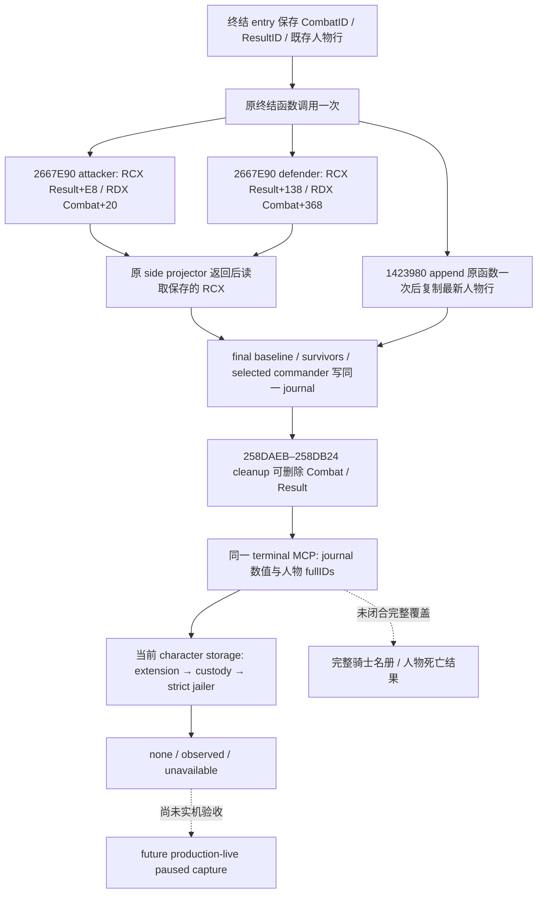

# 战斗终结：最终人数与实际 jailer 的被动观测

2026-10-03。绑定 CK3 **1.20.0.3 / Steam 25652598**，EXE SHA-256 `94B55397ABB687A3DCD436805A5D885E6BE90FA6C693FEB44A9E3BBEEADE02A6`。本增量以当前 `Z:/g38` / source `0cb14dc` 为基线，保留已推送 `93b6ecf` 的双方 loss inputs。前置专题：[正常结算原始数值](battle-terminal-normal-result-values-1.20.0.3-2026-10-03.md)。

当前交付为 **static-ready，新增生产路径离线夹具 GREEN**。真实游戏被动捕获及 paused MCP 验收由维护主线继续；这里没有 production-live、人物死亡结果、完整骑士名册或完整战斗 OODA 的声明。战争与战斗已全面授权，Robert 29829 原普通战役仍是唯一实机入口。

## 原生树与生命周期

原生证据先于实现落盘在外部冻结包 `Z:/ck3_mod_rewrite_process_assets/g2-resume-20261003/battle-casualty-outcomes/final-survivor-character-increments/native-research/`，入口为 `WRAPPER-ABI.md`、`NATIVE-TREE.md`、`character-timing/ABI-TIMING.json` 和 `character-timing/PROJECTION-INPUTS.md`。本轮复用既有 exact EXE 绑定，未宣称重新验证所有旧字段。

`0x2667E90` 是 **void in-place ABI**：RCX 为 caller-owned output，RDX 为 CombatSide。保存两个参数，original 调用一次，返回后复制保存 RCX 的 `+0x08` selected commander、`+0x10` baseline、`+0x18` survivors。两个真实 caller `0x258D171` / `0x258D180` 均忽略 RAX；empty army 的 RAX 可为 0，不能添加非空返回值条件。16-byte anchor `4154415541564883EC308B42744533F6`，resume `0x2667EA0`。

survivors 来自实际 Army fullIDs → strict CRegiment fullIDs → `CRegiment+0x38` 整数 current 之和再乘 **100000**。它不同于 entry `CombatSide+0x98` cached fighting current。attacker Result baseline/survivors 是 `+0xF8/+0x100`；defender 是 `+0x148/+0x150`。正常空侧的最终 0 是合法值。Result `+0xC4` relevant-player count 为 0 或 suppress 的路径可在整个终结函数返回前经 `0x2ADA7F0` 删除结果，因此必须在 side original 返回处冻结，而不能事后追读已消失 Result。旧 foreign 结果不会获得追溯填充。

人物行 appender `0x1423980` 的 RCX 是 container，RDX 是 source row，**RAX 确实为 appended row**，wrapper 保留该返回值。已证明 caller 使用 Result `+0x188`；其他 caller 不假定属于战斗，采用当前 strict Result fullID 关联。14-byte anchor `4053415641574883EC304863410C`，resume `0x142398E`。entry 先冻结既存 rows，postappend 再复制最新完整 container，按 native row index 保留一次，覆盖早期行和后加行。

native row stride `0x38`：left/right full CharacterID `+0x08/+0x0C`，MSVC string object `+0x10`，size/capacity `+0x20/+0x28`，type `+0x30`，side0/target_right `+0x34/+0x35`。capacity `<16` 使用 inline 字节，否则使用 heap data pointer；在 row 尚存时复制文本，不保留 native pointer。key 不能完整复制时，仅 key 为 null，fullIDs 与 custody 观测仍独立可用。row 是候选事件参与者，不推断实际受影响的一方、囚犯、死亡或完整骑士覆盖。

实际 jailer 是 later paused query 的当前事实：strict `Character+0x18` identity → `Character+0x1B0` extension → extension `+0x288` relation → relation `+0` full jailer CharacterID，再 strict resolve jailer。缺 extension/relation 是该帧原生已知无 jailer；正值但无法 generation-resolve 为 unavailable。这不证明 deferred `.1002` 已完成，也不证明该次战斗导致 custody；无需任意 death helper。

## 同一 terminal MCP 的新增输出

| prior 字段 | 值与语义 |
| --- | --- |
| `side_final_results_in_native_order` | null 或固定 attacker/defender 两行：side_index、selected_commander_character_id（-1 为无）、baseline_raw_q100000、survivors_raw_q100000 |
| `character_result_rows_in_native_order` | null 或 native 顺序 rows：native_row_index、left/right_character_id、key（string/null）、type_raw、side0、target_right |
| `character_custody_in_observed_order` | null 或去重 fullID 顺序：primary A/D → actual final commander A/D → row left/right；character_id、status、actual_jailer_character_id |

custody `observed` 对应实际正值、strict resolved jailer；`none` 对应原生无 jailer 的 `-1`；`unavailable` 对应 null。合法零、合法无 jailer 与本构建阶段缺捕获能力分别保留，不把旧结果的 null 当成观测完成。

## 唯一新增 focused 验证

新 test 为 `ck3_autonomous_player/native_bridge/src/ck3_12002_battle_terminal_final_survivor_character_test.cpp`。它调用实际生产 terminal hook、side wrapper、append wrapper、journal lookup、terminal reader、native serializer 和本增量 Python normalizer；fixture originals 只提供已闭合的原生输出布局，不执行 CK3 EXE，也不安装实机 detour。

一次新 case 验证 terminal original 一次、双方 void side original 各一次、append original 一次；初始 SSO 行与 late heap-key 行均保留。original 内清空 Combat、Result 和原字符串，再把 backing regiment count 改为 77；后续两个查询仍返回捕获的 attacker **500000** / defender **0** Q100000，而不是 cached current 9000000/7000000 或修改后的 backing count。第一个 custody 帧全部 `none/-1`，第二帧一个候选人物变为 `observed/strict jailer ID`，最终人数与结果行保持不变。

验证路径：`Z:/ck3_mod_rewrite_process_assets/g2-resume-20261003/battle-casualty-outcomes/final-survivor-character-increments/fixture-topic/focused-attempt-02/RESULT.json`；两个真实 native wire 在其 `native-wire/` 内，均经过 Python normalization。`/O2 /DNDEBUG /W4 /WX`，检查使用 Require，不受 NDEBUG 关闭。最终投影的 5 TU 并行编译，并复用未改 routes object；共 6 TU 链接。`focused-attempt-01` 保留为缺现有 combat dependency 的 harness linker RED，未执行 fixture；补齐依赖后新 executable 仅执行一次并 GREEN。未跑旧矩阵、full DLL、SDK 或窗口操作。

下一步为维护主线构建、按 exact anchor 安装被动 observers，再在 Robert 29829 原战役产生新的正常战斗终结，冻结真实 paused artifact 验收同一 MCP 的 final 与 custody。人物角色解释、完整骑士覆盖及死亡结果仍是另列研究入口，不阻塞已闭合的 fullID 与 actual jailer 观测。
