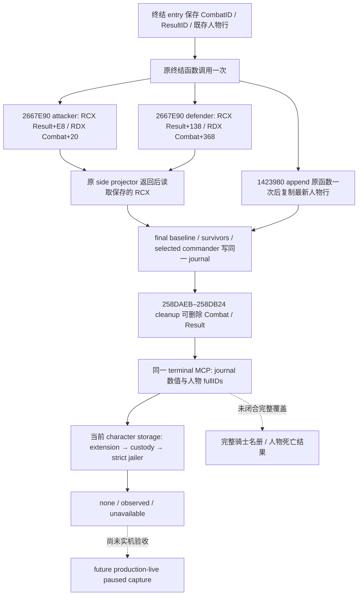

# 战斗终结：最终人数与实际 jailer 的被动观测

2026-10-03。绑定 CK3 **1.20.0.3 / Steam 25652598**，EXE SHA-256 `94B55397ABB687A3DCD436805A5D885E6BE90FA6C693FEB44A9E3BBEEADE02A6`。本增量以当前 `Z:/g38` / source `0cb14dc` 为基线，保留已推送 `93b6ecf` 的双方 loss inputs。前置专题：[正常结算原始数值](battle-terminal-normal-result-values-1.20.0.3-2026-10-03.md)。

当前交付为 **static-ready，新增生产路径离线夹具 GREEN**。真实游戏被动捕获及 paused MCP 验收由维护主线继续；这里没有 production-live、人物死亡结果、完整骑士名册或完整战斗 OODA 的声明。战争与战斗已全面授权，Robert 29829 原普通战役仍是唯一实机入口。

## 原生树与生命周期

原生证据先于实现落盘在外部冻结包 `Z:/ck3_mod_rewrite_process_assets/g2-resume-20261003/battle-casualty-outcomes/final-survivor-character-increments/native-research/`，入口为 `WRAPPER-ABI.md`、`NATIVE-TREE.md`、`character-timing/ABI-TIMING.json` 和 `character-timing/PROJECTION-INPUTS.md`。本轮复用既有 exact EXE 绑定，未宣称重新验证所有旧字段。

`0x2667E90` 是 **void in-place ABI**：RCX 为 caller-owned output，RDX 为 CombatSide。保存两个参数，original 调用一次，返回后复制保存 RCX 的 `+0x08` selected commander、`+0x10` baseline、`+0x18` survivors。两个真实 caller `0x258D171` / `0x258D180` 均忽略 RAX；empty army 的 RAX 可为 0，不能添加非空返回值条件。16-byte anchor `4154415541564883EC308B42744533F6`，resume `0x2667EA0`。

survivors 来自实际 Army fullIDs → strict CRegiment fullIDs → `CRegiment+0x38` 整数 current 之和再乘 **100000**。它不同于 entry `CombatSide+0x98` cached fighting current。attacker Result baseline/survivors 是 `+0xF8/+0x100`；defender 是 `+0x148/+0x150`。正常空侧的最终 0 是合法值。Result `+0xC4` relevant-player count 为 0 或 suppress 的路径可在整个终结函数返回前经 `0x2ADA7F0` 删除结果，因此必须在 side original 返回处冻结，而不能事后追读已消失 Result。旧 foreign 结果不会获得追溯填充。

人物行 appender `0x1423980` 的 RCX 是 container，RDX 是 source row，**RAX 确实为 appended row**，wrapper 保留该返回值。已证明 caller 使用 Result `+0x188`；其他 caller 不假定属于战斗，采用当前 strict Result fullID 关联。14-byte anchor `4053415641574883EC304863410C`，resume `0x142398E`。entry 先冻结既存 rows，postappend 再复制最新完整 container，按 native row index 保留一次，覆盖早期行和后加行。

native row stride `0x38`：left/right full CharacterID `+0x08/+0x0C`，MSVC string object `+0x10`，size/capacity `+0x20/+0x28`，type `+0x30`，side0/target_right `+0x34/+0x35`。capacity `<16` 使用 inline 字节，否则使用 heap data pointer；在 row 尚存时复制文本，不保留 native pointer。key 不能完整复制时，仅 key 为 null，fullIDs 与 custody 观测仍独立可用。row 是候选事件参与者，不推断实际受影响的一方、囚犯、死亡或完整骑士覆盖。

实际 jailer 是 later paused query 的当前事实：strict `Character+0x18` identity → `Character+0x1B0` extension → extension `+0x288` relation → relation `+0` full jailer CharacterID，再 strict resolve jailer。缺 extension/relation 是该帧原生已知无 jailer；正值但无法 generation-resolve 为 unavailable。这不证明 deferred `.1002` 已完成，也不证明该次战斗导致 custody；无需任意 death helper。

## 同一 terminal MCP 的新增输出

| prior 字段 | 值与语义 |
| --- | --- |
| `side_final_results_in_native_order` | null 或固定 attacker/defender 两行：side_index、selected_commander_character_id（-1 为无）、baseline_raw_q100000、survivors_raw_q100000 |
| `character_result_rows_in_native_order` | null 或 native 顺序 rows：native_row_index、left/right_character_id、key（string/null）、type_raw、side0、target_right |
| `character_custody_in_observed_order` | null 或去重 fullID 顺序：primary A/D → actual final commander A/D → row left/right；character_id、status、actual_jailer_character_id |

custody `observed` 对应实际正值、strict resolved jailer；`none` 对应原生无 jailer 的 `-1`；`unavailable` 对应 null。合法零、合法无 jailer 与本构建阶段缺捕获能力分别保留，不把旧结果的 null 当成观测完成。

## 唯一新增 focused 验证

新 test 为 `ck3_autonomous_player/native_bridge/src/ck3_12002_battle_terminal_final_survivor_character_test.cpp`。它调用实际生产 terminal hook、side wrapper、append wrapper、journal lookup、terminal reader、native serializer 和本增量 Python normalizer；fixture originals 只提供已闭合的原生输出布局，不执行 CK3 EXE，也不安装实机 detour。

一次新 case 验证 terminal original 一次、双方 void side original 各一次、append original 一次；初始 SSO 行与 late heap-key 行均保留。original 内清空 Combat、Result 和原字符串，再把 backing regiment count 改为 77；后续两个查询仍返回捕获的 attacker **500000** / defender **0** Q100000，而不是 cached current 9000000/7000000 或修改后的 backing count。第一个 custody 帧全部 `none/-1`，第二帧一个候选人物变为 `observed/strict jailer ID`，最终人数与结果行保持不变。

验证路径：`Z:/ck3_mod_rewrite_process_assets/g2-resume-20261003/battle-casualty-outcomes/final-survivor-character-increments/fixture-topic/focused-attempt-02/RESULT.json`；两个真实 native wire 在其 `native-wire/` 内，均经过 Python normalization。`/O2 /DNDEBUG /W4 /WX`，检查使用 Require，不受 NDEBUG 关闭。最终投影的 5 TU 并行编译，并复用未改 routes object；共 6 TU 链接。`focused-attempt-01` 保留为缺现有 combat dependency 的 harness linker RED，未执行 fixture；补齐依赖后新 executable 仅执行一次并 GREEN。未跑旧矩阵、full DLL、SDK 或窗口操作。

下一步为维护主线构建、按 exact anchor 安装被动 observers，再在 Robert 29829 原战役产生新的正常战斗终结，冻结真实 paused artifact 验收同一 MCP 的 final 与 custody。人物角色解释、完整骑士覆盖及死亡结果仍是另列研究入口，不阻塞已闭合的 fullID 与 actual jailer 观测。

## Oct4 second actual player result: final zero/3911 and current characters

Combat1577058310的真实normal_result event383（cursor358之后）在date53248296发布；winner1为Robert29829
所在combat defender side1。Result1711276040仍retained/relevant1、wipe=true；final native sides为
baseline136300000/392000000Q100000、survivors0/391100000（enemy0/player3911）。side0 selected commander−1
是原生合法缺席，side1为29829。side1 current fighting cache384688604与actual final survivor字段分别保留，
不得替换或因它们与hard账的不同启动一致性审计。

prior当前custody/alive读回70766及29829均alive=true、custody none、actual jailer−1；character result rows为
已观测空列表，top character_observations=null（未请求额外IDs）。空结果行不等于全体骑士死亡总数0，
army wipe也不等于actor死亡；不造knight名单，不为已充分人物观测再开query。新增的是第二场实际player
terminal/final-survivor与当前人物事实primitive，没有完整字符aggregate/war/完整OODA信用。

subject83886367无combat backlink/active、blocked=false、no_successor；current snapshot army_state moving7
并保留完整route[2630,2631,2624,2619]至2619。terminal的movement_or_retreat_state_raw0不是该current enum，
不改称regular。recorded battle War50331736 row0 attacker-relative delta−21.37与whole-war current+11分别记录；
War129 current−25仍单独保留。保持已经继续的march，不重置route或为结果重复查询。

本页追加只复用主consumer已parse的schedule缓存及origin pin。Root正常h6549/save SHA
b17b038cd929782db8f11adffb8909c9680110d55266192a74a8bd4645273227（93567377B）；本战9日=3+6、
total4332/resume1179/Oct4+307均是Root已计存量，本worker新增0日/动作。无SDK/raw/control重读/tests/Git或共享修改。

保留的历史 before 明细仅引用 numeric owner 已封包的
`Z:/ck3_mod_rewrite_process_assets/g2-resume-20261003/battle-casualty-outcomes/player-combat-1577058310-actual-terminal/numeric-person/RETAINED-ENTRIES.json`
（SHA-256 `cc271dfdfc4ca06c32d3e1643b29054a5f203d6c9bb5e04162a907ef1d02b62c`），
而不重读 owner export/control：day06/native1124/public22/date53248272 的 51 typed entries
是历史帧，不能冒充本终局 native1127/date53248296。32 MAA 行的 knight_character_id_raw 均为−1，
positive knight IDs 为空；type_raw/prowess 尚未发布，因此不能推成完整骑士无死无俘。
这些是 source actor 的既有观测扩展入口，不是本次 march 的前置条件，也不启动未知逆向或额外查询。
该 before owner hard ledger（70766=51112494、Robert29829=2631980Q100000）与终局 side input 属不同 scope，
不计算跨账差或一致性问题。历史 selected rolls 为 phase1/day5/cadence2、advantage−5400000Q100000；
attacker current0/next0..0/commander null，defender Robert current6/next0..10；均不是终局后当前掷骰。

## Oct4 third actual result — final survivors and named wound rows

Combat1593835526 的 normal_result event398>cursor383 于 paused native1241/public41/date53248944
发布 phase3/day0、defender winner1，Result1761607683 retained/relevant1；enemywipe=true。
captured final side0 commander70766/baseline296700000/survivors0Q100000，side1 commander29829/
baseline391100000/survivors380400000Q100000，即敌2967→0、玩家3911→3804。
玩家净减少107、native hard23267447Q100000、stored fighting326466938Q100000 是不同字段，
不互相替代或因数值不同启动一致性审计。真实 final/custody/result-row 组件资格为 production-live primitive。

两条实际人物结果行依次为 left43706、left32023；right−1合法无人物，key=knight_wounded_no_enemy、
type_raw2、side0=false、target_right=false。这只证明 native 具名受伤记录；没有当前trait/等级读取，
不从key声称trait已生效，不推完整骑士受伤/死亡/被俘 aggregate。prior同查询发布
70766/29829/43706/32023 alive=true、custody none/actual_jailer−1；该当前事实不等于全部战斗人物
因果结果。top character_observations=null是本次未请求额外character_ids，不需要重复人物query。

old Combat removed、subject active/backlink clear/no_successor，原route[2630,2631,2624,2619]与target2619
仍在同一terminal输出；current control/route/save另由指定observer封包，本lane只由Root引用receipt。
War50331736/row1的attacker-relative delta−50仅为单场 native row，不是 whole-war current score。
只消费父已封decoded/facts/pin；本战25日与末batch10日/240小时已由Root计入
total4359/resume1206/Oct4+334，本报告新增0日/0query/0test；h6666部署没有新增日期推进。

历史 before 只引用 numeric owner 的 `numeric-person/RETAINED-ENTRIES.json`，不重读 owner export。
父已封字段为 native1238/public38/date53248920，不能当本终局1241/public41/date53248944。
该帧54 typed entries：敌levy3/MAA4、我levy17/MAA30，各owner hard ledger1；34 MAA 的
positive knight raw IDs 为空，不代表骑士不存在，实际终局已有43706/32023两条wound记录。
旧typed的type/prowess未发布只作为字段现状记载，不产生未知研究或march门禁；本报告仍新增0查询/0日。

## Oct4 fourth actual final survivor — wipe flag and enemy1 coexist

Combat1728053248 normal_result event22>19 于native164/public13/date53249808发布，
phase3/day0/winner1 defender Robert29829，Result1442840576 retained/relevant1。
side0 selected commander63316、baseline15100000、final survivors100000Q100000（151→1）；
side1 commander29829、baseline389300000、survivors389300000Q100000（3893→3893）。
wipe_raw=true和敌final1是同一实际终局的两个值；不改final0、不推所有敌人物死、不启动跨账差审计。
native hard双方为15100000/198373Q100000，current cached fighting为0/388748832Q100000；
side1 soft levy279499/MAA73296Q100000，分别保留，不能用cached fighting替代final survivors。

人物native result rows为observed empty。prior发布35863/29829/63316的当前alive=true、
custody none/jailer−1；这不等于完整骑士伤亡集合或战斗捕杀因果。top character_observations=null
是没有额外人物请求，不增加traits或重复query。War129/row0的battle attacker delta−9.2175
仅为本场行，不能猜另一个WarID或当前整场战争总分。

旧Combat删除、subject@2619 active/backlink clear/no_successor、targetnull/route empty；
Root current-control报告main regular，native movement raw0独立保留。只给玩家战斗胜利信用，
Capital siege clearance is independently credited by [Root-owned independent capital receipt](Z:/ck3_mod_rewrite_process_assets/g2-resume-20261003/siege-efficiency-inputs/current-capital-2619-query/actual-after-battle1728053248-v52-01/ROOT-DELIVERY.json).
Root supplied native166/public2/date53249808 capital2619 unoccupied/Siege null, GREEN.
Receipt SHA256 42deeec47f3737de5b79840cff59b5b1493399c1a63bd1c0d1051855cca53f25 (6878B); this lane does not read or repeat it.
Terminal and occupation retain separate native observations. The earlier arrival date53249664 with Siege201326609 still present remains historical.
prestep53249784的typed明细仅引用numeric-person/RETAINED-ENTRIES.json，由numeric owner独占消费。
Root已计本战6日=3+3、末批3日/72小时和transit30；normalh6844/94141190B/
relay save SHA675a…20706、total4395/resume1242/Oct4+370。本text消费新增0日/0query/0test。
