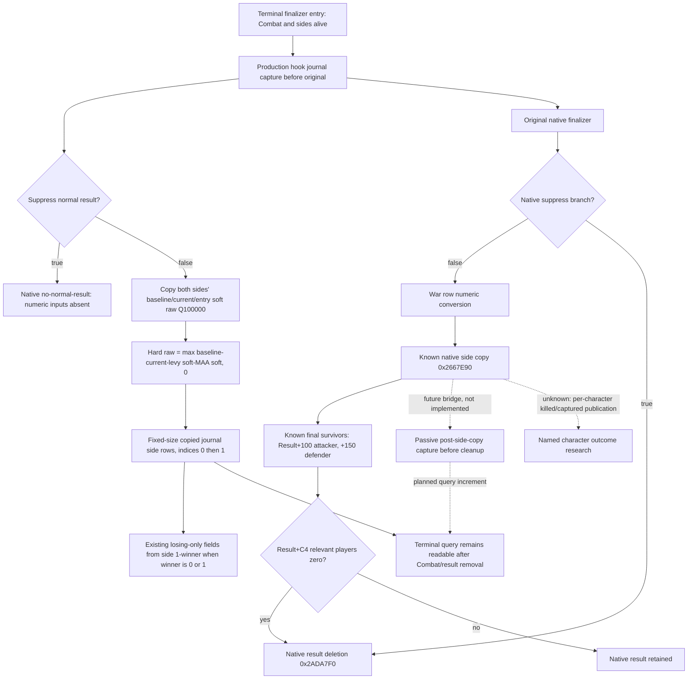

# Battle terminal normal-result numeric inputs — CK3 1.20.0.3

Exact build: CK3 `1.20.0.3`, Steam build `25652598`, EXE SHA-256 `94B55397ABB687A3DCD436805A5D885E6BE90FA6C693FEB44A9E3BBEEADE02A6`. Source freeze for this work package: `Z:/g38`, owner-reported `5cbc`. Native evidence was written before the producer or new fixture: [minimum capture ABI](Z:/ck3_mod_rewrite_process_assets/g2-resume-20261003/battle-casualty-outcomes/normal-result-value-increments/native-research/MINIMUM-CAPTURE-ABI.md), [native lifecycle tree](Z:/ck3_mod_rewrite_process_assets/g2-resume-20261003/battle-casualty-outcomes/normal-result-value-increments/native-research/NATIVE-TREE.md). Those artifacts retain the exact instruction spans and hashes.

This increment preserves both sides' native numerical **inputs at terminal-hook entry** for future normal-result captures. Cached fighting current is not a final survivor count. Aggregate hard loss is not a count of named dead characters. This topic does not claim a player battle loop or reconstruct a vanished historical foreign result.

## Closed native inputs and timepoint

The exact `.3` hard-loss helper `0x2652B50(CCombatSide*, int64_t*)` reads baseline `side+0xA8`, cached current `side+0x98`, levy entries `side+0x28`, and MAA entries `side+0x40`. Both entry arrays use `0x60` stride and soft quantity `entry+0x20`. It computes:

```text
hard_raw = max(baseline_raw - stored_current_raw - levy_soft_sum - maa_soft_sum, 0)
```

Native war-row constructor `0x28681C0` calls that helper for actual attacker side `Combat+0x20` and defender side `Combat+0x368`. It converts raw hard loss and baseline to integer troop equivalents with division by `100000`. The bridge preserves the original raw values, including their fractional part. The two sides are combat sides; they do not by themselves identify war-attacker alignment.

The existing production hook `XarBattleTerminalHook12002V1` invokes `CaptureBattleTerminalJournalEntryV1` before the original `0x258CD50` finalizer. The original later writes war rows and result-side summaries. Entry capture therefore copies the closed baseline/current/soft inputs while the Combat and entry arrays are alive. It does not label the later result projection as already complete. Removing Combat or the result object afterward cannot erase copied journal numbers.



## Query fields and honest null semantics

`prior.side_loss_inputs_in_native_order` is either `null` or two rows in native order: attacker `side_index=0`, defender `side_index=1`.

| Row field | Type | Meaning |
| --- | --- | --- |
| `side_index` | int32 | Actual combat side, 0 or 1 |
| `baseline_raw_q100000` | int64 | Native result initial troop equivalent |
| `stored_current_fighting_raw_q100000` | int64 | Cached fighting current at capture |
| `levy_soft_raw_q100000` | int64 | Sum of native levy soft pools |
| `men_at_arms_soft_raw_q100000` | int64 | Sum of native MAA soft pools |
| `hard_loss_raw_q100000` | int64 | Native nonnegative aggregate formula above |

Existing `prior.hard_loss_inputs` remains the losing-side projection, using index `1-winner` for winner `0` or `1`. Its five quantities use the same Q100000 units despite their older `_raw` names. Native winner `-1` supplies no losing-side index; absence of that projection must not be turned into a zero loss.

Zero is a real copied quantity. `suppress=true` deliberately skips normal-result numerics; active nonterminal observation has no normal terminal capture. Historical captures from before this implementation lack these new observations. These are separate reasons for `null`, and no historical artifact is rewritten or backfilled. Missing numeric capture does not become a completed casualty or survivor capability merely because the terminal query itself is available.

## Closed final survivors and the next bridge entry

The exact `.3` native side projection `0x2667E90` now closes final survivor fields, separately from cached fighting current. The original finalizer passes attacker output `Result+0xE8` and defender output `Result+0x138`. The side projection copies baseline `side+0xA8` to `output+0x10`; it resolves the actual regiment IDs, sums the integer current count at `CRegiment+0x38`, and multiplies that sum by `100000` into `output+0x18`. Final survivors therefore occupy `Result+0x100` for attacker and `Result+0x150` for defender, in Q100000 units. They are native produced result fields, not an inference from the entry-stage fighting cache.

The entry hook runs before these side copies. Reading final survivors there would read a field before its native producer. Reading only after the whole original finalizer returns also misses native deletion: `suppress` or `Result+0xC4` relevant-player count zero reaches `0x258DAFC/0x258DB01→0x2ADA7F0` and removes the result object. This lifetime explains why the old foreign outcome cannot be recovered afterward.

The next concrete bridge entry is a passive wrapper around `0x2667E90`: save the actual Combat/ResultID association, call the original side projection, then copy its completed `output+0x10` and `output+0x18` into the journal before cleanup. The native producer and field semantics are known; this post-side-copy bridge and query increment remain unimplemented. Named killed/captured character publication remains an unknown native branch. Neither readiness is promoted by the current input-only fixture.

## Focused verification and remaining live work

The new test is `ck3_autonomous_player/native_bridge/src/ck3_12002_battle_terminal_normal_result_values_test.cpp`. It reuses existing byte-layout setup, invokes the real production hook callback and checks the real capture/lookup, removes both Combat and result storage, clears the original numerical arrays, advances the query date, and then calls the production terminal reader, native serializer and Python normalizer. The offline callback has no installed game detour and no original finalizer; this is a production-path static fixture, not live execution of a native battle.

Only two new meaningful branches run: normal capture with noninteger Q inputs, a nonzero attacker hard loss and legal zero defender/MAA values; and native `suppress=true` with absent side and losing numerics. The fixture uses active `Require` checks under `/O2 /DNDEBUG /W4 /WX`. It does not rerun the old terminal primitive, binder, SEH matrix or full DLL acceptance.

Verification status: the first focused run is GREEN, with five concurrent translation units and both new native wires accepted by the extended Python normalizer. [Focused receipt](Z:/ck3_mod_rewrite_process_assets/g2-resume-20261003/battle-casualty-outcomes/normal-result-value-increments/fixture-topic/focused-attempt-01/RESULT.json) records source hashes, compiler commands, native logs and consumer results; native wires are [normal values](Z:/ck3_mod_rewrite_process_assets/g2-resume-20261003/battle-casualty-outcomes/normal-result-value-increments/fixture-topic/focused-attempt-01/native-wire/normal-result-values.json) and [native suppress null](Z:/ck3_mod_rewrite_process_assets/g2-resume-20261003/battle-casualty-outcomes/normal-result-value-increments/fixture-topic/focused-attempt-01/native-wire/no-normal-result-null.json).

The normal wire preserves attacker baseline `17000007`, cached current `14000001`, levy soft `1000002`, MAA soft `0`, hard `2000004`; defender baseline `8000003`, cached current `7000001`, levy/MAA soft `500001` each, hard `0`. These are deliberate offline fixture values, not actual Robert or foreign army losses. Native winner `1` selects attacker side `0` for the existing losing-only projection. The reader queried one raw day after capture and after both native objects and the numerical arrays had been cleared; it retained the original numbers and capture date.

Readiness is `static-ready` for the copied numeric inputs. A new exact-build paused artifact from a future normal terminal capture is still needed before claiming production-live numeric observation. Final survivor native fields and lifetime are closed with the post-side-copy entry above, but their bridge is not implemented by this increment. Named character killed/captured publication remains separate native research.
