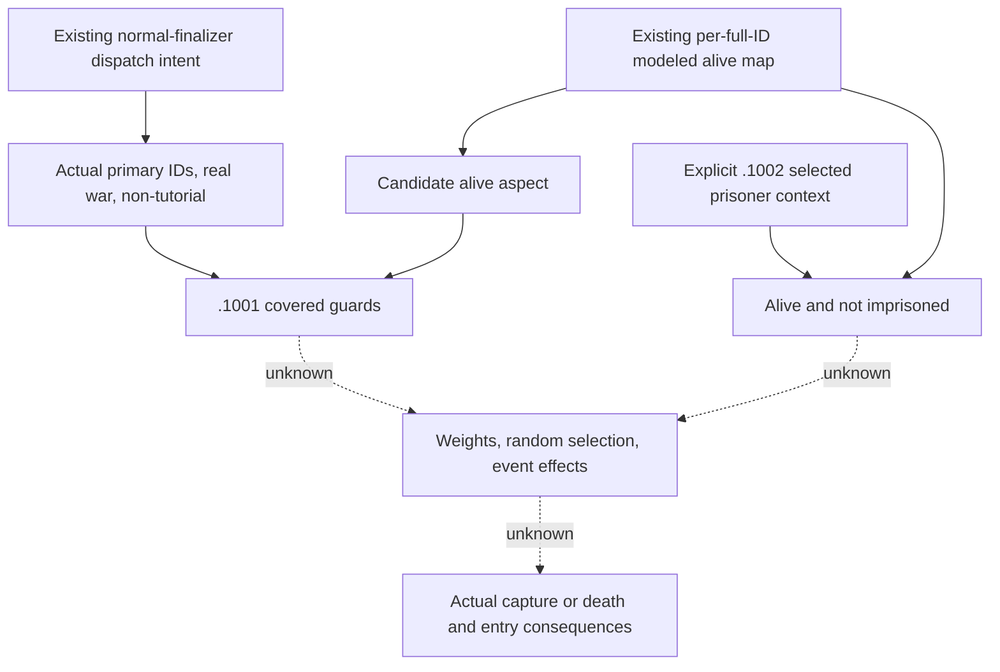

# Conditional named-person terminal eligibility (1.20.0.3, 2026-10-05)

This source-first increment composes the already adopted named-person outcome and numerical normal-finalizer APIs. It evaluates only the covered stock character guards. It does not choose a random outcome, execute an event, change an entry, or upgrade the numerical finalizer's unmodeled `person_and_retreat` branch.

Exact build: CK3 1.20.0.3, Steam 25652598, EXE SHA-256 `94B55397ABB687A3DCD436805A5D885E6BE90FA6C693FEB44A9E3BBEEADE02A6`.

## Source contract and actual dependencies

The frozen g65 and Root-reported g38 HEAD `1774e934` contain the same existing producers:

- `battle_current_named_person_outcomes_12003.py`: 9035 bytes, SHA-256 `c8f1f0d659a25b3b1eacbd86f400546d94af3fe4f996f4557c311511cf5f2d81`.
- `battle_current_normal_finalizer.py`: 12819 bytes, SHA-256 `a27f4f6870a65d05f3e9f1eb6469d3e89fc768b2c68ee2b0b5838aab83ba2134`.

The normal-finalizer API has no person-state argument. This increment keeps its output unchanged and joins its `dispatch.normal_result_intent` with the existing named-person `alive_for_terminal_candidate_by_id` map in a separate pure projection.

The source contract was sealed before implementing this helper:

- [composition contract](Z:/ck3_mod_rewrite_process_assets/g2-resume-20261005/battle-named-person-outcome-seam-v62/composition-contract/COMPOSITION-CONTRACT.json), SHA-256 `fd099ae674157716efa78e1f6afa45ddeaffabe1318486b7305b298427229349`.
- [death-reason/alive source API](Z:/ck3_mod_rewrite_process_assets/g2-resume-20261005/battle-named-person-outcome-seam-v62/source/API.json), SHA-256 `bdc0f27a86913316883b6e8905a9fde5ebaa917fbfb3f0f6bc4d8f582495003b`.

Frozen stock `combat_on_actions.txt` lines 14-17 dispatch winner-side `combat_event.1001`. The cached stock event file has SHA-256 `d6cd87366f14654f860ee6daf70d41094b6bcfd6e32b3358e29f8a74d58842b1`. Its `.1001` trigger (lines 591-596) requires the actual winning/losing primary participants to be at war and the war tutorial variable to be absent. Commander capture and knight capture/death branches require their actual candidate to be alive. This predicate is not the numerical manager's broader `primary_hostile` flag. `.1002` has its own selected prisoner scope and requires that character to be alive and not already imprisoned (lines 1285-1294).

The already closed native alive leaf resolves the strict full Character ID and reads qword `Character+0x1D0`: zero means alive, nonzero means dead, read failure remains null. A pending death record does not itself commit death. The adopted named-person producer applies only explicitly selected modeled primary writebacks; original observed query state remains separate.

## New pure API

`project_named_person_terminal_eligibility_12003(named_person_outcomes, normal_finalizer_projection, *, winner_primary_character_id, loser_primary_character_id, primary_participants_really_at_war, war_tutorial, candidates, source_context=None)` returns the covered normal envelope and ordered candidate guard results. Each explicit `TerminalPersonCandidate12003` supplies its full Character ID, actual losing commander/knight role, capture/death branch, and optional separate prisoner-install context and imprisonment witness.

Known false operands resolve a covered conjunction to false. Missing operands remain null with their concrete names unless a known false already decides that conjunction. Real zero/false values are preserved. Raw winner `-1` does not become a rejection: the native fallback branch needs explicit actual primary participant context. Overall finalizer numeric completeness is not another person eligibility operand. A commander death branch is not invented for the covered stock normal terminal.

An eligible covered guard is not a selected event. Supplied candidates are not a complete roster; custody is not used to infer the separate stock `is_imprisoned` witness. The original producer outputs pass through unchanged, and no fake person parameter is added to the numerical finalizer.

## Additional source progress and next entry

A separate bounded Oct 5 source increment captured 401 bytes: `0x2897FD0` (87 bytes) obtains the actual DeathReason database singleton at `0x5D295F0`; `0x2B854E0` (314 bytes) performs the authored key-hash lookup and returns the actual definition or fallback at `0x5D296D8`. This closes pointer identity, not a stable reason key string.

The current reason-specific key accessor/layout is still unclosed. The concrete next read-only entry is the actual receiver/vbtable/vtable behind the cached queue serializer's virtual call at `0x28F8E77`, now tied to the identified DeathReason database and definition. The old 1.19 `+0x18` lead and a generic bounded key reader cannot establish the current specific offset. No native provider or key observation is claimed. This metadata gap does not block the independent alive-guard composition.

## Focused verification and qualification

[The sole new focused result](Z:/ck3_mod_rewrite_process_assets/g2-resume-20261005/battle-named-person-outcome-seam-v62/parent-focused-run-01/RESULT.json) is FIRST GREEN under `-B -O`: one composed production-path case, 0 failures/errors/skips, 0.145138 seconds; SHA-256 `9ad4e95898e092d82018cca038804c1935644ebd92c06c440435ee083900562f`. It calls the two genuine adopted producer APIs before the new helper, covering pending-versus-committed alive, real-war versus hostility, separate prisoner guards, unresolved candidates, and winner `-1` fallback context. The Oct 4 two-case result remains historical and was not rerun.

Readiness is **static-ready covered terminal-person guard composition**, plus **research** for the stable reason key. This is a constructed pure fixture, with zero new live observations, game days, SDK/pipe/CK3/window operations, native builds, Git operations or shared source writes. Random/event selection, committed game callbacks, custody effects, roster cleanup, whole normal-finalizer person consequences and complete Monte Carlo remain outside this helper. The source sealing harness RED is preserved in the external source receipt; final source sealing succeeded.

Oct 5 / W41 report handoff: [ROOT-DELIVERY.json](Z:/ck3_mod_rewrite_process_assets/g2-resume-20261005/battle-named-person-outcome-seam-v62/ROOT-DELIVERY.json) and [ROOT-DAY-WEEK-FIELDS.json](Z:/ck3_mod_rewrite_process_assets/g2-resume-20261005/battle-named-person-outcome-seam-v62/ROOT-DAY-WEEK-FIELDS.json). Root alone applies, commits and pushes the four new paths.
