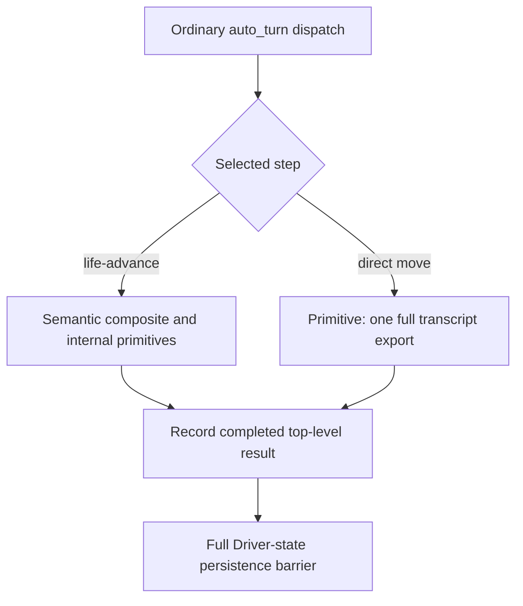

# Person query transcript export on CK3 1.20.0.4

The registered `ck3_query_battle_terminal_transition_v1` uses one existing
Service and NativeDriver. It does not construct or reload a driver per request.
Before this correction, five internal frame snapshots exported the complete
retained command history: the Service precheck, Driver precheck, primitive
submission snapshot, Driver postcheck, and Service postcheck.
`_history_snapshot` deep-copies every retained result. These frame checks consume
semantic identity, pause, revision,
date and connection fields; they do not consume the exported transcript.

The correction selects `include_native_command_history=False` only at these
five sites. Public snapshot defaults, explicit full-history export, native
packet validation, pre/post frame checks, command-result recording, and
persistence barriers retain their existing behavior.

The registered `ck3_take_snapshot` already defaults to omitting command history.
It therefore follows a different export path from the former Person query.

## Disk I/O and startup boundary

`NativeHeadlessGameplayDriver.__init__` starts its endpoint. The first received
hello invokes `_adopt_bridge_session`; only its first-connection branch calls
`_read_driver_state`. The loader reads and parses the entire Driver JSON, then
detaches its history. Same-PID adoption copies that restored history and requests
a complete state rewrite. This work belongs to hello/adoption, which may overlap
an initial snapshot request, rather than to every stable readonly query.

Successful `query-*` commands append a detached result to in-memory history and
mark it dirty while deferring the full state write. Failed commands retain the
existing immediate persistence barrier. `_persist_driver_state` serializes the
entire history and atomically replaces the Driver state file; `close` flushes
dirty history. Episode binding, identity changes and newly observed marriage
outcomes also have conditional persistence paths. They do not prove a write on
every snapshot. The `native_campaign` episode projection bypasses one-life
episode binding.

Root observed the SDK085 initial snapshot take 51.36 seconds and Person002 take
87.66 seconds on 2026-10-10. Source inspection establishes the repeated export
cost, not its measured share of either duration. A separate cached native-reader
47 ms value is uncorrelated and cannot be subtracted from these timings.
The source-flow receipt is retained in
`Z:/ck3_mod_rewrite_process_assets/g2-background-20261010/r85-snapshot-performance-metadata/SOURCE-FLOW.json`.

## One new connected regression

`test_registered_terminal_query_omits_history_and_preserves_command_evidence`
uses the unchanged qualified Native60 `matching-final-tail-ordered-i64.json`
through real registered MCP, Service, NativeDriver primitive transport and
normalizers. A retained-payload copy detector checks that the query exports no
full transcript while preserving prepared PC order, full signed64 values and
command evidence. The same compound checks explicit detached history export,
stale submission rejection and changed post-query frame rejection. Root alone
runs this new test; the native producer and earlier compounds are not replayed.

This source correction assigns no new live, FullPerson, Entry or whole-helper
readiness credit. Runtime latency improvement remains unmeasured at author time.

## Root FIRST qualification

Author source `e997280d50560fcccd1a1c22234467f8d56e06b8` was initially
AUTHORED_NOTRUN. Root materialized the complete Git SDK at
`D:/codex-ck3-background-spill/r0084-person-readonly-history-sdk-full-source`
and qualified that exact same source head with the sole registered compound.
The correction is now **static-ready**.

The FIRST receipt at
`D:/codex-ck3-background-spill/r0084-person-readonly-history-first01/RESULT.json`
records GREEN, exit code 0, start `2026-10-09T19:07:20.368512+00:00` and end
`2026-10-09T19:07:26.808721+00:00` (6.440209 seconds elapsed). Root reported
`1 passed in 5.66s`. The invocation used the complete corrected SDK's import
package and exactly
`test_battle_terminal_transition_readonly_history.py::test_registered_terminal_query_omits_history_and_preserves_command_evidence`.

The real registered MCP -> Service -> NativeDriver compound consumed only the
unchanged retained Native60 packet
`Z:/g2-native60-build01/attempt01/first/native-wires/matching-final-tail-ordered-i64.json`.
The native producer and earlier compounds were not replayed. The qualification
covers omission of full transcript copies, normalized Person/captured PC output,
retained command evidence, explicit detached history export, and preserved frame
rejection checks. It does not measure live query speedup; the owned Game162360
hot query remains a separate execution. Live, FullPerson, Entry and whole-helper
readiness credit remain unchanged.

## Ordinary advance source conclusion

The finite e997 source trace is `Service.auto_turn` (`service.py:2993`) ->
`_execute_planned_turn` (`3039`, ordinary dispatch `3408`) ->
`Service.execute_step` (`3942`) -> `NativeDriver.execute_step` (`native_driver.py:8416`).
Service planning already uses an internal semantic snapshot (`service.py:1150`);
there is no additional Service advance loop exporting history around each day.

For `life-advance`, NativeDriver binds a semantic entry snapshot (`8478–8480`),
passes it into the composite (`9798–9800`), and uses semantic starting/polling
frames (`22465–22470`, `23163–23191`). Speed/event primitives (`23146`, `23157`),
resume (`22962`, `22999`), pause (`23061`, `23102`) and exact-day sentinel
commands (`22868`, `22894`, `22925`) select `internal_semantic_snapshot=True`.
That selector precedes the history-export selector in `_execute_primitive_step`
(`11001–11008`). Its default history flag therefore causes no full transcript
export in these ordinary advance primitives.

Generic direct move is a separate route: the fallback (`9807–9811`) retains the
primitive's default `include_native_command_history=True` (`10948`), causing one
full transcript export. Its revision/submission consumers use semantic fields.
Successful top-level move and life-advance calls both record their new result
(`8435`, `9960`) and invoke full Driver-state persistence (`9966`); neither is a
deferred `query-*`/preview command (`23407–23416`). This serializes and atomically
writes the retained state once per completed top-level command. Composite-owned
speed/resume/pause primitives do not independently pass through `execute_step`
and its action-recording barrier.

At investigation time, pending request #8 was a `ck3_auto_turn({})` wrapper;
its selected step was **not held**. The preceding actual request #7 submitted
move target 8756. Source inspection cannot attribute the pending delay of more
than five minutes to advance, transcript export or persistence. The advance
conclusion is **NO_NEW_SOURCE**: no production change, new FIRST or replay of
earlier GREEN compounds is required by this finding. Timeout/budget evidence
remains a separate investigation.
