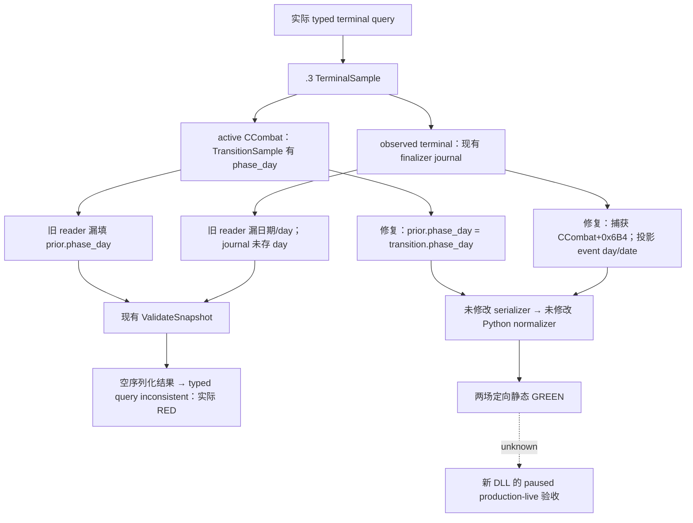

# .3 battle terminal：v35 实际序列化故障与定向修复

## 2026-10-03T19:50 外国正常终结实际资格

随后 **一次实际terminal查询 GREEN**、正常SDK关闭：journal **event18/latest20** 捕获外国Combat1577058305 **normal_result / terminal_date53238096 / phase3 / winner0**，attacker70766、defender30097、Result1493172226、wipe=false，ordered sides真实保持。当前query日期是raw53238336，终结事件日期另为53238096；prior与result对象已absent、province不含该combat，subject@2640 noactive/backlink，coordinator50331823的successor assignment_reopened，已观察真实正常终结分支，晋级有限 **production-live primitive**。journal内finalized_before=false是当时捕获的旧字段，不据此把当前写成仍active。battle_warscore为not_recorded_by_native/allnull、hard_loss_inputs=null，Robert不在双方，不授伤亡、玩家战分/胜利或完整战斗loop。一次dispatch后mailbox failure0/readytrue、exception0，无save/retry/rearm，增加0日；旧v37真实AV和v38 active/member实际资格保留。[独立真正terminal实际](Z:/ck3_mod_rewrite_process_assets/g2-resume-20261003/runtime-preparation/v39/actual-terminal-after-pursuit-v39-01/result.json)；[单次健康mailbox消费](Z:/ck3_mod_rewrite_process_assets/g2-resume-20261003/v39-terminal-after-pursuit/faultstate/ROOT-DELIVERY.json)

以下旧故障、static fixture、active/member证据保持原阶段事实。

## 2026-10-03T18:02 当前实际资格：v38 active lifecycle 与 foreign AI membership

有限 `production-live primitive` 已在v38/PID107772/source `0ad923525ef899b836a823dfe983db49030789f2` 实机验收：一次terminal查询返回ready/available，Combat1577058305@2640为main/day4、`active_not_terminal`、winner−1/finalizedfalse、journal0/not_observed；subject251658381的真实CArmy167772260 及coordinator50331823、stack/subunit0/0、blockedbyactivecombattrue均实读。相邻快照date53236800保持，query后mailbox failure0/readytrue、exceptioncode0/image none/RVA null，SDK正常关闭，无save/retry/rearm。当前active phase_day与真实foreign helper路径已通过，正常/no-normal终结journal的date/day、winner、人物结果及完整终战loop仍未实测。[完整语义与pins](Z:/ck3_mod_rewrite_process_assets/g2-resume-20261003/v38-terminal-fixed/semantics/ROOT-DELIVERY.json)；[post-query执行器状态](Z:/ck3_mod_rewrite_process_assets/g2-resume-20261003/v38-terminal-fixed/faultstate/ROOT-DELIVERY.json)

### 先前投影、fixture与失败记录（保留当时资格）

状态：`static-ready`；2026-10-03 实际 RED 已保留，修复尚无新 DLL 的 paused live 成功。
此前将缺失 phase/day/date 当作“不阻断”的结论错误；生产 serializer 会拒绝，不能声称该 terminal
观测已完成。独立 transition/horizon 仍可用于尚在进行中的有界战争 OODA。

## 冻结输入与实际故障

- CK3 `1.20.0.3` / Steam `25652598` / EXE SHA
  `94B55397ABB687A3DCD436805A5D885E6BE90FA6C693FEB44A9E3BBEEADE02A6`。
- .3 binder 沿已证明的 .2 unchanged ABI；本修复不新增 RVA、公开 schema 或 MCP 口。
- 生产代码前像 `Z:/g36`，Root `608bc12` 与 `19b` code-identical；具体字节 SHA 在
  `battle-casualty-outcomes/v35-terminal-red/SOURCE-PINS.json`。
- 实际失败：`runtime-preparation/v35/actual-new-leaves-v35-01/024-ck3_query_battle_terminal_transition_v1.json`，
  `prior_combat_id=1577058305`，subject `251658381`，fresh public revision `2`，cursor `null`。
  错误为 `native gameplay step failed: typed query result is inconsistent`，未进入 Python normalizer。
- 前后 023/025 snapshot 均 paused/date `53236608`，Robert `29829` alive，episode
  `native-29829-2bc2d599f7f9`。该实际调用没有日期推进；Root 其余 11 个查询成功，Sway 4 已重挂。

subject `251658381` 在同一实际帧仍为 owner `70766` 的 in-combat CUnit@2640。terminal 的 native
reader、driver、service 和 normalizer 均没有 foreign-owner / player-controllable 门槛；这不是因
敌军 subject 被拒绝。实际 snapshot 不发布 CombatID，冷启动 PID `13408` 后不能仅用 v34 ID
断言当前 CombatID 不变；下一次真实 query 必须复用当前 discovery/transition 的完整 generation ID。

## 已证实生产调用链

`ck3_12002_battle.cpp::TerminalSample` 原 active 分支只填 `phase_raw` 等字段；
`battle_terminal_transition_v1_mailbox.cpp::ValidateSnapshot` active 分支要求 `phase_day >= 0`。
observed 分支还要求 `terminal_date_raw` 与 phase day；journal 已捕获 `observed_date_raw`，但旧 reader
未投影，journal 自身未存 phase day。serializer 返回空字符串，bridge typed executor 才产生实际错误。
既有 reader-only fixture 只能证明 reader 返回 available，不能证明这条生产序列化链可用。

最小补丁仅改三个生产文件及一个新 focused test：active 投影真实 transition day；journal 增存
`phase_day` 并沿已有 reviewed `kBattlePhaseDayOffset`（CCombat `+0x6B4`）读取；observed 投影
真实 `observed_date_raw` 与 captured day。日期 raw 延续原版日期计数，day 是阶段内整数日数；
它们不从查询时刻推断、不填固定零。hard-loss optional producer 保持既有边界。

## 一次定向验证与可复现入口

`focused-attempt-01/RESULT.json` 为唯一运行回执。MSVC 19.51 `/O2 /DNDEBUG /W4 /WX`，8 个独立
translation units 并发编译，复用 unchanged serializer/routing；没有构建整 DLL、重跑旧矩阵或 SDK。
检查使用抛异常的 `Require`，Release 不会移除断言。

1. active foreign-subject：复用 fixture byte layout，清空 player_armies，maneuver/day0；真实生产
   reader→serializer，保留 subject/backlink，terminal date absent、journal sequence0。
2. observed journal terminal：真正调用 `CaptureBattleTerminalJournalEntryV1`，phase3/day7，随后移除
   CombatID/省份列表/backlink，并仅在 fixture 中把 query date 加24。真实 reader→serializer 必须返回
   captured date53236608（query date53236632）、day7、原 event sequence、removed/no_successor。

相同两场在原 reader/journal 的外部 baseline 都复现 reader available / empty serializer RED；修复投影
两场 GREEN，输出 native wire 进入原 Python normalizer 2/2 GREEN。phase/date 路径被直接覆盖，
没有把 fixture 或此验证称作 live、实际战斗终结、人物结果、战分成功或完整战争 OODA。

Root 应使用统一 v36 DLL 在当前 paused 实际帧做一次 terminal 查询，fresh revision、当前完整
CombatID、真实 subject，与 snapshot/transition 同步保存。战斗未结束时只验收 active baseline；
真正结束后再用当前 journal cursor 验收 observed result。不要重试旧 v35，也不要因旧 terminal RED
重新收紧战争授权。完整战斗伤亡、人物死亡/捕获仍需各自真实 ledger/人物/羁押结果。

## Artifact 与报告字段

外部根目录 `Z:/ck3_mod_rewrite_process_assets/g2-resume-20261003/`：

- `battle-casualty-outcomes/v35-terminal-red/REAL-FAULT-EXTRACT.json`：实际 023/024/025 SHA 与前后状态。
- `foreign-subject-source-review.md`：subject 查询的真实控制范围与当前身份边界。
- `ROOT-ONLY-TERMINAL-PHASE-DATE-FIX.patch`：3 生产路径 + focused test，Root 独占整合。
- `SOURCE-PINS.json`、`focused-attempt-01/RESULT.json`：字节前像、8 TU 命令、原始 RED、修后 GREEN。
- `ROOT-ONLY-TERMINAL-PHASE-DATE-DOC-CORRECTION.patch`：本 topic 与原 outcome topic 更正。
- `ROOT-DAY-WEEK-FIELDS.md`：Root 合并当天/当周记录；worker 无共享 source/Git/window 操作。

## 2026-10-03T16:22 v36实际executor SEH

028在serializer之前触发真实executor_exception512；后续mailbox不ready且计数停13。原phase/date补丁字节已经加载，但没有新的terminal body，故该修复仍static-ready；实际故障不能标为已关闭。随后private reader与统帅提交前拒绝共享这一前置故障。诊断：[DIAG-SUMMARY.json](Z:/ck3_mod_rewrite_process_assets/g2-resume-20261003/runtime-preparation/v36-retry-02/diag-summary/DIAG-SUMMARY.json)。Root已正常保存/stop/reap并从save4714恢复同v36新PID；先继续游戏价值，下一候选只补针对本SEH的异常code/RVA定位，不自动rearm、不新建安全门禁。

## 2026-10-03T16:29 接续源码采用

真实v36 query028触发executor_exception512并使后续private reader和统帅提交前被拒绝，现有记录没有具体exceptioncode/RVA。候选仅在现有SEH filter记录真实Win32 exceptioncode、所属image和相对RVA，沿已有typed_query_failure_v1/heartbeat/snapshot诊断块发布；不自动rearm、不改门槛或协议版本。实际AV production-handler fixture首次GREEN，0xC0000005/failure512/callback1，Reclaim前后提交仍拒绝且metadata保留；2TU并行，变更bridge TU使用v36完整feature defines严格Release GREEN。fixture的RVA23941为测试样本，不能写成真实CK3 terminal故障RVA。实际外国战斗没有Robert参与，terminal仍RED；新定位尚需新DLL及保存后最后一次实际请求。Root已用同v36最新save正常冷恢复R15，观察→选择→一次任命→独立读回GREEN，正在继续军事日；本源码包本身不增加日数/动作/胜利信用。

实际记录：`2026-10-03T16:29:33+08:00`。源码已采用；严格组合DLL和Robert暂停实读仍待完成，不能记为live或增加日数/动作/收益/G2信用。ROOT负责正常commit/push。

交付回执：[v37-seh-location](Z:/ck3_mod_rewrite_process_assets/g2-resume-20261003/battle-casualty-outcomes/v36-terminal-live/ROOT-DELIVERY.json)。

## 2026-10-03T19:43 v39：真实正常终结 journal 与战后状态

本场外国战斗的正常终结查询已达 `production-live primitive`：Root唯一一次terminal请求返回
ready/available，真实journal event18/normal_result、captured date/day、旧Combat删除及战后foreign AI
membership均可读。相较v38 active baseline，这是自然终结后的真实增量；未验收no_normal_result分支，
没有Robert参战、玩家胜利、数值伤亡或完整玩家战斗OODA信用。v35/v36/v37失败记录继续保留。

实际目录：`Z:/ck3_mod_rewrite_process_assets/g2-resume-20261003/runtime-preparation/v39/actual-terminal-after-pursuit-v39-01/`。
result于2026-10-03T11:42:49.343645–11:43:04.603146 UTC完成GREEN，terminal_query_count1，
无save/retry/rearm，normal_sdk_close=true。001/003相邻snapshot均native166/public2、date53238336 paused、
Robert29829 alive/same episode；002绑定fresh revision2。diagnostics PID112516、exact .3/build-match/SHA匹配，
after mailbox ready=true/failure0/exception none、published/completed126。读查询让history total5021→5022，
日期与军事状态不变；这不是新玩家军事动作。

完整逐字段值、ordered sides、subject身份和原始pins保留在本包 [ACTUAL-TERMINAL-SEMANTICS.json](Z:/ck3_mod_rewrite_process_assets/g2-resume-20261003/v39-terminal-after-pursuit/semantics/ACTUAL-TERMINAL-SEMANTICS.json)。subject251658381@2640/CArmy167772260无active/backlink、blocked=false；native AI membership仍observed、coordinator50331823、stack0/subunit0，successor=subject_assignment_reopened、matching[]/selected null，没有继承战斗提交动作。

phase3或敌军撤退本身不能证明正常终结；本次有observed journal与normal_result、captured winner/date，
同时独立读取旧Combat移除、subject backlink清空，因而可确认已经结束。journal的finalized_before=false
是捕获时的字段，不能反向覆盖这个真实终结证据。prior.result对象当前已经删除，也不妨碍被动journal
保留当时ResultID1493172226及双方成员；不能把非空ResultID本身当胜利证据。

攻击方70766的CUnits获本场外国战斗胜利。双方在Robert快照中都属于enemy：owner70766为war50331736
enemy，owner30097/35357为war16777231 enemy；Robert军83886367不在捕获的两侧成员中，仍在2604
sieging、in_combat=false。当前defender军50331920/83886484在2634退向2631/8754；这些是相邻快照的
真实战后状态，不是本consumer执行的动作。subject251658381与473在2640 sieging；474在当前快照未列出，
仅凭遗漏不能认定删除、伤亡或人物死亡。

hard_loss_inputs与snapshot soldiers均null；wipe=false只记录非wipe，不能写零损失。
battle_warscore状态not_recorded_by_native且WarID、row、delta及所有原生值均null；Robert独立战争总分
（-35/0/0）不能冒充此战的战分变化。没有死亡、被俘、骑士或指挥官结果证据。本次真实闭合的是
正常终结date/day投影、历史身份与removal、战后subject/foreign membership查询；其余能力保持既有边界。

consumer交付：`Z:/ck3_mod_rewrite_process_assets/g2-resume-20261003/v39-terminal-after-pursuit/semantics/ROOT-DELIVERY.json`，
附ACTUAL-INPUT-PINS、完整语义及日/周字段。仅消费Root已经完成的五份actual文件，没有SDK、重复测试、
共享source/state/Git或窗口操作。Root继续既定军事主线，中央文档负责人统一topic与报告并记录commit/push。
