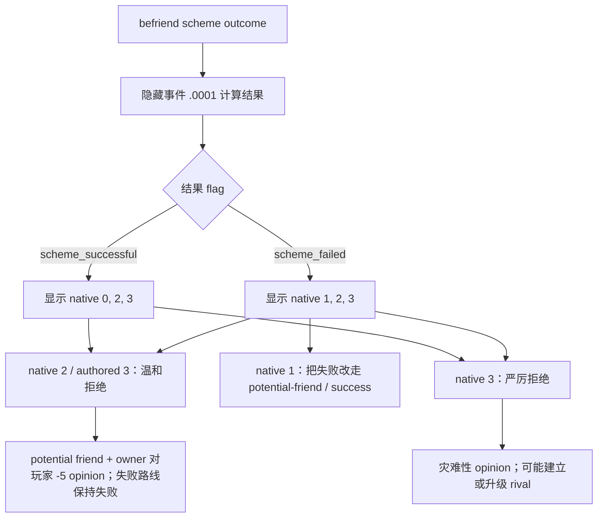

# CK3 1.19.0.6 `befriend_outcome.0002` 目标侧决策树

## 状态与实机边界

- [static-confirmed] 本专题绑定 CK3 `1.19.0.6` 与 `ck3.exe` SHA-256
  `2D00FF3101EF70B566F2FCBAE292F09263199C80E9DC8F139B82D7D96F83DB86`。
- [production-live RED retained] R860 在普通封建连续运行中自然触发 instance `5`：玩家/target 为
  `31853`，scheme owner 为非玩家 `31506`，保存 scopes 为
  `scheme, owner, artifact, target, scheme_failed`，snapshot authored option count 为 `4`，实际显示并可用的
  native rows 为 `(1, 2, 3)`。正式策略在动作前因 direct consumer 尚未支持该已登记 variant 而停止；没有提交动作。
- [production-live loop for success projection; failure projection live-open] R861 从 R860 的 h961 安全 checkpoint
  启动新 CK3 进程，丢弃未 checkpoint 的失败尾部后自然触发 success variant。正式 registry 选择 authored option `3` /
  native `2` / rendered `1`，instance `5 -> null`，压力 `20 -> 60`、gold raw 保持 `49949715`，下一 formal query
  和后续日期推进消费了 event absence；最终保存 h981 checkpoint。R860 的 failure variant 仍只有自然选择前 RED 与静态精确覆盖，
  不冒充 post-fix live action。

## 原版入口与决策树

`befriend_scheme` 的 outcome/旧 critical-moment 链先进入隐藏事件 `.0001`；它计算结果并保存互斥的
`scheme_successful` 或 `scheme_failed` flag。若目标是玩家，`.0001` 随后触发 `.0002`。

native `2` 在成功与失败投影中都是已审阅的保守路线：它不接受友谊，也不采用 native `3` 的潜在宿敌/宿敌副作用。
失败帧中，native `1` 会把原本失败的计划改走潜在友谊/成功路线，因此不选。部分 trait 会使温和拒绝增加少量压力，
这是该 source-reviewed 路线的已知代价，不改变当前选择。

## 合同与重复语义

直接消费者必须同时核验：root/target 是当前玩家、owner 不是玩家、五个 saved scopes 的名称和类型、互斥 outcome flag，
以及与 flag 配对的完整 native option 投影。任一关系或投影漂移都保持 fail-closed。

原版每个以玩家为目标的独立 befriend scheme 都可能触发 `.0002`，源码没有全局 one-shot、cooldown 或总次数上限。
R339 在一个旧恢复窗口看到 success 与 failure 各一次只是一组 observation，不是 `max_occurrences=2` 的产品门；合同因此使用
`repeatable-within-product-observation-window`。同一 instance 的重复副作用仍由 action receipt、独立后帧和恢复语义防止。

## 证据

- 原版事件：`Crusader Kings III/game/events/scheme_events/befriend_scheme/befriend_scheme_outcome_events.txt:214-422`，
  SHA-256 `2E8D69158A9A10C901084628074EBA33A0655048A982825F006FA439548234C8`。
- 原版 scheme caller：`Crusader Kings III/game/common/schemes/scheme_types/befriend_scheme.txt:642-650`，
  SHA-256 `8E8BF937C7F4BC2C573AD7FD089DB932D80E5F1D2DAF8ACB56E2B6A32DED4258`；旧 critical-moment caller：
  `Crusader Kings III/game/events/scheme_events/scheme_critical_moments_events.txt:1231-1238`，SHA-256
  `A51C5D0ED3CE9B475A25B7857829B098A4D5A38B4D89044C68C4813CC32EEA26`。
- 结果 effects：`Crusader Kings III/game/common/scripted_effects/00_scheme_scripted_effects.txt:14278-14409`，
  SHA-256 `478F4B1B9D94F28E33B83B8453F6BBCFD239830D821196D68120D5727723F6DF`；outcome pools：
  `Crusader Kings III/game/common/on_action/schemes/befriend_on_actions.txt:159-223`，SHA-256
  `58CE2CC8C86C5370DA15C9F5FBB8EBF9DAC89201FD4758F17254162040136B6D`。
- R860 formal report SHA-256：`4BA536C7AF000F3BDA030025A8C3BB2E1B1898C11CA9A87310012191F4CE38F2`。
- R861 formal report / final checkpoint / driver SHA-256：
  `623BAB4FFE04BF125D039259E1CEEE8A8E1AD61B4336D40266FF6F95D31447A7` /
  `6A8720C69D84593EA6026990CDF1A8423554AC3601AB50238BF455760ADC2D20` /
  `488A52B44A9C6EBE3B4F3A47ECFC80FB62C8A93EBBB868433BCFD00E9243A5FC`；close ledger
  `890EA1CC8CF8EBDF5B3939FFA666CF125C954F3FDB2BC505F366BA5D8DE7D7F4`。
