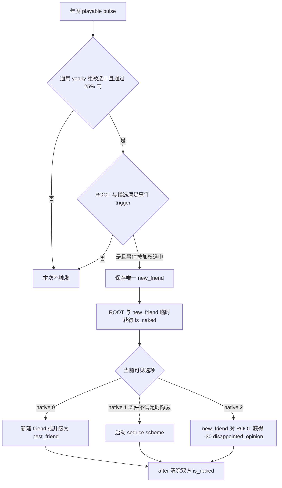

# CK3 1.19.0.6 `bp1_yearly.1040` 浴场友谊事件决策树

## 状态与证据边界

- [static-confirmed] 本专题绑定 CK3 `1.19.0.6` 与 `ck3.exe` SHA-256
  `2D00FF3101EF70B566F2FCBAE292F09263199C80E9DC8F139B82D7D96F83DB86`。
- [paused live RED] R416 attempt 2 在 PID `174656` / connection generation `1` 的真实暂停帧命中 instance
  `1078`。ROOT 是玩家；唯一 saved scope 是非玩家 `new_friend:character`；原生定义有三个选项，当前窗口只投影
  shown/enabled 的 native `0` 与 `2`。没有提交选择。
- [counter-policy static-ready, live action pending] 可移植合同严格绑定当前稀疏投影并选择 authored `3` / native `2`。
  RED 的直接原因是恢复 harness 尚未登记这个原版事件，不证明天朝二期产品失败。必须在旧 instance 消失或前进后，
  才能升级为 production-live primitive。

## 原版入口与决策树

`random_yearly_playable_pulse` 在每个可玩角色各自随机的年度时点运行。它以权重 `6` 选择通用
`on_yearly_events` 组；该组先过 `25%` 的 `chance_to_happen`，再从当时有效的候选中按权重选取，
本事件权重为 `100`。因此不能把 `6`、`25%` 或 `100` 单独解释成固定年概率。事件自己有二十年 cooldown。

ROOT 必须启用 Friends & Foes、不是部落或游牧政府、没有处于战争、是可用健康成年人、拥有首都，且存在一个合格的
潜在朋友、现有朋友或好感高于 `70` 的廷臣。男性专属或女性专属继承法还会要求候选与 ROOT 同性。

`immediate` 按优先级从潜在朋友、没有挚友时的现有朋友、或合格廷臣中保存一个 `new_friend`，然后只为场景显示临时
添加双方的 `is_naked` flag。三个选项完成后统一由 `after` 清除这两个 flag。

## 选项语义与恢复策略

- native `0`：没有 friend 关系时建立 friend；已有 friend 时升级为 best_friend。shy、disloyal、paranoid 可增加压力。
- native `1`：只有性取向、近亲边界和 `can_start_scheme` 都通过时才显示；会对 `new_friend` 启动 seduce scheme，
  并添加原版成功率 modifier。R416 当前投影未显示该行。
- native `2`：不创建关系或计谋；`new_friend` 对 ROOT 获得 `-30 disappointed_opinion`。该 modifier 在 exact source 中为
  `monthly_change = 0.1`、`decaying = yes`、`stacking = yes`。gregarious、trusting、compassionate、loyal 可使 ROOT
  获得 major stress。

产品恢复选择 native `2`。在当前两个可见按钮里，它是唯一不建立持久朋友/挚友关系的路线，也不会启动计谋。这里保留
`-30` 与 `monthly_change = 0.1` 的原版事实；不在缺少引擎单位实证时把它换算成精确月数。

提交前必须重新绑定同一 event key、instance、日期窗口、玩家 ROOT、唯一 `new_friend:character`、shown/enabled 的
native `(0, 2)` 以及最新 revision。ACK 不算完成；必须观察旧 instance 消失或前进。

## 证据

- 原版事件：`Crusader Kings III/game/events/dlc/bp1/bp1_yearly_events_claudia.txt:2467-2845`，SHA-256
  `F79A3224CFB74804BD489D626E121A883CB0217895D136BB61B9A96880EA3EE4`。
- 年度入口：`Crusader Kings III/game/common/on_action/yearly_on_actions.txt:2522-2563,2933-3842`，SHA-256
  `0FC85A284224A68D1CA0A4EF071D4F4A4F49896753AEC463975A12EE4E1116FA`。
- 好感 modifier：`Crusader Kings III/game/common/opinion_modifiers/00_opinion_modifiers.txt:135-139`，SHA-256
  `9784F704B8DE847294451BEC6E6D1345B5CA4109219A9B4264E4AE8FDB1AE555`。
- R416 选择前 RED：
  `_runtime/p1-terminal-resume-r416-20260911/live-artifacts/terminal-stages-red-attempt-02.json`，SHA-256
  `1D965717FBA5B1FEA8654060091431BA23086BEF22375B1A44AEC67DDBE1F22C`。
- 可移植合同、analysis 与 observation：
  `ck3_autonomous_player/src/xar_autoplayer/vanilla_events/records_bp1_yearly.py`。
