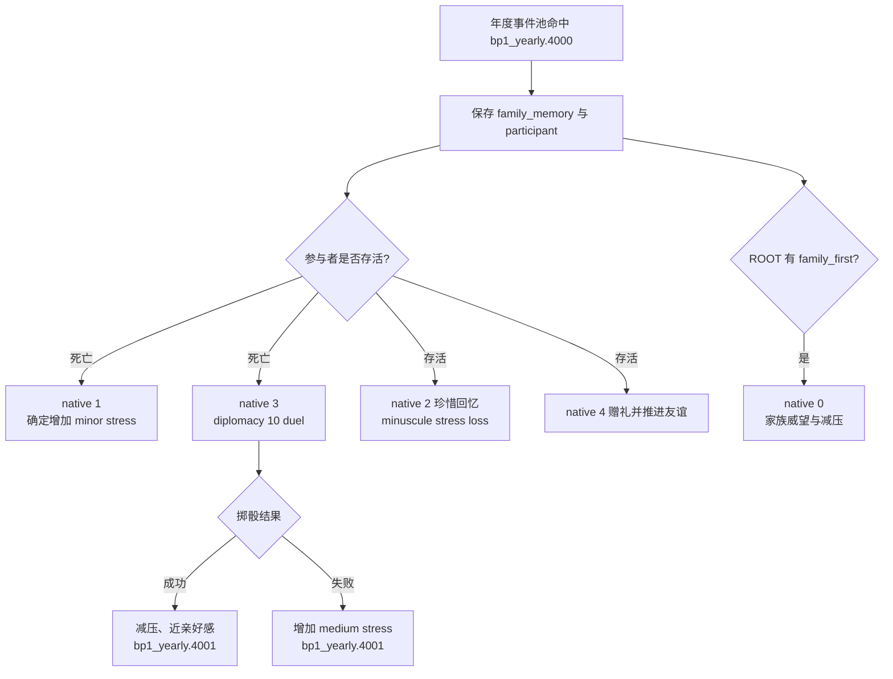

# CK3 1.19.0.6 `bp1_yearly.4000` 家族回忆事件决策树

## 状态与证据边界

- [static-confirmed] 本专题绑定 CK3 `1.19.0.6`、Steam build `23530548` 与 `ck3.exe` SHA-256
  `2D00FF3101EF70B566F2FCBAE292F09263199C80E9DC8F139B82D7D96F83DB86`。
- [paused live RED → production-live primitive] R416 retry 10 在 PID `174656` / connection generation `1`、`date_raw=53902032`
  暂停于 instance `1090`。root 是玩家 `32904`；saved scopes 严格为
  `family_memory:character_memory` raw `34` 与非玩家 `family_memory_participant:character` raw `4` / ID
  `67046`；snapshot 含五个 authored option，当前只渲染 native `1/3`，两者均 shown/enabled。retry 10 保留选择前
  RED；retry 11 随后在同一 PID / generation 选择 authored `2` / native `1`，instance `1090 -> null`、snapshot
  `native:1499 -> native:1500`、revision `1500 -> 1501`，且 `postcondition_verified=true`。该分支只承受
  确定性的 minor stress gain，没有进入 native `3` 的外交掷骰与后续事件。

## 原版入口与取样

事件是两个年度事件池中的 weight `100` 候选：`yearly_on_actions.txt:3377` 与
`yearly_groups_on_actions.txt:227`。具体年概率取决于当时有效的事件组和候选总权重，不能把单次实机间隔写成固定频率；
事件自身有五年 cooldown。

触发要求 Friends and Foes 可用、ROOT 有家族且压力大于零、不是冷酷或虐待狂，并至少有一条
`appropriate_family_memory`。`immediate` 随机保存一条合格记忆，再从其中选取同家族、不是 ROOT 仇敌的参与者。
这次实机参与者已死亡，因此存活分支与 `family_first` 特质专属分支都没有渲染。

## 选择语义

| native | 显示条件 | 原版效果 | R416 当前投影 |
|---:|---|---|---|
| `0` | ROOT 有 `family_first` | minor dynasty prestige、minor stress loss | 未显示 |
| `1` | 参与者死亡 | 确定的 minor stress gain | 显示，选取 |
| `2` | 参与者存活 | minuscule stress loss | 未显示 |
| `3` | 参与者死亡 | 外交 10 掷骰；成功减压并加近亲好感，失败增加 medium stress；两者都触发 `.4001` | 显示 |
| `4` | 参与者存活 | 支付 minor gold、推进友谊、增加感激好感，通常减压 | 未显示 |

native `1` 的收益并不高；选择它的原因是当前目标需要确定地排空终局中断。native `3` 的成功分支更有收益，
但失败压力更高，且当前界面也显示增压 indicator。合同只准入这次实见的死亡参与者两行投影，不把源代码中已知的
存活参与者或 `family_first` 形状推定为已验证投影。

## Exact-build 来源

- `events/dlc/bp1/bp1_yearly_oltner.txt:22-292`，SHA-256
  `2D8DAB35EF9630F3A0206CE8F3DEC91AAE0442D80434A66955D7B3B7134A1CC6`；trigger `95-107`，
  immediate `109-132`，options `134-291`。
- `common/on_action/yearly_on_actions.txt:3377`，SHA-256
  `0FC85A284224A68D1CA0A4EF071D4F4A4F49896753AEC463975A12EE4E1116FA`。
- `common/on_action/yearly_groups_on_actions.txt:227`，SHA-256
  `D916E482A780F26CC1B1B27B582B675F90945AB808EB461A54A906EAAD0147C5`。
- 英文与简中本地化 SHA-256 分别为
  `14718DDCABE8FE5AA53BE00C1FEEA6788842E21E0D417764A3B04EA08CE9F4D2`、
  `A922EB18E96A803CF7F216CB9D974F5B9160D1E9D8CABBF0D398C6D70F122CB9`。
- 选择前 RED：
  `_runtime/p1-terminal-resume-r416-20260911/live-artifacts/terminal-stages-red-attempt-10.json`，SHA-256
  `F05201BCDD0D441F199C56D65D8BF8CF59E1B1F7570226101985BA4E2A29D62F`。
- 同 PID 热恢复 GREEN 与下一项 `health.2202` 选择前 RED：
  `_runtime/p1-terminal-resume-r416-20260911/live-artifacts/terminal-stages-red-attempt-11.json`，SHA-256
  `E4DC093D890449A3F9FAE85FD40BE733FBDDBB7322CF31EBBA314E2F0E57D51F`。
