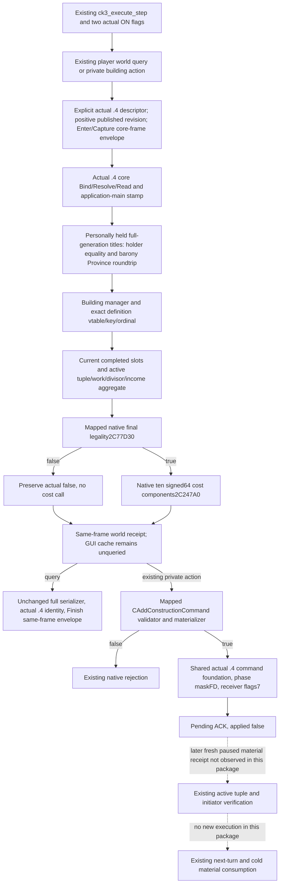

# Existing player building routes on CK3 1.20.0.4

This source package migrates the two actually enabled building options at Root
base `caa4adc3d1278e324cf4ec19774028e9b9138e28`:
`XAR_CK3_ENABLE_G2_PLAYER_CONSTRUCTION_VIEW_PROBE_PRIVATE_V1` and
`XAR_CK3_ENABLE_G2_PLAYER_WORLD_BUILDING_ACTION_PRIVATE_V1`. The existing
registered provider remains `ck3_execute_step`; native steps remain
`g2_player_construction_view_probe_v1` and
`g2_player_world_building_action_private_v1`. No typed tool or new feature is
introduced. Actual configuration comes from the adopted MCP coverage ledger,
not historical default-OFF prose in the older construction topics.

The frozen native identity is CK3 **1.20.0.4**, Steam **25734779**, EXE SHA
`98702F88A547CDE2EAF29A85F93B85F68EE4CF8148336A4F7AFAEB75319DD518`.
This lane does not hash or reread the complete executable. The existing
[construction provider](ck3-1.20.0.2-construction.md),
[cost to action](domain-construction-world-cost-to-action.md) and
[province aggregate](domain-construction-province-income-raw-c97.md) retain
their original identities and historical qualifications.

The sole mapper authorized the declared production-source spans. The first
14-row map closed 11 spans; an actual validator call edge located the missing
definition lookup, and two agreeing adjacent cached runtime boundaries located
the named income leaf. Those candidates were subsequently checked against the
complete declared instruction spans and actual relative/RIP operands. Three
map invocations added **3,904 bytes / 26 reads** in total. Title-holder and
receiver proofs were reused; no shared body or proven prefix was recaptured.

| Existing source use | Actual .4 source |
| --- | --- |
| Building manager, vector +50/+58/+5C | `8D1670`, real global `5C67540` |
| CBuildingType identity/vtable | constructor operand `3087257`, primary `48B6CD8`; ordinal +10 and key +18 retained |
| Definition lookup / exact Null | `2986090`, real Null global `5D1E320` |
| Player final legality | `2C77D30`: actor, Province, definition pointer, slot, true, null |
| Effective cost call | `2C247A0`: output10, Province, definition +6F518, context *(definition+6F510), resolved actor |
| Completed/active state | Province+620: slots +10/stride10/count1C; active +68/+70/+D8; work +80/divisor+E0 |
| Province aggregate | named CMonthlyIncomeTrigger `2B41FB0`, signed64 Province+718; scale and building attribution remain separate |
| Personally held titles | `2BB11C0`, full-generation IDs; Character+1C0 -> held vector1E0/1E8/1EC; Title+48/template+64 |
| Title holder | reused full `247D010` body; exact instruction at `247D0AE` reads Title+128 |
| Building command | primary `476C550`, secondary `476C5E8`, 30 bytes; actor20/Province24/slot28/type2C |
| Validator / materializer | `2982420` / `2985DA0` |
| Queue phase / receiver | source wrapper `37EBC20`, maskFD at global `5CC14D0`; shared receiver `37F06D0`, manager `5CC1240`, flags7, sequence3EC |

Evidence is under
`Z:/ck3_mod_rewrite_process_assets/g2-parallel-20261007/adopted-lifestyle-building-faction-12004/building/`:
`native-map01/FAMILY-MAP.json`, `native-lookup02/FAMILY-MAP.json`,
`native-income03/FAMILY-MAP.json` and the finite manifests. Reused Title+128 is
in the Army owner's `commander-supply/domain-scoped06/provinceholder_247D030-DETAIL.json`:
old `247D0CE` and actual `247D0AE` are the same seven bytes,
`mov r10d,dword ptr [rdx+128]`. Core/player/province and command foundation
proofs remain owned by their respective migration lanes.

The new binder uses actual `.4` `BindCoreImage`, `ResolveCoreCharacter`, and
`ReadCoreSnapshot`; it never calls an older image binder with an old hash.
The domain mailbox carries the real selected `.4` adapter in the shared
envelope and preserves `EnterQueryMailbox`, `CaptureQuerySnapshot`, and
`FinishQueryMailbox`. It selects `core_frame` because the construction reader
consumes only the existing core-frame fields. A standalone revision0 is not
an accepted runtime frame. The old pointer-free receipt DTO and serializers
are reused as software interfaces; old GUI native owner/cache bindings are
not consumed. A direct world success can coexist with outer GUI unavailable.

The 19-target authored policy table was introduced for 1.19 and separately
verified for `.2`; existing production already accepts it under `.3`.
Five additional occupant keys have explicit `.3` source pins and actual Robert
inventory origin. Root accepted reuse of the currently adopted `.3` data
through the old/new installed content depot **1158311**, manifest
**5078208590259867811**, size **19091661807**. The sealed vanilla-event
`data-proof/SOURCE-PROOF.json` applies to `game/common/buildings` as confirmed
by its owner. This reuses current `.3` inputs for `.4`, preserves their original
source/hash labels, and makes no new `.2` to `.3` review or native ABI claim.
No values, keys, ranking, budget, conditional modifiers, ROI or observed-income
meaning change. Effective cost still comes from the fresh native ten-slot call.

Status is **research / SOURCE_PREPARED / NOTRUN** until Root performs its first
build, registered consumer and paused query/action checks. No game, SDK,
project import, test, build, old GREEN replay or new live qualification occurs
in this package. Command ACK remains pending; source migration does not imply
that construction starts, completes, earns income, or closes the two-year loop.
