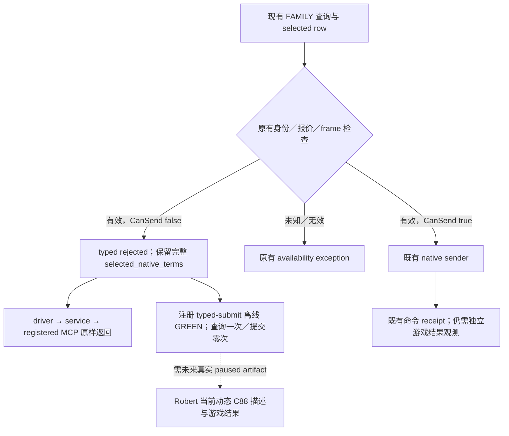

# 1.20.0.3 召盟最终拒绝：保留既有原生诊断的提交 caller

2026-10-05，后台用户独占轮 round02 交接后按新的“只做后台、禁止使用 CK3”授权施工。已采用最小 Python 消费修复，并完成一次注册提交工具的受影响路径验证及未知值异常验证，当前为 `static-ready`。本轮无游戏、SDK、pipe、窗口或游戏进程操作，无 native 构建，新增游戏日 0；frozen 5035 基线不变。Root 整合共享报告与最终发布。

施工前复用了 [C88 原生 failure-description 专题](call-ally-c88-failure-description-12003.md)与 [final CanSend false 专题](call-ally-final-cansend-false-12003.md)。原生构建仍绑定 CK3 1.20.0.3、Steam build 25652598、EXE SHA-256 `94B55397ABB687A3DCD436805A5D885E6BE90FA6C693FEB44A9E3BBEEADE02A6`；没有重新扫描或哈希 EXE。

## 已有查询与真实消费缺口

既有 `ck3_query_family_obligations_private_v1` 已经把 C88 status、owning UTF-8 描述、首败阶段、原生十槽报价及战争关系行交给 caller。C88 normalizer 保留原文，不从文字推导新子句；合法空串、未观测的 null 与 legacy 缺 key 各自保留。旧 source-produced wire 到 registered FAMILY MCP 的一次静态 GREEN 直接复用，本轮没有重跑。

修复前的缺口位于 `call_ally_to_war_private_action_v1.py`：提交工具已经读取这一行，但把 `native_complete_can_send=false` 与未知值、无效 picker、无报价合并为 `BridgeUnavailableError("call ally selected target lacks final native send legality")`。动态原因与可行动的费用／战争关系数据因此没有随这个提交调用返回。现已区分有效原生 false 与未知值，无需增加 provider 或重复发布 C88 字段。

## 已采用的单文件合同

生产改动只在 `ck3_autonomous_player/src/xar_autoplayer/bridge/call_ally_to_war_private_action_v1.py`。现有 actor／recipient／完整 WarID、query revision、ten-slot quote、picker 与 paused frame 检查沿用。有效 selected row 的 final CanSend 为原生布尔 false 时，返回现有支持的 `status="rejected"` 字典，并带回完整 `selected_native_terms` 深拷贝、`quoted_send_cost_raw`、query frame／revision 与 source date。

这一结果来自已经完成的 FAMILY 查询：`result_source="native_family_query"`、`read_only=true`、`native_submit_attempted=false`、`request_id=null`。`accepted`、`submitted`、`material_result`、`verification_pending`、`automatic_retry` 全为 false。分支在 UUID 与 native submit `endpoint.send` 之前返回；既有 FAMILY 查询仍然会使用查询通道，不能将“没有提交命令”写成“没有 endpoint 调用”。

稳定 reason code 为 `call_ally_native_complete_can_send_false`。C88 原文及首败阶段保留在原始 selected row 中，不解析本地化文案，不把 description 当作每个子句的结构化求值结果。报价保持十槽 signed raw／Q100000，包括合法全零；不增加 `actual_send_cost_raw`，不把查询报价称为 send receipt 或已支付金额。

未知 CanSend、invalid picker/selectability、未采样／错误报价、身份／revision／frame 不一致继续按原合同抛 availability exception。CanSend=true 的既有 native sender 路径不变。

## 返回／异常合同的调用方影响

本次在隔离树 `Z:/gb7`、基线 `3f2025ca8cfac4e298210925ca0e472025ae5d51` 重新读取当前三层调用方：`native_driver.py:3390`、`service.py:574`、`mcp_server.py:1639` 均直接转发 dict，不包装异常或把拒绝变成 ACK，因此不需要同步修改转发代码。工具返回声明为 dict；没有新增输出 schema 或端口。三个既有 docstring 偏重“提交／ACK”；查询阶段即可能返回 rejected，不能据其措辞声称每次调用都产生了命令。

外部 caller 若只捕获 `BridgeUnavailableError` 来处理 final false，需消费正常返回的 `status="rejected"`，并检查 `native_submit_attempted=false`／`submitted=false`。不得因为收到普通 dict 就安排加入战争 postread 或认定已排队。已读的策略入口未找到这个 typed submit 的直接调用；这不是全仓未知 caller 已完成迁移的声明。

唯一已确认的旧预期在 `tests/unit/test_call_ally_to_war_private_action_v1.py:91`：它把 CanSend=false 设为必须抛 `BridgeUnavailableError`。已将旧异常 case 改为未知 CanSend=null 仍抛原异常，并新增注册工具的 false 分支验证。实际调用顺序是 registered MCP → service → driver → submit helper → 既有 FAMILY transport/normalizer → 离线 endpoint，返回沿原路透传。验证确认完整 C88 text／首败阶段／quote／战争关系行深拷贝保持，FAMILY query 一次、native submit 零次、request_id null、动作结果标志全部 false，无 `actual_send_cost_raw` 或参战结果字段。修改输入的费用和关系列表后，返回 selected row 不变。

## 证据边界与可施工入口

原生 final CanSend 入口为 `0x307C040(context,nullptr)`；C88 节点对应 `is_valid_showing_failures_only`。旧 v40 九行实测在 C88 首败，十槽报价均零，不能将其归因为资源不足或指定未观测的个别关系子句；它们不是当前 frozen 5035 的新观察。

原生 C88 描述链已在对应专题闭合：`0x4223BB4` 分配 0xD8 → `0x37C66E0` 构造 → `0x372E4F0(def+C88,context+8,description)` → `0x375DCC0(&owner,imageBase+0x4441B00,native32byteString)`，再走既有 cleanup。旧 fixture 中 callbacks 是 mock，packet identity 为 1.20.0.2；只证明生产序列化／normalizer／registered query 消费，不能重标成 .3 live 或 Robert 的实际动态描述。

本轮新增知识是“诊断已经发布到只读 query，但提交 helper 在原生 false 分支丢失这一输入”及其最小修复合同。没有设计 counter-policy，也没有对当前失败原因猜资源／战争动作。消费修复已通过离线验证；当前 Robert 的动态 C88 原文仍需未来真实 paused capture，本轮不触碰这一入口。

原交接包保留于 `Z:/ck3_mod_rewrite_process_assets/g2-resume-20261005/background-user-session-round02/call-ally-reason/ROOT-DELIVERY.json`。原源码候选 patch SHA-256 `87705dfb6fdfd65c7b162db75440bd513508f57692d18bb8725c010d19ae0829`，exact projection SHA-256 `86a15d196c6e4229dd6cd392b51be9a0b75dc290a631c2775d45178b0836b080`。本次沿用其 false 分支，补充 helper 文档及受影响测试。

## 本次唯一离线验证

实际命令：`python Z:/ck3_mod_rewrite_process_assets/g2-background-20261005/call-ally-diagnostics-gb7/run_validation.py`。内部只执行两个指定 unittest：新增注册拒绝 case 与替换后的 unknown case，结果 **2 tests GREEN，1.576s，exit 0**。日志与命令、输入 SHA-256、readiness 和时间回执分别为同目录 `validation.log` 与 `VALIDATION.json`。未重跑旧 C88 native fixture、旧 registered FAMILY query、完整旧套件或 EXE hash。

注册拒绝 case 消费已有 `.3` 离线 serializer fixture，并显式添加 synthetic C88 首败及带 markup／换行／中文的诊断文字；它验证消费合同，不是新原生描述抓取，也不重标旧 `.2` callback fixture。查询使用 fixture endpoint，没有 SDK、真实 pipe、attach、UI、Steam 或游戏进程操作。`open_kaishek` 预验为 `not-applicable`：本次修改 Python/MCP 返回合同，没有 Paradox 脚本有限运行语义子集。

当前交付只升级此拒绝消费路径至 `static-ready`；原 v40 原生 legality 证据不变，未增加 `fixture-live`、`production-live primitive`、参战循环或完整能力信用。后续仍需获准实机后保存当前 Robert `.3` paused 动态 C88 描述，以及真实提交和独立参战／费用结果；ACK 与查询报价不能替代它们。
