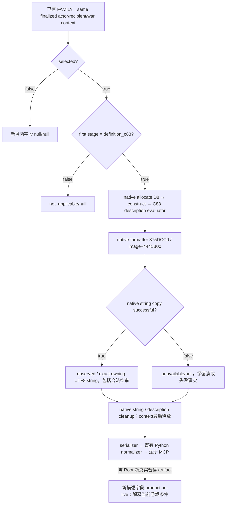

# CallAlly C88 native failure description (1.20.0.3)

This extends the existing FAMILY query after the v40 actual nine-row C88 rejection. The native ABI is source-closed, and the external implementation is static-ready. The current Robert clause text has not yet been captured from the rebuilt .3 DLL. The already observed nine legality inputs remain a production-live primitive.

## C88 原生条件描述：同 FAMILY 最小扩充（2026-10-03）

v40 已实测九个当前选定召盟组合全部 `CanSend=false`，且首个失败组是 C88=`is_valid_showing_failures_only`。既有九字段继续保持 **production-live primitive**；本次只给已有 FAMILY row 增加原生 C88 条件描述的 status/text，帮助下一次真实暂停读取定位组内条件，不重新猜 ruler/realm。

该扩充冻结 CK3 `1.20.0.3 / Steam25652598`、EXE SHA-256 `94B55397ABB687A3DCD436805A5D885E6BE90FA6C693FEB44A9E3BBEEADE02A6`。Python 外置投影基线是只读 `Z:/g38`，源码 `a6f3221ef99cea5501dcd0595b4461affc63e2db`。ABI/source 树先由 native owner 冻结，再施工 reader、wire 与 Python normalizer；沿用 endpoint、schema version 和既有查询权限。

| 新增原生字段 | 意义 |
| --- | --- |
| `native_c88_failure_description_status` | `observed` / `unavailable` / `not_applicable`；selected=false 时 null |
| `native_c88_failure_description_text` | owning UTF-8 原生描述字符串；合法空串是 `""`，未采样或 unavailable 是 null |

selected=true 且首败不是 C88，输出 `not_applicable/null`；C88 首败且 native formatter 字符串复制成功，输出 `observed/string`；分配、binding 或真实字符串读取失败，输出 `unavailable/null`。未选定上下文时两个字段均 null。冻结旧 packet 没有这组字段时保留原 shape；新原生 packet 输出完整两字段。Python 只校验这组原生输出类型及适用状态，再 deepcopy 原值；既有 complete CanSend、九诊断字段、两路 answer、费用与 acceptance 都保持原生结果。

精确 ABI 由 `failure-clause-extension/native-abi/SETTLED-NATIVE-ABI.json` 冻结：

| 操作 | RVA / signature | 当前原生输入与生命期 |
| --- | --- | --- |
| 分配 | `4223BB4: void*(size_t)` | `0xD8` bytes |
| 构造描述 | `37C66E0: void*(void*)` | 原生分配的 storage；constructor 将 `+D0` 初始化为1 |
| 评估 C88 并构造描述 | `372E4F0: bool(const void*,void*,void*)` | `definition+C88, context+8, description`，没有第四个参数 |
| 格式化 | `375DCC0: void(void**,const void*,void*)` | 将 `description+D0` 设0；`&owningDescription, imageBase+4441B00, native32byteString` |
| 清理 native string | `856050: void(void*)` | exact-byte owning copy 后调用一次 |
| 描述析构与释放 | `219FE20: void(void*)` / `4223F64: void(void*,size_t)` | formatter 后重新读取 owner，非null时依次析构、释放同 owner 与 `D8` |

native32byteString 对齐8，初始32bytes为0、`+18` capacity=15，size在`+10`。capacity<16时 inline data在`+0`；否则首QWORD是原生字符指针。exact size 字节在 native string、描述与 finalized context 都存活时复制到拥有所有权的字符串；随后清理两个临时原生所有者，最后释放 context，wire 仅序列化拥有所有权的文字。实际新 production fixture 的顺序是 copy→description destroy/free→string destroy，两个清理均在复制之后。

formatter 的参数来自借用的 image-owned `imageBase+4441B00`，原始 bytes=`02 02 00`，无需自造参数块。native formatter 自己完成必要的内部准备，不能额外绑定或手工模拟子脚本。输出是**原生条件描述**，可含 markup、上下文及通过条件；mode/root filtering 有 node/parent override，不能承诺它是纯 failed-only 列表，也不能在 Python 中剥离文字、猜子谓词或重算 native gate。

生产 Python 路径仅修改 `ck3_autonomous_player/src/xar_autoplayer/bridge/family_obligations_private_transport.py`。注册 MCP → `NativeHeadlessGameplayDriver` → `g2_private_query_transport` → 此 normalizer → 原生字典 deepcopy，既有 private FAMILY 路径没有 service hop。验证只用 sibling 新生成的 production Reader→description→formatter→cleanup→serializer wire，通过实际注册 MCP 消费一次，`python -B -O` 下使用显式 require/raise；不重复旧 null-special、sender 或九字段 fixture。

新 production fixture 首次三场景 `/O2 /W4 /WX` GREEN，六个必要 TU 并行编译、一次 link/run；selected C88 生成 observed owning text、selectedfalse 双null、non-C88 not_applicable/null。仅消费其中一个 newly emitted observed packet，经当前 g38 注册 MCP / driver / protocol / 私有 transport / 实际 Python projection，一次 `python -B -O` explicit require/raise GREEN，旧九字段与新增两字段完全保留，1 个协议事务。

该 fixture 使用原 `1.20.0.2` descriptor，EXE 标识 `AE1BA6FF060BA603842F6F4A2DED0AF4B7D3666B3DD271F75FB01B0DA8E81B2D`，actor67108864 / ally83886081 / revision17 / date123456。真实执行的是改造的 production Reader/getter/serializer 与生产 Python 消费链，native allocation/ctor/evaluator/formatter/cleanup callbacks 是独立夹具 mock；不是 `.3` 实机 formatter 抓取。fixture 输出特意包含 `#N`/`#P` markup、通过条件上下文与 UTF-8，证明 normalizer 完整保留 owning string，并非 Robert 当前某个 clause 的实测。

本扩充已 **static-ready**，仅新增两个描述字段仍 **source-pending**，当前未收到新真实 Robert paused description，不写 production-live clause、不写已召盟/参战。v40 原有九字段保持 production-live，旧完成 primitive 保持；military lane 继续自己军队与围城。Root 实机后根据原生描述和同框输入选择具体游戏动作，完整 send→独立参战/资源 outcome 仍须真实证据。Reader fixture正常不等于 executor真正挂载；独立executor lane/Root须采用bindings并用新 `.3` DLL真实 paused读取。

| 冻结证据 | SHA-256 |
| --- | --- |
| `native-abi/ROOT-DELIVERY.json` | `dc108f11f2771ba1e49427a590813da4ae1bbf1ca04e8cbd312f688e21663d12` |
| `native-abi/SETTLED-NATIVE-ABI.json` | `63e197eef82cd734a72d5aee151fe3ac2389f21c326b28d8a4c90247e23019ed` |
| `native-abi/output-dtor/ROOT-DELIVERY.json` | `3c81a421806c60a5324ff2dd56ef08ff7c0f71e7211c0d77735dda360ceb80de` |
| `native-abi/output-dtor/OUTPUT-DTOR-ABI.json` | `410e4c85966b98ec30d8732267e6005889bf51dff8415901cfe7c0323ee154f9` |
| Python baseline normalizer | `c733c415403100d01da66af3c570fdc4eff8f8719f58a9378476f501fd6f8d2e` |
| Python projected normalizer | `20868ed7178205ca00c2813741a53c5f7a5dbb4fa27e30bb83dc705ac1e48d1a` |
| Python one-path patch | `af9fbd1a2ed22ec9f3f087521b5e4a2468f00be63ee87a9ea7b3845624f4d4ba` |
| `native-reader-wire/ROOT-DELIVERY.json` | `c4621ce307788596c83f4e9f1220109ba72fda2a0dcbdd46e3cc135640f9d672` |
| `native-reader-wire/ROW-WIRE-CONTRACT.json` | `0aae667990687502a4c6638ec343e6f2e44593d5406d99ab24b21c563150937a` |
| `production-fixture/ROOT-DELIVERY.json` | `5c0153462ea04fafc71e9c76d8bde356219e34d42f3bc04f6222a662316271cc` |
| 新 native 3cases RESULT | `6326160b82641d932e389008e4f5da09905f358227b0c07850fa7318ecce514b` |
| 新 observed production serializer wire | `06542b76855ee2256867329cab80d672f2401829ef4dc32afa1c656dd98ff13b` |
| 一次 registered MCP RESULT | `8c9c4f14afdad25dfb0dde42c4d6df85951603f68920913ae89483aaffc6f539` |
| registered consumer source | `4517df8d76febfec12dc3ac20383e3e6289f82471dd28476d84466745e3f62d2` |

本表原生相对路径位于 `Z:/ck3_mod_rewrite_process_assets/g2-resume-20261003/call-ally-native-action/failure-clause-extension`，Python consumer 在其 `python-docs/registered-consumer`。协调者追加本段及未来实际读回结果，不覆盖已采用的 v40 actual-rows 能力记录。
