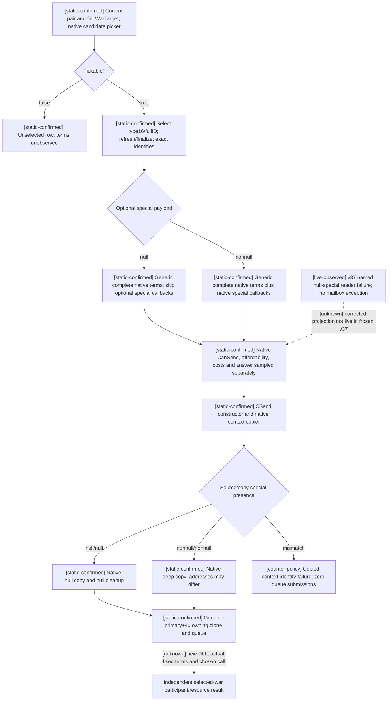

# CK3 1.20.0.3: optional special payload in selected-war call-ally terms and send

2026-10-03. Exact build: **Crozier 1.20.0.3 / Steam25652598**, EXE SHA-256 `94B55397ABB687A3DCD436805A5D885E6BE90FA6C693FEB44A9E3BBEEADE02A6`. The actual v37 source freeze is `f42522f7f176ad67b000d66341a17a02a3f82ae7` at `Z:/g39`; its DLL SHA is `e6c114d82d31900d0a07bf6c43eb89a26f3fd55e2ffb3a3c9a1b5385af7c4585`. The new nullable-special source projection is bound by its own before/after hashes below and has not been observed in that frozen DLL. This is a correction for a **real production reader failure**, with exact native research and focused fixtures kept separate from subsequent actual uptake.

**A finalized call-ally context does not require a nonnull special instance.** The native terms, copy and cleanup branches explicitly support a null special payload. Earlier reader/sender assumptions that required `context+0x330 != nullptr` are superseded by this exact-build evidence. Actor, recipient, definition, selected type16/full WarID, complete native legality, observed costs and command ownership remain required. Native null handling does not imply that a call is legal or accepted.

## What v37 actually returned

Root's `runtime-preparation/v37/actual-new-leaves-v37-01` contains three native FAMILY bodies for Robert **29829**, episode **`native-29829-2bc2d599f7f9`**, paused dateRaw **53236800**, native snapshot revision **3**, PID **62452**. Each registered MCP request returned `isError=false` with a native `unavailable` body and the specific reason `call_ally_finalized_special_instance_unavailable`:

| Packet | Recipient full ID | SHA-256 |
|---|---:|---|
| 018 FAMILY | 34730 | `0e84270fccaff71096be44373c56e21e6d23c8e012785ed878785e1ae250612a` |
| 020 FAMILY | 37689 | `f3e3b96ebbe2f12ca744c628a4532e96e577aeab0ed81c19e3566c4a9b580da7` |
| 022 FAMILY | 38718 | `fa8286ead3689c46c2ea44a22c2d2db0758c70f42c7a93a60105ab19d59731dd` |

The dedicated reason occurs after the finalized actor, recipient, selected target type and full target token checks. It identifies the reader's mandatory-nonnull check; no pointer value is inferred from a formatted message. Surrounding snapshot packets 017/019/021/023 show an installed, ready application-main-thread mailbox, `failure=0`, exception code **0**, and matching published/completed sequences **7 → 8 → 9 → 10**. The reader ran and returned its named failure. This is a capability RED with a working transport, distinct from an empty error response or mailbox exception.

These failed native bodies returned **no available per-war terms**. They establish neither picker=false nor CanSend=false, and expose no independent participant/WasCalled/cost rows. No call, payment, joined ally or troop arrival occurred in this file-only consumption. The active defensive WarIDs **16777231**, **129** and **50331736** remain separate observation/action targets; unavailable FAMILY bodies must not supply invented terms for them.

## Native terms: optional special payload and complete gates

The genuine selected context uses a 0x338-byte disposable context: actor full ID at `+0x2D8`, recipient at `+0x2DC`, WarTarget type at `+0x2F0`, full WarID token at `+0x2F8`, and optional special payload at `+0x330`. The UI's wrapper offsets `+0x3B8/+0x3C0` are different and are not standalone context offsets.

The native candidate picker **`0x307A690`** is called on the concrete WarTarget before selection, matching the existing UI's candidate admission order. If it rejects that war, the observer returns an unselected row with `native_target_can_be_picked=false` and `native_selected_target_context_available=false`; selected costs and answer terms are unobserved, not a sampled zero quote. If the candidate is pickable, the observer writes the exact type16/full WarID, refreshes **`0x3078A60`**, finalizes **`0x3078C90`**, and rereads the actor, recipient and target identities. Passing these checks makes the selected context available even if the special slot is null.

Complete native **CanSend `0x307C040`** retains the full precheck **`0x307AB70`**, interaction-status/final-answer path and final affordability **`0x310B3B0`**. The precheck's special-dependent virtual `+0x60` is conditional on a nonnull payload; its character-scope helper **`0x307A860`** similarly conditionally invokes special virtual `+0x58`. Null skips those optional virtual callbacks, not the general character, option, compiled-rule and affordability checks. The observer calls this complete entry, rather than substituting a relation bool or an isolated picker result.

The ten signed int64 Q100000 send-cost slots come from **`0x310CEE0`**, using definition `+0x40` and context scope `+8`. Recipient score **`0x307C460`**, raw final-answer **`0x307BC80`** and its helper **`0x307BD90`** operate through the generic interaction/role path; an optional payload is not a prerequisite for sampling these terms. Autoaccept uses the definition's compiled trigger at `+0x2290` through **`0x372DF30`**, or the validated scalar at `+0x2718` when no trigger is present. A raw answer status, score or authored autoaccept value remains separate from independent world membership.



## Native copy, nullable identity and ownership

The **`0x2968170`** CSend constructor stores the primary/secondary vtables **`0x448BCE0/0x448BCB0`** and copies the finalized source context into command `+0x20` via **`0x3076B80`**. The genuine primary-vtable owning clone is **`+0x40 → 0x86D760`**, and the genuine primary deleting destructor is **`+0 → 0x86BE90`**. The exploratory `0x2968220`/`0x29677A0` names are secondary interface slots; they are not the owning clone/destructor proof.

Context copy `0x3076B80..0x3076C86` copies definition, six role IDs, selected 16-byte target and option vector, then calls special-copy helper **`0x25038A0`**. At **`0x25038CE`**, a null source special slot branches to **`0x2503907`** and stores destination zero at **`0x250390F`**. The nonnull branch uses the native factory/virtual copier. It may create a different pointer address while preserving a legitimate nonnull payload.

The minimal sender correction is therefore **source/copy nullness parity**, alongside all existing identity checks:

```cpp
const bool source_null = Load<void *>(context, 0x330) == nullptr;
const bool copy_null = Load<void *>(copy, 0x330) == nullptr;
const bool special_presence_preserved = source_null == copy_null;
```

Null/null is valid; nonnull/nonnull is valid when the native copy and identities pass; a mismatch is rejected before queue submission. Neither mandatory nonnull nor raw pointer equality is part of this contract. Definition, current paused player frame, actor/recipient IDs, type16/full selected WarID, auxiliary role IDs `+0x2E0..+0x2EC`, native candidate picker, complete CanSend, ten observed-cost equality, command vtables and native owning queue are retained.

The 0x368-byte owning clone uses the same native context copier and retains score fields `+0x358/+0x360`. The native deleting destructor calls context destruction **`0x30773A0`** on command `+0x20`; context cleanup tests `+0x330`, skips its virtual destructor on null and continues scope/option cleanup. The existing `SubmitCommandCopy` moves the native clone pointer out of return storage, queues through manager **`0x5CC1240`** / entry **`0x37F06F0`** with channel **`0x0E`**, and destroys only residual game-owned objects. This fix changes no ABI offsets, sizes, signatures, vtable slots, channel or allocation ownership.

The send receipt keeps `send_cost_sampled`: false is unobserved/null, true with ten zero values is a legitimate quote. `actual_send_cost_raw` is the immediate reevaluated compiled quote, not proof of payment. Queue submission is not a recipient response, participant transition or troop arrival.

## Exact evidence pins and readiness

External artifact root: `Z:/ck3_mod_rewrite_process_assets/g2-resume-20261003/call-ally-native-action/new-v37-consumption/`. Evidence is reused or extended only for the observed failure; this documentation lane performs no game queries, command, source modification, test rerun, Git operation or window action.

| Evidence | Exact pin |
|---|---|
| Actual v37 consumption, `ACTUAL-V37-ALLY-CONSUMPTION.json` | SHA `5d6044a0fa7a8949a8e95fdc33593e9b9e21cd0ef61f2296273c68037b744bdd`; actual packets above |
| Reused complete CanSend `307C040` raw span | SHA `ff9344c7fa4860880eb1eb32f4b58ac51619303852c8749a0fac931552f0ae57`; source ABI manifest SHA `f363c581677f7dd3883ea6140a6734f7769d7a662b64521f4a1bf5298c607a44` |
| New precheck `307AB70` / character-scope `307A860` | SHA `ecc5a3f91651f1d69e5e01a7ec724c5dc6b0dec31ea473f2d1f0f22a8268313f` / `2a671e407fd5c8722c0aaae69edf35fc40343013e54052fa56481aed6b964314` |
| New cost `310CEE0` / affordability `310B3B0` | SHA `d860e437ad5d5f015d6cd143dd5b33ce21f9796fc5f0180b8f996edce08f3c83` / `ec64681c0b9ca1bb537dd10107de620a01c2dd25ff90ce9acfd7df0e3bf3253d` |
| New final-answer `307BC80` / score `307C460` | SHA `edfbcfb9285564333d3720c66641f6199a4a8b65051f301c9a57c18ab9ecb9d9` / `0495716807e3d81c4296c8e12264403e54e104aa886b66249d2638a7b969ce21` |
| Context copy `3076B80` / special copy `25038A0` | SHA `f267c8b6ba51698017f29769b9c271e66ea09215cc4076a117ed0b3da3834903` / `1f25cc390b8d22009621a33a9b4eb28ca687b13bfaeba3e1e8a7a0ab9ab0fb05` |
| Genuine owning clone `86D760` / command destructor `86BE90` / context destructor `30773A0` | SHA `613e50ba3d5a0240e8c6c7a281792f6a77943625b816101007fdf5d4cab4d638` / `94461c0b3dacb38c8c3b4f2c6f860b52aff0ecd678bba64071575167f48dcf79` / `32c11450cbba423a54d7ba68fed6a63286c1e7899a5a9f7adc8e1c67d70bf8ad` |

The three source receipts are `null-special-terms/ROOT-DELIVERY.json`, `null-special-send/ROOT-DELIVERY.json` with its `ROOT-CONTRACT.json`, and `null-special-fix/PROJECTION-MANIFEST.json`. Terms windows live in `null-special-terms/NEW-FOCUSED-SPANS.json` and `REUSED-SPANS.json`; owning-copy windows live in `null-special-send/NULL-SPECIAL-NATIVE-SPANS.json`. The fix projection starts from alliance source SHA `fa7a75c76d26109a22dfeaf4d6629dee611e79765ee92db064cd744e4b9ffac9`; its final source/test hashes and patch identity are recorded in the projection manifest, not assumed to be frozen v37 bytes.

The parent's **four focused changed production-path cases passed `/O2 /W4 /WX`**, using the real changed reader/sender/serializer paths with fixture-owned native objects: valid nullable selected terms, null/null send-copy/clone/cleanup, nonnull native deep copy, and nullness mismatch with zero submission. `null-special-fix/focused-fixture/result.json` records compile/run exit0, four cases and zero old no-entry/sender cases rerun. Its newly emitted selected wire SHA is `e846dbdf4f79a9889b577ae32fcb4dd0393bf9459e43c070616592a78330a1af`.

The parallel registered-consumer lane consumed that **one new positive selected row** through the current g39 registered MCP callable, driver, private transport, protocol and normalizer under `python -O` with explicit require/raise checks. CanSend=true, the ten costs `[0,100000,...,900000]`, acceptance score `-2500000` and raw answer status2 were retained unchanged. `null-special-fix/registered-consumer/ROOT-DELIVERY.json` records GREEN and its `RESULT.json` SHA `b3ac608fae935378e65e0639c012780228941e40e5c6345be38735d3324b17a5`. This is an offline field-preservation result, not actual CanSend or recipient acceptance for any of the three observed allies; older negative/unselected matrices were reused without rerunning them.

The correction is **static-ready**. The earlier six-case sender GREEN is preserved as earlier interface evidence; it does not validate this later correction. Root must build/adopt the corrected DLL and obtain a **new paused available terms artifact** before selecting a legal call. The old v37 failure is retained and no corrected production-live or sent-call claim is made here.

`postcondition/ROOT-DELIVERY.json` reports zero independent FAMILY war rows and zero calls in this actual attempt. Its pre/post recipe remains: freeze the fresh actual selected-war participant/called prestate and player resource balances; send one fresh legal request; independently reread the selected war's full same-side participant vector and balances. WasCalled does not distinguish pending, accepted and refused states. Membership is separate from actual ally-owned army arrival and support. Preserve any delayed response and ordinary tick income/upkeep in the attribution. This work adds no game days, accepted calls, won battles, loop completion or G2 credit.
