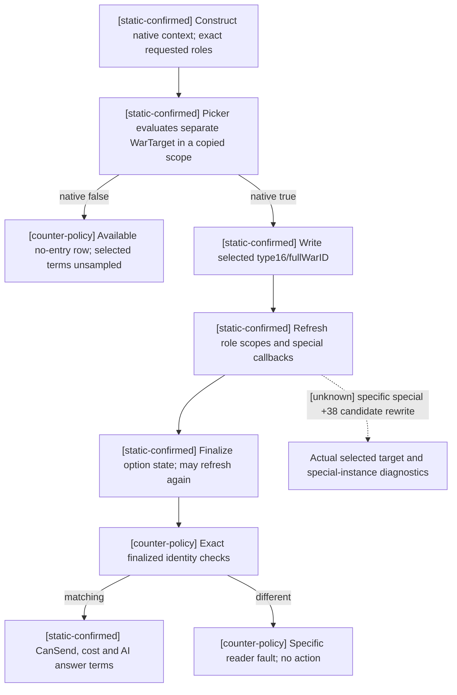

# CK3 1.20.0.3: call-ally candidate selection before finalization

2026-10-03. This is bounded exact-build research for the real `call_ally_finalized_context_identity_unavailable` reader failure. CK3 Crozier 1.20.0.3 / Steam 25652598, frozen EXE SHA-256 `94B55397ABB687A3DCD436805A5D885E6BE90FA6C693FEB44A9E3BBEEADE02A6`. It uses the frozen installed-build EXE, not the older repository stock reference. No process, SDK, pipe, desktop, Git, or shared source was touched by this lane.

The actual paused capture `war-allied-support/actual-terms-and-cold-combat-v35-01` has three failed family queries, for Robert 29829 and requested recipients 34730, 37689 and 38718. Its frame is raw date 53236608, native revision 4. Each result gives the same combined identity failure and no operand values. The earlier collection observed bilateral `IsAllied=true` and `has_realm_data=false`. These facts do not identify which identity assertion failed or prove landlessness caused the failure. The captures remain production capability RED.

## Exact native selection sequence

The current source `Terms` constructs a native context, writes the requested type16 WarTarget, refreshes/finalizes, demands actor, recipient, target type, full target token and special-instance presence, then evaluates `CanBePicked`. This selection order differs from the current native UI.

UI initializer `0x1398930` calls row predicate `0x1398F30` at `0x13989B4` before writing the selected target. Only a selectable row is written at wrapper `+0x3B8/+0x3C0`. If there is no selectable single row, the native UI writes type16 with the **zero-extended uint32 sentinel `0x00000000FFFFFFFF`**, then calls its refresh wrapper at `0x1398A14`. These wrapper offsets are not standalone-context offsets.

The exact row predicate constructs a local type16 candidate from the resolved full WarID at `0x1398F79..0x1398F85`. It obtains the standalone context at wrapper `+0xC8` and calls `CanBePicked 0x307A690` at `0x1398FA1`; recipient-on-attacker-side, recipient-on-defender-side and `WasCalled` checks follow only when that picker returns true. This establishes that the picker accepts a separate candidate target before that candidate is selected in the original context.

`CanBePicked 0x307A690..0x307A76E` copies `context+8` to a stack-local scope using `0x373AD10`, binds the supplied WarTarget to the temporary scope using `0x373A110`, and evaluates definition `+0xFC8` with `0x37998F0`. It does not write the original context's role IDs, selected target, or special pointer. A false result is a native observed selection rejection; it is not a failure to read identity.

## Refresh and finalization semantics

`Refresh 0x3078A60..0x3078C86` rebinds all six role IDs and selected target into scope. It permits `context+0x330` to be null in the generic path. When a special instance exists, it calls virtual `+0x30(context)` at `0x3078BBC` and virtual `+0x38(context, scope+8, &selected_target)` at `0x3078BD7`. The latter receives a mutable selected-target pointer. Refresh itself has no direct store to actor `+0x2D8`, recipient `+0x2DC`, target type `+0x2F0`, target token `+0x2F8`, or special pointer `+0x330`.

The complete finalizer `0x3078C90..0x3078EB4` adjusts the option vector at `+0x300/+0x30C`, reevaluates selected options and can recurse through option refresh `0x3078650` and `Refresh 0x3078A60`. It has no direct role, target, or special reset. Looking only at the first `.pdata` fragment ending `0x3078D6E` would omit the continuation; the evidence includes the complete byte span through `0x3078EB4` and padding to `0x3078EC0`.

The specific call-ally special factory/virtual `+0x38` implementation is **unknown in this lane**. The static native registry chooses a factory from definition `+0x26F8` at table `enum*0x40+0x38`; the actual failed packets do not publish that byte or the produced special-instance presence. It is therefore not justified to claim the callback clears these recipients because they have no realm, or to weaken the actor/recipient equality checks. The generic allowance for null does not establish that a correctly resolved `call_ally_interaction` should have a null special instance.

## Minimal observation and submission correction

Construct the disposable native context and preserve the exact requested roles. Evaluate `CanBePicked(context, &requested_war_target, nullptr)` before writing that target into the context. Publish this observed bool separately from complete selected-target CanSend.

If the preselection picker is false, return an available world-state war row with `native_target_can_be_picked=false`, row-selectable false and `native_selected_target_context_available=false`. `native_complete_can_send`, `send_cost_raw`, `recipient_acceptance_raw`, `recipient_answer_status_raw` and `native_auto_accept` are JSON null. This reports no selected native target entry without turning uncalled CanSend into false or uncalled cost/AI getters into zero. Do not perform selection, refresh/finalize, cost/answer calls, send construction, cloning, or submission on this branch.

If the picker is true, write the exact type16/fullWarID target, refresh/finalize, retain exact role/target/special checks, and sample complete CanSend and terms. Keep an actual inconsistent context unavailable with a specific failed predicate, or explicit observed diagnostic fields, so another combined failure cannot hide its construction cause. Do not classify a changed actor/recipient or unsupported target as an available requested call.

The sender may use the same preselection predicate as an early native rejection, then retain its complete refreshed legality, observed-cost match and owned-copy verification. An early false is a rejected action with zero queue submissions, not an unavailable reader. Root owns implementation, the one focused production-path reproduction and actual acceptance.

The exact native tree was closed before implementing the correction. The subsequent external implementation is `static-ready`: five focused cases exercised the changed production reader, sender and serializer with fixture-owned callbacks, compiled `/O2 /W4 /WX` and passed. They cover native picker false with retained world graph and unsampled terms, picker true with full terms, a sampled complete-CanSend false, a retained finalized-actor mismatch, and sender rejection before queue submission. Six Python normalizer cases also passed, and the exact emitted native no-entry wire traversed the existing registered FAMILY MCP/driver/transport/state/normalizer chain once. The old sender matrix was not rerun.

These fixtures retain the existing internal .2 descriptor under the reviewed exact .3 adapter reuse; they do not demonstrate a newly exercised .3 renderer. They verify the production-path sequence/model correction, not an exact reproduction of the unknown original failed operand. They do not claim that the three real recipients return picker false, that the correction is production-live, or that an ally was called, accepted, joined troops or completed an OODA milestone. Root owns fresh-DLL paused actual acceptance. Original failed artifacts are retained.

## Evidence

Artifact root: `Z:/ck3_mod_rewrite_process_assets/g2-resume-20261003/call-ally-native-action/actual-reader-fix/finalized-semantics/`.

- `NATIVE-SPANS.json` pins exact raw windows and their byte hashes.
- `ui_row_picker-01398f30-01399045.txt`: 277 bytes, SHA-256 `969105c0d68e73888f463b973bbd7d9eb7cd54f71ec1f7e5633a07af477d10e8`.
- `can_pick-0307a690-0307a76e.txt`: 222 bytes, SHA-256 `ec83f24499268eb461dae2226c59e4e5eb841ed9bbba4357d684f7832bccd799`.
- `refresh-03078a60-03078c86.txt`: 550 bytes, SHA-256 `9b59b06f3b2126640b79b2a2ac3325da77c91edfaf547c4237703bb4435a9a35`.
- `finalize_complete-03078c90-03078ec0.txt`: 560 bytes, SHA-256 `e0c5a90bbfbd6a30eb4f305d91935843c37c11ec8b654e639c1f5707f2ae00e6`.
- `option_refresh_complete-03078650-03078700.txt` and `option_reset-03078700-03078757.txt` close finalizer recursion without direct identity resets.
- Existing `call-ally-native-action/select_war-disassembly.txt` and `SOURCE-AND-EXACT-CHAIN.json` supply the actual UI selected-war write sequence; reused rather than regenerated.
- Parent `../ROOT-READ-FIX-DELIVERY.json` and `../ROOT-READ-FIX-PROJECTION-MANIFEST.json` pin the combined implementation, docs and verification receipts. `../focused-fixture/result.json` records the five native cases; the actual emitted fixture wire SHA-256 is `93fab1b3bb643a533c6393ed2caf9cd6cf7a76e64925269315bb61d245e18cb0`. `../context-identity/normalizer/ROOT-NORMALIZER-DELIVERY.json` pins the six dict cases and the registered-chain consumption result.

`CALL-ALLY-SPECIAL-DISCOVERY.json` records a bounded unsuccessful static name search. The lone raw integer-byte match at `0xBD0BAA` is a call displacement in an unrelated sorting function, not a call-ally registration. Its extracted window is exploratory evidence only and supports no semantic claim. No prior full ABI verifier or fixture matrix was rerun.

## 2026-10-03T15:41 接续源码采用

统一fresh v36配置在0TU阶段RED：手工xar_ck3_12002_family_obligations_no_entry_test与原有ck3_12002_*_test.cpp GLOB foreach同时add_executable/add_test；原冻结9476/g36及完整失败日志/cache留存。这是新增夹具遗漏已有skip list，而非原生ABI或游戏失败；当前v35/PID13408/raw53236728/3850保存日不变。g37仅加一条fixture_name STREQUAL排除，与已手工alliance/sender条目并排，保留手工目标全部flags/includes/link/tests。原独立native/MCP GREEN复用，不加测试或安全边界；下一新fresh目录严格四targets/64jobs/115flags完整构建负责验证这次实际配置修复。

实际记录：`2026-10-03T15:41:34+08:00`。源码已采用；严格组合DLL和Robert暂停实读仍待完成，不能记为live或增加日数/动作/收益/G2信用。ROOT负责正常commit/push。

交付回执：[v36-cmake-fixture-target-registration-fix](Z:\ck3_mod_rewrite_process_assets\g2-resume-20261003\runtime-preparation\v36\BUILD-RESULT.json)。

## 2026-10-03T17:19 接续源码采用

v37 三个盟友在健康 mailbox 中均被 reader 错误的 special-instance 非空条件拒绝。exact .3 原生完整 CanSend、费用、回复、复制、队列 clone 与析构已证明 genuine selected context 的 special 可以为 null。删除 reader/sender 两处错误的非空条件；原生完整合法性、实际费用与目标身份读回保持，owned copy 的 special null 状态与源一致。四个新增 changed-production-path 案例严格 /O2 /W4 /WX GREEN，一份真实新原生完整序列化报文通过注册 MCP 的 python -O 显式检查 GREEN，旧测试复用。新增 canonical native tree；三份真实失败产物完整保留。新修复仅 static-ready，召盟动作、入战和扣款均尚未发生。

实际记录：`2026-10-03T17:19:01+08:00`。源码已采用；严格组合DLL和Robert暂停实读仍待完成，不能记为live或增加日数/动作/收益/G2信用。ROOT负责正常commit/push。

交付回执：[ally-null-special-v38](Z:/ck3_mod_rewrite_process_assets/g2-resume-20261003/call-ally-native-action/new-v37-consumption/null-special-fix/ROOT-DELIVERY.json)。
