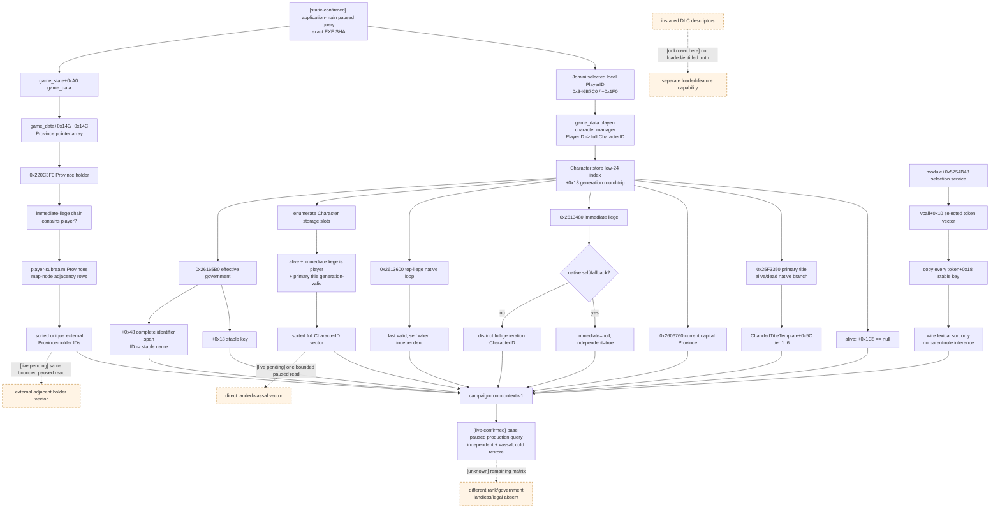

# CK3 1.19.0.6 campaign root context：玩家、政体、头衔与实际规则集

## 结论与边界

- **[static-confirmed]** 本文只绑定 CK3 `1.19.0.6 (Scribe)` 的
  `Crusader Kings III/binaries/ck3.exe`，文件大小 `95,206,008` bytes，SHA-256
  `2D00FF3101EF70B566F2FCBAE292F09263199C80E9DC8F139B82D7D96F83DB86`。所有 RVA 都以模块基址为零点。
- **原生 AI 决策树：N/A。** campaign setup 后的 local-player/root identity、当前主头衔、首都、领主链、有效政体和
  selected game-rule setting tokens 都是已经存在的 session/world state，不是 CK3 AI 在本次 query 中进行的策略选择。
  原版头衔数据确实允许 `ai_primary_priority` 影响 AI 选择主头衔，但本文读取的是 native 已解析的当前主头衔，既不重跑、
  也不模仿那个 AI 评分。
- **[static-confirmed]** `campaign-root-context-v1` 所需的每个 native leaf 已在冻结 EXE/stock 数据中闭合；当前没有需要以
  猜值代替的字段。2026-09-13 增加的 `direct_landed_vassal_character_ids` 与
  `adjacent_external_province_holder_character_ids` 复用 Character storage、province array、native holder、primary-title 与
  immediate-liege leaf，在 application-main 双采样内枚举；`related_character_contexts` 再对这两个 identity vector 逐行调用既有
  primary-title、capital、immediate/top-liege resolver，不读取或猜测存档文本。
- **[live-confirmed]** production bridge、Python service 与 MCP 已发布这项只读聚合查询。两个 immutable campaign
  checkpoint 分别完成“同 paused revision 双查询 -> 保存 -> 新 managed PID 冷恢复 -> 同 paused revision 双查询”，并逐项
  证明业务值跨恢复不变；artifact SHA-256 为 `DA5EB7F01A48A2869B8C9B6B2F6607825FA5319715F66D2C0D04AFFCF802CDDC`
  与 `677C4FF9727A479B40D068EC7E62A7AC54EF2E21A3EF57649D624C7648B279F9`。
- **[static-ready, live pending]** 上述两个历史 artifact 早于直属有地封臣、相邻外部省份持有者、相关人物上下文、玩家月收入及
  domain capacity 字段，不能证明这些字段的
  production 值。新增 reader、serializer、source contract、Release DLL 与 Python driver/service/MCP 聚焦测试已通过；
  只在下一次本来就需要的 paused G2 会话中做一次读取互证，不为单个字段另开长跑。
- 这项 capability **不声明 DLC truth**。磁盘上的 DLC descriptor 只说明文件已安装；它既不证明当前进程已加载对应内容，
  也不证明当前账户 entitled/enabled。selected setting-token vector 只证明当前 selection service 中实际选中的 rule
  setting，也不能反推 installed、loaded 或 entitled DLC/feature。后者必须由独立的 loaded-feature/entitlement native
  capability 回答。

证据标签沿用[本目录索引](README.md)：`static-confirmed` 只表示 frozen EXE 或同安装包 stock 数据直接支持；图中的虚线和
`unknown` 节点仍然是未完成的实机互证账本。

## 冻结输入

| 输入 | SHA-256 |
|---|---|
| `launcher/launcher-settings.json`（`rawVersion=1.19.0.6`） | `23085950A98A8A85059B6E5AEA87F8B8A5D2698AB5633C21CEE1FC5019691368` |
| `binaries/ck3.exe` | `2D00FF3101EF70B566F2FCBAE292F09263199C80E9DC8F139B82D7D96F83DB86` |
| `game/common/governments/00_government_types.txt` | `4AA234FD63CE8BBE73DAE4369A7E80FE8A33E779A22B41B80C3998F0FEE6D656` |
| `game/common/governments/01_japan_government_types.txt` | `453DBC17F91338FC31F847D2680D9C4DA04B270BE5A1BE793F1E258385CC0AF3` |
| `game/common/governments/_governments.info` | `14CA628A2C68B9DF4F7D6EABD6ACC44BF32BCDAF62D59ABD758729D0C71AFE5F` |
| `game/common/game_rules/00_game_rules.txt` | `01B247EBABB2D59D26DB88249D95AD0E285BE2EFFDB1D3969E1D00B2E9DAE715` |
| `game/common/game_rules/_game_rules.info` | `4432AD2D0218428BBC570AC363FBF9D314D54D5627B3C8670BC5D940A16BE95B` |
| `game/common/landed_titles/_landed_titles.info` | `50C05B55A2BD2EAC0C5905B6DBA58280D1301483E435AE5DBB4CF99643D5DE5D` |
| `game/common/landed_titles/00_landed_titles.txt` | `6A508DB6C113115AA5ACA18B8DA5374B30FEB76198533AEC3A59C5076958637E` |
| `game/common/landed_titles/01_japan.txt` | `CE10CC1EB49A46947B69DC39D77AB8C3432D67708ED9F99C7957C3F0BD1F8A12` |
| `game/common/landed_titles/01_japan_noble_family.txt` | `DDC47EB2FDCE24BBB6EE28944339D9CA4B95AAE592327A5DA70D1637CC4AC895` |
| `game/common/landed_titles/01_korea_noble_family.txt` | `F0E0A935905F3AE775780B95DB0E5A6D1DAEF2CDD8CD463FAF1AA6782549C3CC` |
| `game/common/landed_titles/01_other_noble_family.txt` | `8FC56BF1673C377877170BB81AE4E2757041EC7FEB665B2220C5B9BC7570167A` |
| `game/common/landed_titles/02_china.txt` | `342F67E4D3E27A66B05A7257493A28C32AD8C0F9D9B314C0E18BDD8261165811` |
| `game/common/landed_titles/03_seasia.txt` | `3BD4D636DE3CB499A2A4C1A673746D1E7905C10EE1FF033D7980FF0BE6EFE044` |
| `game/common/landed_titles/04_china_noble_families.txt` | `23B161C109EE32071E269E82272ECB44DED02213FE7E342BABC4C01626A4F020` |
| `game/common/landed_titles/05_goryeo.txt` | `D3514B73771FF91DCD8BA6B3E6D31BA333C388144FF189513E8FD5FE129E2E3D` |
| `game/common/landed_titles/06_philippines.txt` | `43492ABF4543C0BE3DA0AC2AFD4FFE8E5E4DB982A8AE3CFAD7E3A8553FFE977F` |

## 已发布的只读 wire

下面是已经发布的 native `campaign_root_context` frame 的结构完整、数值示意载荷；示例数组没有省略成员，计数与数组
长度严格一致。service/MCP 把该 frame 放在同名 `campaign_root_context` 字段中，同时在外层发布
`query_sequence`、`scope`、`build`、`source` 与 `binding`，并逐字段镜像 frame。`null` 只表示 native 合法
absent；结构或 identity 无法在同一 paused query 中闭合时返回 typed `unavailable`，不能把部分字段拼成成功结果。

```json
{
  "schema_version": 1,
  "status": "available",
  "snapshot_revision": 3,
  "date_raw": 53178264,
  "local_player_id": 0,
  "player_character_id": 12345,
  "player_character_alive": true,
  "player_monthly_gold_income": {"raw": 570772, "scale": 100000},
  "player_domain_size": 6,
  "player_domain_limit": 7,
  "primary_title": {
    "title_id": 67890,
    "tier_raw": 4,
    "tier_key": "kingdom"
  },
  "primary_title_succession_character_ids": [23457, 23458],
  "capital_province_id": 42,
  "immediate_liege_character_id": null,
  "top_liege_character_id": 12345,
  "independent": true,
  "direct_landed_vassal_character_ids": [23456],
  "adjacent_external_province_holder_character_ids": [45678],
  "related_character_contexts": [
    {
      "character_id": 23456,
      "relationship_role": "direct_landed_vassal",
      "primary_title": {"title_id": 73456, "tier_raw": 3, "tier_key": "duchy"},
      "capital_province_id": 88,
      "immediate_liege_character_id": 12345,
      "top_liege_character_id": 12345,
      "independent": false
    },
    {
      "character_id": 45678,
      "relationship_role": "adjacent_external_province_holder",
      "primary_title": {"title_id": 95678, "tier_raw": 2, "tier_key": "county"},
      "capital_province_id": 144,
      "immediate_liege_character_id": null,
      "top_liege_character_id": 45678,
      "independent": true
    }
  ],
  "government": {
    "key": "feudal_government",
    "flags": [
      "government_is_feudal",
      "government_is_settled"
    ],
    "native_flag_count": 2
  },
  "selected_game_rule_tokens": [
    "1453_end_date",
    "normal_difficulty"
  ],
  "native_selected_game_rule_token_count": 2,
  "readiness": {
    "player_identity_ready": true,
    "player_monthly_gold_income_ready": true,
    "player_domain_ready": true,
    "primary_title_ready": true,
    "primary_title_succession_ready": true,
    "capital_ready": true,
    "lieges_ready": true,
    "direct_landed_vassals_ready": true,
    "adjacent_external_province_holders_ready": true,
    "related_character_contexts_ready": true,
    "government_ready": true,
    "selected_game_rule_tokens_ready": true,
    "same_frame_ready": true,
    "ready": true
  },
  "unavailable_reason": null,
  "provenance": {
    "game_version": "1.19.0.6",
    "executable_sha256": "2D00FF3101EF70B566F2FCBAE292F09263199C80E9DC8F139B82D7D96F83DB86",
    "backend_id": "ck3-1.19.0.6-native-campaign-root-context-v1",
    "monthly_gold_income_rva": "0x28DBE90",
    "domain_size_rva": "0x260BA50",
    "domain_limit_rva": "0x260BA20",
    "primary_title_rva": "0x25F3350",
    "capital_province_rva": "0x2606760",
    "immediate_liege_rva": "0x2613480",
    "top_liege_rva": "0x2613600",
    "government_rva": "0x26165B0",
    "province_holder_character_id_rva": "0x220C3F0",
    "selected_game_rule_service_slot_rva": "0x5754B48"
  }
}
```

示例数值不是某个实机 artifact。正式 query 的 `government.flags` 和 `selected_game_rule_tokens` 必须各自复制 native span
的**全部**条目；为获得确定性 wire，可以按 UTF-8 bytewise
lexical order 排序，但必须保留 native multiplicity，并以 `native_*_count` 证明没有丢项。排序只是 serializer
canonicalization：**不得依此反推 native 优先级、父 game-rule、rule declaration order 或 DLC 状态。**

合法 absent 语义固定为：

`player_monthly_gold_income` 在 available frame 中不可为空；它是完整 native evaluator 的 signed Q100000 结果。调用失败或
Character generation 漂移会让整帧返回 `player_monthly_gold_income_unavailable`，不会把缓存 income 或零值冒充结果。

`player_domain_size` 与 `player_domain_limit` 在 available frame 中同样不可为空，分别要求 `>= 0` 与 `>= 1`。它们来自
exact-build `GetDomainSize`/`GetDomainLimit` core；任一调用失败、值域非法或调用后的 Character generation 不再一致时，整帧返回
`player_domain_unavailable`。完整注册链与 grace-period 边界见
[玩家直辖规模与上限](player-domain-capacity-v1.md)。

| 字段 | 合法 absent |
|---|---|
| `primary_title` | 活着但 landless，或 native primary-title resolver 返回 `-1` |
| `primary_title_succession_character_ids` | 无主头衔或主头衔当前没有 successor 时为 `[]`；有值时严格保留 native 顺序 |
| `capital_province_id` | native capital resolver 无结果，例如 landless root |
| `immediate_liege_character_id` | native immediate resolver 返回 self/canonical fallback，即 independent |
| `top_liege_character_id` | 不为空；independent 时明确等于 `player_character_id` |
| `direct_landed_vassal_character_ids` | 合法没有直属有地封臣时为 `[]`；available frame 中不使用 `null` |
| `adjacent_external_province_holder_character_ids` | 合法没有已持有的外部相邻省份时为 `[]`；available frame 中不使用 `null` |
| `related_character_contexts` | 两个来源 identity vector 都为空时为 `[]`；行内 `capital_province_id` 可合法为 `null`，主头衔与 top liege 不可空 |
| `government` | resolver 返回 canonical no-government object `module+0x570CB50`；不得把 fallback 的内存内容发布成 stable key |
| selected tokens | 合法空 vector 是 `[]`；不能回退到 preset 文件或 stock defaults |

## Local player 与 full-generation Character root

**[static-confirmed]** 现有 exact bridge 已使用的根路径为：

```text
module+0x570E068 -> game_state
game_state+0xA0 -> game_data
game_data+0x1D4F0 -> player-character manager
manager+0x58 / +0x64 -> entry pointer span / count, qword stride
entry+0xD8 -> local PlayerID
entry+0xB0 -> full CharacterID
```

Jomini local selection 位于 `module+0x570F7B8 -> +0x18`；其 selected local PlayerID 是 `+0x1F0`。
`get_local_player`（RVA `0x346B7C0`）扫描 `players+0x1D8/+0x1E4`，以 player object `+0x70` 匹配该 ID。
返回对象存在且 `+0x70 >= 0` 是 map-ready gate；菜单期不能冒充 campaign root。

Character 必须以完整 generation ID 解析：

```text
Character store slot     module+0x570C130
index                    full_id & 0x00FFFFFF
storage slots/capacity   store+0x20 / store+0x2C
slot stride/pointer      0x10 / +0x08
identity round-trip      CCharacter+0x18 == full CharacterID
alive                    CCharacter+0x1C8 == nullptr
```

query 开始和结束都应重读 local PlayerID、entry full CharacterID、resolved `CCharacter+0x18` 与 map-ready；这些身份在同一
application-main paused query 中一致后才发布一份原子 context。

## 主头衔与完整 tier

### Native primary-title resolver

**[static-confirmed]** canonical `CLandedTitle* primary_title(CCharacter*)` 位于 RVA `0x25F3350`：

- alive landed：`CCharacter+0x1B8 -> land`；`land+0x1EC` 非零时取 `*(land+0x1E0)` 的第一个 full TitleID；
- dead：`CCharacter+0x1C8 -> death`；`death+0x74` 非零时取 `*(death+0x68)` 的第一个 full TitleID；
- 两者都没有时返回 `-1`，这是合法 absent；
- full TitleID 经 `module+0x570C410` 的 LandedTitle store 解析，必要时回到 canonical fallback
  `module+0x570C3F8`。index 仍为 low 24 bits，slot stride `0x10`、pointer `+0x08`，最终要求
  `CLandedTitle+0x10 == full TitleID`。

RTTI 交叉证据是 `CPrimaryTitleLink` type descriptor `0x533EF10`、vtable `0x41D6B60`；leaf
`0x19D59E0` 镜像同一 alive/dead first-title 分支。bridge 也可复用 `game_data+0x2FC8` 的
`CLandedTitleManager`，其 storage pointer `+0x20` 仍采用上述 generation layout。

### Tier loader：不能漏掉 `h_*`

**[static-confirmed]** `CLandedTitle+0x160 -> CLandedTitleTemplate`，raw tier 是
`CLandedTitleTemplate+0x5C`。template loader `0x2DBE5A0` 在 `0x2DBE688..0x2DBE6DA` 要求 key 长度大于
1、第二字节为 `_`，随后按首字节跳表设置 raw tier：

| title prefix | jump target | raw | wire `tier_key` |
|---|---:|---:|---|
| `b_` | `0x2DBE6B0` | 1 | `barony` |
| `c_` | `0x2DBE6B7` | 2 | `county` |
| `d_` | `0x2DBE6BE` | 3 | `duchy` |
| `k_` | `0x2DBE6C5` | 4 | `kingdom` |
| `e_` | `0x2DBE6CC` | 5 | `empire` |
| `h_` | `0x2DBE6D3` | 6 | `hegemony` |

跳表本体在 `0x2DBE91C`，对 `b..k` 的十个 RVA entry 依次是
`6B0,6B7,6BE,6CC,6DA,6DA,6D3,6DA,6DA,6C5`；`0x2DBE6DA` 是 reject 分支。
stock `_landed_titles.info` 的说明文本仍只列到 empire，但 `00_landed_titles.txt` 已有
`h_roman_empire` 等多个 `h_*`，`02_china.txt` 也从 `h_china` 开始，stock scripts 使用
`tier_hegemony`。因此 raw `6` 是 frozen build 的真实层级，不得依据过时 `.info` 文字截断成五级。

## 当前 capital Province

**[static-confirmed]** canonical `CProvince* character_capital_province(CCharacter*)` 位于 RVA
`0x2606760`。它先调用 RVA `0x2606C40` 求当前 capital TitleID，再 full-generation 解析 LandedTitle：

- alive landed 且 `land+0x1F8 != -1` 时，`0x2606C40` 直接采用该 current-capital TitleID；
- 否则从 first primary TitleID 起，沿 native title runtime/dynamic capital fields（包括 `+0x454/+0x458`）求 fallback；
- 没有 land state/合法 title 时返回 `-1`；
- 若 resolved title 的 template tier `+0x5C == 2`（county），`0x2606760` 从 title
  `+0x240/+0x24C` 的 first de-jure child 开始，经 helper `0x20B6B20` 下钻到非-county title，再取
  `CLandedTitle+0x460` 的 Province pointer；其它 tier 直接取 `+0x460`。

RTTI 交叉证据为 `CCapitalProvinceLink` type descriptor `0x533FEC8`、vtable `0x41DAE18`、leaf
`0x19DB410`；它复用 `0x2606C40` 的 capital-title 上游。返回 Province 再以
`game_data+0x140/+0x14C` 的 Province pointer array 和 `CProvince+0x10` ProvinceID 做 pointer/identity 对照。

stock `_landed_titles.info` 明确 `province` 只用于 barony definition，而 `capital` 是 preferred county。
因此不能从 stock `capital=c_*` 文本或 primary-title 的定义静态推断**当前玩家**首都；只调用 native current-state
resolver。合法无结果发布 `null`，不以 `0` 代替。

## Immediate/top liege：native termination 与 generation

### Immediate liege

**[static-confirmed]** RVA `0x2613480(CCharacter*)`：

- landed：`character+0x1B8 -> +0x1C0 -> +0x28` 得到 candidate `CCharacter*`，对 candidate base
  `+0x10` 调 validity vcall；独立/无效时 native 返回输入 self；
- unlanded：`character+0x1B0` relation 的 `+0xC8` 是 full CharacterID，经
  `module+0x570C130` Character store 的 low-24-bit slot 和 `candidate+0x18 == full_id` generation gate 解析；
- relation/解析失败时 native 返回 canonical Character fallback `module+0x570C138`。

wire 把 `self` 或 canonical fallback 归一化为 `immediate_liege_character_id=null`；只有 distinct、重新按
`candidate+0x18` full-generation round-trip 的 Character 才发布 ID。

### Top liege

**[static-confirmed]** RVA `0x2613600(CCharacter*)` 重复使用同样两类 next-liege path。每轮保存 last valid：

- landed candidate 走 direct pointer + validity vcall；
- unlanded candidate 走 relation `+0xC8` full CharacterID、store index 和 generation equality；
- next 缺失/无效时返回 last valid；next 等于 current/self 时终止并返回 current；
- 输入是 canonical Character fallback 时原样返回 fallback；independent Character 因而返回 self。

RTTI `CTopLiegeLink` type descriptor `0x533EB30`、vtable `0x41D5568`，leaf `0x19D4550` 调
`0x2613600` 后发布 `CCharacter+0x18`。bridge 应调用 native resolver，不在 C++ 重写层级循环；返回对象仍须在本次 query
结束前按 full CharacterID 重新解析。`independent` 严格派生为 immediate `null`，而 top=self 保留，不能把 self 错写成
一条实际 immediate-vassal relation。

## 直属有地封臣枚举

**[static-confirmed]** 该字段不新增 RVA。reader 在同一次 application-main paused observation 内读取
`module+0x570C130` Character storage 的 `+0x20` slot span 与 `+0x2C` capacity，逐个只读检查：

1. slot 对象的 `CCharacter+0x18` 是正 full-generation ID，且 low 24-bit index 必须回到当前 slot；
2. `CCharacter+0x1C8 == nullptr`，排除死亡角色；
3. native `0x2613480` 的 immediate-liege pointer 必须精确等于当前玩家对象；
4. native `0x25F3350` 必须返回可由 LandedTitle storage generation-round-trip 的实际头衔，排除 landless 直属角色。

结果按完整 CharacterID 数值升序排列并拒绝重复。整个 vector 随其余 root 字段做两次 observation equality 与前后 paused frame
equality；任何 slot 读取、generation、resolver 或第二次采样失败都会把整帧降为 typed
`direct_landed_vassals_unavailable`，不会发布残缺名单。该名单只回答直属有地封臣身份，不回答契约、税赋、兵力、派系或
地图邻接。

## 玩家子领地边界与相邻外部省份持有者

**[static-confirmed]** `0x220C3F0(CProvince*, CharacterID* out)` 的 leaf 范围为
`0x220C3F0..0x220C49F`，`0xAF` bytes，SHA-256
`531558C7064BA9F24F2FDE278F2A5FEF7F495664F0437A0EF528E04FC8CAB8D8`；`0x220C49E` 是 `ret`，下一字节
`0x220C49F` 为 `int3`。它先取 `CProvince+0x744` 的 CharacterID；值为 `-1` 时，才从 `CProvince+0x740`
解析 full-generation LandedTitleID。若该 title template 的 tier 为 barony，则沿 `CLandedTitle+0x218` 取 parent title，
最后读 `CLandedTitle+0x258` 的 holder CharacterID。title storage/fallback 仍是 `module+0x570C410/+0x570C3F8`。

reader 从 `game_data+0x140/+0x14C` 取得 Province pointer array/count，并执行以下全量但有界的只读分类：

1. 每个非空 entry 的 `CProvince+0x10` 必须等于 array index；native holder 返回 `-1` 表示合法无持有者；
2. 非空 holder 必须在 Character storage 做 full-generation round-trip，且 `CCharacter+0x1C8 == nullptr`；
3. 从 holder 反复调用 native immediate-liege `0x2613480`。链在遇到 null、fallback 或 self-root 前到达当前玩家，才属于
   玩家子领地；这一定义同时适用于独立玩家和宗主之下的玩家，不会把兄弟封臣或宗主直辖地误算进玩家子领地；
4. 对玩家子领地内每个 Province，读取 `CProvince+0x08 -> map node`，再扫描 `+0x50/+0x5C` adjacency span；row stride
   `0x30`，`+0x00` kind 只接受 exact `0..3`，`+0x04` 是 target ProvinceID；
5. target Province 有 generation-valid、存活 holder 且该 holder 不属于玩家子领地时，将其 full CharacterID 纳入结果。

wire 按完整 CharacterID 数值升序去重，发布
`adjacent_external_province_holder_character_ids`。同一外部持有者跨多个边界省份只出现一次；内部直属或间接封臣、玩家自己、
无持有者省份和海域不会进入结果。任何 array、identity、holder、liege-chain、adjacency 或第二次 observation 读取失败都会返回
typed `adjacent_external_province_holders_unavailable`，不会拼接部分边界。

这个字段是**直接相邻的外部 Province holder identity**，不是独立 realm ruler、top liege、外交关系或战争合法性。
`related_character_contexts` 保留这个 source role，并另行发布 native top liege；只有消费该上下文后才能按 top liege 归并
realm，原 holder vector 本身仍不能单独称为完整邻国名册。

## 相关人物的主头衔、首都与 realm identity

**[static-confirmed]** reader 在两个 identity vector 完成后，按完整 CharacterID 合并排序并逐行执行：

1. Character storage full-generation round-trip 与 alive 复核；
2. `0x25F3350(character)` 读取必需主头衔，LandedTitle storage round-trip 后从 template `+0x5C` 发布 tier；
3. `0x2606760(character)` 读取合法可空的首都；非空 Province 必须回到 `game_data+0x140/+0x14C` 同一 pointer；
4. `0x2613480/0x2613600` 读取 immediate/top liege，并对非空人物执行 Character storage round-trip；
5. 直属有地封臣必须满足 immediate=player、top=player top liege；相邻 holder 必须再次证明不属于玩家子领地，但其 top liege
   可以与玩家相同（例如同一宗主下的兄弟封臣），不能被错误排除。

wire 行为 `related_character_contexts`，每行包含 `character_id`、原始 `relationship_role`、`primary_title`、可空
`capital_province_id`、可空 `immediate_liege_character_id`、`top_liege_character_id` 与 `independent`。行数必须精确等于两个来源
vector 的去重并集，按 CharacterID 升序且不重复。任一 resolver、round-trip、关系不变量或第二次 observation 失败，整帧返回
`related_character_contexts_unavailable`；不会用 ID-only 行、旧 frame 或 Python 推断补洞。

这组字段复用既有冻结 RVA，没有新增 native function、mailbox slot 或 mutation surface。产品投影见
[entity-directory-v1.md](entity-directory-v1.md)。

## Effective government stable key 与全部 flags

**[static-confirmed]** canonical resolver RVA `0x26165B0(CCharacter*)` 的分支是：

```text
alive landed    -> *(character+0x1B8) + 0x3F0
alive unlanded  -> character+0x1B0 relation -> +0xC8 full CharacterID
                   -> generation-resolve employer/liege -> effective government
dead            -> *(character+0x1C8) + 0x88
invalid/none    -> canonical no-government object module+0x570CB50
```

RTTI 为 `CGovernmentType` type descriptor `0x50C2270`、primary vtable `0x44063E8`；
`CGovernmentTypeLink` type descriptor `0x533E640`、vtable `0x41D5400`，leaf `0x19D5780` 调同一 resolver。

- stable government key 是 `CGovernmentType+0x18` 的 MSVC string。caller `0x9684EB` 在调用
  `0x26165B0` 后精确执行 `add rax,0x18`，并按 `+0x10/+0x18` 的 size/capacity 读取它；
- complete flags 是 `CGovernmentType+0x48` 的 sorted int32 identifier span：data `+0x00`、signed count
  `+0x0C`。原 `government_has_flag` evaluator `0x2839340` 把该 span 与 compiled flag ID 交给 binary-search
  helper `0xB1C4A0`；
- 为发布 stable names，逐个 existing ID 调 lookup/name 路径 `0x3B588E0` / `0x3B58970` 并复制 exact bytes；
  不调用 interner `0x3B58330`。必须枚举整个 span，而不是只发布 planner 当时询问的几个 bool。

stock 两个 government 文件共有 18 个顶层 government key、136 次 flag 声明、56 个 unique flag。按 source order
序列化 `{key, flags[]}` 的 canonical manifest SHA-256 是
`7641BF95087F22F86ACD7892BAF7E44B02BA4FC2DCDC52ED4EB2DAC4327190BA`：

| government key | flag count |
|---|---:|
| `feudal_government` | 5 |
| `republic_government` | 3 |
| `theocracy_government` | 3 |
| `clan_government` | 5 |
| `tribal_government` | 7 |
| `wanua_government` | 7 |
| `mercenary_government` | 3 |
| `holy_order_government` | 3 |
| `administrative_government` | 9 |
| `landless_adventurer_government` | 3 |
| `nomad_government` | 11 |
| `herder_government` | 3 |
| `celestial_government` | 13 |
| `mandala_government` | 11 |
| `steppe_admin_government` | 18 |
| `meritocratic_government` | 13 |
| `japan_administrative_government` | 11 |
| `japan_feudal_government` | 8 |

这张 stock 表只用来复核 parser/reader，不是 runtime allowlist：loaded mods 可以新增 government 和 flag。有效玩家解析到
canonical no-government object时发布 `government=null`；其它对象必须发布其 runtime stable key 和全部 runtime flag names。

## 当前 selected game-rule setting tokens

完整 ABI 也由[战斗 phase-event 研究](combat-phase-events.md#current-game-rule-selection-exact-build-reader-abi)独立交叉证明。

**[static-confirmed]** `has_game_rule` factory `0x66EEC0..0x66EF53` 生成
`CGameRuleSettingTrigger`（type descriptor `0x563D7E8`、vtable `0x44BD2A8`）；leaf
`0x329E580` 不是读取 preset 文件，而是：

```text
module+0x5754B48 -> IGameRuleSelectionService
service vcall +0x10 -> SelectedRuleSettingSet
selected+0x08 -> const RuleSettingToken** data
selected+0x14 -> signed int32 count
stride 0x08
RuleSettingToken+0x18 -> stable key MSVC string (+0x28/+0x30 length/capacity)
```

原 leaf 用 `0x9A3E60` 对这个 span 做 pointer-equality membership。单 key resolver `0x329F830` 则以
`0x3B8B000` hash 后调用 loaded registry lookup `0x32A3350`；registry slot 是 `module+0x57D3CE8`，miss
fallback 是 `module+0x57D7430`。这些 xref 确认 vector element 的类型和 stable-key offset；完整 query 无需预先知道
key，也无需逐 key lookup，直接复制 vector 中**每个** token 的 `+0x18`。

stock `00_game_rules.txt` 当前声明 81 个顶层 rule，且每个有一个 default setting；按 declaration order 序列化
`[{rule,setting}]` 的 SHA-256 是 `5A6FB2337DBB235742574887F91392C4F014288B6370DB9C967B9C9B684730E3`。
这只是 frozen stock baseline：

- 当前 campaign 可能选择非 default setting；
- loaded DLC/mod 可以增加 rule/setting；
- 完整 runtime query 必须返回 selection vector 的全部 token，不能只返回这 81 个 stock default，也不能只返回已有
  combat query 关心的 `easy_difficulty` / `very_easy_difficulty`；
- token 自身不携带本文已经证明的 parent-rule mapping。canonical 排序后尤其不能凭位置反推父 rule；若 planner 需要
  `rule -> setting`，必须另行闭合 loaded rule-definition registry；
- `player/game_rules/presets.txt` 是启动前/启动器侧材料，不是当前 native selection truth；它不能作为 fallback。

selection vector 的 native 顺序业务含义目前 **[unknown]**。wire 只把复制后的全部 key lexical-sort 以获得可复现序列，保留
multiplicity 与 native count；不会给排序附加策略含义。query 前后重读 service result、data pointer、count，并在复制期间只使用
engine-owned borrowed pointers；任一变化都不发布跨帧拼接结果。

## 原生状态解析树（非 AI 决策树）



## production-live 互证（2026-08-26）

fresh MSVC production DLL 大小 `3,517,440` bytes，SHA-256
`F070E5E0C9AE248F25E12F9FEAF948E5C96E1E3BD3B6B59B08538A5BEF6F2F5E`；配套 injector SHA-256
`4E1FB1D1CAEA08C63A4DC992EF78FF2902E2BF55A6E07717DD3029CD99F9E80B`。原生 reader/serializer、application-main
mailbox、source contract 与旧 mailbox/injection 回归 fresh CTest `29/29` GREEN；Python driver/service/MCP/live-runner
组合 `288` 项 GREEN（另 `4` 项 optional SDK skip）。

| artifact | 玩家根 | 主头衔 / 首都 | 宗主链 | government / rules |
|---|---|---|---|---|
| `DA5EB7F0...02CDDC` | Character `29829` | duchy `2141` / Province `2619` | immediate `null`、top=self、independent | `feudal_government`，完整 5 flags，84 selected tokens |
| `677C4FF9...B279F9` | Character `36108` | duchy `2296` / Province `2543` | immediate/top `37011`、vassal | `feudal_government`，完整 5 flags，84 selected tokens |

每个 artifact 都要求两个不同 positive managed PID、Stage A/Stage B 各自相邻双查询、checkpoint validator、业务 payload
（只排除 frame revision/date binding）完全相等、source save SHA 不变、两棵进程树回收及 nonce disposable root 删除。首轮 RED
还实证 `save-checkpoint` 会合法地令 `native:3/rev4/native3 -> native:4/rev5/native4`；runner 因而只把查询前后绑定保持
同帧，并把 save 后置条件定义为同日期/episode/paused 且 revision 单调前进，绝不把合法保存 mutation 误判成 query 漂移。

## 2026-09-13 关系身份与上下文扩展的静态验收

直属有地封臣、相邻外部省份持有者与相关人物上下文共用现有 query、mailbox 与 MCP，不新增 mutation surface。Release DLL 编译链接 GREEN，
候选 DLL 为 `2,634,752` bytes，SHA-256 `D86F78E9EE4044609197B1903C4333FBCCA847DB13A7386B63519A26535960B7`。
direct native reader fixture 覆盖外部相邻 holder、内部直属封臣、无持有者边界和重复边，source-contract executable 也为 GREEN；
Python contract/driver/service/MCP/live-harness 与 turn-bundle 聚焦测试 normal/optimized 各 `39/39` GREEN。ABI/source contract
已冻结函数体 hash、Province array、adjacency row、player-subrealm 和 related-character 全有或全无语义。

当前 query 的既有 root 字段 production-live readiness 已成立；两个 artifact 不包含 2026-09-13 新增的直属有地封臣、相邻外部
省份持有者 vector、相关人物上下文、玩家月收入及 domain capacity，因此这些扩展仍是 `static-ready / live=false`。覆盖矩阵还诚实保留缺口：两个场景都是 feudal duchy，尚未
实机覆盖另一 rank、另一 government、landless 以及 primary/capital/government 合法 absent。这些是 F0 场景矩阵缺口，
不再是 query implementation 或 independent/vassal liege-chain 的缺口。

## 下一施工入口与验收

1. [completed] exact-build application-main reader、serializer、typed bridge capability、Python/service/MCP 与独立/vassal
   double-query + cold-restore production acceptance。
2. 下一次本来就需要的 G2 paused 会话顺带读取两个 identity vector、`related_character_contexts`、月收入及 domain size/limit，
   核对至少一个非空名单、exact generation IDs、玩家子领地排除语义、holder→top-liege 归一及 HUD 所示 capacity；不单开长跑，
   成功后才能升为 production-live primitive。
3. [static-ready] canonical `ck3_search_entities_v1` 已消费相关人物上下文并发布 title/capital/liege components；
   `ck3_query_turn_bundle_v1` 已聚合最低 ruler/realm/succession alerts、收入资源门与 domain capacity。M1 仍缺 health、council、
   faction、partition 及上述共享 live 验收，不得标 complete。
4. 补 live 矩阵：至少一个非-duchy rank、一个非-feudal government，以及 landless/legal-absent 根；六级 tier 与 unavailable
   路径已有 deterministic exact-build fixture，但 fixture 不能替代这些 live 值。
5. 建立 loaded rule-definition registry 的只读映射，只有这样 planner 才能把当前 84 个 setting token 还原为
   `rule -> selected setting`；不得从排序位置猜 parent rule。
6. loaded/enabled/entitled feature truth 保持独立施工项；不能用本 query 的 stock 文件、磁盘 DLC descriptor、government key
   或 selected rules 间接填充。
