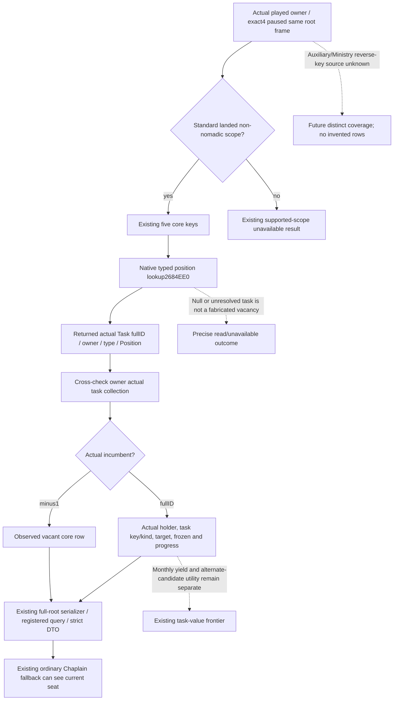

# Actual4 CampaignRoot core Council seats

Status: **SOURCE_READY / FIRST_NOTRUN**, source implementation only. This follows the
[ordinary Chaplain assignment source](chaplain-council-assignment-12004.md).
The current ordinary path requires a real root seat row; the existing
actual4 `ReadCouncilProjection` always returns `positions=[]` with
`actual4_council_position_key_source_unavailable`, including the supported
standard landed non-nomadic scope. That concrete production stub blocks
the otherwise implemented Chaplain fallback.

## Frozen native input tree

Independent source base: `bcacff1d2190cee9946f609bac8e5ba7fc5a45f6` at
`Z:/gbs-faith-m6-root-council`. Exact game identity is CK3
`1.20.0.4 / Steam25734779`, retained executable SHA-256
`98702F88A547CDE2EAF29A85F93B85F68EE4CF8148336A4F7AFAEB75319DD518`.
Native36's already handed-over child/Clergy/action composition is separate
and proceeds without waiting for this new readonly source increment.

The actual4 Council source proof, central required finite delivery and
typed-source join already close the following interfaces. This package
does not capture or hash the executable and does not read the unproved
raw `PositionType+18` key.

The retained evidence index is
`Z:/ck3_mod_rewrite_process_assets/g2-parallel-20261008/faith-g2-next/m6-root-council/native/RETAINED-FIELD-SOURCES.json`;
the typed provider ABI and current source join are in the adjacent
`PROVIDER-CONTRACT.json` and `NATIVE-SOURCE-TREE.md`.

| Closed input | Current use |
| --- | --- |
| Typed native lookup `2684EE0(owner Character*, std::string* requested key)` | Returns the actual task for the requested loaded core position; the key accepted by this native query supplies position identity. |
| Owner extension/list/count `1C0/230/23C`, task storage/full identity | Cross-check each returned task against the same owner's actual task collection and generation. |
| Task `10/18/40/44` and type Position `40` | Actual TaskID/type/incumbent/owner/Position relation; a missing task is not invented as an occupied seat. |
| TaskType key `18` | Separately closed task identity; this is distinct from the unproved PositionType key at the same numerical offset. |
| Task kind `48`, target tag/value `48/50`, frozen `39` | Actual general/county/court shape, real target and frozen state. |
| Progress kind `54`, current raw `20`, actual current/max evaluators `31AB500/31AB820`, scopes `40` | Actual infinite/percentage/value progress, not monthly yield or an ETA. |

The requested keys are exactly the existing standard root core keys:
Chancellor, Steward, Marshal, Spymaster and Court Chaplain. Native task
lookup and pointer/fullID consistency establish each emitted row; this is
not a fabricated dictionary of assumed seats. A returned task whose actual
incumbent is `-1` is an observed vacancy. A missing task or unresolved
identity is not converted into a fake vacancy or an arbitrary incumbent.
Auxiliary/Ministry positions and their vacancy completeness remain outside
this core coverage; `auxiliary_vacancies_complete=false` stays truthful.

## Source seam and qualification boundary

The previous CampaignRoot environment lacked the typed Council
position lookup provider slot. The implementation binds the already
closed actual4 function as a functional input and allows a fixture's
explicit same-signature synthetic callback. It must not reuse an unrelated
function slot, add a global setter or invoke an old image factory with an
actual4 identity. The actual4 environment derives from the existing shared
software base and adds only this typed provider; the historical base
environment is unchanged. Actual4 PopulateEnvironment and pointer
comparison install and admit the actual4 native entry. Wire schema, MCP
tool and ordinary consumer stay the same.

The occupied row projection reuses the deferred software reader after
replacing its Position raw-key read with typed requested-key/task identity.
Python's current root DTO and Service already admit all five core rows and
their seven seat fields. No additional policy gate, new action or permanent
null placeholder is needed. Existing focused non-Council fixtures that
provide explicit synthetic getter overrides but do not install this new
lookup retain their previous optional Council unavailable result. That
fixture seam is absent from production: the actual4 binder always installs
the independently mapped native lookup and production compares its pointer.

Root owns one new whole producer and one connected registered consumer
FIRST. The new fixture invokes the production Council reader and full-root
serializer once, producing `full-root-core-council.json`. Its scene covers
the five core seats, a genuine vacancy, an occupied Chaplain, and actual
general/court/county task shapes. The sole connected consumer ingests that
packet once through the production native driver and uses exactly two
registered MCP calls: root query, then one ordinary plan that reaches the
same-frame Chaplain row. Native engine objects/callbacks, non-Council root
DTO baseline and no-op candidate providers are explicitly synthetic. This
does not qualify the full CampaignRoot getter loop or a live game snapshot.
Candidate96de and actionbcac FIRSTs are not repeated. This worker executes
no Game, SDK, build, tests, production
imports, EXE reads or hashes. No appointment, new game day, M6 material or
G2 loop credit is claimed by this source work.
