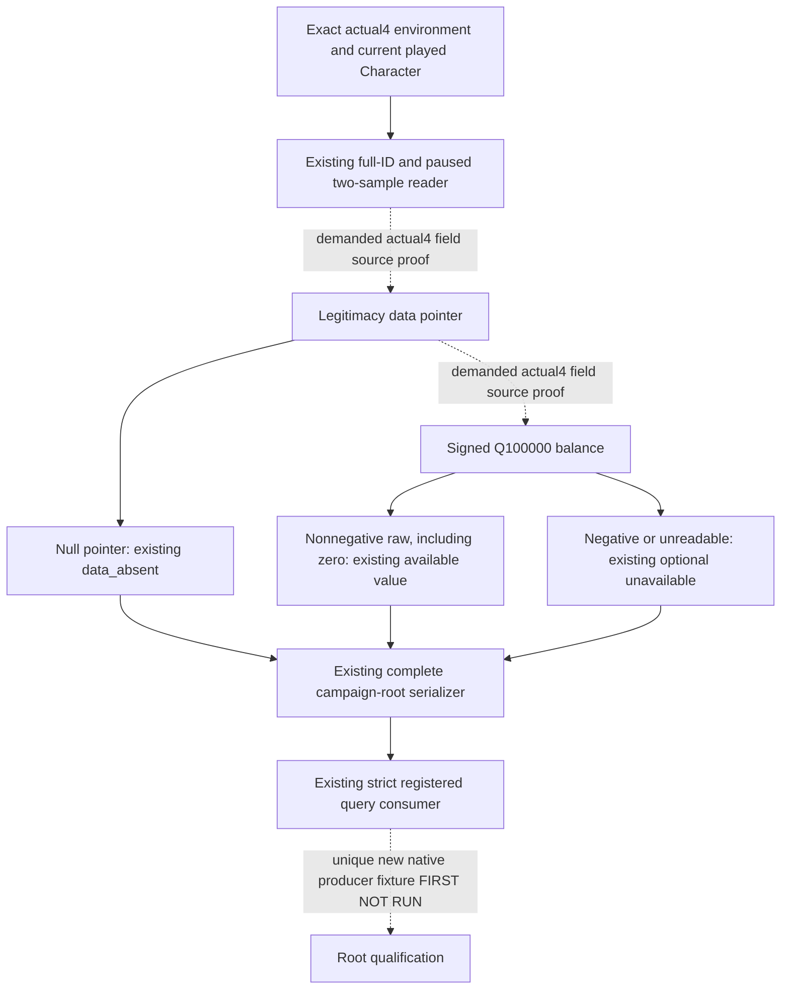
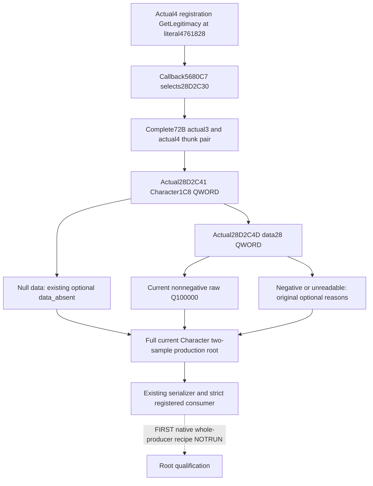

# CK3 1.20.0.4 current player legitimacy

This bounded migration restores the already published optional
`query-campaign-root-context-v1.player_legitimacy_v1` input. At source baseline
`337270d7700e514169d6fc55e121a3063c579e08`, the actual4 metrics producer always
returns `actual4_legitimacy_field_source_unavailable`. The existing family,
first-heir, held-title partition and complete realm projection are already
implemented and are reused; this packet does not migrate them again.

The target is CK3 `1.20.0.4`, Steam `25734779`, executable SHA
`98702F88A547CDE2EAF29A85F93B85F68EE4CF8148336A4F7AFAEB75319DD518`.
The installed-build freeze and existing migration metadata supply that pin.
No executable hash, whole-image scan, runtime or build is performed here.

The current software contract observes an already resolved played Character,
reads a legitimacy-data pointer and then its signed Q100000 balance, and
preserves four existing optional unavailable reasons. Missing material does
not erase the independently usable root. The outer production reader keeps
the current Character generation, paused frame, two observations and equality
checks; the serializer and strict Python consumer already accept positive and
legal zero balances.

Before native field proof is closed, the actual4 pointer and balance offsets
remain a source dependency. The historical `.2/.3` software offsets
`Character+0x1C8` and data `+0x28` are locators, not actual4 evidence. In
particular, the older `1.19.0.6` `Character+0x1C0` description is not a migration
substitute. Only a finite source-use witness can authorize the new read.

The source task reuses existing full-campaign-root and migration caches. New
source capture, if needed, is capped at 512 physical bytes and four exact
reads across both frozen images. The companion task authors one distinct
complete production-reader/serializer fixture and its unique FIRST recipe;
it executes no tests, imports or builds. The source/ABI receipt is sealed
before any production read is enabled.

Packet:
`Z:/ck3_mod_rewrite_process_assets/g2-migration-20261007/family-root-legitimacy/`.
Readiness at this initial source plan is `research`; neither actual4 field
closure, compiled native qualification, nor live material observation is
claimed. Root remains the sole central integrator, builder and runtime owner.

## Finite source closure before implementation

The actual4 reflection registration's name-copy window is `0x56809B`, 31
bytes. Its three actual RIP operands assemble 8+4+1 bytes from
`0x4761828`; the separately captured 13 bytes are exactly `GetLegitimacy`.
The actual callback LEA at `0x5680C7` selects `0x28D2C30`. Thus the selected
function is identified by its actual registration name and callback, rather
than by candidate ordinal alone.

The complete 72-byte actual3 thunk at `0x28D2C50` and complete 72-byte actual4
thunk at `0x28D2C30` normalize equally. The new thunk's `0x28D2C41` instruction
loads a QWORD from `Character+0x1C8`; `0x28D2C4D` loads the QWORD at data
`+0x28`. Their widths, signed checks and source order are preserved. The
existing `.2→.3` frozen source receipt supplies the reused registration
identity; no old native fixture qualification is borrowed. The new read uses
the current raw balance and preserves the published optional contract's
negative-value rejection instead of importing the native UI clamp.

Fresh physical source I/O is 195 bytes in five exact reads: old3 thunk72,
new4 thunk72, new4 callback7, new4 name-copy31 and new4 literal13. The initial
151-byte/three-read result closed the field operands but left the actual name
unread. The capture limit was amended before the final two necessary reads,
from 512 bytes/four reads to 512 bytes/five reads, solely to close this typed
identity. No previously captured bytes were reread. Reused source costs are
not recounted. Source receipts are in the packet's `source-proof/` directory.

## Production delivery and first qualification recipe

`ck3_12004_campaign.hpp` publishes the two actual4 field constants. The
existing `campaign_root_detail::ReadMetricsProjection` now reads the data
pointer and signed raw balance through its existing access helper. Positive
and zero values use the original Q100000 DTO; absent pointer, failed pointer
read, failed balance read and negative raw retain the original four optional
reasons. The outer complete reader compares this material together with its
two existing observations. No callback, initializer, action, new schema or
Python policy is introduced. Existing exact4 dispatch already reaches this
producer, serializer and strict registered query consumer.

The new fixture
`ck3_autonomous_player/native_bridge/tests/campaign_root_legitimacy_12004_fixture.cpp`
calls the genuine complete actual4 reader and serializer. It reuses only the
old fake-memory setup and callbacks, then adds five distinct whole-result
cases: positive8000000, valid zero, absent data, negative raw and changed
frame. The first four preserve identical root readiness; the changed frame
uses the existing unavailable clearing path. No old test case or copied
reader is invoked.

Root's sole central registration is
`include(cmake/campaign_root_legitimacy_12004_first.cmake)`. The new target is
`xar_campaign_root_legitimacy_12004_first_fixture`; its unique CTest is
`xar_campaign_root_legitimacy_12004_first`. The wire directory is
`${CMAKE_CURRENT_BINARY_DIR}/fixtures/campaign_root_legitimacy_12004_first`,
containing `positive.json`, `zero.json`, `absent-data.json`,
`negative-raw.json`, `changed-frame.json` and a separate offline producer
manifest. The [FIRST recipe](Z:/ck3_mod_rewrite_process_assets/g2-migration-20261007/family-root-legitimacy/strict-producer/FIRST-RECIPE.md)
requires Root's full intended DLL/runtime and this target to share the same
clean fresh strict source/build pin before the unique new CTest and actual
registered-consumer qualification. This worker has run no import, fixture,
test or build; all FIRST stages remain `AUTHORED_NOTRUN`.

This field's source dependency is closed and its production implementation is
delivered. Remaining work is Root integration, first native/whole-wire
consumer qualification and an actual paused current-value observation.
Unrelated optional Council PositionType key evidence and rare no-Province
county-subtype evidence remain separate source entries in the
[complete-root topic](ck3-1.20.0.4-full-campaign-root.md). This packet makes no
new family decision, natural succession, stock-effect attribution or campaign
outcome claim.
