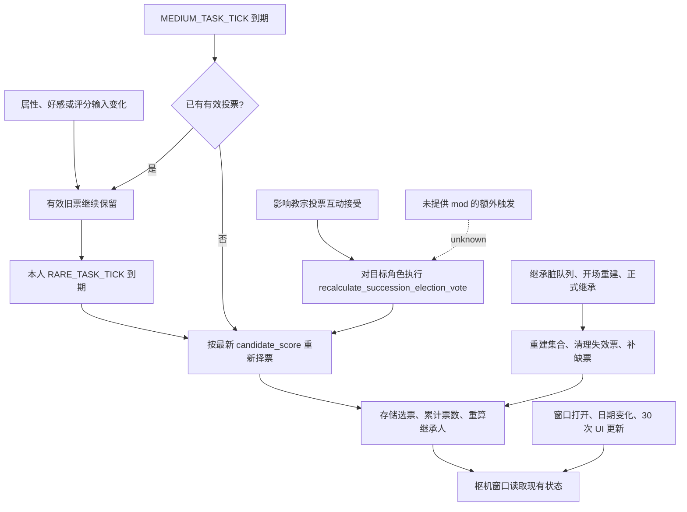

# CK3 1.20.0.3：教宗继承与枢机投票刷新

> 2026-10-10 主线整合：恢复来源提交 `2b9498a8f2dcf5ffb0d0506d1117616d3b70921b` 的研究。下文“当前”均指原调查时的构建与样本；没有新增实机验收，也没有把结论外推到 CK3 1.20.0.4。文中外置原始路径是历史定位，本次未重新读取那些原件。

状态：`research / static-confirmed`；2026-10-06 当前构建脚本与二进制调查，未启动游戏，未做 live 计时。普通投票、补票、互动即时重算、继承计票和窗口显示调用链已静态闭合；未将任务调度负载换算成实测延迟。调查在补录计划会前已经开始。

## 构建与证据

- 实际安装：`Z:\SteamLibrary\steamapps\common\Crusader Kings III`，版本 `1.20.0.3`。
- 当前 EXE SHA-256：`94B55397ABB687A3DCD436805A5D885E6BE90FA6C693FEB44A9E3BBEEADE02A6`，已与 10 月 5 日冻结副本核对一致。
- 本机只读调查目录：`artifacts/investigations/2026-10-06/cardinal-election-refresh/`；复用 10 月 5 日冻结 EXE，不提交游戏二进制或完整私人存档。
- 可随 Git 回查的[摘录与反汇编证据](evidence/cardinal-election-refresh-1.20.0.3.json)记录源文件哈希、关键 RVA 和指令。不是 live artifact。
- 下文地址全部为该 EXE 的 RVA。镜像基址 `0x140000000`；原始 Capstone 输出中的跳转目标含基址。

## 已确认：投票是保存的状态

`CSuccessionElectionState` 的候选人数组为 `+0x10/+0x1C`，选举人数组为 `+0x28/+0x34`，已投选票数组为 `+0x40/+0x4C`。选票行长 `0x0C`，内容为选举人 CharacterID、候选人 CharacterID、票重。

- RVA `0x2740D60` 将候选人、选举人与选票写入序列化器；`0x2740D00` 对应读入。
- RVA `0x2743AC0` 从已存选票累计支持者与票数。它不是对所有枢机的最新属性重新执行择票评分。
- RVA `0x17B9A10` 的枢机窗口刷新调用该统计函数，并从现有选举状态填充界面。

因此最新候选人属性、最新评分说明与旧的支持票，可以同时出现在界面里。关闭重开窗口只刷新视图，不等于全体枢机重新择票。

`00_pam_clerical_elective.txt` 的 `candidate_policy = one_candidate_per_set` 先按虔诚派、平民派、强权派三组 priority 选出候选人；各枢机投谁则另外使用 `candidate_score`。候选人优先级、个人投票偏好与已存票数是不同数据，不能用其中一个数值的变化推定另外两者已经更新。

## 已确认：正常重新择票与补票是两条路径

RVA `0x1AA9460` 共用处理选举，首参数决定是否仅处理空票。

- 正常重新择票：`0x19E8780` 在 `0x19E8A90` 以 `CL=0` 调用它；结束时 `0x19E8AEF` 从 `RVA 0x5449D90` 的数组读本角色层级间隔，写入 AI 数据 `+0x284`。注册读出函数 `0x1A3DBA0` 将同一地址绑定到字符串 `RARE_TASK_TICK`。
- 补票：`0x1A31460` 在 `0x1A314A4` 以 `CL=1` 调用它；结束时 `0x1A314EC` 从 `RVA 0x5449D10` 的数组读取间隔，写入 AI 数据 `+0x27C`。注册函数 `0x1A3DA00` 将同一地址绑定到 `MEDIUM_TASK_TICK`。
- `CL=1` 时 `0x1AA9575`–`0x1AA95BD` 搜索现有选票；候选人 ID 不为 `-1` 则直接跳过。这条检查不会因为别人的评分提高就替换一张有效旧票。
- `0x19EA5E0` 的 `0x19EA740` 每次推进将各 AI 任务倒计时减一；`0x19E7E64` 的初始化按角色 ID 与任务序号错开首轮倒计时，而不是每月一号全体同步。

原版 `game/common/defines/ai/00_ai.txt` 的顺序为无地、男爵、伯爵、公爵、国王、皇帝、霸主：

| 选举人最高层级 | 正常重新择票 RARE_TASK_TICK | 空票检查 MEDIUM_TASK_TICK |
|---|---:|---:|
| 伯爵 | 360 天 | 60 天 |
| 公爵 | 180 天 | 30 天 |
| 国王 | 180 天 | 30 天 |
| 皇帝 | 180 天 | 30 天 |
| 霸主 | 180 天 | 30 天 |

原始配置还列出无地 `180/30`、男爵 `720/180`；但 `0x1AA9486/0x1AA9490` 的 AI 入口排除玩家和低于伯爵层级的角色，故不能直接把这两行当成有效 AI 选举人的投票周期。玩家票通过手动投票命令改变，不由这条 AI 周期替换。

枢机席位是 `d_cd_*` 公爵头衔，因此正常有席位的 AI 枢机使用 **180 游戏日** 的常规重新择票间隔，**30 游戏日**检查缺票。间隔按选举人本人层级；RVA `0x28AC6B0` 为层级 getter。

初始化公式为 `((taskIndex * 101 + CharacterID) % interval) + 1`；RARE 的 taskIndex 为 3。任务执行结束后重新装入当前层级的间隔，不按固定月初、年初或共同选举日同步。`0x1A30A53`–`0x1A30AAA` 将倒计时 `<= 0` 的任务纳入待处理集合，负计时还参与 stale 判断；随后 `0x1A30B15`–`0x1A30CEE` 按任务组负载预算选择执行者。因此 **180 日是正常任务重置值，不是承诺第 180 日全体同时改票**，也不是六个日历月。

到期只表示重新评估：`0x288F7D0 -> 0x2742CF0` 按最新 `candidate_score` 比较候选人；最高评分并列时优先保留原支持者，否则按调用传入的随机种子选择。新选择与旧票相同则不提交换票，因此有时过了一个周期仍看不到票数变化。

## 已确认：影响教宗投票互动有即时例外

`game/common/character_interactions/pam_interactions.txt:14327` 起，互动接受后在目标枢机上设置 `pam_forced_papal_vote_target`（20 年），随后执行：

```text
hidden_effect = {
    recalculate_succession_election_vote = yes
}
```

源码注释明确说明不等待下次 AI tick，立即更新视图。原生 effect 执行函数 `0x2CCBC40` 遍历该角色参与的选举，调用 `0x288F7D0` 重新择票并提交；后续 `0x2CCBB60` 置继承管理器的更新标记，再调用 `0x2A69580` 清空待更新队列。

注意该 effect 是对作用域角色重算其参与的选举，并不是全体枢机一起刷新。

## 候选人、失效票与继承顺位

继承管理器收到状态更新时执行 `0x2A687F0 -> 0x27413E0 -> 0x2741C50/0x2741F60/0x27423B0`，重建候选人和选举人；随后 `0x2741750` 补齐选票。具体行为：

1. 选举人不再属于当前集合：移除其票；候选人不再属于当前集合：将该票目标置 `-1`（`0x2742450`–`0x2742543`）。
2. 票重按照最新 `elector_vote_strength` 重算（`0x2742546`–`0x2742651`）。本选举的基础票重为 1。
3. `0x2741750` 从需要补票的选举人集合中剔除已经有有效旧票的角色，再对剩余 AI 调用评分选票。新选举人、已失效的旧票可因此提前补投；有效旧票不因为发生重建而全部重投。

调用入口包括开局/读档重建（`0x229F110 -> 0x28FBCF0 -> 0x2A669C0`，源字符串为 `Start characters from bookmark`；`0x22A23D0` 为开场更新）、头衔/法律变化的继承脏队列、实际换票和显式 effect。`CSuccessionManager` 的 manager update `0x2A67FC0` 清空队列，`0x2A69580 -> 0x2A687F0` 处理其中的角色。开局代码中的月度 cohort 分组不能作为“全体枢机每月重投”的证据。

正式继承链 `0x278D510` 在 `0x278D784` 先重算旧持有人的继承状态，再于 `0x278D859` 调用 `ExecuteSuccessionWithTheocracyLeaseFreeze`（`0x2789F90`，原生函数名字来自埋入 EXE 的字符串）。重算仍走上述保留有效票/补失效票逻辑。选举继承分支 `0x273B2CC -> 0x27438C0` 将 **已存票行的票重相加**并排序为继承候选顺序，没有调用个人投票评分函数 `0x2742CF0`。

因此，正常继承流程会重新确认可用候选、补失效票并计算结果，不能理解成“教宗一死，全体枢机按死亡瞬间评分重新投票”。脚本或 mod 若显式执行重算 effect、改变候选资格或选举法，另按其实际调用处理；本次没有穷举用户未提供的全部 mod 代码。

## 枢机窗口的显示刷新

`CCardinalsWindow` 虚表 `RVA 0x4590FF0`：打开回调 `0x17B9930` 立即刷新；UI update 经 `0xB1F0A0` 转入 `0x17B99E0`，将窗口 `+0x318` 计数加一，到 **30 次界面更新**调用 `0x17B9A10` 并清零；日期改变回调 `0x17B9A00` 也立即刷新。

调用者 `CInGameInterfaceHandler` 的更新函数 `0xAF0340` 在 `0xAF0E0D` 调用可见窗口的虚表 `+0x58`（UI update），在 `0xAF0E10` 比较前后游戏日期，不同则于 `0xAF0E1B` 调用 `+0x68`（日期改变）。因此窗口中的 **30 是界面更新次数，不是 30 游戏日，也未实测换算为秒数**。日期推进和重开窗口只触发显示读取，不能强制全部 AI 换票；暂停时日计时不推进。

## 玩家能观察到的行为

- 通过好感、属性或其他评分输入让某候选更受支持：有效旧票可能保留到该枢机的下一次 RARE 任务；通常剩余等待落在其个人周期内，另受排队影响。
- 接受“影响教宗投票”互动：目标枢机立即重算；其他枢机保留自己的票。
- 候选人失去资格或新角色进入选举：继承状态重建时清理/补票，可早于正常 180 日。
- 窗口分数和票数不同步、过月没有整齐变化：符合保存选票和错峰任务机制，单凭这一现象不能判定故障。

适用前提是头衔实际具有 `theocratic_elective` 选举。本轮为机制调查，不把先前 960 年存档中缺失选举法的教宗头衔当成有效选举的计时样本。

## 旧票会不会让已经不合法的候选人继承？

会保留较早投下的票，但“当前评分已不领先”和“已经不在合法候选集合里”须区分。正常继承重建后，仍属于候选集合的人可以靠旧票当选，即使现在另一人的 `candidate_score` 更高；已经被当前候选重建排除的人，其票会在 `0x2742508`–`0x2742539` 被置空，补票后不按原来票数取得选举顺位。

例如甲得到多数票后，乙的评分超过甲：甲仍在三派候选集合中，旧多数票可能使甲当选。若甲已经被三派候选重建排除（包括失去候选资格或被新的组内人选替代），原来投甲的票需要重新补投。**过时的偏好不等于过时的资格**。静态调用链支持这一正常行为；没有提供的不合法继承复现、其他 mod 的自定义移交或法则覆盖，不能从上述缓存机制直接诊断为原版漏洞。


