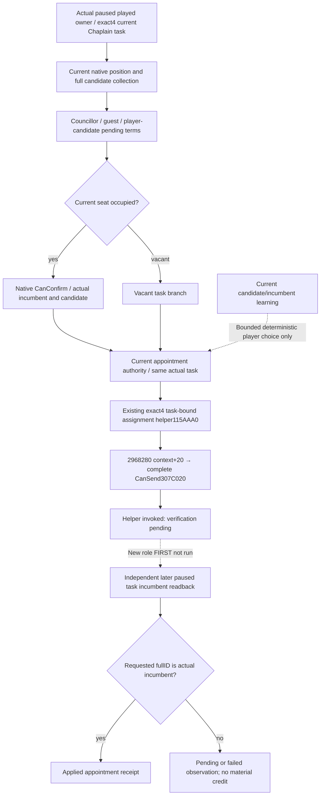

# Ordinary player Chaplain assignment on the existing Council route

Status: **SOURCE_READY / FIRST_NOTRUN**, research source only. This package follows the
actual4 [candidate terms source closure](clergy-candidate-terms-12004-source-closure.md)
and closes the next functional seam: the existing Council appointment request
and independent incumbent receipt do not admit Chaplain. It does not rerun
candidate fixtures, change religious doctrine or infer a result from command ACK.

## Frozen input ledger

The independent source base is `96de2f3b70805ae3a8a2c81cabf0c9b2d233ca06`,
whose retained actual4 base is `6ee7dea1b4d2fa4ecb05223f12c66b7afe72ac2d`.
The exact game identity is CK3 `1.20.0.4 / Steam25734779`, retained executable
SHA-256 `98702F88A547CDE2EAF29A85F93B85F68EE4CF8148336A4F7AFAEB75319DD518`.
This worker does not read or hash the executable. Root's Native34 Stop and
Native35 Release increments remain separate; their qualification does not
qualify this new action role.

The exact4 retained entries are indexed by the original
[Council candidate source proof](Z:/ck3_mod_rewrite_process_assets/g2-migration-20261007/council-government/native-candidates/SOURCE-PROOF.json),
[gate/assignment ABI](Z:/ck3_mod_rewrite_process_assets/g2-migration-20261007/council-government/native-gates-assign/ACTUAL-ABI.json)
and the new source-only
[retained native proof manifest](Z:/ck3_mod_rewrite_process_assets/g2-parallel-20261008/faith-g2-next/m6-chaplain-action/native/RETAINED-NATIVE-PROOF.json).
The final validator's complete mapped `CanSend307C020` body is already held
in the existing context-validator cache; it is not reread for this package.

The stock input ledger is retained in the
[realm-priest native tree](religion-realm-priest-council-native-ai-12003.md),
[Clergy permission tree](religion-clergy-council-native-ai-12003.md),
[actual4 Clergy migration](religion-clergy-appointment-12004-migration.md)
and [task-bound Council assignment chain](ck3-1.20.0.2-council-assignment.md).
The historical stock line windows describe the rule inputs, while this
package consumes current loaded exact4 native predicates. It does not relabel
the historical authored stock snapshots as freshly captured actual4 files.

Ordinary `councillor_court_chaplain` uses `learning`, a clergy pool and
`inherit=no`. Position and candidate rules include ordinary councillor
availability, actual clergy gender and **same Rite**, with separate Ministry
and temporal/theocratic branches. Appointment authority includes
`can_appoint_own_court_chaplain_trigger`; current seat, `can_fire`,
`can_reassign`, `can_change_once` and auto-fill have different branches.
Python does not implement these authored religious conditions. Learning is
a useful bounded comparison, not a complete native AI utility or authority
to replace the incumbent.

## Existing exact4 sources and current gap

| Current source | Retained behavior and seam |
| --- | --- |
| `ck3_12004_council_candidates` | Actual position lookup, owner task/fullID and candidate collection; Chaplain composition already maps learning to `Character+E8`. |
| `ck3_12004_council_gates` | Current councillor/guest/pending terms and occupied-seat `CanConfirm`; assignment role admission still excludes Chaplain at the source base. |
| `ck3_12004_council_assign` | Exact4 helper `115AAA0(candidate CharacterID, actual TaskID)` and generic typed transaction. The source-base role adapter selects Chancellor or Steward only. |
| Current exact4 command validator | Retained mapped `2968280` passes the embedded interaction context at `RCX+20` to complete native `CanSend307C020`; this remains the final loaded appointment authority, including the actual Chaplain task's rules. |
| `ck3_12004_council_action_runtime` | Actual current task and incumbent capture, recheck of current candidate collection and gates, generic helper ACK, retained pending identity and independent later incumbent readback. |
| Python Council contract and ordinary consumer | Existing request/ACK/receipt and selected-seat policy support Steward/Chancellor; Chaplain is not a complete action merely because its observation is available. |

The existing command helper is task-bound. It derives the current player,
constructs the native interaction context with the actual Council TaskID,
and retains native command-time validation. Request-time checks do not
replace that validator. The exact4 command validator `2968280` passes its
embedded context at `RCX+20` to complete native `CanSend307C020`. The occupied
route additionally evaluates candidate-specific `CanConfirm11604A0` against
the actual current incumbent; the vacant route uses the same task-bound
command and validator. The source does not replace these final loaded rules
with a guessed `CanAppoint` boolean or a new `CanReassign && CanFire` conjunction.
Its void return means only
`native_helper_invoked_verification_pending`; it does not prove that the
engine accepted the queued command or that an incumbent changed.

The existing independent receipt captures the same actual position/task on
a distinct later paused frame, resolves the full incumbent ID, and succeeds
only when the requested candidate is observed as incumbent. The previous
incumbent, owner and task remain bound to the original request. An unchanged
seat or a command ACK alone is not an applied appointment.

The appointment-authority edge is already tied to the mapped exact4 final
native command route. Missing native entries: **0**; new executable capture
budget: **0 bytes / 0 reads**. The existing paused owner/task and candidate
rechecks remain on the same typed transaction, and the engine consumes the
actual task's current religious rules when the command executes. This is
source closure, not a claim that the current Robert seat is changeable.

The source change is limited to explicit Chaplain role admission in the
actual4 gate and assignment adapters, plus the existing Python request,
receipt and skill selector. The mailbox/action transaction and independent
native receipt are reused unchanged. The same candidate fullID must remain
in the current native collection immediately before submit; owner always
comes from the played character and actual task, not from another AI actor.
There is no new feature flag, MCP method or standalone religious command.

## Ordinary player behavior and evidence boundary

The minimum action source uses the existing selected-seat request,
ordinary Council action route and independent incumbent receipt. Candidate
learning may select an actual strictly better eligible alternative after
native permission is available. It does not add guest recruitment,
councillor swapping or player control of AI characters. The current Robert
claim war remains the planner's priority; this package does not declare a
new war or grant a second autonomous actor.

The existing ordinary Service hook still calls Council only when the
original planner selected `life-advance`. The consumer first resolves its
existing pending receipt and existing Steward/Chancellor opportunity.
When those do not select an action and a fresh actual root Chaplain seat
row exists, it queries the same current-build final-gates route for
Chaplain. A vacancy uses one observed legal candidate; an occupied seat
requires a strictly higher observed learning value and the actual native
final terms. No root seat row means no guessed replacement target. The
same pending/applied ledger and independent next-turn holder observation
consume the result; the Service and native action mailbox are unchanged.

The new role has one authored whole source-chain producer with four scenes:
occupied-applied, vacant-applied, occupied-confirm-denied and
helper-pending-seat-unchanged. It emits four actual query envelopes, four
typed ACK envelopes and three independent later receipt envelopes. Engine
memory/callbacks and delayed incumbent delivery are explicitly synthetic.
The actual4 Core/candidate/gate/action/mailbox/pump/serializer functions
are real production code with no replacement definitions. The production
finite control parser runs; the full static bridge worker handler is
retained by source, rather than claimed as fixture executed. Engine
`CanSend` and queue acceptance are not observed in that fixture.

One authored registered-MCP compound consumes those whole bytes through
the actual NativeDriver, private transport, NativeProtocolState and strict
contract, with caller setup declared separately. It covers native denial,
helper-only pending and independent later seat identity. The
previous candidate/base/county/Holy GREEN evidence is retained directly.
Its two ordinary-plan calls also demonstrate that real Service/consumer
source reaches the Chaplain fallback from a declared synthetic S/C no-op
baseline, while a selected current-war action keeps priority. The normal
baseline chooser, current root seat and S/C no-op providers are synthetic;
the Chaplain query remains the original compiled actual4 whole packet.
There is no repaired or renamed S/C native packet and no normal action
execution in that fixture plan call.
Only Root executes the new build/producer/registered consumer and later
fresh original Robert paused opportunity. The worker performs no Game,
SDK, build, tests, production imports, executable reads or hashes.

No current appointment, game day, M6 material or G2 completion credit is
claimed. Actual task dispatch/assignment is distinct from replacing the
incumbent and from completion of county conversion. Religious-relations
task value, alternative candidate evaluated yield and task-side effects
retain their own existing native-input frontiers.
