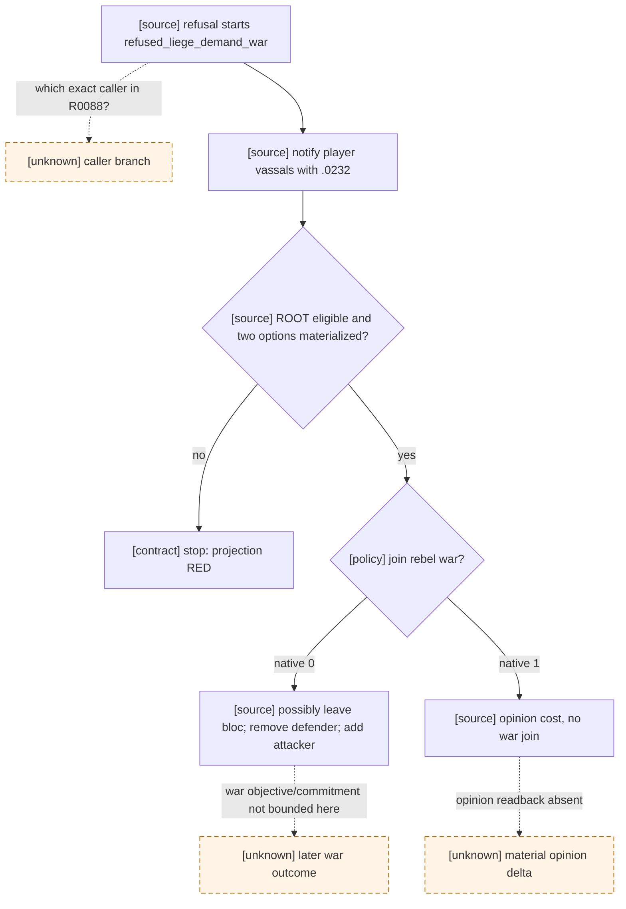

# `char_interaction.0232`: rebel call to an imprisonment war

## Exact-build native decision tree

CK3 `1.19.0.6`, `binaries/ck3.exe` SHA-256
`2D00FF3101EF70B566F2FCBAE292F09263199C80E9DC8F139B82D7D96F83DB86`.
`game/events/interaction_events/character_interaction_events.txt` SHA-256
`D238E0A3442F41C35AF35157D47A754CB200B72AB2A0184BAEFC86E63347A150`,
lines 1677-1784, defines the `letter_event`. `game/common/scripted_effects/00_interaction_effects.txt`
SHA-256 `7B426465FCED71A6D6AA96B34C8924B91990D0BE144FE4BFAA57681BB7FA6EA5`
calls it at lines 895, 1362 and 1528 after an imprisonment/retraction refusal
creates a `refused_liege_demand_war`. Each caller sends it to player vassals of
the liege; the precise caller used by R0088 is not established.

The event trigger excludes the rebel as ROOT, requires ROOT not imprisoned,
and adds a house-bloc leader condition only if the TGP confederation condition
holds. Its immediate block only handles a possible ceremonial regent. Option
`.a` (authored 1/native 0) may leave that bloc; it removes ROOT from the
liege's side if already participating, then calls ROOT and adds ROOT as an
attacker in the rebel's `refused_liege_demand_war`, and grants the rebel an
opinion modifier. Option `.b` (authored 2/native 1) only grants the rebel
`sided_with_tyrant_opinion` toward ROOT; it does not join the war. These
source effects are not interchangeable. There is no source `ai_chance` block
inside this event that establishes a preferred option.

## R0088 production observation and bounded counter-policy

The frozen R0088 formal report is
`Z:\ck3_mod_rewrite_process_assets\g2-first-1066-r0088-warhold-red-20260922\formal-report.txt`;
the same-root post-RED driver is **observation only**, not paired to the safe
checkpoint. At `command_history[393]` (row index 394), paused `native:10`,
date_raw `53349960`, the native window identifies `char_interaction.0232`,
instance 19, calculated ID 3670232, ROOT/player 36403, actor 38609 and
recipient 39146. It shows exactly two enabled rows, native 0 and 1. The
secondary-character identities are unavailable and the Boolean scopes are
opaque. Both effect previews are incomplete and empty; empty indicators do
not mean no effect. The unregistered key led the formal turn 6 policy to
`active_event_degraded_minimal_choice`, authored 1/native 0. A war appears in
a later frame, but that observation alone does not prove its complete cause
or a durable campaign outcome; this post-checkpoint tail was discarded.
The R0088 evidence addendum SHA-256 is
`4FF8060EE30197096BD311FE4D64AFE7DA83F3EF4EB03419CB7AA7896A505B15`.
This is **not** `epidemic_events.1100`; instance 19 was reused after restore.

For standard-feudal bounded continuation, joining a rebel's war with an
unobserved objective and long commitment is not a safe default. The smallest
source-pinned choice for this exact two-option projection is native 1, accepting
the explicit rebel-opinion cost while not joining that war. Other projection
shapes must stop rather than take the first visible option. A focused replay
must show formal semantic selection, one typed submission, an independent
paused frame with old instance absent, next-turn consumption, and no new
player war membership attributable to this option. Without a read-only
opinion modifier/result query, event disappearance alone proves only narrow
modal closure, not the material opinion effect, G2-M2, or overall war quality.
The R0088 live RED remains open until that focused replay; this work does not
change native ABI, MCP/public capability advertising, or open_kaishek protocol.
The shared vanilla-event knowledge registry and exact-build source index now
expose this source/choice contract to read-only consumers; the latter indexes
the three lexical caller candidates but does not claim which edge ran in R0088.
