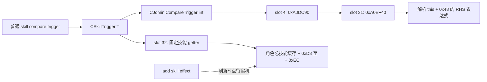

# 角色技能 trigger 与属性转移读回：CK3 1.20.0.3

2026-10-04。状态：**精确构建离线 RTTI／反汇编研究**。来源是《超人强》独立模组的技能转移施工；结论可用于其他 mod 的技能增减与验收设计。本页没有启动 CK3，没有实机证明技能缓存刷新时点，也没有给任何模组授予验收通过信用。

## 已确认的读取路径

普通 `diplomacy`、`martial`、`stewardship`、`intrigue`、`learning`、`prowess` 条件读取角色的**总技能缓存**。本次解析的原生 getter 路径没有读取基础技能的分支，也没有根据 `base`／`source` 参数切换来源。

这不等于证明全游戏不存在其他基础值接口。当前可以确定的是：不能凭 `base_diplomacy` 猜名，或凭 `diplomacy = { base = yes ... }` 猜参数，就把基础技能读取写进生产合同。普通技能比较的右侧能接受表达式，不会由此把左侧改成基础技能。

## 输入及证据身份

| 输入 | 冻结身份 |
| --- | --- |
| 游戏 | CK3 1.20.0.3（Crozier） |
| Steam build | `25652598` |
| EXE | `C:/SteamLibrary/steamapps/common/Crusader Kings III/binaries/ck3.exe` |
| EXE SHA-256 | `94b55397abb687a3dcd436805a5d885e6be90fa6c693feb44a9e3bbeeade02a6` |
| 方法 | 只读 EXE、MSVC x64 RTTI CompleteObjectLocator／class hierarchy／vtable 与 Capstone 反汇编；未访问游戏进程 |
| 原版源码入口 | [性经验与属性吸取可行性分析](../sex-experience-attribute-drain-feasibility-1.20.0.3.md)中的同一构建身份及源码搜索 |

以下地址均为该 EXE 的 **RVA**，不把历史 1.19 或 1.20.0.2 的地址外推到本构建。图中只有离线已经解析的边使用实线。



## 六项技能的实际 getter

RTTI class hierarchy 的共同路径是 `CSkillTrigger<T>` → `CJominiCompareTrigger<int>` → `CCompareValueTrigger` → `CJominiTrigger`，另有 `CSkillTriggerBase`。CompleteObjectLocator 中的 type descriptor 与 primary vtable 对应已逐项解析；没有把相邻 vtable 的 COL 指针当作函数槽。

| 技能／枚举 | RTTI 名称 | Type descriptor RVA | Primary vtable RVA | Slot 32 getter RVA | 角色缓存偏移 |
| --- | --- | --- | --- | --- | --- |
| 外交／0 | `.?AV?$CSkillTrigger@$0A@@@` | `0x5A5AA90` | `0x47EFAF0` | `0x2B68640` | `+0xD8` |
| 军事／1 | `.?AV?$CSkillTrigger@$00@@` | `0x5A5AAF0` | `0x47EF230` | `0x2B68720` | `+0xDC` |
| 管理／2 | `.?AV?$CSkillTrigger@$01@@` | `0x5A5AAC0` | `0x47EF590` | `0x2B68790` | `+0xE0` |
| 谋略／3 | `.?AV?$CSkillTrigger@$02@@` | `0x5A5AA60` | `0x47EF350` | `0x2B686B0` | `+0xE4` |
| 学识／4 | `.?AV?$CSkillTrigger@$03@@` | `0x5A5ACC8` | `0x47EF470` | `0x2B68800` | `+0xE8` |
| 勇武／5 | `.?AV?$CSkillTrigger@$04@@` | `0x5A5AC98` | `0x47F06C0` | `0x2B68870` | `+0xEC` |

外交 getter 从输入 scope 的 kind `4` 取得角色 FullID，检查数据库 row 及 `character + 0x18` identity。成功解析角色后，已观察到的返回指令为：

```text
RVA 0x2B6869B  8B 82 D8 00 00 00  mov eax, dword ptr [rdx + 0xD8]
RVA 0x2B686A1  C3                 ret
```

数据库不在或角色解析失败的 fallback 也直接从默认角色的同一偏移读取。其余技能的 getter 同形，固定改用表内对应偏移。这条路径没有取 `this` 上的来源选择字段，没有读取基础值数组，也没有当场计算 trait／modifier 分解。

上述成功解析分支指令摘录来自本次已经完成的 `selected-disassemblies.txt` 输出观察；最终保全的同名文件保存的是随后定位的共同 RHS parser，**不把最终 parser 文件 hash 冒充成功解析分支的完整转储 hash**。六项 slot 身份及固定偏移仍由保全的 `contracts.json` 与 `rtti-and-disassembly.txt` 交叉绑定。

## RHS 解析的已证实边界

六项 trigger 共用 vtable slot 4 的 `0xA0DC90`，该函数跳转到 `vtable + 0xF8`，即 slot 31 的 `0xA0EF40`。后者取 `this + 0x48` 的 RHS 对象并调用其虚方法 `+0x18`，随后处理 comparator；本次解析到的函数正文没有读取技能 `base`／`source` 选项。

这证明的是**已解析 compare 路径中，左侧是固定缓存 getter，右侧走数值表达式解析**。本次没有完全穷尽 RHS 表达式 parser 的全部子语法，不能扩大成“所有嵌套 block 一律不支持”，也不能扩大成“全部原生接口已证明不存在基础值”。EXE 带有 skill 差值形式的说明，列出 `target`、`value` 与可选 `abs`；这不是新增 `base = yes` 参数的依据。

GUI 的 `GetSkill`／`GetSkillWithLevel` 名称及 ruler designer 的 `BASE_SKILL` 本地化也不能证明有可供普通 scripted value 使用的基础值 getter。本页不发布这种接口。

## 属性转移验收的可复用结论

`diplomacy > 0` 等面板／总技能条件不能独立证明基础点可扣。基础值为零但 trait 提供正修正，和基础值为正但负修正把面板压到零，应分别作为实机用例；同一项技能必须读取来源者与接收者的基础值、总值及本次增减，不能只凭双方总和守恒就判定完成。

若实现采用“先减点探测、再恢复”的候选检测，必须证明 `add_*_skill` 后同 effect 内的缓存读取已经反映改变。这里的 native getter 只读缓存，所以离线反汇编不能代替刷新时点验收。还须证明未被随机选中的五项属性在探测结束后完全不变。必要时把 effect 内采样和独立后续事件／paused native snapshot 的读数同时保存，明确哪个时间点是有效业务后置。

当前仍待对应 fresh live 的边界为：基础属性的真实下限／接收者上限、零值和负修正遮蔽、同 effect 与跨 effect 的缓存刷新，以及 temporary scope value 写后读是否能支撑候选判断。不得用本页的离线研究把这些门槛标 GREEN，也不得把《超人强》的未来验收结果自动外推到所有 mod。

## 原始证据与 SHA 索引

永久索引：[character-skill-trigger-readback-1.20.0.3-2026-10-04.evidence.json](character-skill-trigger-readback-1.20.0.3-2026-10-04.evidence.json)。原始文件外置保全，未把 EXE 或游戏完整源文件复制入仓库。

| 既有证据 | 字节数 | SHA-256 |
| --- | --- | --- |
| [RTTI／slot 合同](D:/ck3-superman-skill-trigger-readonly-20261004/contracts.json) | `7170` | `19b9b1ae2a585310e0c20c2a8ba8c563e45e145610f62f92b191d66e94cec1e1` |
| [RTTI 与 getter 转储](D:/ck3-superman-skill-trigger-readonly-20261004/rtti-and-disassembly.txt) | `114891` | `cd4d1a7ed7a7a03af8e25a5d601ca0f8d23913b0c89abf7fe3e62674f7b27841` |
| [共同 RHS parser 转储](D:/ck3-superman-skill-trigger-readonly-20261004/selected-disassemblies.txt) | `6761` | `972af2745819dee29bc64bf6294a24c95dc1b051da201dcbf712bfdc309238cb` |
| [只读提取脚本](D:/ck3-superman-skill-trigger-readonly-20261004.py) | `4862` | `5da1a0f7c635a01fdc1698cfd96194ff1b4e9703bf0080889db0591d3aacfb17` |

本次永久化只归档、校验和描述已有结果，没有重新运行 EXE 研究，也没有新增游戏进程观测。
