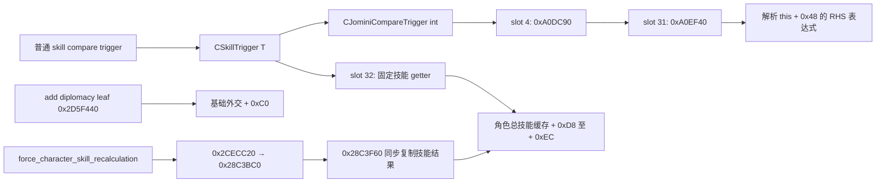

# 角色技能 trigger 与属性转移读回：CK3 1.20.0.3

2026-10-04。状态：**精确构建离线 RTTI／反汇编研究，另附 R0006 原生存档确认的修复前 RED**。来源是《超人强》独立模组的技能转移施工；结论可用于其他 mod 的技能增减与验收设计。提取脚本没有启动 CK3；实机存档由独立验收流程取得。增加强制刷新后的生产版本仍须重新实机验收。

## 已确认的读取路径

普通 `diplomacy`、`martial`、`stewardship`、`intrigue`、`learning`、`prowess` 条件读取角色的**总技能缓存**。本次解析的原生 getter 路径没有读取基础技能的分支，也没有根据 `base`／`source` 参数切换来源。

这不等于证明全游戏不存在其他基础值接口。当前可以确定的是：不能凭 `base_diplomacy` 猜名，或凭 `diplomacy = { base = yes ... }` 猜参数，就把基础技能读取写进生产合同。普通技能比较的右侧能接受表达式，不会由此把左侧改成基础技能。

## 输入及证据身份

| 输入 | 冻结身份 |
| --- | --- |
| 游戏 | CK3 1.20.0.3（Crozier） |
| Steam build | `25652598` |
| EXE | `C:/SteamLibrary/steamapps/common/Crusader Kings III/binaries/ck3.exe` |
| EXE SHA-256 | `94b55397abb687a3dcd436805a5d885e6be90fa6c693feb44a9e3bbeeade02a6` |
| 方法 | 只读 EXE、MSVC x64 RTTI CompleteObjectLocator／class hierarchy／vtable 与 Capstone 反汇编；未访问游戏进程 |
| 原版源码入口 | [性经验与属性吸取可行性分析](../sex-experience-attribute-drain-feasibility-1.20.0.3.md)中的同一构建身份及源码搜索 |

以下地址均为该 EXE 的 **RVA**，不把历史 1.19 或 1.20.0.2 的地址外推到本构建。图中只有离线已经解析的边使用实线。



## 六项技能的实际 getter

RTTI class hierarchy 的共同路径是 `CSkillTrigger<T>` → `CJominiCompareTrigger<int>` → `CCompareValueTrigger` → `CJominiTrigger`，另有 `CSkillTriggerBase`。CompleteObjectLocator 中的 type descriptor 与 primary vtable 对应已逐项解析；没有把相邻 vtable 的 COL 指针当作函数槽。

| 技能／枚举 | RTTI 名称 | Type descriptor RVA | Primary vtable RVA | Slot 32 getter RVA | 角色缓存偏移 |
| --- | --- | --- | --- | --- | --- |
| 外交／0 | `.?AV?$CSkillTrigger@$0A@@@` | `0x5A5AA90` | `0x47EFAF0` | `0x2B68640` | `+0xD8` |
| 军事／1 | `.?AV?$CSkillTrigger@$00@@` | `0x5A5AAF0` | `0x47EF230` | `0x2B68720` | `+0xDC` |
| 管理／2 | `.?AV?$CSkillTrigger@$01@@` | `0x5A5AAC0` | `0x47EF590` | `0x2B68790` | `+0xE0` |
| 谋略／3 | `.?AV?$CSkillTrigger@$02@@` | `0x5A5AA60` | `0x47EF350` | `0x2B686B0` | `+0xE4` |
| 学识／4 | `.?AV?$CSkillTrigger@$03@@` | `0x5A5ACC8` | `0x47EF470` | `0x2B68800` | `+0xE8` |
| 勇武／5 | `.?AV?$CSkillTrigger@$04@@` | `0x5A5AC98` | `0x47F06C0` | `0x2B68870` | `+0xEC` |

外交 getter 从输入 scope 的 kind `4` 取得角色 FullID，检查数据库 row 及 `character + 0x18` identity。成功解析角色后，已观察到的返回指令为：

```text
RVA 0x2B6869B  8B 82 D8 00 00 00  mov eax, dword ptr [rdx + 0xD8]
RVA 0x2B686A1  C3                 ret
```

数据库不在或角色解析失败的 fallback 也直接从默认角色的同一偏移读取。其余技能的 getter 同形，固定改用表内对应偏移。这条路径没有取 `this` 上的来源选择字段，没有读取基础值数组，也没有当场计算 trait／modifier 分解。

上述成功解析分支指令摘录来自本次已经完成的 `selected-disassemblies.txt` 输出观察；最终保全的同名文件保存的是随后定位的共同 RHS parser，**不把最终 parser 文件 hash 冒充成功解析分支的完整转储 hash**。六项 slot 身份及固定偏移仍由保全的 `contracts.json` 与 `rtti-and-disassembly.txt` 交叉绑定。

## RHS 解析的已证实边界

六项 trigger 共用 vtable slot 4 的 `0xA0DC90`，该函数跳转到 `vtable + 0xF8`，即 slot 31 的 `0xA0EF40`。后者取 `this + 0x48` 的 RHS 对象并调用其虚方法 `+0x18`，随后处理 comparator；本次解析到的函数正文没有读取技能 `base`／`source` 选项。

这证明的是**已解析 compare 路径中，左侧是固定缓存 getter，右侧走数值表达式解析**。本次没有完全穷尽 RHS 表达式 parser 的全部子语法，不能扩大成“所有嵌套 block 一律不支持”，也不能扩大成“全部原生接口已证明不存在基础值”。EXE 带有 skill 差值形式的说明，列出 `target`、`value` 与可选 `abs`；这不是新增 `base = yes` 参数的依据。

GUI 的 `GetSkill`／`GetSkillWithLevel` 名称及 ruler designer 的 `BASE_SKILL` 本地化也不能证明有可供普通 scripted value 使用的基础值 getter。本页不发布这种接口。

## 原生增减与强制刷新调用链

`add_diplomacy_skill` 的 `CAddSkillEffect<0>` type descriptor 是 `0x5A842D0`，CompleteObjectLocator 为 `0x4EDE3F8`，primary vtable 为 `0x487B490`；执行 leaf 是 slot 22 的 `0x2D5F440`。它解析 scope 中的实际角色，在 `0x2D5F4C5` 读取 `character + 0xC0` 的基础外交、加 RHS，然后限制在零与全局地址 `0x5C6A0D8` 所存上限之间；`0x2D5F4E9` 写回同一基础字段。这个 leaf 没有写 `character + 0xD8` 的总外交缓存，也没有调用下面的技能重算链。全局上限的当前数值未在本研究中读取，不能凭这段代码把技能上限写死为 100。

写入后仅在角色有相符的活动 `CharModel` 时尾调用 `0x2A3E140`。已解析的该函数设置 model 的 `+0x2F4` 标记，并把 model 加入待处理向量；它没有同步写六个角色总技能字段。该函数使用的 `+0xD8` 是队列管理对象上的 byte，不能与角色对象上的总外交 dword 混淆。本页没有继续逆向整个日 tick 和模型刷新系统。

`force_character_skill_recalculation = yes` 是已有原版 effect。EXE 的说明字符串位于 `0x4877140`，明确说明它立即重算技能、绕过日 tick 等待；usage 位于 `0x4877208`，键名位于 `0x4877240`。原版 `events/diarchy_events/diarchy_events.txt:6364–6383` 说明创建角色后的 trait 尚未即时计入技能检查，先刷新、再检查和修改勇武、再刷新。另有 `common/scripted_effects/00_ep1_court_type_effects.txt:323` 与本仓 [廷臣生成器投影](../../XenoAmess_s_Eternal_Recurrence/common/scripted_effects/xar_courtier_creator_effects.txt#L333) 的既有用法。精确来源行和文件 SHA 已保存在新增外置合同中。

`CForceCharacterSkillRecalculationEffect` type descriptor 是 `0x5A83ED8`，COL 为 `0x4EDE560`，vtable 为 `0x48795C0`。已闭合的调用边如下：

| 调用位置 | 已观察行为 |
| --- | --- |
| Slot 22 `0x2D67BF0` | 计算 yes/no；true 调用 vtable `+0xC0`，即 slot 24 |
| Slot 24 `0x2CECC20` | 解析角色并尾调用 `0x28C3BC0` |
| `0x28C3BC0` | 活动模型分支调用 `0x291C0D0` 重建模型修正，再尾调用 `0x28C3F60` |
| `0x28C3F60` | 检查角色 `+0x1B0` 的 scratch 状态；必要时调用 `0x28C3D80`，随后同步复制计算结果至角色字段 |
| `0x28C3D80` | 枚举六项技能，调用 `0x2BA95E0`、按实际全局边界 clamp，将结果写入 scratch |
| `0x2BA95E0` | 读取基础 `character + 0xC0 + skill * 4`，叠加绝对修正及百分比修正；包含整数运算 |

实际写缓存的指令包括：`0x28C3FCC` 将 scratch `+0x408` 的 16 字节复制到角色 `+0xD0`（包含 `+0xD8/+0xDC`）；`0x28C3FDA` 将 scratch `+0x418` 的 16 字节复制到角色 `+0xE0`（包含 `+0xE0/+0xE4/+0xE8/+0xEC`）。`0x28C4026` 清除 scratch `+0x440` 标记。这是离线闭合的同步写回路径；模型修正图的所有内部子调用未穷尽。

MSVC `.pdata` 可以把同一函数拆成多个 unwind segment。新增证据目录内标为 `bounded-function-*` 的文件只覆盖对应 segment，不能把其首段末尾当作整个函数末尾；本节完整分支依据 `function-*` 及显式窗口转储。共同 slot 6 `0xA06630` 实际构造允许的 scope 位集，不是执行 effect 的 wrapper。

## R0006 实机 RED 与生产修复

独立验收的 R0006 原生 checkpoint 经读回确认：六项确定性 helper 的接收者基础数组都保持 `[10,10,10,10,10,10]`，来源者仅本项变成 9；正式随机入口的来源者六项全部变成 9，接收者全为 10。持久的事前有效技能不是零（管理 11、勇武 12），因此该失败不能解释成“新角色没有事前基线”。这证明旧候选真的漏扣基础点，与前述只改基础字段、技能比较读旧缓存的路径吻合。

来源为 [R0006 独立存档读回](D:/ck3-experience-drain-feasibility-20261004/desktop-3fevhd2-1c74096080--superman-qiang--R0006/save-readback-a01/fixture-readback.json)。native checkpoint SHA-256 为 `444b8fb753694981619daaa9a2368da6eabba6f767e523c74a09d41bea141cd3`；角色 ID、六项基础数组与事前读数另存 [窄摘要](D:/ck3-superman-add-skill-readonly-20261004/R0006-leaked-base-readback-summary.json)。R0006 的 28 项中有 3 项因 hidden event 递归限制未执行，不能把其余 PASS marker扩成完整验收。

修复由 `gen_runtime.py` 生成：在来源者／接收者正值 guard 和基线读取前刷新，每次试探增减、成功恢复及最终双方提交后立即刷新。没有改变经验计数、等权随机及正显示候选规则。当前 [open_kaishek 预验](D:/ck3-superman-force-refresh-precheck-A0001/receipt.json) 对 probe、transfer、经验 effect 的 parser／逐字节 round-trip 通过；该本机源码／CLI 不支持技能缓存和转移 runtime，相关语义明确为 `UNSUPPORTED`，不借 parser 通过声称机制成功。

## 属性转移验收的可复用结论

`diplomacy > 0` 等面板／总技能条件不能独立证明基础点可扣。基础值为零但 trait 提供正修正，和基础值为正但负修正把面板压到零，应分别作为实机用例；同一项技能必须读取来源者与接收者的基础值、总值及本次增减，不能只凭双方总和守恒就判定完成。

若实现采用“先减点探测、再恢复”的候选检测，必须刷新基线和每次修改，再证明同 effect 内读数与独立存档基础数组一致。失败分支若只依赖“总值没变化就代表基础没有改变”，仍需覆盖面板上下限、百分比修正的整数舍入等遮蔽情形：已解析的总值计算不保证每一基础点都使面板变化。还须证明未被随机选中的五项属性在探测结束后完全不变。必要时把 effect 内采样和独立后续事件／paused native snapshot 的读数同时保存，明确哪个时间点是有效业务后置。

当前修复版仍待 fresh live 的边界为：基础属性的真实下限／接收者上限、零值和负修正遮蔽、强制刷新后的同 effect 与跨 effect 读回，以及 temporary scope value 写后读是否能支撑候选判断。不得用本页的离线研究或修复前 RED 把这些门槛标 GREEN，也不得把《超人强》的未来验收结果自动外推到所有 mod。

## 原始证据与 SHA 索引

永久索引：[character-skill-trigger-readback-1.20.0.3-2026-10-04.evidence.json](character-skill-trigger-readback-1.20.0.3-2026-10-04.evidence.json)。原始文件外置保全，未把 EXE 或游戏完整源文件复制入仓库。

| 既有证据 | 字节数 | SHA-256 |
| --- | --- | --- |
| [RTTI／slot 合同](D:/ck3-superman-skill-trigger-readonly-20261004/contracts.json) | `7170` | `19b9b1ae2a585310e0c20c2a8ba8c563e45e145610f62f92b191d66e94cec1e1` |
| [RTTI 与 getter 转储](D:/ck3-superman-skill-trigger-readonly-20261004/rtti-and-disassembly.txt) | `114891` | `cd4d1a7ed7a7a03af8e25a5d601ca0f8d23913b0c89abf7fe3e62674f7b27841` |
| [共同 RHS parser 转储](D:/ck3-superman-skill-trigger-readonly-20261004/selected-disassemblies.txt) | `6761` | `972af2745819dee29bc64bf6294a24c95dc1b051da201dcbf712bfdc309238cb` |
| [只读提取脚本](D:/ck3-superman-skill-trigger-readonly-20261004.py) | `4862` | `5da1a0f7c635a01fdc1698cfd96194ff1b4e9703bf0080889db0591d3aacfb17` |

原始 trigger 专题永久化只归档既有研究；本页新增的 AddSkill／Force 窄调用链研究另保全在 [新增原生合同](D:/ck3-superman-add-skill-readonly-20261004/add-skill-refresh-contracts.json)，其 SHA-256 为 `3bd4d0b24989d182b698b6b4fddadf0dd3fe253a14664a83f01870b63bd0fc8e`。新增所有反汇编、脚本快照、原版来源摘录和 R0006 摘要均在同一永久 JSON 索引逐文件绑定；没有复制完整 EXE 入仓，也没有通过提取脚本启动游戏。
