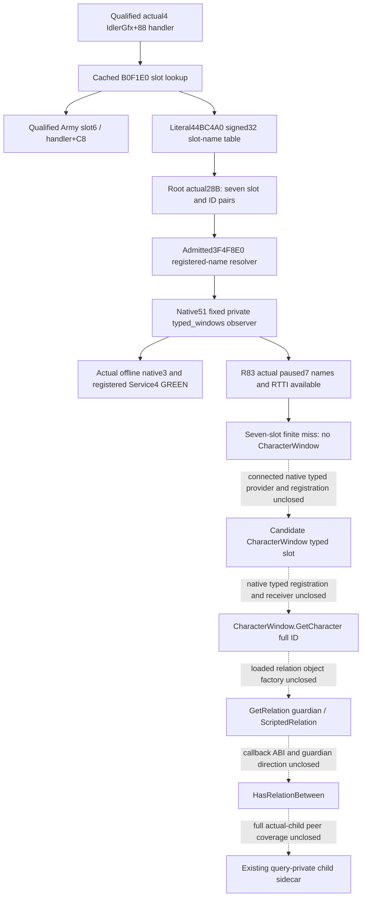

# CharacterWindow guardian provider: actual4 controller entry

2026-10-09 / W41. The fixed typed-window observer is now **static-ready**
for CK3 1.20.0.4 / Steam build25734779. CharacterWindow/GetCharacter and
guardian relation observation remain research.
The frozen image identity is inherited from Root:
`98702F88A547CDE2EAF29A85F93B85F68EE4CF8148336A4F7AFAEB75319DD518`.
This documentation update performs no image read/hash, Game/SDK operation,
build or test. Root separately performed the exact28-byte source capture
and the unique Native51 offline qualification below. Neither those results
nor an Army window observation supplies guardian capability.

## Proven controller and typed slot lookup

The retained actual4 `CIngameInterfaceHandler` evidence identifies primary
vtable `0x44BA8A0`, COL `0x4A59370` and type descriptor `0x5694B20`.
The already qualified IdlerGfx+0x88 handler is reused. Its cached171-byte
slot routine is `[0xB0F1E0,0xB0F28B)`, not a newly captured body.

| Actual instruction RVA | Decoded operation | Meaning established here |
| --- | --- | --- |
| `0xB0F1EF` | `movsxd rsi,edx` | Signed slot argument. |
| `0xB0F1F5` | `cmp rsi,0xAD` | Existing range diagnostic branch; not a Character slot. |
| `0xB0F21E` | `mov rbx,[rbx+rsi*8+0x98]` | Window pointer at handler+0x98+8*slot. |
| `0xB0F229` | `jne 0xB0F278` | Nonnull window skips the name diagnostic. |
| `0xB0F23A` | `lea rax,[rip+0x39AD25F]` | Literal table RVA `0x44BC4A0`. |
| `0xB0F241` | `mov ecx,[rax+rsi*4]` | Signed32 registered-name identifier for that slot. |
| `0xB0F244` | `call 0x3F4F8E0` | Existing exact4 registered-name resolver. |
| `0xB0F249` | `cmp qword [rax+0x18],0x10` | Native string inline/heap selection in the diagnostic. |
| `0xB0F273` | `call 0x3F7AB70` | Diagnostic consumer, not GetCharacter. |
| `0xB0F27D` | `mov rax,rbx` | Return the selected window pointer. |

The existing source already documents the array formula in
`ck3_autonomous_player/native_bridge/include/xar_bridge/ingame_ui_navigation_v1.hpp:98`.
The actual Army anchor is slot6, handler+0xC8. It cannot be relabelled
CharacterWindow. The lack of a direct Character call in this short routine
does not exhaust its other typed indices.

Root's one actual capture read `[0x44BC4A0,0x44BC4BC)` on
2026-10-09T10:29:02.922255Z, finishing10:29:02.930943Z. It obtained:

| Slot | Handler offset | Actual signed32 type-name ID | Resolved name |
| --- | --- | --- | --- |
| 0 | `0x98` | 13092 | Not yet captured |
| 1 | `0xA0` | 11010 | Not yet captured |
| 2 | `0xA8` | 11399 | Not yet captured |
| 3 | `0xB0` | 14350 | Not yet captured |
| 4 | `0xB8` | 14351 | Not yet captured |
| 5 | `0xC0` | 15450 | Not yet captured |
| 6 | `0xC8` | 10602 | Army slot independently qualified; registered spelling not captured |

The existing new-image PE metadata supplies `.rdata` RVA0x43DA000 and
raw offset0x43D8E00. Consequently the table's file offset is0x44BB2A0.
The `.text` displacement is not applicable. Root read28 bytes once,
without a PE parse, hash or section/name scan. Its immutable receipt is
`Z:/ck3_mod_rewrite_process_assets/g2-background-20261009/guardian-character-controller-source/root-prefix01/WINDOW-SLOT-TYPE-ID-PREFIX.json`.

## Exact name domain and the next bounded source operation

The resolver's entire `[0x3F4F8E0,0x3F4FA04)` body is already decoded in
`event-window-12004/declared-scope-map/EventResolveGenericValueTypeName-DETAIL.json`.
This292-byte body is reused without another read or decode. It sign-extends
ECX, loads the runtime registry pointer from image RVA0x5CBEDE8, rejects a
negative ID and an ID greater than the signed32 maximum at registry+0x54,
then indexes the string-pointer vector at registry+0x48 by8*ID. The maximum
is inclusive. Null or invalid lookup uses the admitted fallback at
image RVA0x5DC1128. These are registered name identifiers, not the Event
scope token's uint16 type-index, a relation-definition DB or a Character ID.

The established production signature is
`const std::string *(*)(std::int32_t)` (`EventResolveTypeName`). The actual4
`BindEventWindowImage12004` already binds `resolve_generic_value_type_name`
to0x3F4F8E0 and the fallback to0x5DC1128. Its existing materialized-token
reader uses this resolver after a separate token-index-to-ID step. The
window table has already supplied the ID; applying that token-index step
would address the wrong domain.

The selected cached event typed/leaf/declared maps, generic-GUI FAMILY-MAPs
and the two core-global-slots input/manifest indices provide no name join
for these seven newly observed IDs. This is a scoped metadata result, not
a claim that every registration in the image has been searched. The old
8.57MB three-name scan remains sealed and is not repeated.

## Native51 fixed observer: actual offline qualification

Root adopted functional source `d23bb88a5fcedd1bfc54956d9f18f767b514e978`
as `0d12fbeaf14641747fd984a068bbd181516346c4` in the complete frozen tree
`Z:/gbs-runtime51-child-typed-windows-root-source`. The existing paused
current-first-heir relationship query now fills optional query-level
`current_first_heir_descendants_v1.child_inputs.typed_windows`, outside
the child rows. It is observable with zero children and with an unavailable
child roster. No arbitrary memory MCP, registry dump or new query protocol
was added; Root has no arbitrary raw-memory MCP surface.

The reader reuses the actual4 name binding and the existing
`ResolveHandler` in `ingame_ui_navigation_v1.cpp`. That TU is a Bridge
owner. It resolves exactly seven registered-name IDs and immediately copies
their strings. For present slots it publishes module-relative vtable/COL/TD
addresses and copied decorated RTTI names. Null slots, null/fallback names
and unreadable object typing remain distinct. Name/handler/RTTI availability
does not change child roster or trait status. The existing mailbox's paused
before/after frame and stable copy govern publication.

Root's sole actual run is
`Z:/g2-native51-build01/attempt01/ROOT-NATIVE51-RESULT.json`:

| Actual stage | Result | Seconds |
| --- | --- | --- |
| Bridge `bridge.cpp` compile | GREEN | 17.9052400 |
| Bridge relationship serializer compile | GREEN | 3.9327387 |
| Bridge `ingame_ui_navigation_v1.cpp` compile | GREEN | 4.8546505 |
| Existing descendant fixture compile | GREEN | 6.5085308 |
| DLL / full-Bridge fixture links | GREEN / GREEN | 0.9293699 / 0.9289001 |
| Unique new native FIRST, three original whole packets | GREEN | 0.2319252 |
| Sole registered query + Service compound, four scenes | GREEN | 8.4758183 |

The native FIRST ran 2026-10-09T11:48:03.077809Z to 11:48:03.309728Z;
its consumer ran 11:48:03.310538Z to 11:48:11.786348Z. The originals under
`attempt01/first/native-wires/` are `typed-window-seven-mixed.json`,
`typed-window-independent-unavailable.json` and
`typed-window-handler-unavailable.json`. The fourth scene removes only
`typed_windows` from a copy of the first new packet; no old producer is
replayed. The actual registered-Service evidence is
`attempt01/first/consumer/RESULT.json`.

These fixtures use native slot/RTTI buffers and real `std::string` storage
through the production reader and emitter. Their `FixtureWindowType...`
and RTTI spellings are synthetic fixture inputs, not captured game names.
The first two scenes have a complete empty child roster; the third retains
all seven names while both handler and child-roster reads are unavailable.
All four consumer scenes record zero submit, action ACK, action and day
advance. They prove this observer's transport/MCP/Service path, not a
CharacterWindow identity, GetCharacter callback or guardian relation.

The canonical receipt is
`Z:/ck3_mod_rewrite_process_assets/g2-background-20261007/upstream-build-migration/entry-live-fix51/ROOT-PARENT-RUNTIME-INCREMENTAL-DLL.json`.
It seals 735 production owners: 299 Bridge, 435 Runtime and 1 Protocol.
Only three Bridge owners are replaced; 732 are retained. This increment
performs zero Runtime compilation or archive operations. Its DLL is
`Z:/g2-native51-build01/attempt01/binaries/xar_ck3_bridge.dll`,
13,493,760 bytes, with Root's already recorded SHA-256
`e109ef954e3cc4e2345037e3f5588f43bbd905a57218074401af650b935bbbba`.
No artifact is rehashed by this documentation lane.

### Compiled, qualification and future SDK source split

| Evidence scope | Exact source or artifact basis |
| --- | --- |
| Native51 three fresh Bridge owners, fixture and unique typed-window consumer | Root frozen `0d12fbeaf14641747fd984a068bbd181516346c4` |
| Inherited Runtime435 archive | `Z:/g2-native50-build01/attempt01/binaries/xar_ck3_12002_runtime.lib`, production source `8024d9692d7564a300e96f6e3d76a161a407da79`, reused unchanged |
| Other retained objects | Mixed actual parent lineage; not all 735 compiled at 0d |
| Subsequent Python opinion admission fix / next full SDK freeze | `bf5cc1761d3389907150156c07c41637ce5997bb`, included in documentation base `0a727571c5d7ee51bee80c13af37b210c3a06a35`; Root separately prepares R83 |

Native51's 0d qualification is specific to this new typed-window observer.
Its older opinion Python source is not the future complete SDK source.
The bf5 source freeze and Root's R83 work are separate from these static
receipts; they do not turn this observer into a paused live observation.

## R83 actual paused fixed-window observation

Root's sole R83 family query completed2026-10-09T12:15:38.567245Z to
12:15:55.431223Z (20:15:55 CST). Its retained thin receipt is
`Z:/ck3_mod_rewrite_process_assets/g2-background-20261009/r83-native51-recovery-preparation/R83-FAMILY-TYPED-WINDOWS-THIN.json`;
the original response remains
`Z:/ck3_mod_rewrite_process_assets/g2-background-20261009/managed-full-r83-native51restore01/operator/gameplay-responses/002-r83-family-typed-windows01.json`.
The read-only family response is available at native revision2,
date53288640, played Robert29829 and first heir38822. Descendants are
available with a complete roster, and child inputs are independently
available. No repeated query or UI opening is required by this lane.

All seven registered names, slot objects and copied RTTI names are
available in that same frame:

| Slot / handler offset | Exact type ID | Actual registered name | Actual decorated object type |
| --- | --- | --- | --- |
| 0 / 0x98 | 13092 | `intrigue_window` | `.?AVCIntrigueWindow@@` |
| 1 / 0xA0 | 11010 | `military` | `.?AVCMilitaryView@@` |
| 2 / 0xA8 | 11399 | `men_at_arms` | `.?AVCMenAtArmsView@@` |
| 3 / 0xB0 | 14350 | `men_at_arms_type` | `.?AVCMenAtArmsTypeView@@` |
| 4 / 0xB8 | 14351 | `select_maa_origin_province` | `.?AVCSelectMAAOriginView@@` |
| 5 / 0xC0 | 15450 | `select_title_troop_assignment` | `.?AVCSelectTitleTroopAssignmentView@@` |
| 6 / 0xC8 | 10602 | `army` | `.?AVCArmyWindow@@` |

The thin receipt also retains each actual vtable/COL/type-descriptor RVA.
The Army6 name and object type agree with the already admitted Army
anchor. None of these seven registered names or RTTI types identifies a
CharacterWindow. This is a finite miss for the seven selected slots,
not an absence claim about every handler window.

Native51's fixed seven-name/RTTI observer is now a
`production-live primitive`: its same-query paused publication is observed
in the real R83 game. The actual field is a provider-locating input,
not a guardian relation, selected educator or CharacterWindow.GetCharacter
observation. Its offline source/qualification0d and inherited Runtime8024
remain the source split recorded above; the R83 full SDK source is a
separate Root freeze, rather than treating Native51's old opinion Python
as the future complete SDK. Root's R83 baseline paused qualification
and this new field's live readback do not transfer guardian or action
credit.

## Next actual CharacterWindow provider input

The seven-ID runtime name capture through the existing paused child query
is complete. The next construction input must come from a literal typed
registration or a connected native provider/caller, not another query of
these seven known non-Character slots.

1. Retain each original slot/ID pair and the independent name, handler and
   object-type status published by `typed_windows`.
2. Preserve the actual seven-name finite miss and Army6/10602 anchor.
   Obtain a Character candidate from a literal typed registration or
   actual caller, rather than scanning all windows or guessing slot8.
   A future matching name yields a candidate window slot only.
3. Follow that window's actual typed registration to the native
   `CharacterWindow.GetCharacter` callback and prove its window receiver
   and returned full Character identity. Only an actual callback/callsite
   justifies the next finite image span. No next EXE span is guessed here.

The implementation and unique FIRST packet are under
`Z:/ck3_mod_rewrite_process_assets/g2-background-20261009/runtime51-child-typed-windows-preparation/`.
The earlier optional raw-surface research plan is superseded by this private
same-query observer. No unclosed Character or relation callback is invoked.

## Guardian dependency after the window provider

Stock `window_character.gui` declares datacontext
`CharacterWindow.GetCharacter`. Its separate
`DefaultOnCharacterClick(GetPlayer.GetID)` is a global player click,
not a window receiver or slot registration. The old11906 character click
addresses0xA23440/0xA04530 are not borrowed for actual4.

The production Character-window observation seam currently implements Army
only despite its broader advertised API. Repeating its known expected
failure would not resolve the native provider. The separate ScriptedRelation
factory, canonical guardian key, two-Character argument direction and
complete guardian collection remain required after GetCharacter closes;
see [the relation provider topic](scripted-relation-provider-12004.md).

The fixed typed-window observer is a `production-live primitive`.
CharacterWindow/GetCharacter and the guardian/educator provider remain
`research`. There is no new guardian/educator observation, action, full
AST, child/education/birth/succession or G2 credit. This documentation lane
performs no Game/SDK or process action, fixture/FIRST replay, build or hash.
Existing failures and the separate parent live evidence remain unchanged.
