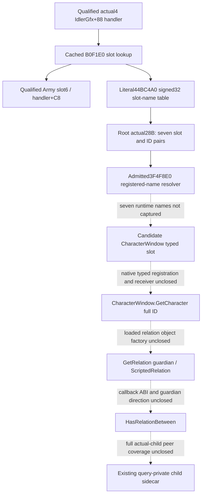

# CharacterWindow guardian provider: actual4 controller entry

2026-10-09 / W41. Research for CK3 1.20.0.4 / Steam build25734779.
The frozen image identity is inherited from Root:
`98702F88A547CDE2EAF29A85F93B85F68EE4CF8148336A4F7AFAEB75319DD518`.
This source lane performs no image read/hash, Game/SDK operation, build or test.
Root separately performed the exact28-byte source capture below. Neither
that capture nor an Army window observation supplies guardian capability.

## Proven controller and typed slot lookup

The retained actual4 `CIngameInterfaceHandler` evidence identifies primary
vtable `0x44BA8A0`, COL `0x4A59370` and type descriptor `0x5694B20`.
The already qualified IdlerGfx+0x88 handler is reused. Its cached171-byte
slot routine is `[0xB0F1E0,0xB0F28B)`, not a newly captured body.

| Actual instruction RVA | Decoded operation | Meaning established here |
| --- | --- | --- |
| `0xB0F1EF` | `movsxd rsi,edx` | Signed slot argument. |
| `0xB0F1F5` | `cmp rsi,0xAD` | Existing range diagnostic branch; not a Character slot. |
| `0xB0F21E` | `mov rbx,[rbx+rsi*8+0x98]` | Window pointer at handler+0x98+8*slot. |
| `0xB0F229` | `jne 0xB0F278` | Nonnull window skips the name diagnostic. |
| `0xB0F23A` | `lea rax,[rip+0x39AD25F]` | Literal table RVA `0x44BC4A0`. |
| `0xB0F241` | `mov ecx,[rax+rsi*4]` | Signed32 registered-name identifier for that slot. |
| `0xB0F244` | `call 0x3F4F8E0` | Existing exact4 registered-name resolver. |
| `0xB0F249` | `cmp qword [rax+0x18],0x10` | Native string inline/heap selection in the diagnostic. |
| `0xB0F273` | `call 0x3F7AB70` | Diagnostic consumer, not GetCharacter. |
| `0xB0F27D` | `mov rax,rbx` | Return the selected window pointer. |

The existing source already documents the array formula in
`ck3_autonomous_player/native_bridge/include/xar_bridge/ingame_ui_navigation_v1.hpp:98`.
The actual Army anchor is slot6, handler+0xC8. It cannot be relabelled
CharacterWindow. The lack of a direct Character call in this short routine
does not exhaust its other typed indices.

Root's one actual capture read `[0x44BC4A0,0x44BC4BC)` on
2026-10-09T10:29:02.922255Z, finishing10:29:02.930943Z. It obtained:

| Slot | Handler offset | Actual signed32 type-name ID | Resolved name |
| --- | --- | --- | --- |
| 0 | `0x98` | 13092 | Not yet captured |
| 1 | `0xA0` | 11010 | Not yet captured |
| 2 | `0xA8` | 11399 | Not yet captured |
| 3 | `0xB0` | 14350 | Not yet captured |
| 4 | `0xB8` | 14351 | Not yet captured |
| 5 | `0xC0` | 15450 | Not yet captured |
| 6 | `0xC8` | 10602 | Army slot independently qualified; registered spelling not captured |

The existing new-image PE metadata supplies `.rdata` RVA0x43DA000 and
raw offset0x43D8E00. Consequently the table's file offset is0x44BB2A0.
The `.text` displacement is not applicable. Root read28 bytes once,
without a PE parse, hash or section/name scan. Its immutable receipt is
`Z:/ck3_mod_rewrite_process_assets/g2-background-20261009/guardian-character-controller-source/root-prefix01/WINDOW-SLOT-TYPE-ID-PREFIX.json`.

## Exact name domain and the next bounded source operation

The resolver's entire `[0x3F4F8E0,0x3F4FA04)` body is already decoded in
`event-window-12004/declared-scope-map/EventResolveGenericValueTypeName-DETAIL.json`.
This292-byte body is reused without another read or decode. It sign-extends
ECX, loads the runtime registry pointer from image RVA0x5CBEDE8, rejects a
negative ID and an ID greater than the signed32 maximum at registry+0x54,
then indexes the string-pointer vector at registry+0x48 by8*ID. The maximum
is inclusive. Null or invalid lookup uses the admitted fallback at
image RVA0x5DC1128. These are registered name identifiers, not the Event
scope token's uint16 type-index, a relation-definition DB or a Character ID.

The established production signature is
`const std::string *(*)(std::int32_t)` (`EventResolveTypeName`). The actual4
`BindEventWindowImage12004` already binds `resolve_generic_value_type_name`
to0x3F4F8E0 and the fallback to0x5DC1128. Its existing materialized-token
reader uses this resolver after a separate token-index-to-ID step. The
window table has already supplied the ID; applying that token-index step
would address the wrong domain.

The selected cached event typed/leaf/declared maps, generic-GUI FAMILY-MAPs
and the two core-global-slots input/manifest indices provide no name join
for these seven newly observed IDs. This is a scoped metadata result, not
a claim that every registration in the image has been searched. The old
8.57MB three-name scan remains sealed and is not repeated.

The next operation is therefore a **seven-ID runtime name capture** using
Root's existing paused native observation path and admitted resolver:

1. Retain each original slot/ID pair. Resolve only the seven IDs above via
   the existing actual4 binding and copy each returned native string in
   the same admitted observation. Record null/fallback separately.
2. If Root instead uses its existing read-only memory surface, read only
   the pointer at loaded-image-base+0x5CBEDE8, registry+0x48 and+0x54, and
   the seven vector entries. Decode their32-byte native string headers
   using length+0x10/capacity+0x18 and inline storage below capacity16;
   otherwise read exactly the declared string bytes from the stored pointer.
   Reuse the current reader's string limits. Do not dump the registry/vector.
3. Match an actual registered CharacterWindow spelling/alias to a slot,
   preserving the independent Army6/10602 anchor. A matching name yields a
   candidate window slot only. If these seven names contain no Character
   window, record that finite miss and obtain the next slot from a literal
   typed registration or actual caller, rather than scanning all windows.
4. Follow that window's actual typed registration to the native
   `CharacterWindow.GetCharacter` callback and prove its window receiver
   and returned full Character identity. Only an actual callback/callsite
   justifies the next finite image span. No next EXE span is guessed here.

This plan adds no public query/schema and does not invoke an unclosed
Character or relation callback. The external
`ROOT-NEXT-TYPED-NAME-SOURCE-PLAN.json` records the exact finite input set
and existing resolver/source locators; its runtime operation is NOTRUN.

## Guardian dependency after the window provider

Stock `window_character.gui` declares datacontext
`CharacterWindow.GetCharacter`. Its separate
`DefaultOnCharacterClick(GetPlayer.GetID)` is a global player click,
not a window receiver or slot registration. The old11906 character click
addresses0xA23440/0xA04530 are not borrowed for actual4.

The production Character-window observation seam currently implements Army
only despite its broader advertised API. Repeating its known expected
failure would not resolve the native provider. The separate ScriptedRelation
factory, canonical guardian key, two-Character argument direction and
complete guardian collection remain required after GetCharacter closes;
see [the relation provider topic](scripted-relation-provider-12004.md).

Readiness remains `research`. There is no new guardian/educator observation,
production-live capability, action, child/education/birth/succession or G2
credit. No Game/SDK operation, process action, fixture/FIRST, build or hash
was performed by this lane. Root's source-only28-byte read is the only new
image I/O. Existing failures and parent live evidence remain unchanged.