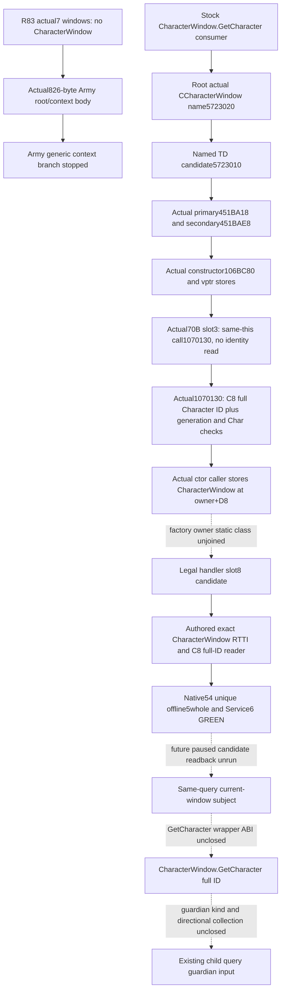
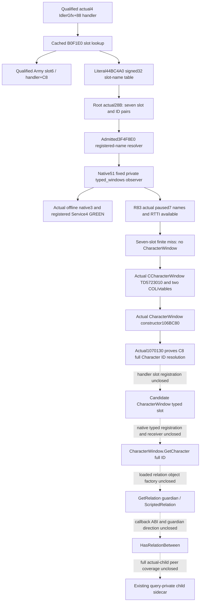

# CharacterWindow guardian provider: actual4 controller entry

2026-10-09 / W41. The fixed typed-window observer is now **static-ready**
for CK3 1.20.0.4 / Steam build25734779. Native54's private CharacterWindow
identity observer is also static-ready after the offline qualification
below. The callable GetCharacter wrapper and guardian relation remain research.
The frozen image identity is inherited from Root:
`98702F88A547CDE2EAF29A85F93B85F68EE4CF8148336A4F7AFAEB75319DD518`.
This documentation update performs no image read/hash, Game/SDK operation,
build or test. Root separately performed the exact28-byte source capture
and the unique Native51 offline qualification below. Neither those results
nor an Army window observation supplies guardian capability.

## Proven controller and typed slot lookup

The retained actual4 `CIngameInterfaceHandler` evidence identifies primary
vtable `0x44BA8A0`, COL `0x4A59370` and type descriptor `0x5694B20`.
The already qualified IdlerGfx+0x88 handler is reused. Its cached171-byte
slot routine is `[0xB0F1E0,0xB0F28B)`, not a newly captured body.

| Actual instruction RVA | Decoded operation | Meaning established here |
| --- | --- | --- |
| `0xB0F1EF` | `movsxd rsi,edx` | Signed slot argument. |
| `0xB0F1F5` | `cmp rsi,0xAD` | Existing range diagnostic branch; not a Character slot. |
| `0xB0F21E` | `mov rbx,[rbx+rsi*8+0x98]` | Window pointer at handler+0x98+8*slot. |
| `0xB0F229` | `jne 0xB0F278` | Nonnull window skips the name diagnostic. |
| `0xB0F23A` | `lea rax,[rip+0x39AD25F]` | Literal table RVA `0x44BC4A0`. |
| `0xB0F241` | `mov ecx,[rax+rsi*4]` | Signed32 registered-name identifier for that slot. |
| `0xB0F244` | `call 0x3F4F8E0` | Existing exact4 registered-name resolver. |
| `0xB0F249` | `cmp qword [rax+0x18],0x10` | Native string inline/heap selection in the diagnostic. |
| `0xB0F273` | `call 0x3F7AB70` | Diagnostic consumer, not GetCharacter. |
| `0xB0F27D` | `mov rax,rbx` | Return the selected window pointer. |

The existing source already documents the array formula in
`ck3_autonomous_player/native_bridge/include/xar_bridge/ingame_ui_navigation_v1.hpp:98`.
The actual Army anchor is slot6, handler+0xC8. It cannot be relabelled
CharacterWindow. The lack of a direct Character call in this short routine
does not exhaust its other typed indices.

Root's one actual capture read `[0x44BC4A0,0x44BC4BC)` on
2026-10-09T10:29:02.922255Z, finishing10:29:02.930943Z. It obtained:

| Slot | Handler offset | Actual signed32 type-name ID | Resolved name |
| --- | --- | --- | --- |
| 0 | `0x98` | 13092 | Not yet captured |
| 1 | `0xA0` | 11010 | Not yet captured |
| 2 | `0xA8` | 11399 | Not yet captured |
| 3 | `0xB0` | 14350 | Not yet captured |
| 4 | `0xB8` | 14351 | Not yet captured |
| 5 | `0xC0` | 15450 | Not yet captured |
| 6 | `0xC8` | 10602 | Army slot independently qualified; registered spelling not captured |

The existing new-image PE metadata supplies `.rdata` RVA0x43DA000 and
raw offset0x43D8E00. Consequently the table's file offset is0x44BB2A0.
The `.text` displacement is not applicable. Root read28 bytes once,
without a PE parse, hash or section/name scan. Its immutable receipt is
`Z:/ck3_mod_rewrite_process_assets/g2-background-20261009/guardian-character-controller-source/root-prefix01/WINDOW-SLOT-TYPE-ID-PREFIX.json`.

## Exact name domain and the next bounded source operation

The resolver's entire `[0x3F4F8E0,0x3F4FA04)` body is already decoded in
`event-window-12004/declared-scope-map/EventResolveGenericValueTypeName-DETAIL.json`.
This292-byte body is reused without another read or decode. It sign-extends
ECX, loads the runtime registry pointer from image RVA0x5CBEDE8, rejects a
negative ID and an ID greater than the signed32 maximum at registry+0x54,
then indexes the string-pointer vector at registry+0x48 by8*ID. The maximum
is inclusive. Null or invalid lookup uses the admitted fallback at
image RVA0x5DC1128. These are registered name identifiers, not the Event
scope token's uint16 type-index, a relation-definition DB or a Character ID.

The established production signature is
`const std::string *(*)(std::int32_t)` (`EventResolveTypeName`). The actual4
`BindEventWindowImage12004` already binds `resolve_generic_value_type_name`
to0x3F4F8E0 and the fallback to0x5DC1128. Its existing materialized-token
reader uses this resolver after a separate token-index-to-ID step. The
window table has already supplied the ID; applying that token-index step
would address the wrong domain.

The selected cached event typed/leaf/declared maps, generic-GUI FAMILY-MAPs
and the two core-global-slots input/manifest indices provide no name join
for these seven newly observed IDs. This is a scoped metadata result, not
a claim that every registration in the image has been searched. The old
8.57MB three-name scan remains sealed and is not repeated.

## Native51 fixed observer: actual offline qualification

Root adopted functional source `d23bb88a5fcedd1bfc54956d9f18f767b514e978`
as `0d12fbeaf14641747fd984a068bbd181516346c4` in the complete frozen tree
`Z:/gbs-runtime51-child-typed-windows-root-source`. The existing paused
current-first-heir relationship query now fills optional query-level
`current_first_heir_descendants_v1.child_inputs.typed_windows`, outside
the child rows. It is observable with zero children and with an unavailable
child roster. No arbitrary memory MCP, registry dump or new query protocol
was added; Root has no arbitrary raw-memory MCP surface.

The reader reuses the actual4 name binding and the existing
`ResolveHandler` in `ingame_ui_navigation_v1.cpp`. That TU is a Bridge
owner. It resolves exactly seven registered-name IDs and immediately copies
their strings. For present slots it publishes module-relative vtable/COL/TD
addresses and copied decorated RTTI names. Null slots, null/fallback names
and unreadable object typing remain distinct. Name/handler/RTTI availability
does not change child roster or trait status. The existing mailbox's paused
before/after frame and stable copy govern publication.

Root's sole actual run is
`Z:/g2-native51-build01/attempt01/ROOT-NATIVE51-RESULT.json`:

| Actual stage | Result | Seconds |
| --- | --- | --- |
| Bridge `bridge.cpp` compile | GREEN | 17.9052400 |
| Bridge relationship serializer compile | GREEN | 3.9327387 |
| Bridge `ingame_ui_navigation_v1.cpp` compile | GREEN | 4.8546505 |
| Existing descendant fixture compile | GREEN | 6.5085308 |
| DLL / full-Bridge fixture links | GREEN / GREEN | 0.9293699 / 0.9289001 |
| Unique new native FIRST, three original whole packets | GREEN | 0.2319252 |
| Sole registered query + Service compound, four scenes | GREEN | 8.4758183 |

The native FIRST ran 2026-10-09T11:48:03.077809Z to 11:48:03.309728Z;
its consumer ran 11:48:03.310538Z to 11:48:11.786348Z. The originals under
`attempt01/first/native-wires/` are `typed-window-seven-mixed.json`,
`typed-window-independent-unavailable.json` and
`typed-window-handler-unavailable.json`. The fourth scene removes only
`typed_windows` from a copy of the first new packet; no old producer is
replayed. The actual registered-Service evidence is
`attempt01/first/consumer/RESULT.json`.

These fixtures use native slot/RTTI buffers and real `std::string` storage
through the production reader and emitter. Their `FixtureWindowType...`
and RTTI spellings are synthetic fixture inputs, not captured game names.
The first two scenes have a complete empty child roster; the third retains
all seven names while both handler and child-roster reads are unavailable.
All four consumer scenes record zero submit, action ACK, action and day
advance. They prove this observer's transport/MCP/Service path, not a
CharacterWindow identity, GetCharacter callback or guardian relation.

The canonical receipt is
`Z:/ck3_mod_rewrite_process_assets/g2-background-20261007/upstream-build-migration/entry-live-fix51/ROOT-PARENT-RUNTIME-INCREMENTAL-DLL.json`.
It seals 735 production owners: 299 Bridge, 435 Runtime and 1 Protocol.
Only three Bridge owners are replaced; 732 are retained. This increment
performs zero Runtime compilation or archive operations. Its DLL is
`Z:/g2-native51-build01/attempt01/binaries/xar_ck3_bridge.dll`,
13,493,760 bytes, with Root's already recorded SHA-256
`e109ef954e3cc4e2345037e3f5588f43bbd905a57218074401af650b935bbbba`.
No artifact is rehashed by this documentation lane.

### Compiled, qualification and future SDK source split

| Evidence scope | Exact source or artifact basis |
| --- | --- |
| Native51 three fresh Bridge owners, fixture and unique typed-window consumer | Root frozen `0d12fbeaf14641747fd984a068bbd181516346c4` |
| Inherited Runtime435 archive | `Z:/g2-native50-build01/attempt01/binaries/xar_ck3_12002_runtime.lib`, production source `8024d9692d7564a300e96f6e3d76a161a407da79`, reused unchanged |
| Other retained objects | Mixed actual parent lineage; not all 735 compiled at 0d |
| Subsequent Python opinion admission fix / next full SDK freeze | `bf5cc1761d3389907150156c07c41637ce5997bb`, included in documentation base `0a727571c5d7ee51bee80c13af37b210c3a06a35`; Root separately prepares R83 |

Native51's 0d qualification is specific to this new typed-window observer.
Its older opinion Python source is not the future complete SDK source.
The bf5 source freeze is separate from these static receipts. Static
receipts alone do not prove a paused live observation; the separate
actual R83 family receipt below supplies that observation.

## R83 actual paused fixed-window observation

Root's sole R83 family query completed2026-10-09T12:15:38.567245Z to
12:15:55.431223Z (20:15:55 CST). Its retained thin receipt is
`Z:/ck3_mod_rewrite_process_assets/g2-background-20261009/r83-native51-recovery-preparation/R83-FAMILY-TYPED-WINDOWS-THIN.json`;
the original response remains
`Z:/ck3_mod_rewrite_process_assets/g2-background-20261009/managed-full-r83-native51restore01/operator/gameplay-responses/002-r83-family-typed-windows01.json`.
The read-only family response is available at native revision2,
date53288640, played Robert29829 and first heir38822. Descendants are
available with a complete roster, and child inputs are independently
available. No repeated query or UI opening is required by this lane.

All seven registered names, slot objects and copied RTTI names are
available in that same frame:

| Slot / handler offset | Exact type ID | Actual registered name | Actual decorated object type |
| --- | --- | --- | --- |
| 0 / 0x98 | 13092 | `intrigue_window` | `.?AVCIntrigueWindow@@` |
| 1 / 0xA0 | 11010 | `military` | `.?AVCMilitaryView@@` |
| 2 / 0xA8 | 11399 | `men_at_arms` | `.?AVCMenAtArmsView@@` |
| 3 / 0xB0 | 14350 | `men_at_arms_type` | `.?AVCMenAtArmsTypeView@@` |
| 4 / 0xB8 | 14351 | `select_maa_origin_province` | `.?AVCSelectMAAOriginView@@` |
| 5 / 0xC0 | 15450 | `select_title_troop_assignment` | `.?AVCSelectTitleTroopAssignmentView@@` |
| 6 / 0xC8 | 10602 | `army` | `.?AVCArmyWindow@@` |

The thin receipt also retains each actual vtable/COL/type-descriptor RVA.
The Army6 name and object type agree with the already admitted Army
anchor. None of these seven registered names or RTTI types identifies a
CharacterWindow. This is a finite miss for the seven selected slots,
not an absence claim about every handler window.

Native51's fixed seven-name/RTTI observer is now a
`production-live primitive`: its same-query paused publication is observed
in the real R83 game. The actual field is a provider-locating input,
not a guardian relation, selected educator or CharacterWindow.GetCharacter
observation. Its offline source/qualification0d and inherited Runtime8024
remain the source split recorded above; the R83 full SDK source is a
separate Root freeze, rather than treating Native51's old opinion Python
as the future complete SDK. Root's R83 baseline paused qualification
and this new field's live readback do not transfer guardian or action
credit.

## Next actual CharacterWindow provider input

The seven-ID runtime name capture through the existing paused child query
is complete. The next construction input must come from a literal typed
registration or a connected native provider/caller, not another query of
these seven known non-Character slots.

1. Retain each original slot/ID pair and the independent name, handler and
   object-type status published by `typed_windows`.
2. Preserve the actual seven-name finite miss and Army6/10602 anchor.
   Obtain a Character candidate from a literal typed registration or
   actual caller, rather than scanning all windows or guessing slot8.
   A future matching name yields a candidate window slot only.
3. Follow that window's actual typed registration to the native
   `CharacterWindow.GetCharacter` callback and prove its window receiver
   and returned full Character identity. Only an actual callback/callsite
   justifies the next finite image span. No next EXE span is guessed here.

### Actual connected Army context and its stopping point

The cached actual4 `army_window_init_root-DETAIL.json` supplies a real
connection:0x1345ECA stores the GUI root at native-window+0x60;
0x1345ED3/0x1345ED6 pass the CArmyWindow and GUI-root operands in RDX/RCX,
then0x1345EDE tail-jumps0x1351A90. Root read its held
`[0x1351A90,0x1351DCA)` extent once at
2026-10-09T12:26:46.457071Z to12:26:46.477197Z:826 bytes,207 decoded
instructions,0.0011772 seconds for the source read. The actual result and
DETAIL are in
`Z:/ck3_mod_rewrite_process_assets/g2-background-20261009/guardian-character-controller-source/connected-provider52/root-provider01/`.

The body saves the native-window operand in RBX and GUI root in RDI:

| Actual operand or call | Established dataflow |
| --- | --- |
| 0x1351AD0 | Copies the32-bit context key at image RVA0x5D56DC4 to local `[RBP+0x90]`. |
| 0x1351B04 -> 0x3AC4500 | RCX=original native window, RDX=&local context key, R8=&temporary value at `[RSP+0x20]`. |
| 0x1351B09-0x1351B61 | Obtains/creates GUIroot+0xE0's container, then calls0x3AC2080 with that container and the same key. |
| 0x1351B72-0x1351CFC | Stores/copies the temporary value according to byte tags-1/0/1/2/3, then sets entry+0x4C to1. |
| 0x1351D3F | Calls the already cached generic GUI event-delivery0x3AA5A00. |

Static initialization at0x1351DA5-0x1351DB3 takes and increments the
counter at RVA0x5C5FDA8; its initialization-state slot is0x5D56DC0.
The actual dynamic context key is a different, unjoined domain from the
seven fixed registered-name IDs. It is not passed to0x3F4F8E0 or called a
Character/relation identifier.

This body connects the Army root to generic context but supplies no
Character literal or registration. That branch stops here: no expansion
of0x3AC4500, container lookup, generic IR, allocation, copy or destruction.
These bytes do not qualify CharacterWindow.GetCharacter or guardian truth.

### Actual named CCharacterWindow type entry

Root's exact decorated-name locator now supplies a Character-specific
native anchor. Its actual receipt is
`Z:/ck3_mod_rewrite_process_assets/g2-background-20261009/guardian-character-controller-source/exact-character-rtti53/root-locator01/EXACT-CHARACTER-WINDOW-RTTI-RESULT.json`.
Root read the existing `.data` source once,8,571,392 bytes in0.0088564
seconds,2026-10-09T12:37:01.845923Z. There is exactly one match:

| Actual named record | Value |
| --- | --- |
| Exact decorated name | `.?AVCCharacterWindow@@` |
| Name RVA | `0x5723020` |
| Candidate type descriptor, name minus0x10 | `0x5723010` |
| Retained16-byte header | `a0104244010000000000000000000000` |
| Header first preferred-image pointer | `0x1444210A0` |

This actual name/record is not borrowed from11906, a guessed slot8 or a
fixture. The named TD candidate is an entry for COL/vtable/constructor
source work, not an admitted callback or a captured Character-window
object in the R83 frame. The old selected `VTABLE-CANDIDATES.json` and
`VTABLE-RTTI-CLOSED.json` metadata contain no row for this newly located TD.

Root then followed only this named TD in the frozen `.rdata` source.
The actual receipt is
`Z:/ck3_mod_rewrite_process_assets/g2-background-20261009/guardian-character-controller-source/character-col54/root-col01/CHARACTER-COL-VTABLE-RESULT.json`.
The read began2026-10-09T12:42:29.993099Z and completed at12:42:30.062970Z:
17,124,352 bytes,0.0135669 seconds for the read. It found two
signature1/self-relative COL records and one vtable reference for each:

| Actual subobject | COL RVA / offset | Vtable RVA | First observed virtual entry |
| --- | --- | --- | --- |
| Primary object | `0x4AEF4B8` / 0 | `0x451BA18` | `0x106C040` |
| Secondary subobject | `0x4AEF4E0` / 0x10 | `0x451BAE8` | `0x1083094` |

Both COLs name TD0x5723010 and class-hierarchy descriptor0x4AEE870.
The primary table's next entries include0x106C4F0,0x102EED0 and0x106CC20.
These are actual virtual pointers; their callback meanings are not guessed.

Root's actual named-vptr locator found exactly two RIP-LEA references,
both in the same held runtime extent:
`[0x106BC80,0x106C03B)`. At0x106BD23 the primary vtable is stored at
`[R15]`; at0x106BD2D the secondary is stored at `[R15+0x10]`.
The retained result is
`Z:/ck3_mod_rewrite_process_assets/g2-background-20261009/guardian-character-controller-source/character-vptr55/root-vptr01/CHARACTER-VPTR-STORES-RESULT.json`,
actual2026-10-09T12:49:20.923563Z,one frozen `.text` buffer read in
0.0301696 seconds. Only the two named targets were decoded locally.

### Actual CharacterWindow constructor and next member entry

Root then captured the exact955-byte body at
2026-10-09T12:53:30.322892Z to12:53:30.343038Z. Its167 instructions
decode all955 bytes; the single read took0.0001280 seconds.
`character-constructor56/root-body01/CHARACTER-VPTR-BODY-RESULT.json`
and its sibling `CHARACTER-VPTR-BODY-DETAIL.json` retain the evidence
under the same provider packet root.

The complete body establishes constructor semantics:

| Actual instruction or member | Established construction input |
| --- | --- |
| 0x106BCA1 / 0x106C01F | Saves incoming RCX as R15 and returns that same receiver after initialization. |
| 0x106BCEB -> 0x3AC1810 | Base construction receives the existing owner chain and literal descriptors at0x451BBB8/length16 and0x451BB98/length24. Their names are not guessed and the generic callee is not expanded. |
| 0x106BCF0 / 0x106BCF7 | Stores incoming RDX at receiver+0x98 and incoming R8 at+0xA0. Their typed owner roles need separate proof. |
| 0x106BD23 / 0x106BD2D | Writes the named primary/secondary vptrs at receiver+0/+0x10. |
| 0x106BD31 | Initializes receiver+0xC8 as a32-bit `0xFFFFFFFF` value. This alone does not name it a Character ID. |

The body initializes its remaining members/subobjects and returns the
receiver. It supplies no named GetCharacter call or actual handler-slot
store. CharacterWindow native construction is now closed; its readable
subject/full-ID getter remains unclosed.

Root captured primary slot3's actual `[0x106CC20,0x106CC66)` body once at
2026-10-09T13:10:02.298282Z:70 bytes,21 instructions, complete decode,
0.0001387 seconds for the read. Its retained source is
`character-member57/root-member01/CHARACTER-MEMBER-RESULT.json` under the
same packet root. The function saves incoming RCX as RBX, invokes primary
virtual entries+0x38/+0x68/+0x60, conditionally writes5 to receiver+0xB20,
calls0x1070130 with the same receiver and EDX=0, then tail-jumps0x110B070.
It performs no+0xC8 read and no typed Character resolution. This method
does not establish GetCharacter; the virtual and generic tail targets
are not expanded.

Root followed only the same-receiver direct call at0x106CC54. The actual
`[0x1070130,0x1070778)` body contains396 instructions,1608 bytes with a
complete decode. Root read it once2026-10-09T13:16:18.089789Z in0.0001507
seconds; `character-field-entry58/root-field01/` retains
`CHARACTER-FIELD-ENTRY-RESULT.json` and `CHARACTER-FIELD-ENTRY-DETAIL.json`.
The member writes+0xD0 from EDX, clears several local states and constructs
scope/typed values. It must not be invoked as a read-only getter.

Its initial subject resolution now establishes the field meaning:

| Actual instruction span | Proven identity operation |
| --- | --- |
| 0x1070211 / 0x1070218 | Loads Character storage at image0x5C67568 and fallback at0x5C67570. |
| 0x1070224 | Reads the32-bit field at CCharacterWindow+0xC8. |
| 0x107022B-0x1070248 | Uses only low24 bits as an index; validates capacity+0x2C and obtains the pointer from vector+0x20 with16-byte rows and pointer+8. |
| 0x107024A / 0x107024D | Compares the object's full32-bit ID at+0x18 with the original+0xC8 field, including its generation bits. |
| 0x1070252-0x1070263 | Requires object+0x1C equal0x43686172 (`Char`) and a non-FFFFFFFF full ID before constructing the typed subject. |

The named window's+0xC8 is therefore a full Character identity, rather than
the constructor-only unknown it was earlier. The admitted actual4
descriptor uses the same Character storage global and offsets. The
existing child collector already calls
`xar::ck3_12004::ResolveCoreCharacter(bindings.context.core, character_id)`;
a private window reader can reuse it with
`std::bit_cast<std::int32_t>(raw_id_at_C8)` and retain the observed magic
and full-ID checks. No new generic resolver or old12002 getter is needed.
This does not name the later relationship-like operands in the body,
qualify a guardian collection or prove a callable GetCharacter wrapper.

Root next captured primary slot1's actual
`[0x106C4F0,0x106CC17)` body once2026-10-09T13:21:40.842159Z:
1831 bytes,418 instructions,complete decode,0.0001577 seconds to read.
The retained `character-receiver-entry59/root-receiver01/` result and
DETAIL show GUI-root creation at0x106C546, storage at this+0x60 and the
direct0x106C6BE connection to0x1074970 with RCX=GUIroot/RDX=this. This
closes only the forward CharacterWindow/root association. That connected
generic context template is not expanded; it does not provide the reverse
handler slot.

### Exact constructor caller and the Native54 finite candidate

Root's separately approved single-target E8 locator found one aligned
constructor caller at0xB04719. Its entire containing runtime fragment is
`[0xB046F0,0xB0477C)`,140 bytes. Root read the frozen `.text` once at
2026-10-09T13:41:58.153125Z in0.0150785 seconds and retained only this
finite caller window/owner prefix, rather than the whole section.
`character-constructor-callers60/root-callers01/CHARACTER-CONSTRUCTOR-CALLERS-RESULT.json`
records the real source:

| Actual instruction | Established receiver dataflow |
| --- | --- |
| 0xB046FA | Saves the incoming owner RCX as RDI. |
| 0xB04710-0xB04719 | Passes allocated object in RCX, owner+0x40 in RDX and the owner in R8 to the named CharacterWindow constructor. |
| 0xB04728 | Stores that constructor's returned primary CharacterWindow pointer at owner+0xD8. |
| 0xB04760-0xB0476C | Registers the saved window pointer in owner+0x600's collection. |

This literal store selects a finite candidate. The existing admitted
handler getter independently proves window index8 is legal and addresses
handler+0x98+8*8=+0xD8. The factory owner's static class has not been joined
to the admitted handler. Native54 therefore does not assume that class or
call the factory: it reads only that one legal handler slot and admits its
object only when the actual primary vtable0x451BA18, COL0x4AEF4B8 and
TD0x5723010 match. A different object produces a visible type mismatch.
No additional handler-vtable prefix read or all-window traversal is needed
for this exact candidate observer.

The authored same-query field is optional
`current_first_heir_descendants_v1.child_inputs.character_window_identity`.
It publishes independent receiver and Character availability/reasons,
the copied signed32 raw+0xC8 ID and a nullable generation-resolved full
Character ID. The existing paused callback/stable before-after frame
governs publication. Zero children do not prevent collection. The window
subject does not replace the actor, heir or any actual child.

The new private DTO/header affects only Bridge `ingame_ui_navigation_v1.cpp`,
`bridge.cpp` and `current_first_heir_relationship_v1.cpp`, plus the existing
descendant fixture. Public Snapshot, Runtime and protocol layouts stay
unchanged. The read-only production wrapper reuses ResolveHandler and the
same+0xD8 candidate picker used by the fixture. It invokes no constructor,
InitRoot, state-mutating0x1070130, GUI callback or UI action.

The authored unique native mode is `--child-character-window-identity-wire-dir`.
It emits five new whole packets: receiver absent, wrong object type,
FFFFFFFF ID, equal low24 index with wrong generation, and successful
full-ID resolution. They all retain the existing reciprocal spouse pair
and a complete empty child roster. One registered query/Service method
consumes those five originals and one copy of the new success packet with
only the optional identity leaf removed. No old producer or GREEN test is
replayed. Root subsequently qualified this exact five-whole/six-scene
contract offline as Native54; the actual result and original harness
failure are recorded below. There is no new live, guardian or G2 credit.

The future implementation seam is already localized: the existing
`ingame_ui_navigation_v1.cpp` ResolveHandler/RTTI helper supplies admitted
handler infrastructure, while `bridge.cpp` collects the private child
sidecar inside the same paused callback and publishes it only after the
before/after frame matches. Its relationship serializer is the third
Bridge owner if a new optional field is published. These are integration
inputs, not a manufactured unavailable-only capability. The authored finite
identity reader now uses the proved+0xC8 semantics and existing generation
resolver. Its candidate source and exact runtime type admission are explicit;
the factory owner's static class and a future paused candidate readback remain
unclosed. The subject cannot substitute for any real family child.

The named type, constructor and initial subject resolution now supply
the exact Character-specific field semantics. GetCharacter still needs
its actual admitted receiver and callable wrapper ABI; the read-only
field path is separate from invoking the state-mutating member.
Robert29829 and heir38822
remain the observed family anchors; neither substitutes for an unobserved
child or selected educator.

The fixed typed-window implementation and its unique FIRST packet are under
`Z:/ck3_mod_rewrite_process_assets/g2-background-20261009/runtime51-child-typed-windows-preparation/`.
The earlier optional raw-surface research plan is superseded by this private
same-query observer. No unclosed Character or relation callback is invoked.
Native54's separate identity FIRST contract is under
`guardian-character-controller-source/character-identity-native54/`.

## Native54 actual offline qualification

Root compiled and qualified the identity observer from the full frozen
tree `Z:/gbs-runtime54-character-root-source` at
`ff5f919f34033088a6151cbe9c1f607b9c597d9b`. Author commit
`282f9da31b6760b260abe23bdc9cfe3805288112` and later documentation
adoptions remain separate source provenance; retained production objects
are not relabelled as compiled from the new head.

Only Bridge `bridge.cpp`, `ingame_ui_navigation_v1.cpp` and
`current_first_heir_relationship_v1.cpp`, plus the existing descendant
fixture, were compiled. All four compiles and both DLL/fixture links passed
in attempt01. Native54 retains736 owners:299 Bridge,436 Runtime and1
Protocol, with3 Bridge replacements and733 retained owners. Runtime uses
the actual53 archive and its existing mixed-source lineage unchanged;
there is no new Runtime compile, archive, protocol or production TU.

Attempt01's native FIRST stopped after approximately0.22329 seconds,
before emitting any packet, because the executor manually transcribed the
unsupported flag `--character-window-full-id-wire-dir`. The author
contract and C++ already required
`--child-character-window-identity-wire-dir`. This is **harness RED**,
with consumer NOTRUN. The original
`Z:/g2-native54-build01/attempt01/ROOT-NATIVE54-RESULT.json` and
`logs/native-FIRST.log` remain preserved. The additive diagnosis is
`Z:/ck3_mod_rewrite_process_assets/g2-background-20261009/runtime54-character-preparation/ROOT-ATTEMPT01-HARNESS-RED.json`.

Root's attempt02 reused the four compiled objects, DLL and fixture
executable. It performed zero compile, link or archive operations and
ran only the corrected new native FIRST and sole registered consumer:

| Actual selected stage | Result and UTC timing |
| --- | --- |
| Five new native whole packets | GREEN,0.0693723s;2026-10-09T14:13:19.728825Z to14:13:19.798195Z. |
| Sole registered query/Service compound, six scenes | GREEN,10.7538225s;14:13:19.798941Z to14:13:30.552756Z. |

Actual receipts are
`Z:/g2-native54-build01/attempt02/ROOT-NATIVE54-RESULT.json`,
`logs/native-FIRST.json` and `logs/consumer-FIRST.json`.
The five original packets are in `attempt02/first/native-wires/`; the
Service result is `attempt02/first/consumer/RESULT.json`.
All five execute the shared production candidate/type/full-ID reader;
the sixth removes only the optional leaf from the new successful packet.
The consumer preserves zero-child whole-frame semantics and confirms
zero submit, action ACK, action and day advance. Existing GREENs are reused.

Root sealed
`Z:/ck3_mod_rewrite_process_assets/g2-background-20261007/upstream-build-migration/entry-live-fix54/ROOT-PARENT-RUNTIME-INCREMENTAL-DLL.json`
and its `ROOT-CHARACTER-WINDOW-FULL-ID-QUALIFICATION.json`.
The new `attempt01/binaries/xar_ck3_bridge.dll` is13517312 bytes with
Root-recorded SHA-256
`7b368bb893b49a9de3995257b630b5dd22f8f8ab653b728855cb7310bb2ca9b1`.
The outer `manifest.json` is2731 bytes, SHA-256
`1b2cf2f7c9b77c828f1e75a61b8e183f158d502012ef25166d7e4a0ab4a49c1a`.
These hashes are inherited from Root's once-only sealer; this documentation
update performs no hash or qualification replay.

The identity leaf is now **static-ready**. No Native54 Game/SDK deployment
or paused live read occurred. The factory-owner class, actual live slot8
candidate, callable GetCharacter wrapper, actual-child guardian collection
and selected educator remain unclosed. Native51's prior fixed seven-slot
live evidence is retained independently. Native54 adds no action, full
guardian, birth, education, succession, full AST or G2 credit.

## Guardian dependency after the window provider

Stock `window_character.gui` declares datacontext
`CharacterWindow.GetCharacter`. Its separate
`DefaultOnCharacterClick(GetPlayer.GetID)` is a global player click,
not a window receiver or slot registration. The old11906 character click
addresses0xA23440/0xA04530 are not borrowed for actual4.

The preexisting generic Character-window GUI route implements Army.
Native54's qualified child-query identity leaf uses the private collector
described above. The ScriptedRelation factory, canonical guardian key,
two-Character argument direction and complete actual-child guardian
collection remain required; see [the relation provider topic](scripted-relation-provider-12004.md)
and [the actual installed named consumer](guardian-relation-character-binding-12004.md).

The fixed typed-window observer is a `production-live primitive`.
Native54's private identity leaf is `static-ready`; the callable GetCharacter
wrapper and guardian/educator provider remain `research`.
There is no new guardian/educator observation, action, full
AST, child/education/birth/succession or G2 credit. This documentation lane
performs no Game/SDK or process action, fixture/FIRST replay, build or hash.
Existing failures and the separate parent live evidence remain unchanged.
