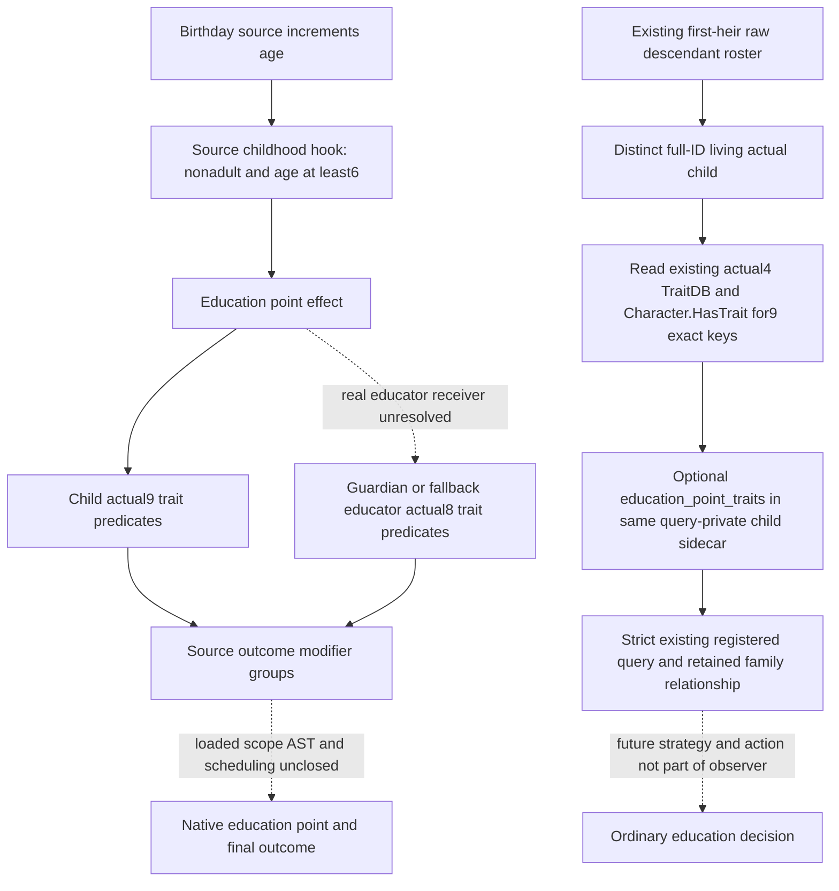

# Child education point trait inputs (1.20.0.4)

2026-W41, authored after midnight on 2026-10-09 (Asia/Shanghai), continuing
the Oct8 family input packet. Source research and a minimal read-only candidate;
build, new FIRST and ordinary-child observation are NOTRUN. Root supplied
public Native38 baseline `9d69a02546edf45331720f7b7632d9387d4dc8ba`.
The admitted actual4 Trait database/Character.HasTrait/key-decoder sources
and current child receiver are reused. No EXE/hash/Game/SDK/pipe/attach/
Steam/UI operation or replay of old qualified fields is part of this lane.

## Stock branch and roles

`00_education_effects.txt:249–438` directly consumes these nine child
trait predicates in the education-point outcome path:

- `intellect_good_1`, `intellect_good_2`, `intellect_good_3`
- `intellect_bad_1`, `intellect_bad_2`, `intellect_bad_3`
- `shrewd`, `dull`, `inbred`

The child positive-intellect, negative-intellect and shrewd/dull modifiers
are separate source groups; inbred is a child failure input. The educator
has eight checks, with positive and negative if/else-if chains and no
educator inbred check in this branch. Child and educator are separate
receivers. The unknown actual guardian/educator may not be replaced with
Robert, the first heir, a parent or an employer.

The source comment says “every half year”. The held actual caller goes
through `childhood_education.9002`, the `childhood_education` sub-hook and
`on_birthday_education_events`, after the source birthday age increment.
The childhood hook requires a nonadult child and the stock education start
age 6. The comment alone does not prove an invocation frequency or a native
scheduled AST. This observer has no age gate: actual zero-age/no-trait
children still have meaningful known-empty raw trait input.

The child success groups use authored additions 20/15/10 for good3/good2/
good1-or-shrewd. Failure groups use 20/15/10 for bad3-or-inbred/bad2/
bad1-or-dull. Each OR group contributes once; separate groups are independent.
Educator success/failure chains use first-match 15/10/5, with later skill,
learning and culture statements. In particular the culture statement is
`value = 10`, not an inferred additional `add = 10`. No normalized probability
or complete native evaluator behavior is asserted.

The six intellect definitions are genetic, inbred has an authored inheritance
field, and shrewd/dull do not have those definition flags. This is a nine-key
education input subset, not a complete genotype or inheritable-trait report.
Latent genetics, marriage genetic score, inheritance probability, loaded
education context/AST and a complete education outcome model remain unknown.
The native/stock source role weights do not imply a guardian AI selection
weight or an optimal focus/counter-policy.

Solid edges record source dependencies, not a live loop. The precise stock
tree, reads and modifier boundaries are archived at
`Z:/ck3_mod_rewrite_process_assets/g2-parallel-20261008/family-genetic-inputs40/stock/`.

## Coverage and minimal observer contract

Current public child input exposes five childhood affinity traits and current
focus, with age/sex. Current household reproductive rows expose fertility,
age/sex and pregnancy. Neither publishes these nine child education-point
traits. LIFE's actor subset is education rank/personality, and combat's four
matching traits use a different receiver/contract. Neither substitutes for
the current child. These existing qualification results are not rerun.

Only `current_first_heir_descendants_v1.child_inputs.rows[]` gains optional
`education_point_traits`. Source is `native_character_has_trait`; fields
are independent status, reason, all nine `queried_trait_keys` in the above
order, and the ordered `present_trait_keys` subset. Two native predicate
samples must agree. All nine false means available `[]`; unresolved required
definition/receiver or a changed predicate sample means unavailable `null`
and an explicit reason. Legacy omission remains omission. No educator field,
guardian inference, computed odds, marriage suitability or command is added.

The current public descendant/relationship layouts keep their original
bytes. Collection and serialization remain in the query-local private
sidecar. The original child values/childhood-traits aggregate status and
native_focus are independent of this new subresult. Three actual C++ owners
may require recompilation: bridge.cpp for the changed inline collector/private
row layout, current_first_heir_relationship_v1.cpp, and the existing native
fixture. No old public-DLL layout closure is introduced.

## Unique next qualification

Root owns the single offline compound after source integration: new native
mode `--child-education-point-trait-wire-dir`, five whole relationships
(two actual child trait subsets and ages, lawful age0 known-empty subset,
missing education-only definition, values failure with readable traits,
changed trait sample) plus one sole registered consumer method. A sixth
consumer-only compatibility case removes only this optional field from a
new wire. It does not invent a sixth compiled native sample or replay an old
child/focus/pregnancy FIRST. Existing registered query and family Service must
retain the whole relation and unchanged plan.

New native build/FIRST, actual child snapshot, guardian selection, education
action/afterstate, birth, natural succession and G2 credits are all zero here.
Local Game/SDK use is prohibited by the latest user direction; this source
work and future Root offline qualification do not require local Game access.

## Root offline qualification — October 9

The bounded child observer is now **static-ready**. Root retained the two
production Bridge compilations from source `2f0a1143` and the successful DLL
link from attempt02. The heap-backed trait-key fixture at `87f92a92` produced
all five new whole native frames in **0.2643774 s**. The sole six-scene
registered-query/Service consumer passed in **12.0609744 s**, at
00:47:44.748483–00:47:56.809454 CST. It reuses those frames and does not rerun
the compiler, linker, native fixture or any older qualified test.

Canonical receipt:
[Native40](Z:/ck3_mod_rewrite_process_assets/g2-background-20261007/upstream-build-migration/entry-live-fix40/ROOT-PARENT-RUNTIME-INCREMENTAL-DLL.json).
The [consumer receipt](Z:/g2-native40-build01/root-consumer-retry04/ROOT-ACTUAL-RESULT.json)
and its `REGISTERED-CONSUMER.json` retain the actual registered result.
The qualified DLL is `Z:/g2-native40-build01/attempt02/binaries/xar_ck3_bridge.dll`,
13,230,080 bytes, SHA-256
`549031cd489f1403dd79ec1a879af76762b32fd3fc0ca7928a279542b4755909`.
Root hashed this new DLL and the small new manifest once; older binary pins
are inherited. The 725-owner production lineage replaces two Bridge objects,
retains 723, and adds no Runtime rebuild.

Attempt01's shadowed fixture name, attempt02's incorrect short-string-only
fixture, and attempt03's missing Python tests in a sparse checkout remain
separate failed harness receipts. The two source corrections affect only
the fixture; the last retry restores missing checkout files without changing
source. These failures do not disappear when final qualification passes.
The nine current-child predicates are observable through the existing query;
educator identity, loaded education context, point computation, guardian
selection, live snapshots, actions, births and natural succession remain
unqualified. No local Game/SDK operation or G2 credit was added.
