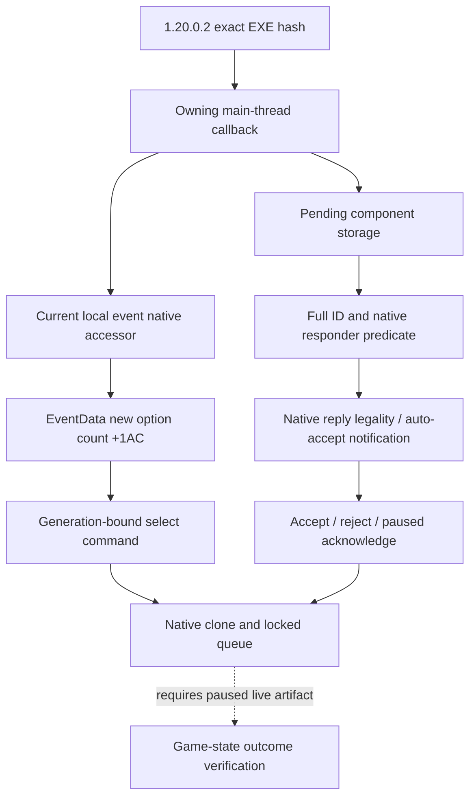

# CK3 1.20.0.2 事件与待答互动迁移

本页记录 2026-10-01 后台迁移的磁盘逆向与离线夹具结果。冻结构建为 `1.20.0.2 (Crozier)`，Steam build `25588574`，EXE SHA-256 为 `AE1BA6FF060BA603842F6F4A2DED0AF4B7D3666B3DD271F75FB01B0DA8E81B2D`。尚未读当前游戏进程、注入、发送命令或运行实机验收。

实现位于 `ck3_autonomous_player/native_bridge/include/xar_bridge/ck3_12002_events.hpp` 与对应 `src/ck3_12002_events.cpp`。读取函数只更新完整 snapshot 中的事件和待答互动字段；返回 `false` 时，调用者不能把输出默认值认作已经观察到“没有事件/互动”。完整世界 snapshot、主线程调度和队列所有权由各自适配包整合。

| 绑定 | 1.20.0.2 的静态证据 |
| --- | --- |
| EventManager | GameData 内嵌 `+0x34480`；原生选项验证 `0x29BDFF9` 与 UI 当前事件消费者 `0xA7D004` 分别确认 |
| 当前本地事件 | `0x29C57A0`，原生过滤当前玩家、事件类型并持读锁；返回 ActiveEvent |
| ActiveEvent | 定义指针 `+0x1B0`、实例 ID `+0x1BC`；新原生消费者直接读取 |
| 选项数组 | EventData `+0x1A0`、容量 `+0x1A8`、数量 `+0x1AC`；`0x1852903` 至 `0x1852914` 实证。旧数量 `+0x1BC` 已失效 |
| 选项命令 | 主/次 vtable `0x47733D0` / `0x4773530`，大小 `0x28`，实例 ID `+0x20`、选项序号 `+0x24`，普通 UI channel `7` |
| Pending storage | 全局 slot `0x5D1EC80`，slots `+0x20`、capacity `+0x2C`、stride `0x10`、object `+0x08`，ID `+0x10` 必须全代数相等 |
| 待答互动路由 | 原生 `0x136D1B0`。先检查 component magic `0x4368496E` 和 ID，再按 `+0x5C0` 的类型匹配 `+0x2F4` 或 `+0x300` recipient，并调用 `0x307AB70` 验证原生响应状态 |
| 待答互动内容 | sender `+0x2F0`、auto-accept 通知 `+0x5C6`；native constructor `0x2A32790` 分配 stride `0x5C8`，context 仍从 `+0x18` 开始 |
| 回复命令 | 主/次 vtable `0x448BC18` / `0x448BBE8`，大小 `0x28`，ID `+0x20`、回复 discriminator `+0x24`；`0` accept、`1` reject、`4` acknowledge，channel `0x0E` |

选项动作在提交前重新取当前事件与新布局下的数量。待答回复枚举仍先调用原生当前响应者判定，普通回复检查原生 command validator `0x2968490`，ack 则要求暂停、精确待答 ID 和 auto-accept 通知。真正的提交通过 `SubmitCommandCopyCompat` 的克隆/队列所有权边界，返回排队结果；排队成功仍不是游戏效果已经发生的证据。

离线夹具 `src/ck3_12002_events_test.cpp` 已用 MSVC 19.51、C++20、`/W4 /WX` 编译并通过。覆盖真实源函数的对象图读取、普通与 alternate-recipient 路由、组件代数、错误旧选项数量的诱饵、accept/reject/ack 的二进制命令字段与 channel、未暂停 ack、排队拒绝、已无事件及读取失败。artifact 为 `artifacts/migrations/2026-09-30/post-update-1.20.0.2/build-events-fixture/events-test.exe`；该夹具从未调用 CK3。

ABI 合同 `research/ck3_1_20_0_2_events.json` 冻结 13 个独特签名、4 个 vtable 前缀和 38 条语义指令，并对应 10 个源码常量。离线结果与源码、fixture 哈希写入同一 artifact 目录下的 `events-binding-result.json`，其 SHA-256 为 `84988ac3f636e95f1fa5ae3c86865c57304eea1b5afe0008bfa2e728e5a6bde9`。

typed 待答上下文已经迁入独立 `ck3_12002_pending_context.hpp/.cpp` 与新版 serializer。其[迁移专题](pending-character-interaction-context-1.20.0.2.md)记录 compiled cost `+0x40`、发送选项 `+0x2258/+0x2264`、选项 stride `0x730`、auto-accept trigger/scalar `+0x2290/+0x2718` 等真实变化。MSVC 离线夹具已通过；ABI 合同冻结 17 个独特签名、5 个 vtable 前缀及 71 条关键指令，包含新版十项成本的顺序互证。目标 envelope 的通用 payload identity、结构化交易/效果和完整互动策略仍保持旧版已有的未闭合边界。

typed 事件窗已经迁入独立 `ck3_12002_event_window_context.hpp/.cpp` 与新版 serializer，MSVC 原生夹具和真实 C++ JSON 到 Python 合同回放均通过。图形 idler 必须匹配 `CIngameInterfaceIdlerGfx` 的 `0x44BC408`；窗口内嵌数据已经从旧 `+0xE8` 改到 `+0xB8`，构造与析构函数分别互证。EventWindowManager 的窗口 vector 也改为 data/capacity/count `+0x18/+0x20/+0x24`，旧 `+0x10` 现在是单个 popup 指针。effect indicator 的 death/scheme 已变为 `4/5`，新增的 `2/3` 是 fulfillment / stress-and-fulfillment；原版 `gui/shared/event_windows.gui` 的 `OptionEffectItem.IsFulfillment` 和 `IsStressAndFulfillment` 与新 materializer 分支互证。行中 secondary gain 位于 `+0x15`，affected-by-trait / critical 改为 `+0x16/+0x17`。本包仅发布当前事件选项已物化的显示信息，不扩展 spiritual fulfillment 的宗教机制或策略。

事件窗[迁移专题](event-window-context-1.20.0.2.md)及 ABI 合同 `research/ck3_1_20_0_2_event_window_context.json` 固定 27 个独特签名、3 组 vtable 前缀、115 条关键指令、40 个逻辑函数范围和 77 个源码常量；统一离线 ABI verifier 已通过并纳入迁移索引。夹具和真实 serializer 输出位于同一 artifact 根目录的 `event-window/event_window_test.exe` 与 `event-window/producer-context.json`。EventData 的 process-local ordinal `+0x0C` 也已在新版 loaded-definition 重建函数 `0x37A1400` 闭合：`0x37A14B4` 按 loaded vector 下标读取定义、`0x37A14D0` 写入该下标，`0x37A179E..0x37A17A6` 同步递增并继续遍历；稳定脚本 key 与此运行期 ordinal 保持区别。

窗口 manager 的新 `+0x10` popup 并非普通事件窗：`0xC45B30` 按 EventData 的脚本 ID 分支创建独立 `0xE0` 对象（vtable `0x4596D38`），普通分支则在 `0xC45CF5..0xC45D2D` 创建 `0x8F0` 的 `CEventWindow` 并追加到 `+0x18` vector。本 reader 继续发布普通事件窗的已物化选项，不把 popup 强行按同一布局读取。

本包状态是 `static-ready`。仍须在用户允许触碰游戏后，用新构建的 paused artifact 验证事件显示数量、当前待答路由、native command 排队及效果发生，并复核 OODA 的状态观测；不存在本包的新构建 live 证据。
