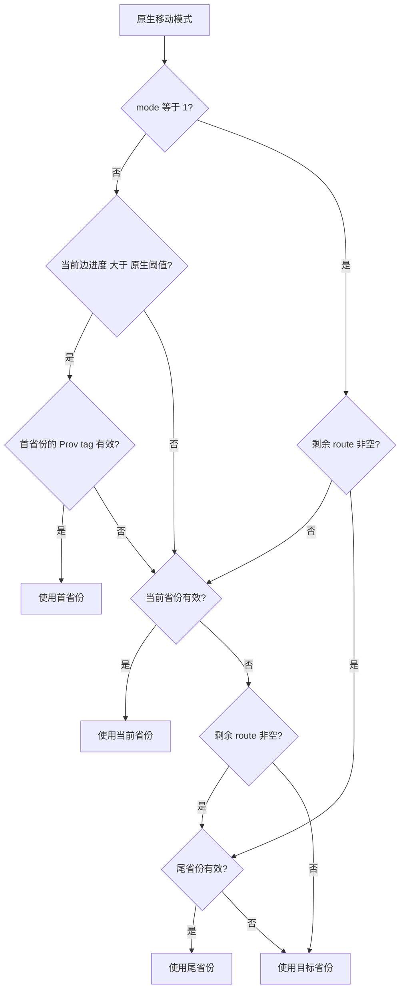

# CK3 1.20.0.2 军事命令与移动预览迁移

> 2026-10-10 主线整合：恢复来源提交 `c6fb7258fa109063dea3d7c79962d295c7d5e948` 的研究。下文“当前”均指原调查时的构建与样本；没有新增实机验收，也没有把结论外推到 CK3 1.20.0.4。文中外置原始路径是历史定位，本次未重新读取那些原件。

本页记录 2026-10-01 的后台静态迁移。游戏版本为 `1.20.0.2`，Steam build `25588574`，EXE SHA-256 为 `AE1BA6FF060BA603842F6F4A2DED0AF4B7D3666B3DD271F75FB01B0DA8E81B2D`。本轮仅读取冻结的 EXE 文件、编译代码并执行调用者自有内存夹具，未启动、附加、读取或操作正在运行的游戏。

实现位于 `ck3_autonomous_player/native_bridge/include/xar_bridge/ck3_12002_military.hpp` 和 `src/ck3_12002_military.cpp`。八个入口覆盖默认征兵、移动、移动预览、解散、均分、合并、开始强攻及停止强攻。状态与对象解析通过 `MilitaryWorldAccess` 回调接入新版本状态模块；动作通过统一 `CommandBindings` 同步克隆并入队。代码不再调用 1.19 的地址。

## 已闭合的原生入口

| 入口 | 1.20.0.2 RVA | 参数与原件生命周期 |
|---|---|---|
| 角色首都 | `0x28B1CD0` | `Province*(Character*)` |
| 默认征兵省份选择 | `0x24A51B0` | `(Character*, capital, 0, -1)`；后两项为距离范围 |
| Raise 构造 / 校验 / 析构 | `0x298C130` / `0x298C2C0` / `0x11F2E00` | `0x50` 栈原件；`RaiseEntry{province_id,-1}`；析构 flags `0` |
| 移动模式 | `0x296A0A0` | `(CUnit*, Province*, direct_target=1)` |
| 角色 / 军队 / 完整移动校验 | `0x29675F0` / `0x24AC1B0` / `0x2969570` | 玩家 command kind `1`；使用原生最终判定 |
| MovePath / path context / route planner | `0xD1A0B0` / `0x2648060` / `0x2648150` | path `0x130`，context `0x70`；context 无独立堆载荷析构 |
| Move 析构 | `0x2969620` | `0x168` 栈原件，path 在 `+0x38`；析构 flags `0` |
| 解散完整校验 | `0x296A620` | `(kind=1, internal CArmyID, nullptr)` |
| 均分完整校验 | `0x296CF60` | `(kind=1, internal CArmyID, CharacterID, nullptr)` |
| 合并工厂 / array append / 完整校验 / 析构 | `0x297BCF0` / `0x9E3790` / `0x296EF90` / `0x296A220` | 原生工厂分配 `0x40` 原件；原生 array append；析构 flags `1` |
| 开始 / 停止强攻完整校验 | `0x29738C0` / `0x2973A70` | `(kind=1, CharacterID, SiegeID, nullptr)` |
| 均分与强攻 POD 析构 | `0x9D1560` | `0x30` 栈原件；析构 flags `0` |

默认征兵先检查首都与选择结果的 `Province+0x85C == 0x50726F76`。旧 getter 的调用链已经对照：原先的 `0x224CC80` 组合了首都 getter 与省份 selector；新构建直接复现这条组合。原生默认征兵路径 `0x2A7EDA3..0x2A7EE43` 明确使用 entry 第二项 `-1`；普通 UI 的另一种上下文不能代替此证据。

## 本次确定的布局变化

`CUnit+0x178` 仍为带 generation 的内部 `CArmyID`，与公共 `CUnit+0x10` 的 ID 不同。解散、均分使用内部 ID；移动、合并使用公共 ID。夹具令两种 ID 的 generation 与 slot 都不同，避免误把公共 ID 传入内部校验。

`Province` 当前 SiegeID 从旧 `+0x790` 改为 `+0x788`。强攻前置观测使用新位置，并核对 `Siege+0x200` 的省份指针和 `Siege+0x44C` 的强攻状态。夹具在旧位置写入无关值，同时在新位置放入正确 ID，覆盖该真实迁移风险。

原生命令的 primary vtable `+0x40` 仍提供同步堆克隆；动态数组由原生 allocator 深拷贝。原件和入队克隆分别按原生生命周期回收。新 UI submit wrapper 不保存可靠的 bool，因此本模块采用已闭合的 `QueueOwnedCommand` 的实际返回值；队列拒绝不会被报告为成功提交。

## 移动预览中的 origin 迁移

旧 `ResolveMoveOrigin` callable 已被内联进新 `0x24ABBE0`。本模块的 `ResolveMilitaryMoveOrigin` 复现 `0x24ABC07..0x24ABD10` 的原生分支，调用进度 getter `0x24AB2F0`、首省份 getter `0x24AA7D0`、尾省份 getter `0x24AA820`，并读取同构建阈值 `0x5C699E8`。没有给旧函数猜测一个新 RVA。

预览只构造原生临时 MovePath 并复制路线，不入队动作。在军队已经进入某条边时，公开 `origin_province_id` 保持为同一暂停帧观测到的当前省份；有效规划起点作为路线首项保留。原生规划再次经过当前省份时也完整保留，例如 `[有效起点, 当前省份, 目标]`。

## 离线证据与验收边界

ABI 合同：`ck3_autonomous_player/native_bridge/research/ck3_1_20_0_2_military.json`。已对冻结 EXE 验证 **54 个唯一 signature、14 组 vtable prefix、38 条指令语义和 7 个源码布局常量**。

合成夹具：`src/ck3_12002_military_test.cpp`，MSVC `19.51`、C++20、`/W4` 编译并执行通过。覆盖全部动作的完整原生校验参数、玩家 command kind 与 channel、入队失败结果、动态载荷释放、暂停移动预览、mid-edge 路线、原生 origin 回退，以及新旧 SiegeID offset。

结果落盘：`artifacts/migrations/2026-09-30/post-update-1.20.0.2/military-binding-result.json`；EXE 与逐段反汇编在同目录 `military-command-research/`、`military-move-research/`、`military-raise-merge-research/`。测试二进制位于 `build-military-msvc/military-test.exe`。

模块整体的离线包为 `static-ready`；已通过的实机格另列如下。其余动作继续使用新构建的暂停实机矩阵逐项验证。队列 ACK 仅代表提交，不能替代游戏结果，单项夹具通过也不代表完整 OODA。

## 2026-10-01 暂停实机增量（F17）

实机由协调者独占操作，军事代理仅从落盘 MCP report 生成下一份具体请求和判定结果。会话证据在 `artifacts/migrations/2026-09-30/post-update-1.20.0.2/live-1.20.0.2/attempt-17/mcp.json`，种子为外部一次性军事夹具，以下仅标 `fixture-live`。

- **M02 均分通过**：公共军队 `33554611`（内部 `CArmyID=33554607`）在省份 `2619`，玩家 `29829`，原为 3 个团、2200 人。均分后原公共 ID 保留，恰好新增公共兄弟 ID `33554628`（内部 `CArmyID=16777572`），两军分别为 1 个团/600 人、2 个团/1600 人。日期 `53168784` 保持暂停；团数、现有/最大人数与原生 AI 战力合计全部守恒。判定原件：`fixtures/military/f17-m02-result.json`。
- **M03 合并通过**：`merge-armies-33554611-with-33554628` 后兄弟 ID 消失，目的军队完整 ID、owner、省份与日期保留；军力恢复为 3 个团/2200 人、原生战力 `5660000000`。判定原件：`fixtures/military/f17-m03-m04-result.json`。
- **M04 预览通过**：`preview-move-army-33554611-to-2618` 返回原生起点 `2619` 与完整路线 `[2618]`；预览前后的暂停、日期与玩家军队投影相同。它没有写入移动 target 或 route。判定原件同上。
- **M05 移动到达通过**：目标 `2618` 和路线 `[2618]` 在后继暂停帧实际生效。一日后同军队仍在 `2619`；原生只读 ETA 给出日期 `53168880`，随后推进 3 日并实测军队在该日期恰好到达 `2618`，恢复 `regular`、target=null、route=[]。完整 ID/owner 保留，3 个团/2200 人与原生战力守恒。途中向另一个目标 `2615` 的只读预览返回 `[2618,2615]`，并未替换实际移动目标 `2618`。判定原件：`fixtures/military/f17-m05-result.json`。

另复用 P11 `attempt-11/mcp.json` 的 `route-preview` 已保存结果：移动中的公共军队 `83886341` 在省份 `2615`、日期 `53169048`，预览起点为 `2615`、目标 `2591`，完整多边路线 `[2609,8756,2606,2593,2592,2591]` 与暂停帧的实际 native route 相符。这是已有 active multi-edge 查询证据；该行没有公开边进度数值，不能据此声称原生阈值两侧的 numeric mid-edge 分支均已实机通过。

均分、合并使用 `raw_step → hold 1 秒 → fresh paused snapshot/strength query` 闭合实际效果。M05 移动提交的即时 `after_snapshot` 仍可能是旧缓存：F17 的移动 ACK 已为 `submitted`，同一步快照却仍为 `regular`、target=null、route=[]。后继暂停帧 `move-applied` 实测为 `moving`、target=`2618`、route=`[2618]`；首个一日推进精确增加 24 个 native 小时，军队仍在 `2619` 且路线保留，完整 4 日后才验证到达。动作生效与到达使用各自真实帧，不能由 ACK 或旧缓存推断。围城与强攻继续等待各自真实结果。

F17 的 M06/M01 后续尝试保留失败原件 `fixtures/military/f17-m06-m01-failed-attempt.json`：M06 解散夹具军队返回 `submitted`，其 1 秒 settle 尚未完成时 nested hold 又进入下一份 M01 清理旧军计划；该原生命令返回 `disband state unavailable`，异常同时终止外层 hold。该尝试缺少完成的 M06 后置帧，不能证明解散生效或默认征兵通过，也不能仅由交叠执行判断 ABI 错误。随后由协调者修正 harness、独立完成 F18 并收集下面的实际结果；F17 不追改成通过。

## F18 默认征兵与独立解散收口

F18 使用已修正 control-plan nesting depth 的冻结 harness，由协调者独占执行 typed MCP，未重复 M02–M05。`attempt-18/mcp.json` 的已完成步骤与暂停快照冻结到 `fixtures/military/f18-m01-m06-evidence.json`（SHA-256 `d04cf68624dd658d3ddfa563bde7d726cb069ef53ad83500cc3b700933e3bf7b`）；判定在 `fixtures/military/f18-m01-m06-result.json`。

- **M06 独立解散通过**：`ck3_disband_army(83886341)` 返回 `war_action.status=disbanded`，后继暂停 `player_armies=[]`，日期 `53168784` 保持不变。这才闭合实际删除；F17 的 raw ACK 尝试仍作为失败证据保留，不追改成通过。
- **M01 默认征兵通过**：从空军队集合调用 `ck3_raise_troops_default`，新公共 ID `100663557`（内部 `CArmyID=67108949`）在原生默认省份 `2619` 生成，owner=`29829`，真实可控，typed 结果为 `raised`。初始与一日后 `army_state=gathering(code=5)`，原生军力 query 为 available、0 个团/0 人；再推进 3 日后同 ID 具有 20 个团、现有 1416 人、最大 1431 人、战力 `5178400000`，日期为 `53168880`。该军仍在 gathering，不能写成全部集结完成。

旧 typed raise 的 production primitive 合同仅要求实际新增可控 full-generation CUnitID（现有 `native_driver.py` 的 `RAISE_TROOPS_STEP` 分支），没有要求等完全部远端征召。F18 已覆盖该合同，并额外证明了同军队真实非零成军；此次 isolated userdir 的证据级别仍为 `fixture-live`。原版 `NCombat.UNRAISED_LEVY_REGIMENTS_SPEED=40.0` 使用距离单位/日，军队 UI 调用 `Army.GetGatheringDaysLeft/GetGatheringProgress`，说明集结并非固定一日。当前 MCP 公开 state code 与军力，尚未公开该 ETA；本轮已有真实人数结果，不为等待全部远端征召添加 ABI 或门禁。

M01–M06 冻结总索引为 `fixtures/military/military-M01-M06-frozen-result.json`，分别记录已通过结果 SHA 与保留失败 attempt。八入口中默认征兵、均分、合并、预览、实际移动到达、解散已在该版本完成上述夹具验收；剩余动态 Siege 观测、强攻开始/停止与时间/伤亡/进度结果继续单独收集实机证据。它们不等同于整局战争 OODA。
