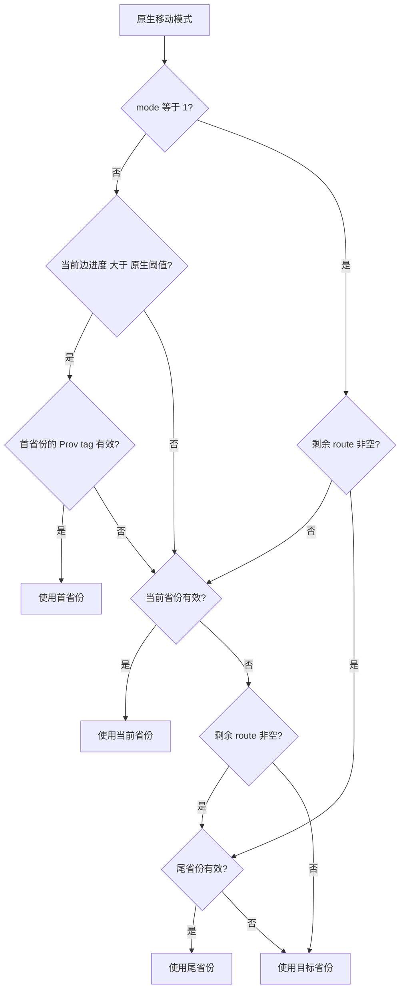

# CK3 1.20.0.2 军事命令与移动预览迁移

本页记录 2026-10-01 的后台静态迁移。游戏版本为 `1.20.0.2`，Steam build `25588574`，EXE SHA-256 为 `AE1BA6FF060BA603842F6F4A2DED0AF4B7D3666B3DD271F75FB01B0DA8E81B2D`。本轮仅读取冻结的 EXE 文件、编译代码并执行调用者自有内存夹具，未启动、附加、读取或操作正在运行的游戏。

实现位于 `ck3_autonomous_player/native_bridge/include/xar_bridge/ck3_12002_military.hpp` 和 `src/ck3_12002_military.cpp`。八个入口覆盖默认征兵、移动、移动预览、解散、均分、合并、开始强攻及停止强攻。状态与对象解析通过 `MilitaryWorldAccess` 回调接入新版本状态模块；动作通过统一 `CommandBindings` 同步克隆并入队。代码不再调用 1.19 的地址。

## 已闭合的原生入口

| 入口 | 1.20.0.2 RVA | 参数与原件生命周期 |
|---|---|---|
| 角色首都 | `0x28B1CD0` | `Province*(Character*)` |
| 默认征兵省份选择 | `0x24A51B0` | `(Character*, capital, 0, -1)`；后两项为距离范围 |
| Raise 构造 / 校验 / 析构 | `0x298C130` / `0x298C2C0` / `0x11F2E00` | `0x50` 栈原件；`RaiseEntry{province_id,-1}`；析构 flags `0` |
| 移动模式 | `0x296A0A0` | `(CUnit*, Province*, direct_target=1)` |
| 角色 / 军队 / 完整移动校验 | `0x29675F0` / `0x24AC1B0` / `0x2969570` | 玩家 command kind `1`；使用原生最终判定 |
| MovePath / path context / route planner | `0xD1A0B0` / `0x2648060` / `0x2648150` | path `0x130`，context `0x70`；context 无独立堆载荷析构 |
| Move 析构 | `0x2969620` | `0x168` 栈原件，path 在 `+0x38`；析构 flags `0` |
| 解散完整校验 | `0x296A620` | `(kind=1, internal CArmyID, nullptr)` |
| 均分完整校验 | `0x296CF60` | `(kind=1, internal CArmyID, CharacterID, nullptr)` |
| 合并工厂 / array append / 完整校验 / 析构 | `0x297BCF0` / `0x9E3790` / `0x296EF90` / `0x296A220` | 原生工厂分配 `0x40` 原件；原生 array append；析构 flags `1` |
| 开始 / 停止强攻完整校验 | `0x29738C0` / `0x2973A70` | `(kind=1, CharacterID, SiegeID, nullptr)` |
| 均分与强攻 POD 析构 | `0x9D1560` | `0x30` 栈原件；析构 flags `0` |

默认征兵先检查首都与选择结果的 `Province+0x85C == 0x50726F76`。旧 getter 的调用链已经对照：原先的 `0x224CC80` 组合了首都 getter 与省份 selector；新构建直接复现这条组合。原生默认征兵路径 `0x2A7EDA3..0x2A7EE43` 明确使用 entry 第二项 `-1`；普通 UI 的另一种上下文不能代替此证据。

## 本次确定的布局变化

`CUnit+0x178` 仍为带 generation 的内部 `CArmyID`，与公共 `CUnit+0x10` 的 ID 不同。解散、均分使用内部 ID；移动、合并使用公共 ID。夹具令两种 ID 的 generation 与 slot 都不同，避免误把公共 ID 传入内部校验。

`Province` 当前 SiegeID 从旧 `+0x790` 改为 `+0x788`。强攻前置观测使用新位置，并核对 `Siege+0x200` 的省份指针和 `Siege+0x44C` 的强攻状态。夹具在旧位置写入无关值，同时在新位置放入正确 ID，覆盖该真实迁移风险。

原生命令的 primary vtable `+0x40` 仍提供同步堆克隆；动态数组由原生 allocator 深拷贝。原件和入队克隆分别按原生生命周期回收。新 UI submit wrapper 不保存可靠的 bool，因此本模块采用已闭合的 `QueueOwnedCommand` 的实际返回值；队列拒绝不会被报告为成功提交。

## 移动预览中的 origin 迁移

旧 `ResolveMoveOrigin` callable 已被内联进新 `0x24ABBE0`。本模块的 `ResolveMilitaryMoveOrigin` 复现 `0x24ABC07..0x24ABD10` 的原生分支，调用进度 getter `0x24AB2F0`、首省份 getter `0x24AA7D0`、尾省份 getter `0x24AA820`，并读取同构建阈值 `0x5C699E8`。没有给旧函数猜测一个新 RVA。

预览只构造原生临时 MovePath 并复制路线，不入队动作。在军队已经进入某条边时，公开 `origin_province_id` 保持为同一暂停帧观测到的当前省份；有效规划起点作为路线首项保留。原生规划再次经过当前省份时也完整保留，例如 `[有效起点, 当前省份, 目标]`。

## 离线证据与验收边界

ABI 合同：`ck3_autonomous_player/native_bridge/research/ck3_1_20_0_2_military.json`。已对冻结 EXE 验证 **54 个唯一 signature、14 组 vtable prefix、38 条指令语义和 7 个源码布局常量**。

合成夹具：`src/ck3_12002_military_test.cpp`，MSVC `19.51`、C++20、`/W4` 编译并执行通过。覆盖全部动作的完整原生校验参数、玩家 command kind 与 channel、入队失败结果、动态载荷释放、暂停移动预览、mid-edge 路线、原生 origin 回退，以及新旧 SiegeID offset。

结果落盘：`artifacts/migrations/2026-09-30/post-update-1.20.0.2/military-binding-result.json`；EXE 与逐段反汇编在同目录 `military-command-research/`、`military-move-research/`、`military-raise-merge-research/`。测试二进制位于 `build-military-msvc/military-test.exe`。

本模块目前为 `static-ready`。协调者接入完整 adapter 与 owning-thread 调度后，剩余验证为新构建的暂停实机矩阵：逐项提交动作、读取实际变化、比较移动预览与真实路线。队列 ACK 仅代表提交，不能替代游戏结果；本轮没有 live 或完整 OODA 的新增结论。
