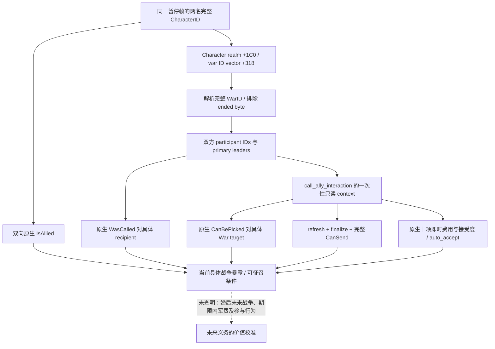

# 1.20.0.2：具体盟友的战争暴露与原生征召条件

**2026-10-01 15:03:53（Asia/Shanghai）冻结记录**：用户已暂停战争相关研究。本页和下述已经完成的源码、ABI 与离线夹具
保留为历史静态证据，立即停止继续研究或迭代；当前 FAMILY obligations candidate 不注册或调用此战争 reader。
冻结索引为 `artifacts/g2-offline-2026-10-01/family-obligations/alliance/.xar-frozen-evidence.json`。

此专题使用 Crozier 1.20.0.2 / Steam build 25588574，EXE SHA-256
`AE1BA6FF060BA603842F6F4A2DED0AF4B7D3666B3DD271F75FB01B0DA8E81B2D`。
本次研究与验收只读取冻结的 EXE、原版脚本和自有 fixture；没有连接 CK3。

## 原生输入与决策树

`common/character_interactions/00_alliance.txt` 的 `call_ally_interaction` 使用具体
WarID 作为 `scope:target`。盟友身份、能否选择该战争、是否已经被征召、是否已在战争
任一方以及完整 `CanSend` 是不同条件；盟友身份不等于必须参战。原版还对进攻与防御
征召的拒绝使用不同后果，并存在原生最终判定中的例外。查询复用最终原生结果，不展开
通用宗教系统，也不把原版当前战争的费用解释为婚姻未来全部战争费用。

## Exact-build 调用与布局

原生 CallAlly UI 在 `0x1398D60` 读取 actor 的 `Character +0x1C0`、
`realm +0x318` 的 WarID vector。`0x1398F30` 对每条战争依次调用
`CanBePicked 0x307A690`、双方 `ContainsParticipant 0x2494B60` 及
`WasCalled 0x2497770`。War 对象以 `+0x08` 的完整 ID 解析；原生战争 storage
slot 是 `0x5D1DE58`，fallback slot 是 `0x5D1DE40`。`+0x358` 是单字节 ended
标记，与已完成的新版本世界读取器一致。

UI 的 `0x1398930` 把 type index `16` 与完整 WarID 写入 window 的
`+0x3B8/+0x3C0`，其 context 位于 `+0xC8`，因此 context target 位于
`+0x2F0/+0x2F8`。`0x10E7810` 对这个 context 调用 `refresh(true) 0x3078A60`
与 `finalize 0x3078C90`；完整发送判定是 `0x307C040`。
查询构造并释放自己的 `0x338` 字节 context，不构造 command，不向队列提交。

交互定义按稳定 key `call_ally_interaction` 通过新版本原生 hash / lookup 解析：
`0x3F7E240`、`0xA055E0`，数据库 slot `0x5C67538`，missing sentinel slot
`0x5D1DD28`。解析后核对定义 key、hash 与 `GDbO` kind；不依赖旧版数据库序号。
双向盟友关系复用已验证的新版本 `IsAllied 0x2911DF0`。

## 交付与边界

新增 producer 输出双方各自的现役 WarID、进攻/防御方、首领及参战者 ID、另一方当前
参战状态、是否已征召、原生 target gate、完整 CanSend、即时费用、接受度与自动接受。
没有战争的完整空集合是可观察的结果；失败读取不能当作零费用或无义务。
具体 projected marriage alliance 尚未建立时，当前 `IsAllied=false` 与 native CanSend
negative 如实保留，不能把它们冒充未来婚姻接受后的征召结果。

本轮 producer 的 exact ABI 验证与生产 reader fixture 已通过，状态为 `static-ready`：

- `ck3_12002_family_obligations_alliance_abi.json` 固定 13 个原生字节区间、7 条实际
  call/jump、14 个原生 operand 与 17 个源码常量；同时核对原版交互脚本文件 SHA。
  合同 SHA-256 `e768457621864c241fc568fb4881fa76bbed8a2abddcebe450c789aed3544f45`。
- `run_ck3_12002_family_obligations_alliance_tests.py` 的 `/Od /MDd` 与 `/O2 /MD`
  均以 `/W4 /WX` 编译并通过四组实际 reader fixture。覆盖进攻与防御战争、双方
  战争集合、对立方参战、已征召、完整 CanSend 与 target gate 的独立 negative、
  未建立联盟的当前 negative、完整空集合、失效 WarID、实际 ended 字节、定义身份、
  finalized roles、native 接受度失败及自有 context 完整释放。没有游戏连接。
- 结果保存在 `Z:\ck3_mod_rewrite\artifacts\g2-offline-2026-10-01\family-obligations\alliance\`
  的 `abi-result.json` 与 `build/result.json`。后者同时固定五份实际编译源码的 SHA。

实机暂停帧、自然征召、独立参战结果以及期限内军费仍待实机；不会因此提升 G2 M5 的
完成数。父工作包负责既有私有 mailbox/MCP 接线；此专题的独立 producer 交付不冒充
已经注册的新游戏查询或已经完成整局策略。
