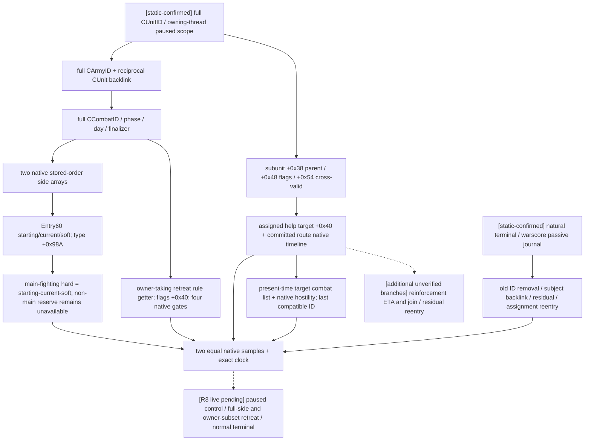

# CK3 1.20.0.2：战中帧、增援与战后迁移

本包截至 2026-10-01 的战中控制、主动撤退与自然终结矩阵为 `static-ready`，R3 外部夹具为 `prepared-only`。用户已授权新版实机，由协调者独占游戏；本工作包只读冻结文件与保存的 artifact、编译夹具和准备请求。新版本 paused 战斗帧与动作后置条件仍须真实取证，旧版本 live artifact 不升级为新版本证据。

冻结 EXE 为 `artifacts/migrations/2026-09-30/post-update-1.20.0.2/installation/binaries/ck3.exe`，SHA-256 为 `AE1BA6FF060BA603842F6F4A2DED0AF4B7D3666B3DD271F75FB01B0DA8E81B2D`。机器合同在 [ck3_1_20_0_2_battle.json](../../ck3_autonomous_player/native_bridge/research/ck3_1_20_0_2_battle.json)，用 `scan_anchors.py` 在冻结文件上验证 18 个唯一签名和 7 组 RTTI vtable 前缀，另冻结 73 条原生字段指令与 30 个源码常量供统一 ABI 检查器复核。

## 已完成的实现

- `ReadBattleControlSnapshot`：完整 CombatID、phase/day/winner/finalizer、双方原生顺序军队、兵团 starting/current/soft 与可确定的 hard、owner hard ledger、64 位 advantage、native strength、撤退影响范围与四个原生合法性门。
- `ReadBattleTransitionSnapshot`：按完整 CombatID 查询，不依赖所选军队仍能操作；旧 generation 已删除时明确返回 `combat_not_found`。
- `ReadBattleReinforcementAssignmentV1`：完整 coordinator/subunit/parent membership，原生 request/assignment flags、power、实际 help target、已提交路线、原生路线到达时间，以及“若此刻接触”的同省 compatible CombatID。没有用当前战斗推测未来 CombatID。
- `ReadBattleTerminalTransitionV1`：被动 journal 的正常结果与无正常结果分支、战分记录、旧 CombatID/省份/result 是否仍存在、军队路线与战斗 backlink、同省 residual combat 与 assignment reentry 分类。
- `ck3_12002_battle_journal`：旧被动记录算法的独立新版本绑定，在 managed startup 的 primary thread suspended 边界安装；自然结果是否真正进入 journal 要由新版本 terminal artifact 验收。

调用方传入同一 paused `game::Snapshot`，读者检查真实 native clock，并比较两次完整结果。公开 DTO 沿用 `game_contract.hpp`，native pointer 不跨 wire。`BindBattleImage` 只接受本页 exact SHA，并自动组合新的 route bindings 和 Province resolver。

## 已证的不兼容性

| 原生面 | 1.20.0.2 静态证据与变化 |
|---|---|
| Combat storage | `module+0x5D1DE70`；`0x24E8360` 用 `CArmy+0x128` 完整 ID 查询、核对 `CCombat+0x08` |
| Combat/side 布局 | `0x25863A0` 与 `0x264CA60` 构造链确认 sides `+0x20/+0x368`、phase `+0x6B0/+0x6B4`、side buckets/ledger/backpointer 沿用原布局 |
| 战中兵团对象 | `module+0x5D1F340` 是 **CArmyRegiment** storage，构造器 `0x2A9EFDA` 写入 RTTI `TPdxRefDatabase<CArmyRegiment>` vtable `0x477C150`；其 serializer `0x2632E60` 确认 type `+0x18`、所属 CArmyID `+0x140`。`CRegiment` 是另一种对象，其 serializer `0x262A0C0` 的 `+0x118` type 与 `+0x140` bool 不得混入此读取路径 |
| main phase 分类 | `0x265538C` 读取兵团 type **`+0x98A`**，旧 `+0xA0A` 已失效；非主战 reserve 不计算 hard |
| strength leaves | side `0x2651100`、entry `0x2657B50`；是 native strength，不是胜率 |
| 撤退合法性 | `0x258AA10`；owner land status **`CCharacter+0x1C0`**，规则对象 **flags `+0x40` bit 10** |
| 规则查询 ABI | `0x28C2E10` 明确接收 **`CCharacter* owner` 于 RCX**。旧专题的 `void*()` 声明不能照搬；新实现显式传 owner |
| CAISubunitStack | constructor `0x19F26D6`、serializer `0x1A19D50`、recalculation `0x1A1D420`：request power `+0x28`；cross power `+0x30`；parent `+0x38`；help target `+0x40`；flags `+0x48`；cross validity 移到尾部 `+0x54` |
| 原生 help target | 仅 `assigned_to_help` 为真时读取 subunit `+0x40`；parent `+0x60` 继续 opaque，不当作 Province |
| Province 列表 | combat IDs **`+0x758/+0x760/+0x764`**；units `+0x740/+0x748/+0x74C`；`0x258DB49` 移除旧 CombatID，`0x247F1D0` 互证完整数组 |
| 自然终结入口 | `0x258CD50`，前 **16 bytes** 是完整可复制指令；新 prologue 已变化，不可使用旧 19 byte signature |
| 战分记录入口 | `0x249A940`；原生 `CWar+0x298` rows 仍成立；记录器保留原生 append 行号/正负侧语义 |

## 原生读取树

这棵树仅迁移观测与已有原生语义，没有修改我方战斗策略或宗教系统。

## 离线验证与剩余实机入口

`ck3_12002_battle_test.cpp` 用 fixture-owned objects 覆盖：旧 generation、双方顺序、超过 32 位的 advantage、新 main-phase flag 与旧 offset decoy、reserve/hard 区分、合法 tick-start cache 落后、owner 参数与新规则 flags offset、daily-dispatch guard、subunit 变更布局、power、已对齐空路径 ETA、同省现时 hostile binding，以及正常终结 journal 在 CombatID 删除后的保留读取。MSVC 19.51 x64 C++20 编译和执行 GREEN。

结果及源文件 SHA 在 `artifacts/migrations/2026-09-30/post-update-1.20.0.2/battle-binding-result.json`，可执行文件为同目录 `battle-offline-test.exe`。初次独立编译发现 Windows min/max 宏冲突，已通过标准 `numeric_limits` 括号调用修复；没有通过关闭检查来消除错误。

本轮旧 GREEN 迁移必验项是新版本真实 paused 控制帧、hold 跨日、full-side/owner-subset 合法撤退后置条件及正常自然终结 journal/战分。增援 asking-help 的旧 primitive 另保留，旧版本尚未验收的 ETA/join 与 residual/reentry 不因升级自动变成回归缺口；这些分支仍是附加能力，不能宣称已完成。

## R3 当前帧合同与夹具

可运行步骤和外部文件维护在 `artifacts/migrations/2026-09-30/post-update-1.20.0.2/live-1.20.0.2/fixtures/combat/README.md` 与 `prepare_battle_matrix.py`。合同按干净 `5d1b565` 核对，后续 `97883fd` 的 service/MCP/driver 合同未变。生成器只读保存的 snapshot/capabilities：只对当前 `controllable + in_combat` 且具体 action step advertised 的 CUnit 发布 control 请求；按已观测的 prior CombatID 发布 transition/terminal，允许撤退后继续查询。

Hold 的真实 MCP 是 `ck3_execute_step("life-advance", expected_revision)`，战中和撤退 horizon 为一天；合法日由 `legality` 的实际 elapsed/baseline/earliest-date 决定，不照搬旧 day 15。撤退真实入口是 `ck3_preview_active_combat_retreat_v1` 和 `ck3_order_active_combat_retreat_v1`：后者的 public revision、CombatID、side、scope、token 全由前者当帧结果取得。`accepted_verification_pending` 仍需实际 retreating/target/route 与 prior-C 两侧成员后置条件。

自然终结先保存 `terminal_journal.latest_sequence`；正数用作 `after_terminal_sequence`，0 对应 `None`。结束后要求 observed event 超过旧 cursor、`normal_result`、实际 winner/result 和战分行/方向，另保存 removal/subject/successor。严格 `combat_not_found` 仅证明旧 generation 删除，不能替代终结结果。

三个新外部 inbox 分别构造自然终结（玩家 10000 对 1500）、full-side（5000 对 5000）与 mixed-owner（另加实际随机有地附庸 3000）。每份都是 UTF8 BOM 的裸 `if` 多行 effect 脚本，root 为 GetPlayer，玩家限定、各独立 `has_global_variable` guard，由 root 在当前围城完成后人工调用。对手通过 stock `random_character_war` 的 `primary_attacker=root` 过滤后从 `primary_defender` 保存实际 scope，每个 army 用 `war=scope:x120battle_war` 绑定同场真实战争。新敌方 spawn、附庸入战仍须实际 snapshot/marker 证明，完整来源与哈希在 `seed-provenance.json`。不新增战争或 production AI hook。

F20 实证否定了把 `run xar_mcp_inbox.txt` 当作逐行 console commandfile 的解释：包裹 `effect = { ... }` 后 error.log 明确报 `Unknown effect: effect`。该 console handler 读取的是 effect 脚本，先前成功的 `combined-inboxes/military_siege.txt` 与婚姻 `seed-adult.txt` 均为裸 `if`。因此已撤回 wrapper、恢复 bare effect；F20 的错误归于 harness 格式，不当作敌方 spawn 或 battle reader capability RED。

F21 准备还移除了 `character:36108` 数值解析假设。冻结 `events/activities/feast_activity/feast_default_events_jason.txt:205..237` 明确使用 character war iterator 与主攻守方保存 opponent scope，`common/scripted_effects/00_interaction_effects.txt:1963..1971` 互证过滤与 scope；`events/bookmark_events.txt:1522` 确认 `spawn_army` 可接受 `war=scope:war`。在本轮两场玩家主攻战争并存时，夹具可选到其中任一实际主防守方，最终身份必须取 native artifact，不保证旧固定 CharacterID 或 WarID。

这轮还修正了 `BattleScopeMatches` 的真实暂停判断：只读 Jomini `byte +0x20`，`+0x24` tick cache 与相邻字节均不能使 running 帧成为 paused。`ck3_12002_battle_test.cpp` 的 tick-cache/邻字节 decoy 定向 MSVC 夹具 GREEN，结果与源码/EXE 哈希更新于 `battle-binding-result.json`；新的生产 DLL 要在协调者下一托管启动前重新构建。
