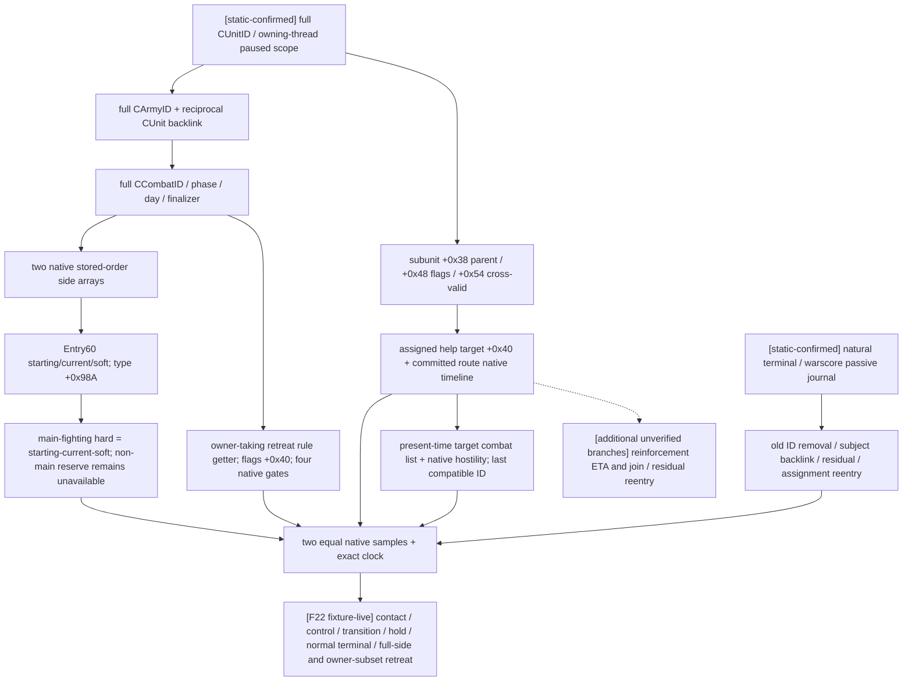

# CK3 1.20.0.2：战中帧、增援与战后迁移

> **2026-10-03 授权覆盖：** 宗教、战争与战斗的研究、实现、策略和实机验收已全面开放；此前仅非战争、战争暂停及 `WAR_CASH/PREWAR` 必须 OFF 的授权限制撤销。下文冻结包的实际 OFF 与历史暂缓理由保留当时事实。未实现的观测与 exact-build/readiness 缺口继续施工，授权不代表完整 combat v3 已就绪。唯一原普通罗贝尔 `29829` campaign、原生 AI 研究优先、exact-build 绑定与最小化/noFocus 继续有效；实机由 ROOT 单一 owner 操作。

截至 2026-10-01 F22，当前省份 actual contact、战中 control/transition、官方 hold、正常自然终结 journal/战分、合法 full-side 与 owner-subset 撤退均已达到 `fixture-live`。F21 terminal baseline 的真实 `state_changed` 已由新 DLL 从同一战中存档恢复后的观测证明修复；本轮三类旧 GREEN 战斗回归均完成。用户已授权新版实机，由协调者独占游戏；本工作包只读冻结文件与保存的 artifact、编译夹具和准备请求。外部 fixture profile 的 `production_profile_verified=false`，这些结果不升级为 production-live 或完整战争 OODA。

冻结 EXE 为 `artifacts/migrations/2026-09-30/post-update-1.20.0.2/installation/binaries/ck3.exe`，SHA-256 为 `AE1BA6FF060BA603842F6F4A2DED0AF4B7D3666B3DD271F75FB01B0DA8E81B2D`。机器合同在 [ck3_1_20_0_2_battle.json](../../ck3_autonomous_player/native_bridge/research/ck3_1_20_0_2_battle.json)，用 `scan_anchors.py` 在冻结文件上验证 18 个唯一签名和 7 组 RTTI vtable 前缀，另冻结 73 条原生字段指令与 30 个源码常量供统一 ABI 检查器复核。

## 已完成的实现

- `ReadBattleControlSnapshot`：完整 CombatID、phase/day/winner/finalizer、双方原生顺序军队、兵团 starting/current/soft 与可确定的 hard、owner hard ledger、64 位 advantage、native strength、撤退影响范围与四个原生合法性门。
- `ReadBattleTransitionSnapshot`：按完整 CombatID 查询，不依赖所选军队仍能操作；旧 generation 已删除时明确返回 `combat_not_found`。
- `ReadBattleReinforcementAssignmentV1`：完整 coordinator/subunit/parent membership，原生 request/assignment flags、power、实际 help target、已提交路线、原生路线到达时间，以及“若此刻接触”的同省 compatible CombatID。没有用当前战斗推测未来 CombatID。
- `ReadBattleTerminalTransitionV1`：被动 journal 的正常结果与无正常结果分支、战分记录、旧 CombatID/省份/result 是否仍存在、军队路线与战斗 backlink、同省 residual combat 与 assignment reentry 分类。
- `ck3_12002_battle_journal`：旧被动记录算法的独立新版本绑定，在 managed startup 的 primary thread suspended 边界安装；F22 已实际保留自然场 event 5 与撤退后正常结果 event 12。

调用方传入同一 paused `game::Snapshot`，读者检查真实 native clock，并比较两次完整结果。公开 DTO 沿用 `game_contract.hpp`，native pointer 不跨 wire。`BindBattleImage` 只接受本页 exact SHA，并自动组合新的 route bindings 和 Province resolver。

## 已证的不兼容性

| 原生面 | 1.20.0.2 静态证据与变化 |
|---|---|
| Combat storage | `module+0x5D1DE70`；`0x24E8360` 用 `CArmy+0x128` 完整 ID 查询、核对 `CCombat+0x08` |
| Combat/side 布局 | `0x25863A0` 与 `0x264CA60` 构造链确认 sides `+0x20/+0x368`、phase `+0x6B0/+0x6B4`、side buckets/ledger/backpointer 沿用原布局 |
| 战中兵团对象 | `module+0x5D1F340` 是 **CArmyRegiment** storage，构造器 `0x2A9EFDA` 写入 RTTI `TPdxRefDatabase<CArmyRegiment>` vtable `0x477C150`；其 serializer `0x2632E60` 确认 type `+0x18`、所属 CArmyID `+0x140`。`CRegiment` 是另一种对象，其 serializer `0x262A0C0` 的 `+0x118` type 与 `+0x140` bool 不得混入此读取路径 |
| main phase 分类 | `0x265538C` 读取兵团 type **`+0x98A`**，旧 `+0xA0A` 已失效；非主战 reserve 不计算 hard |
| strength leaves | side `0x2651100`、entry `0x2657B50`；是 native strength，不是胜率 |
| 撤退合法性 | `0x258AA10`；owner land status **`CCharacter+0x1C0`**，规则对象 **flags `+0x40` bit 10** |
| 规则查询 ABI | `0x28C2E10` 明确接收 **`CCharacter* owner` 于 RCX**。旧专题的 `void*()` 声明不能照搬；新实现显式传 owner |
| CAISubunitStack | constructor `0x19F26D6`、serializer `0x1A19D50`、recalculation `0x1A1D420`：request power `+0x28`；cross power `+0x30`；parent `+0x38`；help target `+0x40`；flags `+0x48`；cross validity 移到尾部 `+0x54` |
| 原生 help target | 仅 `assigned_to_help` 为真时读取 subunit `+0x40`；parent `+0x60` 继续 opaque，不当作 Province |
| Province 列表 | combat IDs **`+0x758/+0x760/+0x764`**；units `+0x740/+0x748/+0x74C`；`0x258DB49` 移除旧 CombatID，`0x247F1D0` 互证完整数组 |
| 自然终结入口 | `0x258CD50`，前 **16 bytes** 是完整可复制指令；新 prologue 已变化，不可使用旧 19 byte signature |
| 战分记录入口 | `0x249A940`；原生 `CWar+0x298` rows 仍成立；记录器保留原生 append 行号/正负侧语义 |

## 原生读取树

这棵树仅迁移观测与已有原生语义，没有修改我方战斗策略或宗教系统。

## 离线验证与剩余实机入口

`ck3_12002_battle_test.cpp` 用 fixture-owned objects 覆盖：旧 generation、双方顺序、超过 32 位的 advantage、新 main-phase flag 与旧 offset decoy、reserve/hard 区分、合法 tick-start cache 落后、owner 参数与新规则 flags offset、daily-dispatch guard、subunit 变更布局、power、已对齐空路径 ETA、同省现时 hostile binding，以及正常终结 journal 在 CombatID 删除后的保留读取。MSVC 19.51 x64 C++20 编译和执行 GREEN。

结果及源文件 SHA 在 `artifacts/migrations/2026-09-30/post-update-1.20.0.2/battle-binding-result.json`，可执行文件为同目录 `battle-offline-test.exe`。初次独立编译发现 Windows min/max 宏冲突，已通过标准 `numeric_limits` 括号调用修复；没有通过关闭检查来消除错误。

本轮旧 GREEN 迁移必验项是新版本真实 paused 控制帧、hold 跨日、full-side/owner-subset 合法撤退后置条件及正常自然终结 journal/战分。增援 asking-help 的旧 primitive 另保留，旧版本尚未验收的 ETA/join 与 residual/reentry 不因升级自动变成回归缺口；这些分支仍是附加能力，不能宣称已完成。

## F21 实际接触、战中帧与 hold

`attempt-21/battle-r3-initial-hold-evidence.json` 冻结了原 MCP artifact 的 7 个完整步骤；`battle-r3-initial-hold-assessment.json` 用 12 项实际字段检查验证 contact/control/transition/hold，SHA-256 为 `5D1A21FC8D0E863465F13EF482C130C984114696138B4738E6C63AC0F37C9FA4`。这是外部自然终结 seed 的实际战斗，尚不是完整战争 OODA 或自然终结通过。

| 实际项 | 新版本观测 |
|---|---|
| 当前省份 / CombatID | `2619` / `234881048` |
| actual contact | `in_combat` / `post_contact_observation`，双方与 control/transition 顺序一致 |
| battle attacker | public CUnit `50331775` / native CArmy `16777309` / owner `36108` |
| battle defender，所选玩家 | public CUnit `16777588` / native CArmy `50331761` / owner `29829` |
| 兵力 | attacker regiment `33554869` 为 `150000000` Q100000（1500）；defender `33554868` 为 `1000000000`（10000），双方 stored current 与 entry-derived 相同，soft/hard 均 0 |
| width / native strength | base/final `5750`；attacker `30150`，defender `239200` |
| 初帧 | public revision `58` / native `57` / date `53169264`，maneuver day `1`，winner none |
| 官方 hold | `life-advance` 返回 elapsed `1`、`postcondition`、paused true；不是仅命令 ACK |
| hold 后帧 | public `61` / native `60` / date `53169288`，同 CombatID maneuver day `2` |
| 撤退合法性 | 两帧均 full-side、too-early；elapsed `1→2`、exclusive minimum `14`、earliest date `53169600` |

自然 seed 已实际生成对手并进入战斗，不能继续把这个场景只记作 prepared；另外两个撤退 seed 仍未执行。首帧已是 in-combat，没有保存 seed 前的 current-province create-new 查询，故该预接触分支本场没有新增实证；后续 full-side 场景应在推进前采集，不能倒填。

terminal baseline 的 ACK 为 accepted，但内部 `status=unavailable`、`battle_terminal_transition_ready=false`、原因 `state_changed`；journal 为 empty latest `0`，后续 cursor 参数为 `None`。这是真实 terminal 查询缺口，不能计入通过。协调者先保存同一 CombatID 的战中 checkpoint，待最小 reader 修复和新 DLL 后从该帧继续正常终结；不为修查询而重种本场或伪造已发生结果。

F21 后最小静态修复去掉了 `Route()` 把 `CUnit+0x30` 强制当作移动目标省份的检查。冻结原生目标 getter `0x24AA820` 从 `CUnit+0x38/+0x44` 的 stored path tail 取目标，空路径返回 null；`0x247A820` 的 `+0x30` 则用于 contact adjacency。新 reader 以真实 path.back 派生目标，空路径保留无目标；增援已经位于 assignment 省份的空路径仍保留当天 ETA。Result `+0xC4` 未改，`0x258DB01` 的 retention compare 证实它仍为原生计数。

`battle-terminal-route-fix-result.json` 留存修前 terminal assertion RED、修后全 battle fixture GREEN 与 MSVC 日志，最终源码 SHA 为 `640AB27A55E8802966617C8C7C9B4DDA69C6EED21F2E3FC3F83188198A49A6B9`，test SHA 为 `EC1BC5873A03514C61309D7E1889ED51CE0F9C837F32FE89B3324CE3176744E3`。夹具专门复现 F21 的 active-human/no-AI/empty-path 形状并放置非 Province 的 `+0x30` decoy；这是对错误目标语义的确定性回归，不表示已公开读取到 F21 的 raw `+0x30`。该静态结果保留当时未实测的历史边界，后续真实修复证据见 F22。

## F22 自然终结与 full-side 撤退

F22 使用 DLL SHA `784304da9f6b0c92f11b206f07a416ec4bf716e5bec9c32d920b257533a58515` 恢复同一 CombatID `234881048` / subject `16777588`。`terminal-baseline-fixed` 在 date `53169288` 返回 available、ready true、`active_not_terminal`、空 route 和 null target；F21 的 `state_changed` 已在真实读取路径消除。baseline journal latest 为 0，cursor 参数仍取 `None`。

`attempt-22/battle-r3-natural-evidence.json` 冻结了 25 个完整步骤，SHA `2B7751A257A427305CD077B04DF5984B4BA87E97BF3B677B931FE2C7DA0F3771`；`battle-r3-natural-assessment.json` 的 12 项检查全部 PASS，SHA `4D7864BE2442A90FB60CEE0969C7B02DB749D6E6FCDA7245FB2C125ACC5E237F`。assessment 关联 F21 失败、精确 DLL 身份及三份单独冻结的原始 wire 子集与哈希，后续军队解散不改变此前终结帧。

| 自然场实际项 | F22 观测 |
|---|---|
| main day 1 / date | `53169360`，双方 casualty/owner ledger available，control ready true |
| tick-start cache | attacker stored `150000000` / derived `132921000`；defender stored `1000000000` / derived `993050000`，双方 matches-derived false，但不影响公开 readiness |
| 正常终结 | date `53169600` / native revision `30`，journal event/latest `5`，`normal_result`、suppress false、phase `3`、winner `1`、wipe true |
| 原生战分 | War `16777290` row `0`，value/delta `+1573950` Q100000，即 `+15.7395`；battle defender 获胜，而赢家是 war attacker，combat side 0 不是 war attacker |
| 删除与结果保留 | 旧 CombatID 严格查询失败、省份列表已移除；BattleResult 严格存在、relevant-player count `1` |
| subject / successor | 军队仍存在，backlink/active Combat 均 null、空 route/null target、blocked false；`no_successor` |

缓存合计与 entry 即时值的差异是已观测字段，不把这一标志当作新的 blocker；实际 main 帧、owner ledger 与公开 readiness 已可用。独立 transition 在正常终结后返回 `combat_not_found`，正常结果本身由 journal 证明。

full-side 场实际 Combat `251658264`，玩家 subject `33554804` / CArmy `67108977` / owner `29829`，battle attacker 为 opponent `29097` 的 CUnit `83886164`。date `53169960` 是 native earliest gate，elapsed `15`、main day `11`、`legal_now=true`、scope `full_side`。已发布 objective `2609` 的官方 preview 为 action-ready，route `[2618,2615,2609]`，source revision `59`；fresh token order 被消费，随后 paused snapshot 实际确认 retreating、target 和完整 route。独立 transition 进入 attacker 获胜的 pursuit，day 0 后官方 hold 验证 day 1；保留旧 C/backlink 是追击期间的正确结果，不能要求即时删除。

`battle-r3-full-side-evidence.json` SHA `E0413EB842755A39731135922A0B69C1D6DD2B9E67DCDE122469F0A3F6F8BE9E`；`battle-r3-full-side-assessment.json` SHA `2C061B9F273209F5A64617ABF88B45165A07FADA96F2D7A17054624A403B62A4`，11 项实际检查 PASS。date `53170080` 旧 C 已删除，journal event `12` / latest `13` 为 normal result；War `16777280` row 0 战分 delta `-211150` Q100000。subject 不再被战斗阻塞，原生后续自动败退改为 target `8751` / route `[2617,2632,2613,8752,2628,2626,8751]`；这与最初下单后观测到的 `2609` route 分别保留。

两个顶层 `combat_id` 引用 KeyError 与未发布目标 `2618` 的 preview 错误均保留为 harness-plan RED。clean `97883fd` 的通用 preview 只展开已发布目标集合；改用已发布的 `2609` 后同一战中调用实测通过，无需改 native、Python 或目标策略。full-side 首次 contact 也已是 `in_combat`，本轮没有补证 pre-contact `create_new`。mixed-owner seed 的附庸 spawn 不等于参加该战争，owner-subset 必须以实际两侧数组与非空 unaffected 集合验收。

F22 原 owner-subset seed 执行后的 Combat `318767116` 仅包含 player `50331766` 与 opponent `83886164`，省份里另有 `100663567` 却没有进战斗数组，control 因此正确返回 full-side。`spawn_army war=scope:war` 不能替代角色参战的 `add_attacker`。为修夹具，新增外部 `seed-owner-subset-join-war-v2.txt`：以当前玩家的实际 war iterator 先将新选的 ruling vassal 加入所有 `primary_attacker=root` 的战争，再在玩家资本生成其 3000 人军队，绑定其中一场实际战争，覆盖并存战争而不用数值 character scope。stock `feast_default_events_jason.txt:304` 与 `character_interaction_events.txt:1827..1838` 提供 war-scoped `add_attacker` 的原版例子。新独立 guard 为 `x120battle_owner_joined_repair`。实际执行后同一 C 的 defender 顺序为 `[50331766,117440793]`：player/native `50331753` 的 owner `29829` 是 affected，新增 native `67109102` 的 owner `32716` 是 unaffected；attacker 仍为 `[83886164]` / owner `29097`。native revision `73` / date `53170080` 的查询、同帧重复与 day 8 都返回 `owner_subset`，earliest date `53170440`。前提证据冻结在 `battle-r3-owner-subset-precondition-evidence.json`，SHA `19E06EA1EAF73DC0B6FACC09188CD2481C1D46139B2005856F0B2A8953F27351`。无需切换玩家或改变 driver episode。

date `53170440` / main day `11` 的官方 owner-subset preview 已为 action-ready、legal-now，affected `[50331766]`、unaffected `[117440793]`，发布目标 `2609` 的 route 为 `[2618,2615,2609]`。fresh source revision `100` 的 token 被下单消费；初始缓存上的 order 响应仍为 verification-pending，稍后 native revision `100` / public `101` 的实际 paused snapshot 才证实玩家军队 `retreating=true`、`in_combat=false`、目标和完整路线匹配。原 C 的独立 transition 保持 main day 11、winner none，attacker `[83886164]` 不变，defender 只剩 `[117440793]`；affected 已离开两侧，unaffected 和敌方均保留。terminal 查询同时读到玩家 backlink/active-C null、state `2`、not blocked。played character `29829`、日期与暂停保持不变。原 C 仍 active，因此 journal 没有该 C 的终结 event、successor 当前 unavailable 符合这一帧，不能把它写成另一场自然终结。

`battle-r3-owner-subset-evidence.json` SHA `19CE6AB03C459A937BA2F3506259E3AE0D7E7A8D7151CB25515BCC050279FC6E`；`battle-r3-owner-subset-assessment.json` SHA `66A9A8C510EC6D03F9C4BE2304AD14BEB552D788C199EC9B343F678E835EA650`，11 项实际检查 PASS，含独立冻结 wire 子集与哈希。三类统一索引为 `battle-r3-summary.json`，SHA `EF82DEC796C6CD1E81072CD19F31790BBECD89F023A54C29AF1248FB5382BE84`：自然场、full-side 与 owner-subset 全部 fixture-live PASS。本轮旧 GREEN 回归已闭合，额外 reinforcement ETA/join/residual-reentry、预接触 create-new/join-existing 和宗教输入尚未实现的完整 v3 仍分别保持原能力边界，不为完成战斗回归扩大范围。2026-10-02 已全面开放宗教研究；能力缺口不再由宗教禁令阻断。

## R3 当前帧合同与夹具

可运行步骤和外部文件维护在 `artifacts/migrations/2026-09-30/post-update-1.20.0.2/live-1.20.0.2/fixtures/combat/README.md` 与 `prepare_battle_matrix.py`。合同按干净 `5d1b565` 核对，后续 `97883fd` 的 service/MCP/driver 合同未变。生成器只读保存的 snapshot/capabilities：只对当前 `controllable + in_combat` 且具体 action step advertised 的 CUnit 发布 control 请求；按已观测的 prior CombatID 发布 transition/terminal，允许撤退后继续查询。

Hold 的真实 MCP 是 `ck3_execute_step("life-advance", expected_revision)`，战中和撤退 horizon 为一天；合法日由 `legality` 的实际 elapsed/baseline/earliest-date 决定，不照搬旧 day 15。撤退真实入口是 `ck3_preview_active_combat_retreat_v1` 和 `ck3_order_active_combat_retreat_v1`：后者的 public revision、CombatID、side、scope、token 全由前者当帧结果取得。`accepted_verification_pending` 仍需实际 retreating/target/route 与 prior-C 两侧成员后置条件。

自然终结先保存 `terminal_journal.latest_sequence`；正数用作 `after_terminal_sequence`，0 对应 `None`。结束后要求 observed event 超过旧 cursor、`normal_result`、实际 winner/result 和战分行/方向，另保存 removal/subject/successor。严格 `combat_not_found` 仅证明旧 generation 删除，不能替代终结结果。

三个新外部 inbox 分别构造自然终结（玩家 10000 对 1500）、full-side（5000 对 5000）与 mixed-owner（另加实际随机有地附庸 3000）。每份都是 UTF8 BOM 的裸 `if` 多行 effect 脚本，root 为 GetPlayer，玩家限定、各独立 `has_global_variable` guard，由 root 在当前围城完成后人工调用。对手通过 stock `random_character_war` 的 `primary_attacker=root` 过滤后从 `primary_defender` 保存实际 scope，每个 army 用 `war=scope:x120battle_war` 绑定同场真实战争。新敌方 spawn、附庸入战仍须实际 snapshot/marker 证明，完整来源与哈希在 `seed-provenance.json`。不新增战争或 production AI hook。

F20 实证否定了把 `run xar_mcp_inbox.txt` 当作逐行 console commandfile 的解释：包裹 `effect = { ... }` 后 error.log 明确报 `Unknown effect: effect`。该 console handler 读取的是 effect 脚本，先前成功的 `combined-inboxes/military_siege.txt` 与婚姻 `seed-adult.txt` 均为裸 `if`。因此已撤回 wrapper、恢复 bare effect；F20 的错误归于 harness 格式，不当作敌方 spawn 或 battle reader capability RED。

F21 准备还移除了 `character:36108` 数值解析假设。冻结 `events/activities/feast_activity/feast_default_events_jason.txt:205..237` 明确使用 character war iterator 与主攻守方保存 opponent scope，`common/scripted_effects/00_interaction_effects.txt:1963..1971` 互证过滤与 scope；`events/bookmark_events.txt:1522` 确认 `spawn_army` 可接受 `war=scope:war`。在本轮两场玩家主攻战争并存时，夹具可选到其中任一实际主防守方，最终身份必须取 native artifact，不保证旧固定 CharacterID 或 WarID。

这轮还修正了 `BattleScopeMatches` 的真实暂停判断：只读 Jomini `byte +0x20`，`+0x24` tick cache 与相邻字节均不能使 running 帧成为 paused。`ck3_12002_battle_test.cpp` 的 tick-cache/邻字节 decoy 定向 MSVC 夹具 GREEN，结果与源码/EXE 哈希更新于 `battle-binding-result.json`；新的生产 DLL 要在协调者下一托管启动前重新构建。
