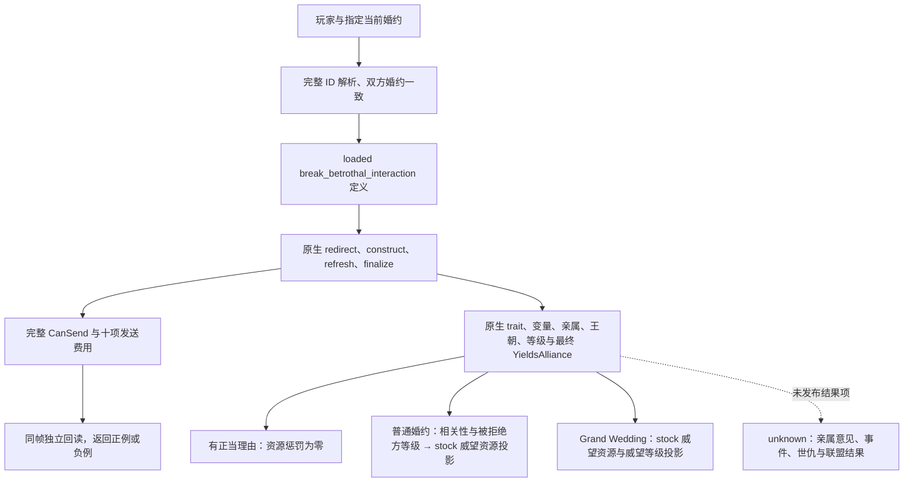

# CK3 1.20.0.2：毁弃当前婚约的原生条款

本页记录 2026-10-01 的后台迁移。冻结构建是 `1.20.0.2 Crozier`，EXE SHA-256 为
`AE1BA6FF060BA603842F6F4A2DED0AF4B7D3666B3DD271F75FB01B0DA8E81B2D`。
所有证据来自 EXE 文件、原版脚本及夹具拥有的对象；没有访问运行中的 CK3。

## 已实现的读取

`ck3_12002_family_obligations_break.hpp/.cpp` 提供实际只读来源：
`BindFamilyObligationsBreakImageV1` 和 `ReadFamilyObligationsBreakTermsV1`。
它以玩家、指定受控角色、该角色当前双方一致的婚约和明确的 interaction recipient 为输入，
读取原生最终角色、完整 `CanSend` 与十项发送费用。原生否决保留为可用的负面观测；没有婚约有单独的
`no_betrothal` 状态。任何查询都不构造或提交 send command。

关键地址与定义身份：

| 来源 | 1.20 RVA / 偏移 | 原生证据 |
| --- | --- | --- |
| Interaction 数据库 getter | `0x89DA60` → slot `0x5C67538` | 真实调用 `0xA81191` |
| Stable key hash | `0x3F7E240` | 调用 `0xA811CC`，key bytes / uint32 length |
| Loaded definition lookup | `0xA055E0` | 调用 `0xA811D6`，database / signed hash |
| Missing definition | slot `0x5D1DD28` | lookup 返回支路 `0xA056EA` |
| Definition identity | ordinal `+0x10` / hash `+0x14` / key string `+0x18` | producer `0x3144A05` / `0x3144A21` / `0x3144A24` |
| Definition kind | `+0x38 = 0x4744624F` | producer `0x3144A57`、caller `0xA811DE` |
| 六角色 redirect | `0x3148DE0` | 调用已加载 definition `+0x17D8` 的 script scope redirect |
| All-role context | `0x3076E50`，大小 `0x338` | actor `+0x2D8`、recipient `+0x2DC`、secondary actor `+0x2E0` |
| Refresh / finalize / CanSend | `0x3078A60` / `0x3078C90` / `0x307C040` | 复用已迁移的 1.20 context 生命周期 |
| 发送费用 evaluator | `0x310CEE0` | definition `+0x40` / context scope `+0x08` |

定义必须是 `break_betrothal_interaction`，并同时通过 loaded kind、canonical key、native hash 和 runtime ordinal
校验；没有把普通 arrange-marriage definition 当成毁约定义。Native redirect 可以改变收件人；若它选择了另一个
secondary actor，则本次指定角色查询不可用。查询后重新读取日期、玩家和当前双方婚约，保持原生结果同帧。

## 原生决策树与费用边界

原版 `common/character_interactions/00_marriage_interactions.txt:1990–2185` 区分自己的婚约、受控廷臣／子女的婚约
及收件人婚约；`redirect` 决定 `secondary_actor`（被毁约的我方角色）。最终合法性包括强钩子、用于婚约的钩子
及正在举行的 Grand Wedding。原生 `CanSend` 负责这些最终判定，适配器不重写它们。

**发送费用与毁约后惩罚分开。** 原版 `on_accept:2227–2327` 根据正当理由、Grand Wedding promise、
亲属／王朝或 `yields_alliance` 相关性，以及被拒绝方／相关 matchmaker 的最高头衔等级，应用威望损失。
Grand Wedding effect 还执行 `add_prestige_level = -1`。这不是 definition `+0x40` 十项 cost 的一部分。
因此即使十项费用全部为零，也不能推断毁约没有代价。

实际来源现在还组合 `ck3_12002_family_obligations_break_penalty.hpp/.cpp`，从原生 trait presence／flag、
`promised_grand_wedding_by` 变量、matchmaker、亲属、王朝、最高等级与 `CYieldsAlliance` 四角色最终判定读取
本帧输入，再依冻结原版条件投影资源惩罚。返回 `outcome_resource_penalty.resource_penalty_available`、
`stock_prestige_effect_raw` 和 `stock_prestige_level_effect`。普通婚约按等级投影 0／35／75／150／350／750／1500
威望；Grand Wedding 投影上移一级并扣一个威望等级。全部 raw 威望使用 `100000` 比例，资源损失为负值。

该结果的 `source = stock_branch_projection_1.20.0.2`：它不是已加载 mod override 的 script-value 观测，
也不是实际执行后的扣款。完整事件、家族意见分布、世仇与联盟后果没有物化，保留 `effects_complete = false`。
同性交往只为原版“正当毁约理由”调用必要的原生 game-rule 与 opaque rite parameter 判定，没有发布通用宗教接口。
未读取的资源惩罚不作为零值送进联合婚配效用。

Penalty 的原生读取使用最高等级 `0x28AC6B0`、matchmaker `0x2B94D10`、close-family `0x29120A0`、
close-or-extended-family `0x2912290`、trait flag `0x2BB0EB0` 与四角色 `YieldsAlliance` `0x2C7C650`。
后者保留原生 actor／target 必须有 realm data 的前提，且只作为本婚姻威望分支的相关性输入，没有开展战争义务研究。
等级是当前 1.20 原生 title-template `+0x64` 的 `0=none / 1=barony / 2=county / 3=duchy / 4=kingdom /
5=empire / 6=hegemony`。`has_been_promised_grand_wedding` 的权威脚本是
`04_ep2_wedding_triggers.txt:12–14`，语义就是 `has_variable = promised_grand_wedding_by`；读取复用已迁移的
完整 CharacterID variable target、context `+0x10`、count `+0x1C`、stride `0x20` 与 name ID `+0x08`。
`eunuch_1` 和 `beardless_eunuch` 两个具体 trait 是脚本的正当理由输入，没有把其他“宦官”字符串当成等价条件。

## 验证与后续

`ck3_12002_family_obligations_break_verify.py` 已对冻结 EXE 验证 8 个唯一字节区间、19 条语义指令和
9 个直接源码绑定。结果：
`artifacts/g2-offline-2026-10-01/family-obligations/break/abi-result.json`。

实际 provider 的 `/Od` 与 `/O2`、`/W4 /WX` 夹具均 GREEN，覆盖 canonical definition、六角色 ABI、
双方当前婚约、完整正／负 `CanSend`、签名费用、无婚约、redirect 选择另一角色、同帧结果丢弃及 context 析构。
组合版本还通过实际 native callback 驱动 promise／trait／matchmaker 来源，观察到王国 Grand Wedding 的
`-75000000` 威望资源投影、`-1` 威望等级，与独立的 send-charge vector 同时保留。
最终结果：`artifacts/g2-offline-2026-10-01/family-obligations/break/build-composed-final/result.json`。
Penalty leaf 的 `/Od`、`/O2` 夹具另外覆盖全部普通／Grand 等级、无关角色、四角色联盟判定、原生 unlanded 前提、
两个不同 owner 分支、eunuch／cannot-marry 正当理由与必要的同性交往判定，结果在
`artifacts/g2-offline-2026-10-01/family-obligations/break/penalty/build/result.json`。
Penalty 独立 exact verifier 已验证 8 个完整函数、8 个 header 地址、7 个唯一前缀及重复 set predicate 的真实 rite
调用绑定、12 条语义指令与 6 份冻结原版文件哈希，GREEN：
`artifacts/g2-offline-2026-10-01/family-obligations/break/penalty/abi-result.json`。

这份证据是 `static-ready` 只读 primitive。1.20 的实际 paused 角色／条款回读与毁约后结果均未实机验证，
没有增加 G2 或完整婚姻循环的完成度。统一 FAMILY query 与 Python consumer 接入由上层工作包交付；
后续 paused 验证应核对已加载脚本与上述 stock projection 的一致性；实机后的资源／婚约／联盟结果是独立 receipt，
不能由 `CanSend`、费用投影或 ACK 代替。
