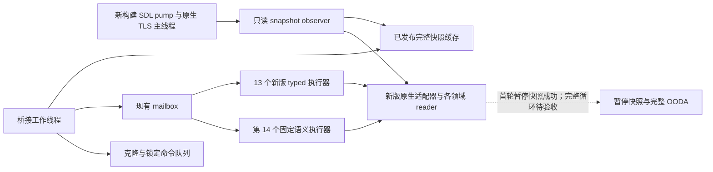

# CK3 1.20.0.2：桥接分发与应用主线程迁移

> **2026-10-02 授权覆盖：** 宗教领域已全面开放；旧暂缓理由仅记录当时状态。未实现的观测与 exact-build/readiness 缺口继续列为可施工项，不代表完整 combat v3 已就绪。罗贝尔唯一入口、战争研究停止及 `WAR_CASH/PREWAR=OFF` 保持有效。

本页记录 Crozier 新二进制的桥接集成；离线基线为 `static-ready`。2026-10-01 首轮受管实机已发布完整暂停快照并通过 loaded-features 查询；首轮整体仍为 RED，尚未完成 OODA 验收。
冻结 EXE 的 SHA-256 为 `AE1BA6FF060BA603842F6F4A2DED0AF4B7D3666B3DD271F75FB01B0DA8E81B2D`，磁盘证据位于
`artifacts/migrations/2026-09-30/post-update-1.20.0.2/`。本轮只读冻结磁盘与合成夹具，不读取、附加或操纵用户正在玩的游戏进程。

## 已实施的边界

1. 生产分发先识别 `ck3-1.20.0.2-msvc-x64`；新版专用原生模块提供绑定、布局与 reader。1.19.0.6 的原生绑定只进入旧版分支。
2. 十三个已有 typed 通道复用稳定请求解析与 DTO，拥有十三个固定的新执行器。新版的战争评估、事件窗口、待回复互动、战役根、加载功能和地图定位使用新版 serializer；其中的实际原生 locator 不能通过仅替换版本和 EXE 哈希伪装成已迁移。
3. `WorkerAdapter` 把普通声明战争、婚姻、军力、战斗 v2、战争结束查询，以及带原生合法性判定的普通命令，交给第十四个固定语义执行器。执行器只支持编译时枚举的现有 `GameAdapter` 方法，不接收任意原生函数地址。
4. 完整 `Snapshot` 含战争／省份 getter 和互动合法性判定，必须由应用主线程读取。SDL pump observer 在原生 TLS 主线程标记已验证时采样；工作线程只复制发布后的快照缓存。采样周期沿用 250 ms 心跳节奏，日期或暂停状态变化立即采样。暂停 typed 请求另在拥有线程内读取完整原生快照并比较前后同帧状态。
5. typed 执行器持有原生适配器；工作线程持有代理适配器。拥有线程内不会再次排队等待自身，从而避免嵌套 mailbox。
6. 暂停、恢复、速度与检查点走单独的克隆命令队列边界。其他调用依据上述拥有线程路径执行。新增通道没有改变现有 wire 命令名称或请求格式。
7. 战斗终结 journal 的启动安装按所选版本分流；新版本使用自己的 finalizer／warscore writer 与状态存储。旧版启动诊断补丁不会进入新版分支。
8. 导出身份按当前进程实际匹配的适配器生成。首选版本升级为 1.20.0.2 后，仍支持的 1.19.0.6 宿主不会被报告为新版构建。

## 合同与实证位置

- 中央生产代码：`ck3_autonomous_player/native_bridge/src/bridge.cpp`。
- 版本专用拥有线程 envelope：`include/xar_bridge/ck3_12002_query_mailbox.hpp` 与对应 `.cpp`。
- 工作线程代理、快照缓存与固定语义执行器：`include/xar_bridge/ck3_12002_semantic_adapter.hpp` 与对应 `.cpp`。
- pump／TLS exact-build profile：`ck3_12002_thread_runtime.*`；原生字节与函数入口证据由该领域迁移包维护。
- 战争 claim terms provenance：新 getter `0x2B9ECD0`，`00_claim.txt` SHA-256
  `887BF0197401CB17CB4588978ADD556AB6B429BF55CB482E3E5F2D0E8351CFD4`；原生领取状态仍按真实 reader 结果序列化。
- 本包直接 MSVC C++20 `/W4 /WX` 编译 `bridge.cpp`、`ck3_12002_semantic_adapter.cpp` 成功。
- 合成夹具与编译产物入口：`artifacts/migrations/2026-09-30/post-update-1.20.0.2/bridge-query-fixture/`；后续完整 DLL 链接及代理线程夹具结果由中央迁移报告汇总。
- `ck3_12002_semantic_adapter_test.cpp` 的独立 MSVC `/W4 /WX` 编译与运行均为退出码 0；
  `build-semantic-fixture/result.json` 记录真正分开的 worker／拥有线程、缓存发布、9 次 mailbox 请求、
  事件／军队／婚姻数据传递、query-specific unavailable 与观察失败恢复。原生回调在错误线程执行次数为 0。
- `build-semantic-fixture/result-before-fix.json` 保留一项 `HARNESS_RED`：夹具在正常卸载和会话结束后继续调用旧 proxy，
  超出了实际 `WorkerMain` 生命周期合同。这项额外断言已撤回；未为不可达的使用方式增加生产门禁。
- 战斗 v3 仍未注册为新版公共能力；内部阶段输出使用 `migration_native_phase_diagnostic` 和真实 source delta，
  没有沿用旧版 `production_exact_132_refs` 或把不完整的阶段输入称为完成。

## 尚需实机回答的问题

自然命令执行后的结果以及 battle journal 的自然捕获，仍须由新版实机 artifact 验证。
磁盘反汇编、MSVC 编译和合成线程夹具不能替代这些结果。本轮当时没有改变自动玩家策略，宗教域在当时仍暂缓；该限制已由 2026-10-02 的全面授权撤销。

## 2026-10-01 首轮受管实机与后续诊断

协调者独占游戏、桌面和进程操作。首轮证据保存在迁移目录的 `live-1.20.0.2/attempt-01/probe.json` 与 `probe.wire.jsonl`；桥接工作包只读这些文件，没有操作游戏。

- hello 匹配新版 exact SHA 与 `ck3-1.20.0.2-msvc-x64`；原生线程邮箱已安装，TLS owning marker 为 1，failure 为 0。
- UTC 21:17:21.923 发布 revision 2 的完整暂停快照：玩家角色 29829、战争 16777290、一支己军、三支敌军，并含行军路线和五个战争目标省份的原生状态。
- UTC 21:17:36.852 的 loaded-feature-manifest 查询成功，返回 44 个有效功能位和 30 个脚本 DLC key，使用新版 provenance。只读字段成立，不代表整局自动游玩完成。
- 首个 campaign-root 请求在整个 8 秒排队等待期内没有进入执行器，失败前 `executed_requests=0`。此前 pump epochs 曾连续约 20 秒不变；现有 wire 尚不能区分 observer 原生读取耗时与窗口 pump 停顿，不能把它写成 campaign reader ABI 失败。
- army-strength 的 harness 调用缺少数组参数，属于 harness RED，已改为从快照推导真实 army IDs；原始 attempt 不修改。受管清理 `tree_gone/cleanup_proven/driver_closed` 全部为 true，耗时约 2.69 秒。

下一轮 heartbeat 增加 `snapshot_observer_12002`，记录读取开始、完成、上次耗时、是否仍在读取和缓存是否可用。这些字段只帮助定位已出现的 pump 停顿，没有改变原生查询门禁或等待预算。

新增受管入口 `ck3_autonomous_player/native_bridge/research/run_ck3_12002_migration_probe.py`，使用 `--agent-source-root` 导入干净 committed package；`--private-step` 保存一次性原生诊断结果，避免走旧 phase parser。其窗口和进程动作仍由协调者执行。

两个私有诊断复用现有执行器，不增加公开 capability：

- `query-marriage-native-diagnostic-v1` 走第十四个固定语义执行器，调用新版婚姻 probe，保留原生合法性、角色、接受度和费用采样。
- `query-combat-phase-nonreligious-v1-<原 v3 参数后缀>` 走第四个 typed 执行器，输出实际非宗教 phase 字段，并明确 `full_phase_inputs_ready=false`；这是当时宗教与 rites 暂缓下的诊断范围。宗教授权现已全面开放，完整 v3 的字段实现、ABI 与实机证据仍未闭合。

上述诊断接入和 observer 字段已通过 MSVC C++20 `/W4 /WX` 编译；其新版实机结果以协调者的后续 attempt 为准。

## 第二轮前台对照

`live-1.20.0.2/attempt-02/probe.json` 为 harness GREEN；协调者在加载阶段恢复并激活自己的受管游戏窗口。
features、campaign-root、army-strength、marriage 四个公开查询全部成功，两个私有诊断均返回结果，受管清理成功。
这证明相应桥接路径实际执行成功；空婚姻候选与私有 phase 返回并不代表所有决策字段已经验收。

UTC 21:26:41 后约 35.82 秒内 pump epochs 从 684 增至 2692，observer 最近读取耗时为 0／15／16 ms，缓存有效。
加载阶段曾有一次 4188 ms observer 读取，当时只发布 `map_ready=false` 的启动前缀。
前台稳定阶段没有复现首轮加载后的约 20 秒停顿；首轮尚无 observer timing，因此不能倒推其原因。
下一项实际边界是最小化窗口后再次执行公开查询，不能把前台对照称为 headless 调度通过。

婚姻私有采样扫描 131072 个 storage slot，构造 34391 个原生候选上下文；当前角色 29829 的主配偶为 34730，候选合法性结果全部为 false。
phase 私有采样真实返回 `diagnostic_completed=true`、`nonreligious_ready=false`，原因为 `phase_nonreligious_operand_unavailable:native_sides`，非宗教字段尚为空。
其 base terrain 为 plains，但 `combat_width_multiplier_raw=4291601254`、precontact width final 为 149905631；该异常量级已交战斗领域按真实结果核对新版 layout。
这些遗留项属于具体实机数据问题，未以私有 command ACK 替代 readiness 验证。

## 第五轮加载末段排队与夹具 GUI 停顿

`live-1.20.0.2/attempt-05/bridge-readonly-diagnosis.json` 固定本包从原始 wire 与 debug.log 得到的结论：

- phase 请求 UTC 21:48:01.916 至 21:48:09.922 失败期间，pump epoch 始终为 3635、执行请求数为 0；observer 已完成，耗时 47 ms，缓存有效。原生 phase reader 没有开始，不能归为 reader ABI 失败。
- 随后的事件窗口查询与重复查询成功；选择脚本选项 4 后，实际 cancel marker 出现，快照中的 active event 消失。
- window-trigger 等待实际为约 60 秒，其间 240 个 heartbeat 的 pump epoch 从 3723 增至 7233，每个 heartbeat 至少增加 12，缓存持续有效。debug.log 中只有两次 counter 创建和一次 inbox 执行，selection 执行之后没有新的 `run` 或 `gui.createwidget` 命令。该失败属于夹具 GUI 轮询停顿，尚未到达 window native query。

三轮真实加载末段排队超时提供了改动依据：新版 typed 和 semantic 请求的 queued wait 从 8 秒改为 30 秒，client timeout 仍为 60 秒；旧版行为、执行中的 2 秒等待片和 title camera settlement 预算保持原值。没有新增门禁或额外采样。

现有 semantic fixture 的第一项请求先排队，再让拥有线程等待 9 秒才 pump。相同夹具链接旧 8 秒实现时退出码 1，链接新版 30 秒实现时退出码 0；结果传递、正确线程、ticket 回收和后续 typed 共存断言均通过。
`bridge-queued-wait-fixture/result.json`、`old/run.log` 和 `new/run.log` 保存编译、运行与源码哈希。此修复已离线验证；加载末段的新版实机复验由协调者完成。

## 第六轮战争结束查询的路线刷新

`attempt-06/war-options-analysis.json` 记录三个真实 available 查询和 72 小时推进。第四个查询在约 31.6 ms 内返回 unavailable；mailbox 执行请求数由 9 增至 10，属于已进入拥有线程的请求，而非排队超时。
wire 中 revision 15→16 的日期 53168952、paused、玩家、战争及其他字段全部不变；唯一变化是敌军 33554657 的 route 从 33 项缩为 31 项，move target 从 2602 变为 2589。
新版 envelope 的无条件完整快照相等比较会拒绝这次正常的暂停寻路结果刷新；callback 计数并不能证明内部战争 reader 已经执行。

只针对 `WorkerAdapter::read_war_termination_options` 使用专用比较策略：比较前忽略各 army 行的 `route_province_ids` 和 `move_target_province_id`。
其余完整字段仍参与比较，包括日期、暂停、玩家身份、战争分数、目标省份、army 身份、当前位置、观测标志和战斗状态。
其他查询与全部写操作仍使用原来的完整快照比较；没有重试写命令，没有改动 Python runtime、原生 RVA 或公开 wire DTO。
机器可读合同位于 `native_bridge/research/ck3_1_20_0_2_war_termination_options_query_scope.json`。

同一个拥有线程夹具已确定性复现 route-only 刷新：旧完整比较退出码 1，新策略退出码 0；同时证明 war score 改变仍在调用 native reader 前拒绝，写操作遇到 route 改变也仍拒绝。
线程归属、ticket 回收、typed 共存和 9 秒排队回归继续通过；证据保存于 `bridge-war-options-scope-fixture/result.json`。
该修复当前为 static-ready，完整战争循环是否解除这一实际阻点，以协调者的新 DLL 实机 attempt 为准。

## 固定 inbox 的私有 fixture 执行入口

第五轮已经实证：事件选择后的 fixture GUI timer 停止继续执行 inbox，而新版原生 owner pump 仍持续运行。
为解除这个夹具阻点，新版桥接增加精确私有 step `fixture-run-inbox-v1`，复用第十四个 semantic executor；没有新增公开 capability 或线程槽位。
payload 只沿用 `expected_snapshot_revision`，不接受命令或路径参数。拥有线程调用的固定文本是 `run xar_mcp_inbox.txt`，长度 21 字节。
native string 的分配、执行和释放使用 `ck3_12002_console_fixture.*`；exact-build 入口与地址证据由其
`research/ck3_1_20_0_2_console_fixture.json` 维护。

这个 fixture 脚本会立即改变世界状态，因此执行前仍完整比较快照，执行后的 Finish 仅为这个 op 接受预期 world delta。
暂停、日期、player ID、地图 ready、played character 的存在、ID 和存活状态仍须保持；其他查询及写操作的既有比较策略不变。
返回的 `result.fixture_inbox` 包含 `query_status`、`native_executed`、固定命令文本及 `marker_confirmed=false`。
原生 console bool 只说明命令执行结果；协调者的 SDK fixture 仍须先原子写入 inbox，再调用私有 step，最后核对唯一 debug.log marker 与目标快照。

MSVC C++20 `/W4 /WX` 的桥接对象编译和 semantic 集成夹具均为退出码 0。
夹具证明固定文本没有变化、console 在正确 owner 执行、五次 native 字符串分配与释放配对、立即事件／关系／军队／war score 变化可返回 executed；
执行前帧变化阻止 console 调用，执行后 player／日期／暂停变化仍拒绝，native rejection 保留明确 JSON。
此前战争选项 route-only 修复、其他 writes、9 秒排队、typed 共存与缓存恢复回归继续通过。
冻结证据在 `bridge-console-fixture/result.json`，scope 合同在
`research/ck3_1_20_0_2_private_inbox_semantic_scope.json`；当前为 static-ready，真实 native console 与 marker 验收由协调者执行。

## 第九轮固定 inbox 的随机作用域断言

第九轮 fixed-run 真实执行 selection 与 window 两个 fixture：返回 `native_executed=true`，各自 trigger marker 和
`console_success: Executing effect` 均出现；公开窗口读取与事件关闭也有真实结果。这两次成功说明私有 inbox 原生调用链已经进入 fixture-live，不能外推全部脚本 effects 已可用。

第三次 pending_accept 请求 UTC 22:37:22.690331→22:37:22.707632 在约 17.3 ms 内失败。
mailbox 执行请求数从 9 增至 10，failure 从 0 增至 512；该值是 `main_thread_query_failure_executor_exception`。
执行后的正常 scope 拒绝或 raw reader 返回 false 不会设置这个异常位，因此这次不是普通 Finish 比较失败。
debug.log 已写出 pending trigger，但没有后续 pending SEED 或 console_success；error.log 最后一行同时出现原生断言：
`Calling global random function without having called ALLOW_RANDOM_IN_SCOPE in this thread`。

最小根因是 pending fixture 创建角色所调用的全局随机函数缺少原生允许随机作用域。
application-main TLS 身份并不替代调用栈上的 `ALLOW_RANDOM_IN_SCOPE`。
下一项施工是静态闭合原生 console owner 链的随机作用域 ABI，仅为固定 fixture runner 补上对应作用域并由协调者复验；本证据不要求修改快照校验或 pending reader layout。
触发 marker 只证明部分脚本执行，不能称 pending seed 已完成。
`attempt-09/bridge-inbox-diagnosis.json` 固定 wire／触发报告／日志哈希与上述证据；本包没有操作游戏。

console fixture 领域随后闭合并接入原生随机 scope。中央 semantic 夹具同步增加局部 wrapper slot、native enter／exit mock；
五次 fixed-run 都在 owner 上完成 scope 安装、执行、string 析构和 scope 恢复，enter／exit 与 string 分配／释放各五次，最终 owner 与 wrapper 均恢复空值。
执行前帧变化没有进入随机 scope，原有路线查询、写操作、暂停／日期／玩家校验和排队回归继续通过。
MSVC `/W4 /WX` 编译及运行均退出 0，证据在 `bridge-console-rng-semantic-fixture/result.json`。
这里只修改离线 semantic test；原生随机 ABI 和生产 helper 的变更由 console fixture 领域维护，实机 pending 结果仍由协调者验收。
