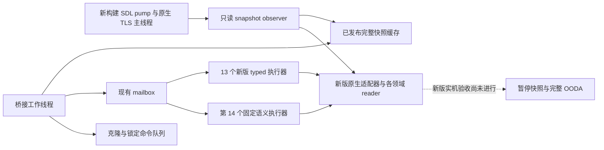

# CK3 1.20.0.2：桥接分发与应用主线程迁移

本页记录 Crozier 新二进制的桥接集成；状态为 `static-ready`，尚未进行新版实机注入、暂停快照或 OODA 验收。
冻结 EXE 的 SHA-256 为 `AE1BA6FF060BA603842F6F4A2DED0AF4B7D3666B3DD271F75FB01B0DA8E81B2D`，磁盘证据位于
`artifacts/migrations/2026-09-30/post-update-1.20.0.2/`。本轮只读冻结磁盘与合成夹具，不读取、附加或操纵用户正在玩的游戏进程。

## 已实施的边界

1. 生产分发先识别 `ck3-1.20.0.2-msvc-x64`；新版专用原生模块提供绑定、布局与 reader。1.19.0.6 的原生绑定只进入旧版分支。
2. 十三个已有 typed 通道复用稳定请求解析与 DTO，拥有十三个固定的新执行器。新版的战争评估、事件窗口、待回复互动、战役根、加载功能和地图定位使用新版 serializer；其中的实际原生 locator 不能通过仅替换版本和 EXE 哈希伪装成已迁移。
3. `WorkerAdapter` 把普通声明战争、婚姻、军力、战斗 v2、战争结束查询，以及带原生合法性判定的普通命令，交给第十四个固定语义执行器。执行器只支持编译时枚举的现有 `GameAdapter` 方法，不接收任意原生函数地址。
4. 完整 `Snapshot` 含战争／省份 getter 和互动合法性判定，必须由应用主线程读取。SDL pump observer 在原生 TLS 主线程标记已验证时采样；工作线程只复制发布后的快照缓存。采样周期沿用 250 ms 心跳节奏，日期或暂停状态变化立即采样。暂停 typed 请求另在拥有线程内读取完整原生快照并比较前后同帧状态。
5. typed 执行器持有原生适配器；工作线程持有代理适配器。拥有线程内不会再次排队等待自身，从而避免嵌套 mailbox。
6. 暂停、恢复、速度与检查点走单独的克隆命令队列边界。其他调用依据上述拥有线程路径执行。新增通道没有改变现有 wire 命令名称或请求格式。
7. 战斗终结 journal 的启动安装按所选版本分流；新版本使用自己的 finalizer／warscore writer 与状态存储。旧版启动诊断补丁不会进入新版分支。
8. 导出身份按当前进程实际匹配的适配器生成。首选版本升级为 1.20.0.2 后，仍支持的 1.19.0.6 宿主不会被报告为新版构建。

## 合同与实证位置

- 中央生产代码：`ck3_autonomous_player/native_bridge/src/bridge.cpp`。
- 版本专用拥有线程 envelope：`include/xar_bridge/ck3_12002_query_mailbox.hpp` 与对应 `.cpp`。
- 工作线程代理、快照缓存与固定语义执行器：`include/xar_bridge/ck3_12002_semantic_adapter.hpp` 与对应 `.cpp`。
- pump／TLS exact-build profile：`ck3_12002_thread_runtime.*`；原生字节与函数入口证据由该领域迁移包维护。
- 战争 claim terms provenance：新 getter `0x2B9ECD0`，`00_claim.txt` SHA-256
  `887BF0197401CB17CB4588978ADD556AB6B429BF55CB482E3E5F2D0E8351CFD4`；原生领取状态仍按真实 reader 结果序列化。
- 本包直接 MSVC C++20 `/W4 /WX` 编译 `bridge.cpp`、`ck3_12002_semantic_adapter.cpp` 成功。
- 合成夹具与编译产物入口：`artifacts/migrations/2026-09-30/post-update-1.20.0.2/bridge-query-fixture/`；后续完整 DLL 链接及代理线程夹具结果由中央迁移报告汇总。
- `ck3_12002_semantic_adapter_test.cpp` 的独立 MSVC `/W4 /WX` 编译与运行均为退出码 0；
  `build-semantic-fixture/result.json` 记录真正分开的 worker／拥有线程、缓存发布、9 次 mailbox 请求、
  事件／军队／婚姻数据传递、query-specific unavailable 与观察失败恢复。原生回调在错误线程执行次数为 0。
- `build-semantic-fixture/result-before-fix.json` 保留一项 `HARNESS_RED`：夹具在正常卸载和会话结束后继续调用旧 proxy，
  超出了实际 `WorkerMain` 生命周期合同。这项额外断言已撤回；未为不可达的使用方式增加生产门禁。
- 战斗 v3 仍未注册为新版公共能力；内部阶段输出使用 `migration_native_phase_diagnostic` 和真实 source delta，
  没有沿用旧版 `production_exact_132_refs` 或把不完整的阶段输入称为完成。

## 尚需实机回答的问题

新版模块是否在真实暂停窗口首次发布完整同帧快照、pump／TLS 是否实际就绪、自然命令执行后的结果以及 battle journal 的自然捕获，都必须由新版实机 artifact 验证。
磁盘反汇编、MSVC 编译和合成线程夹具不能替代这些结果。本轮也没有改变自动玩家策略或解除宗教域暂缓。
