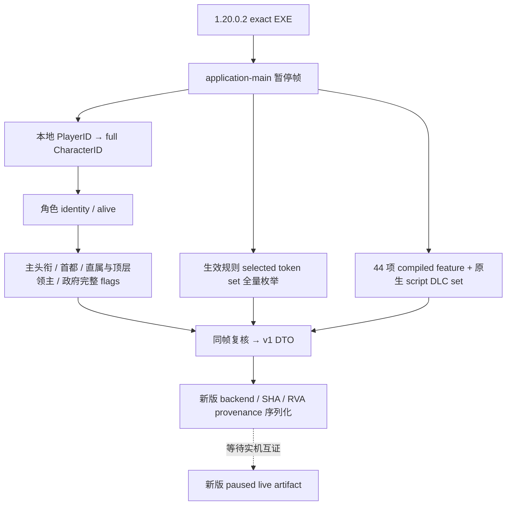

# CK3 1.20.0.2：campaign root 与 loaded features 迁移

本包迁移两项原生只读查询：`query-campaign-root-context-v1` 和
`query-loaded-feature-manifest-v1`。冻结 EXE 的 SHA-256 是
`AE1BA6FF060BA603842F6F4A2DED0AF4B7D3666B3DD271F75FB01B0DA8E81B2D`。
当前状态为 `static-ready`：原生入口、布局与序列化身份已迁移，并通过合成内存与原生 callback fixture。
尚未读取、注入或操作用户正在游玩的 CK3，故没有新版实机证据，也不宣称 `production-live`。

权威 ABI 在 [`ck3_1_20_0_2_campaign.json`](../../ck3_autonomous_player/native_bridge/research/ck3_1_20_0_2_campaign.json)。
该文件固定 13 处精确签名、42 条具体指令和完整 44 项 compiled feature 注册表；每项 feature 同时记录 native index、
CString ID、注册记录 RVA 与实际键字符串 RVA。它复用已有 v1 DTO 和 access/frame/request 合同；新 reader 与 serializer
使用 `xar::ck3_12002` 命名空间，旧版本实现保留。

## 已闭合的 native 查询链

| 字段或入口 | 1.20.0.2 绑定 | 静态证据 |
| --- | --- | --- |
| 玩家角色经理 | `game_state+0xA0 → game_data+0x222E8` | 已冻结 foundation 合同；经理条目 `+0x58/+0x64`，条目 CharacterID `+0xB0`、PlayerID `+0xD8` |
| 角色存活 | `character+0x1D0 == nullptr` | 新 character getter、政府 getter；旧 `+0x1C8` 不再作为死亡字段 |
| 主头衔 | getter `0x289DA30`；storage `0x5D1DAF8`；fallback `0x5D1DAE0` | alive/dead first-title 分支与 full TitleID generation equality |
| 头衔等级 | title template `+0x48`；template tier `+0x64` | `0x28B1D1E/0x28B1D22`；旧 `+0x160/+0x5C` 已移除 |
| 首都省份 | getter `0x28B1CD0` | capital-title resolver `0x28B2220`；省份 helper `0x230F900`；GameData province array `+0x140/+0x14C` |
| 合法省份 | Province tag `+0x85C == 0x50726F76` | 原生 title bounds `0x2311056` 对 resolver 返回值作相同判定；非空 canonical no-province object 可以表示真实缺失 |
| 直属领主 | getter `0x28BFC70` | landed/unlanded 两分支；原生已改为 inline Character tag/ID validity |
| 顶层领主 | getter `0x28BFDA0` | native 逐层循环、full generation equality、终止于 self/fallback |
| 生效政府 | getter `0x28C2E10`；fallback pointer slot `0x5D1E2A8` | alive landed `land+0x3F8`、dead `death+0x88`、unlanded 原生递归 |
| 政府完整 flags | key `+0x18`；identifier span `+0x50/+0x5C` | 原 `government_has_flag` 新调用点 `0x2B1E46D/0x2B1E476`；binary-search count `0xB9DE8A`；旧 span `+0x48` 已移除 |
| 当前选中规则 token | service slot `0x5CB3D78`；vcall `+0x10`；set data/count `+0x08/+0x14` | 原生 leaf `0x36670A0`；token key 构造 `0x3665947`；fallback slot `0x5D37A70` |
| CString 名字 | native `0x3F4F900` | 查询 existing identifier 的 read/name 路径，不调用 interner |

上述 getters 因新版编译器将 Character validity vcall 改为 inline tag 判定，不能仅凭旧函数前缀平移。
本次以多处旧 caller 窗口匹配得到新 caller，再逐项核对完整新 getter；title/capital 布局还与新版地图导航工作包互证。
读数必须来自同一暂停帧和 application-main，实际 callback 捕获的 frame 与两轮 observations 保持一致后才能发布 available。
readiness 仍表示该合同的数据完整程度，不能代替实机验收级别。

## 44 项 feature 的真实变化

新版 effective feature root slot 为 `0x5CB87F8`，bitset/counter 仍为 root `+0x2B0/+0x2B8`。
原生初始化器 `0x2292681..0x22926F7` 固定 manager `+0x290`、bitset 与 enabled counter；
完整 enum table 是 `0x47334C0..0x4733570`，不是沿用旧表 `0x42F7850..0x42F7900`。

新旧枚举都是 44 项，但成员不同：旧 index 36 的 `barter_troops` 不在新版 compiled enum 中，
其后的旧 index 37–43 顺移至新版 36–42；新版 index 43 是 CString `0x4169` 的 `by_god_alone`。
这里只发布该 feature 的 opaque identity 与原生 enabled bit，没有研究或实现宗教系统。
稳定键由 EXE 中 `<Q identifier><Q string pointer>` 注册记录与实际 UTF-8 键字节交叉核对。
长度相等不能作为迁移成功条件；fixture 专门验证旧 44 项数据不能通过新版 reader。

script DLC set 是 direct object `0x5CC15E0`，仍使用 bucket base `+0x08`、mask `+0x14`、spill `+0x18`、
stride `0x28`、control `+0x04`、key MSVC string `+0x08`。原生 contains `0x37A4470` 对上述布局逐项互证。
查询枚举完整集合并按 unsigned UTF-8 bytes 排序，不用启动器、磁盘 DLC 文件或订阅列表推断生效状态。
本查询保留旧合同的 entitlement 未闭合边界，不把缓存中的 false 冒充商店授权结论。

## 离线验证与集成

新增实现是 `ck3_12002_campaign.cpp`、`ck3_12002_features.cpp`，对应两个新版 serializer。
两组 fixture 覆盖完整 root 读数、六级 tier、无头衔/省份/领主/政府的原生缺失、政府 fallback pointer slot、
generation 不匹配、同帧变化、unsupported build、44 项 enabled bits、DLC 排序、counter mismatch、registry drift 和旧表误用。
artifact 目录为 `artifacts/migrations/2026-09-30/post-update-1.20.0.2/build-campaign-fixtures/`。
所有测试只处理自身合成对象或冻结 EXE 的磁盘字节。

桥的新版 main-thread callback 应调用 `ck3_12002::Bind*`、`ck3_12002::Read*` 与 `ck3_12002::Serialize*`。
旧 serializer 虽然接收稳定 DTO，但内部仍带旧 backend/SHA/RVA；直接复用会产生错误版本 provenance。
待用户结束当前游戏并允许实机窗口后，只剩读取新版暂停 snapshot、查询回放和真实 artifact 留存；不能把本页的离线结果改写为 live。
