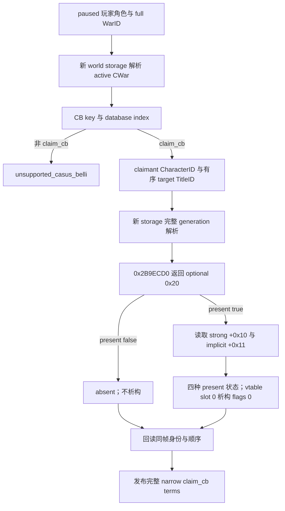

# CK3 1.20.0.2：claim_cb 结束条款迁移

记录时间：2026-10-01 01:28（Asia/Shanghai）。本包状态为 `static-ready`：冻结 EXE 静态验证与本进程合成夹具通过；没有读取玩家游戏进程，没有执行新版本游戏里的 claim getter 或析构函数，没有取得 paused live artifact。

冻结版本为 **1.20.0.2 (Crozier)**，EXE SHA-256 为 `AE1BA6FF060BA603842F6F4A2DED0AF4B7D3666B3DD271F75FB01B0DA8E81B2D`。核验输入为 `artifacts/migrations/2026-09-30/post-update-1.20.0.2/installation/binaries/ck3.exe`。

## 已修复的 ABI 破坏

旧 getter `0x28B1AA0` 不能只替换成新地址后继续使用旧返回缓冲。新 getter 为 `0x2B9ECD0`；它遍历的 `CClaim` 从 16 字节增长到 24 字节，并在 `+0x0C` 增加 4 字节运行期类型标记。含 present tag 的返回对象因此从 24 字节增长到 32 字节。继续传旧缓冲会越界，继续读旧 flag 偏移会把类型标记与 strong flag 当成错误字段。

| 内容 | 1.19.0.6 | 1.20.0.2 |
| --- | --- | --- |
| getter RVA | `0x28B1AA0` | `0x2B9ECD0` |
| claim 数组元素大小 | `0x10` | `0x18` |
| optional 返回缓冲大小 | `0x18` | `0x20` |
| title full ID | `+0x08` | `+0x08` |
| 类型标记 | 无对应字段 | `+0x0C` |
| strong | `+0x0C` | `+0x10` |
| implicit | `+0x0D` | `+0x11` |
| optional present | `+0x10` | `+0x18` |
| CClaim 主 vtable RVA | `0x40E3060` | `0x44F17D8` |
| vtable slot 0 析构 RVA | 旧构建专用 | `0xDDC610` |

调用 ABI 为 `void* getter(void* out_0x20, CCharacter* claimant, CLandedTitle* title)`：RCX 为输出缓冲，RDX 为 claimant，R8 为 title，返回输出指针。新 getter `0x2B9ED36..0x2B9ED5B` 的显式 claim 返回路径和 `0x2B9EE50..0x2B9EE71` 的继承 claim 返回路径分别复制上述新字段。缺失路径在 `0x2B9EE4B` 写 `present=false`。

RTTI `.?AVCClaim@@` 的 TypeDescriptor 为 `0x56E5DC8`，COL 为 `0x4AB0698`，object offset 为 0，导出 vtable `0x44F17D8`。slot 0 在 `0xDDC610` 先更新类型标记，再检查 `delete_flags & 1`；仅当该位为 1 时释放 24 字节对象。本 reader 的栈临时对象传 `delete_flags=0`，仅对 `present=true` 的 row 调析构。缺失 row 不调析构。

## Reader 与原生条款范围

`BindClaimTermsImage()` 仅绑定上述 exact build。`ReadWarTerminationTerms()` 调用新版本 core、world 与 province 绑定，要求暂停、存在存活的玩家角色、目标战争 full ID 命中且玩家位于其中一方。它从 `CWar+0x100` 读取当前 CB，从 `+0x270` 读取有序 target TitleID 数组，从 `+0x290` 读取 claimant full CharacterID，逐条取得 claim 的五态。

CB 的 database index `+0x10` 与 MSVC string key `+0x18` 分别由新 CB type constructor 的 `0x31F1ACC`、`0x31F1AEB..0x31F1B1E` 证明。war 与 title 存储解析由新 world/province 模块提供，保留完整 generation 的 ID 校验；同一低 24 位索引的不同 generation 不能代替原对象。读取后回读 war、CB、claimant、target 列表、title 与暂停日期，仍采用已有完整条款投影的相同帧语义。

冻结 `game/common/casus_belli_types/00_claim.txt` 的 SHA-256 为 `887BF0197401CB17CB4588978ADD556AB6B429BF55CB482E3E5F2D0E8351CFD4`。新脚本仍支持已有窄条款：胜利的 `create_title_and_vassal_change` 使用 `type=conquest_claim` 与 `add_claim_on_loss=yes`；白和平对 target titles 的 claimant weak claim 执行 `make_claim_strong`；进攻方失败对 target titles 执行 `remove_claim`。此包仅迁移这些 claim/title 条款，没有新增 gold、prestige、truce、prisoner 或通用宗教条款。

## 可复现验证与交接

源码为 [新 header](../../ck3_autonomous_player/native_bridge/include/xar_bridge/ck3_12002_claim_terms.hpp)、[新 reader](../../ck3_autonomous_player/native_bridge/src/ck3_12002_claim_terms.cpp)、[合成夹具](../../ck3_autonomous_player/native_bridge/src/ck3_12002_claim_terms_test.cpp)，权威静态账本为 [claim terms ABI](../../ck3_autonomous_player/native_bridge/research/ck3_1_20_0_2_claim_terms.json)。这些文件未依赖旧 1.19 reader。

`scan_anchors.py --manifest ck3_1_20_0_2_claim_terms.json --exe <冻结 EXE>` 已通过 6 个唯一 signature 与 1 个 CClaim vtable prefix；manifest 另外冻结并核验了 25 个具体指令 checkpoint 与 11 个 C++ 常量，包含元素 stride、显式/继承 flag 写入、缺失 tag、类型标记、析构删除位和对象大小。`optional sizeof=0x20` 依据原生 `claim stride=0x18`、`present tag=+0x18` 及 8 字节对齐闭合，已明确标为推导，不能当成某条独立 `sizeof=0x20` opcode 的证明。

MSVC 19.51、`/std:c++20 /W4 /WX` 已编译并运行夹具，输出 `CK3 1.20.0.2 claim terms fixture passed`。夹具覆盖 declared title 顺序、五种 claim 状态、新 flag 偏移与旧偏移上的非布尔诱饵、present-only 析构、暂停与存活前置、完整 generation、unsupported CB、无效 row 清空输出以及 native getter 后的 war 身份回读。world 模块后来集成 army 汇总，重新链接旧 5-source 命令出现一次 `LNK2019 ReadArmiesForCharacters`；补入已有 `ck3_12002_army.cpp` 后 6-source 命令通过。这是已解决的构建依赖 harness RED，attempt 已保留在 `claims-terms-result.json`，不构成 claim reader 的 capability RED。

可核验 executable 位于 `artifacts/migrations/2026-09-30/post-update-1.20.0.2/claims-terms-fixture/claim_terms_test.exe`。中央 CMake/adapter 的集成由迁移协调者提交；本包不自行 commit，以避免共享 index 冲突。后续必须在用户结束游戏或明确允许实机窗口后，取得新构建 paused owning-thread getter/析构调用及 MCP 查询证据，才能宣称 `production-live primitive`。
