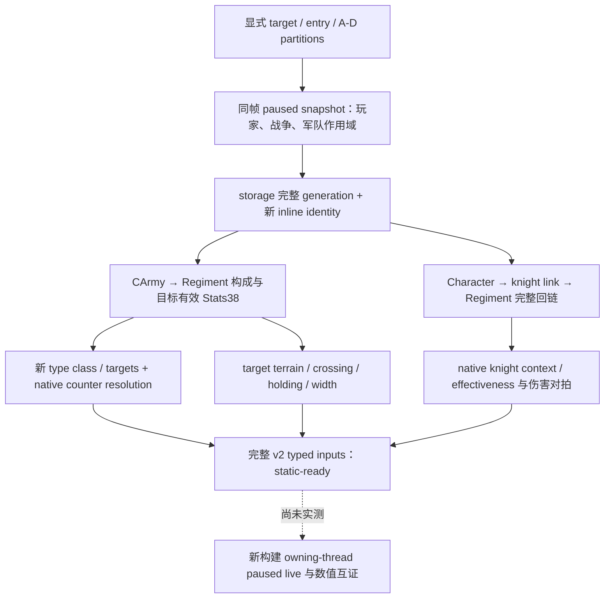

# CK3 1.20.0.2 战斗输入迁移

本专题仅绑定 `1.20.0.2`、Steam build `25588574`，EXE SHA-256 为
`AE1BA6FF060BA603842F6F4A2DED0AF4B7D3666B3DD271F75FB01B0DA8E81B2D`。
所有证据来自冻结 EXE 的磁盘静态分析和合成内存夹具；没有访问、注入、暂停、关闭或重启用户当前的游戏。

`ck3_12002_combat.hpp/.cpp` 已完整实现旧 v2 的只读输入合同：显式 target/entry、攻守 ArmyID 分区、共同战争与
玩家/盟友/敌军作用域、完整 generation 回读、目标地形与 crossing、defender holding、双方兵团构成与
目标省份有效属性、counter operands 与双方 counter resolution、commander advantage/roll bounds、骑士
identity/backlink/effectiveness，以及存在真实 CCombat 对象时的 ongoing-combat 字段。
共享 DTO 和数学处理保持版本无关；原生地址、对象偏移与判定已绑定新构建。

`ReadCombatSimulationInputs(bindings, paused_scope, request, output)` 接受 owning-thread dispatcher 刚取得的
同帧快照，以该快照提供 participant/war scope。它不调用旧版 `ReadSnapshot`，不从磁盘游戏数据推断当前军队。
`BindCombatImage(base, sha)` 只计算地址并要求 exact SHA；调用仍需要宿主正常的主线程生命周期。

| 原生域 | 新构建入口或字段 | 证据 |
|---|---|---|
| public CUnit / CArmy / CArmyRegiment | storage `5D1E380 / 5D1DE48 / 5D1F340` | army 专题与 ABI |
| commander | `24E9ED0`，CArmy `+120` | 完整 CharacterID 解析；`24E9F10` 是另一 ABI 的包装函数 |
| generic advantage | `C6DED0(character, -1, false)` | 旧函数片段匹配及新函数调用语义；不消费 roll RNG |
| terrain / effective stats | `247E590 / 26344C0` | 原生 Stats38 构造分支和返回 receiver |
| counter chunk / class / scale | `2657970 / 2653F10 / 2C533E0` | 原生数组 header、输出 class vector 与固定点语义 |
| knight context / effectiveness | `28BFC70 / 2C06B00` | 实际调用点 `2C06D46 / 2C06D56` |
| holding defender | `2C09D30` | holder 完整 CharacterID 解析后调用最终关系判定 |
| CCombat storage | `5D1DE70` | battle 专题；phase/tail 字段由新 constructor 互证 |

下面这些是已证实的不兼容变化，旧签名或旧字段不能直接用于新构建：

| 字段 | 1.19.0.6 | 1.20.0.2 |
|---|---|---|
| type counter class | `270` | `260` |
| type counter target data/count | `2B8 / 2C4` | `2A8 / 2B4` |
| type counter stack size | `68` | `70` |
| type main-phase eligibility | `A0A` | `98A` |
| counter class count in Maa DB | `F14` | `EFC` |
| character effective prowess | `E8` | `EC` |
| character knight link | `1B0` | `1B8`；link 的 RegimentID 仍为 `F8` |
| counter efficiency/resistance modifier IDs | `106 / 107` | `113 / 114` |
| commander min/max roll modifier IDs | `108 / 109` | `115 / 116` |
| terrain min/max roll modifier-index fields | `76E / 770` | `776 / 778` |

新构建的六个 runtime define slots 已通过原生消费者与 stable-key getter 互证：min/max roll 为
`5C699BC / 5C699B8`，knight damage/toughness 为 `5C699A8 / 5C699B0`，minimum width 为 `5C699C8`，
base width ratio 为 `5C69BA8`。不能沿用旧地址或以 stock 文本值代替已加载数值。

原生有效性判定也发生了 ABI 变化：

- CArmyRegiment secondary vtable `4744DD8` 只有 deleting-destructor thunk `26379F8`，旧 validity 虚槽不存在。
  新消费者直接检查 `+14 == 41725267` 与 `+10 != -1`，存储解析另外要求完整 generation 相等。
- CCharacter 使用 `+1C == 43686172` 与 `+18 != -1` 的原生 inline identity。
- CMenAtArmsType primary vtable `48B8E00` 的 slot zero 是 `30BB100` 数据库初始化 validator，不能作为 bool validity 调用。
  新 stats 与 serializer 直接检查 `+38 == 4744624F`（`GDbo`）。这是有效数据库对象的 identity，不能反转成 fallback。
  `2632E72..2632E86` 同时闭合 CArmyRegiment `+18` Maa type pointer 与 key 序列化条件。

`CArmyRegiment` 与 `CRegiment` 是两个不同类型。当前军队的兵团 ID 数组解析到 `5D1F340` 中的
`CArmyRegiment`：constructor `2632CD0` 写入 `ArRg`，primary vtable 为 `4744DA0`，serializer 为
`2632E60`。其 owning ArmyID `+140` 由 `2632FC5` 直接序列化。`CRegiment` 的 `4744B80/262A0C0`
则包含另一套内联计数、`+118` Maa pointer 和 `+140` bool，不能把它的偏移用于当前军队兵团。
迁移夹具已把军队兵团 `+118` 置空，并明确断言 `+18` 的 `archers` key 可用。

离线夹具采用两个阵营、三个兵团、一个骑士及一个将领，实际覆盖完整 available 路径；旧字段位置填入错误 decoy，
旧 validity 虚槽置空，确保读取依赖新字段。另覆盖 paused gate、重复 ArmyID、同 slot 的陈旧 generation、
真实 CCombat 内存投影与 `monte_carlo_ready=false`。
MSVC `/std:c++20 /EHsc /W4 /WX` 编译和运行 GREEN。
ABI 账本为 `native_bridge/research/ck3_1_20_0_2_combat.json`：16 个唯一签名、2 个虚表、34 条指令、76 个源码常量。
结果落在 `artifacts/migrations/2026-09-30/post-update-1.20.0.2/combat-static/result.json`。

能力状态为 `static-ready`，不是新构建 `live`。剩余验证是实际 owning-thread paused 查询、完整 ID 与 native 数值互证。
Monte Carlo transition fidelity 继续遵循原有边界；本迁移没有把输入观测升级成胜率计算。
v3 非宗教输入及新版原版 phase-event 差异另见 phase 迁移专题；宗教专用域保持所有者已声明的暂缓范围。

相关原生合同：[combat-simulation-inputs.md](combat-simulation-inputs.md)；
[combat-phase-events.md](combat-phase-events.md)；
[路线迁移](ck3-1.20.0.2-routes-migration.md)。
