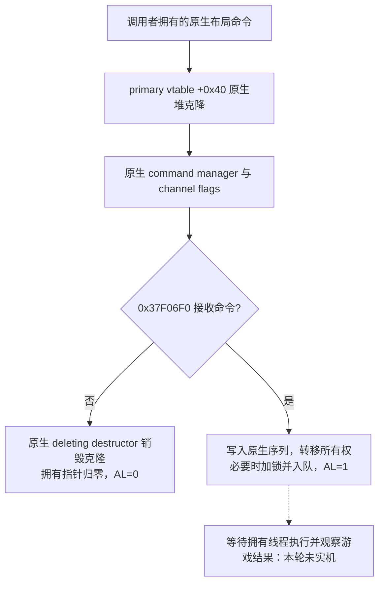

# CK3 1.20.0.2 命令所有权与时间控制迁移

2026-10-01，`static-ready`；本轮只读取冻结 EXE 并运行合成对象测试，没有读取、注入或操作用户正在游玩的 CK3。完整适配器还必须由拥有游戏对象的线程调用，实际暂停、速度变化与存档落盘尚未实机验收。

冻结版本：1.20.0.2 Crozier，Steam build `25588574`，EXE SHA-256 `AE1BA6FF060BA603842F6F4A2DED0AF4B7D3666B3DD271F75FB01B0DA8E81B2D`。所有地址均为这个 EXE 的 RVA；旧版命令提交函数签名不能套到新地址。

新提交链已从完整函数闭合。UI 包装函数 `0x9E16B0` 收到 `RCX = command`、`EDX = channel_flags`，调用 primary vtable `+0x40` 克隆命令，然后把拥有指针交给 `0x37F06F0`。命令管理器由 `0x9E16EC` 的 **LEA** 得到 `image_base + 0x5CC1240`；这里是内嵌对象，不能再把它当成全局指针槽解引用。UI 包装函数清理临时所有权时会覆盖返回寄存器，无法把它当作稳定的布尔提交 API。

下层 `0x37F06F0` 的完整 `0xFA` 字节函数可以直接作为 `bool(manager, void **owned_command, uint32 channel_flags)` 使用。拒绝路径 `0x37F0763` 调用 primary vtable `+0` 的 scalar deleting destructor，`0x37F0765` 清空拥有指针，`0x37F076C` 明确返回 `AL = 0`。成功路径先写入命令序列字段，`0x37F078F` 转移并清空拥有指针；flags 的 bit 2 控制 `queue +0x78` 上的原生锁，`0x37F07AF` 插入队列，`0x37F07E0` 明确返回 `AL = 1`。该返回值只表示队列接收克隆对象，不能代表游戏状态已经变化。



迁移代码在 `ck3_12002_commands.hpp/.cpp`，统一入口 `SubmitCommandCopy` 同步调用上述原生 clone 和 queue，残余拥有指针通过同一个原生 deleting destructor 清理。它不使用桥接 DLL 的 `new/delete` 分配或回收游戏命令。领域模块可以使用 `SubmitCommandCopyCompat`，把 `context` 指向适配器持有的 `CommandBindings`，适配旧的 `bool(context, command, flags)` 回调接口。

时间命令延用本版本已经证明的 `0x28` 对象：flags `+0x08`，secondary vtable `+0x18`，PlayerID／内部速度 `+0x20`，暂停字节 `+0x24`。暂停设置 flags `8`，速度设置 flags `0`，公开速度 `1..5` 转为内部 `0..4`。暂停与恢复先读取 `CoreSnapshotPrefix`，已处于目标暂停状态时不提交。基础时钟、玩家与命令布局的初始证据见 [迁移总账](../ck3-1.20.0.2-migration.md)。

命名 checkpoint 使用 `CAutoSaveCommand`，primary vtable `0x44B5148`，secondary vtable `0x44B51E0`，对象大小 `0x40`，flags `0x20`，`std::string` 表示从 `+0x20` 开始。UI 构造链 `0x22A2F4A..0x22A2FEE`、clone `0xA93060` 和 deleting destructor `0xA75EB0` 已互证：字符串 size 位于字符串对象 `+0x10`，capacity 位于 `+0x18`，capacity 小于 `16` 时使用 16 字节内联缓冲。固定名称 `xar_checkpoint` 是 14 字节，内联 capacity 为 `15`，调用者的源对象没有堆所有权；原生 clone 通过 `0x855F00` 深复制字符串，克隆的原生析构调用 `0x856050`，最后使用游戏的 sized delete `0x4223F64` 回收命令。不得用桥接 DLL 的动态 `std::string` 代替这个布局，或让桥接 allocator 回收原生克隆。

离线 fixture 覆盖真实调用形状：native-layout clone 输出拥有存储、队列接收后延迟销毁、队列拒绝并立即销毁、源命令不被队列元数据写入改变、flags 转发、暂停／恢复的重复操作、全部五档速度、checkpoint SSO 字符串、无地图时不提交及真实队列拒绝映射。MSVC 19.51 构建通过，fixture 的 **14 次克隆与 14 次删除对应一致**，这仍然是合成对象证据。

冻结合同 `native_bridge/research/ck3_1_20_0_2_commands.json` 保存 **7 个唯一签名、6 个 vtable 前缀与 35 个指令语义检查**。首次 autosave clone 的 32 字节前缀有两个命中，已经扩为包含本类 vtable 构造的 64 字节签名后通过；失败尝试保留在本工作包结果中。

产物目录：`artifacts/migrations/2026-09-30/post-update-1.20.0.2/command-runtime/`，包含完整提交／克隆／析构范围的 disassembly、独立离线构建、CTest 日志与结果索引。验证命令：

```powershell
py -3.13 ck3_autonomous_player/native_bridge/research/verify_ck3_12002_foundation.py --manifest ck3_autonomous_player/native_bridge/research/ck3_1_20_0_2_commands.json --exe artifacts/migrations/2026-09-30/post-update-1.20.0.2/installation/binaries/ck3.exe
artifacts/migrations/2026-09-30/post-update-1.20.0.2/command-runtime/build/xar_ck3_12002_commands_test.exe
```

剩余验收是拥有线程中的真实命令执行、paused snapshot 互证、速度变化与命名 checkpoint 文件落盘／可加载；本工作包没有宣称这些项目完成。中央适配器注册与各领域集成由迁移协调者完成。
