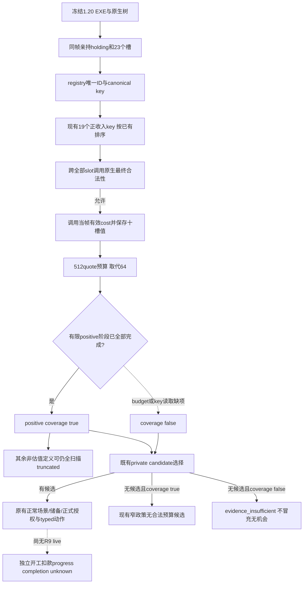

# CK3 1.20.0.2：完整有限经济候选报价

本包只解除 R6 实际建设查询的 64 项费用样本限制，使当前有限 19-key 经济候选的原生最终合法性与有效成本能完整观察。外部 R9 候选保持原 native AI 树、著录收入排序、实际金币储备和私有动作语义。单项生产路径 fixture 为 GREEN，状态 **`static-ready`**；没有 R9 实机、开工或扣款证据。

## 冻结输入与现有原生树

冻结 CK3 `1.20.0.2` EXE SHA-256 为 `AE1BA6FF060BA603842F6F4A2DED0AF4B7D3666B3DD271F75FB01B0DA8E81B2D`。本包先读取 [原生地产建设树](domain-construction-ai.md) 的 NW-ECON-R0225、NW-ECON-VALUE 与 Mermaid 决策树，再读取 [1.20 迁移专题](ck3-1.20.0.2-construction.md)。旧树的高阶 `ai_value`、80% 入围带、带权随机以及完整边际税收不因本包而变为新版本已实现；1.20 仍使用已验证的 `CanConstruct 0x2C77D50` 与 cost `0x2C247C0` 调用，现有有限 19 个著录正收入一级建筑按收入降序跨全部亲持 holding/slot 枚举。此处只修查询容量，不修改候选计分或 counter-policy。

真实基线是 `artifacts/g2-offline-2026-10-01/construction-live-next/root-r6-fresh-material-02/query-source.json`，SHA-256 `c7e1b759a71e5677fc13264baf7c29fc9cb807b91e1c8a5f06858e18767775c6`，actor `29829`、native revision `10` / public `2`、date `53169336`、epoch `92928`。六个亲持领地的 23 槽由 R4 指针证据与 R6 completed/合法 slot 样本互证：16 occupant、7 个原生 Null 空槽。已返回 64 个实际有效成本、390 次原生最终判定，`checks_truncated=true`、`positive_income_coverage_complete=false`。R6 已证明 completed 和这些有效成本可读；它没有观察到后续未扫描的正收入组合。

## 具体缺口与最小修正

新版 mailbox 的请求是 `{revision,-1,512,64}`，新版 reader 又拒绝 `max_legal_samples>64`。扫描在**下一次原生合法性调用前**检查费用样本数量，所以达到 64 不仅截掉输出，还停止后续 native legality 和实际 cost 计算。这是实际信息缺口，可能漏掉后续合法且更合适的报价；不是 GUI 选中状态问题，也不需要新 ABI。

现有 19 个 key 在已验证唯一 registry 定义下，对当前 23 槽至多需要 `19×23=437` 次原生判定及最多 437 个有效报价。原有 512-check 预算已经足够，因此只把费用样本预算和 admission 上限提高到 512；使用新版 header 的同一常量供 mailbox 与 reader 读取。三个生产改动限定于 `ck3_12002_construction.hpp`、`ck3_12002_construction.cpp`、`ck3_12002_construction_mailbox.cpp`。

每个新增合法样本仍在同一 paused callback 中调用真实有效 cost，并保留十槽原始值、玩家 gold、full tuple 与最终合法性。没有补零、复用旧报价或用容量标志代替实际扫描。正收益阶段完成后，其余非估值 registry 仍按既有逻辑消耗剩余 check 预算；因此全扫描 `checks_truncated` 可以仍为 true，而 `positive_income_coverage_complete=true` 只表示当前既有 19-key 范围已完整检查。它不代表所有 989 个建筑定义、完整经济排序或真实税收 ROI。

## 私有分支与此前报告纠正

`domain_construction_private_transport_v1.py` 的普通查询先调用 `_candidate`；有候选就返回 `selected`，并不要求 `positive_income_coverage_complete=true`。只有没有候选时才用该字段区分 `no_legal_budgeted_building` 与 `evidence_insufficient`。正式 consumer 拒绝后者，再对 `selected` 沿原场景、原预算和 typed submit 路径处理。不能新增“全部覆盖以前禁止已有合法候选”的门槛。

`material_receipt=True` 在进入候选选择以前直接返回 `material_source`，所以 R6 的 `candidate=None` 是只读模式语义，不证明正常 selector 没有候选。旧 serializer 的 `cost_ready=false`、`construction_action_ready=false` 是 public-advertisement 占位值；当前 private Python/formal consumer 不读取这两位作为 submit 门禁，[既有 cost-to-action 专题](domain-construction-world-cost-to-action.md) 已说明其语义。此前迁移/日级报告把它们列为“和平后仍独立阻止 private construction”的说法需要纠正。它们保持原值，本包不为这些硬编码布尔值改实现或补测试。

R6 当前一战、一军依然使普通 private binding 的既有正常场景条件不满足；本包不研究或执行战争。真实增量是观察全部有限经济报价，避免容量截断导致漏选、错误的无机会判断或无候选时持续 `evidence_insufficient`。观察通过也不能宣称新建设开工、扣款、完工或税收增量。

## 单项必要 fixture 与 R9 下一观察

新的 `ck3_12002_construction_full_positive_test.cpp` 直接调用生产 `ReadPlayerWorldBuildingDefinitionSourcesV1`，使用六 holding / 23 槽 / 16 occupant / 7 个 exact Null 空槽。注册 19 个真实著录正收入 key，另有非估值定义；原生回调模拟只允许空槽，逐合法 tuple 产生可区分的实际回调成本输出。原 64 预算复现截断与 coverage false；512 预算完成 437 次有限正收入判定、保留 133 个合法有效报价和最后定义/最后槽位报价，positive coverage true。其余定义达到原 512 check 上限时 overall truncated 仍为 true，fixture 不将其冒充全 registry 完整。

这是一个新 Release `/O2 /MD /W4 /WX` fixture，compile/run 均为 `0`，不重复旧矩阵、不操作游戏。单项 runner 是 `research/run_ck3_12002_construction_full_positive_test.py`。结果位于 `construction-decision-r9-candidate/fixture/attempt-02/result.json`，SHA-256 `eb8db5253f7ba72d89aad426ca18bc54155a727ea8056dcd756b30a569546a7e`；首个 candidate 缺依赖 header 的编译失败保留为 harness RED，测试源码未因此修改。准确结果、源码 pins 和日/周报告字段落在外部 `artifacts/g2-offline-2026-10-01/construction-decision-r9-candidate/`。Root 已释放 R8 FINAL frozen 输入，允许将这份已验的七文件精确 bytes 应用到 S；L8 与 R8 immutable artifact 保持不动。R9 paused actual 验收由 root 负责。

下一真实验收是 fresh R9 查询：有限 `positive_income_coverage_complete` 应由实际完整原生扫描成立，费用数可超过 64，并能读到后续 key/slot 的有效报价；不会只以新常量或 fixture 宣称 live。如果该帧有限组合超过 512 或 canonical key 读取仍缺项，就依据实际 slot/positive 数量扩大有界预算或继续读取该缺项，而不是把当前范围标 complete。此次不额外追求全 registry 覆盖或扩展计分。
