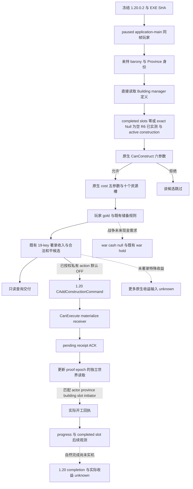
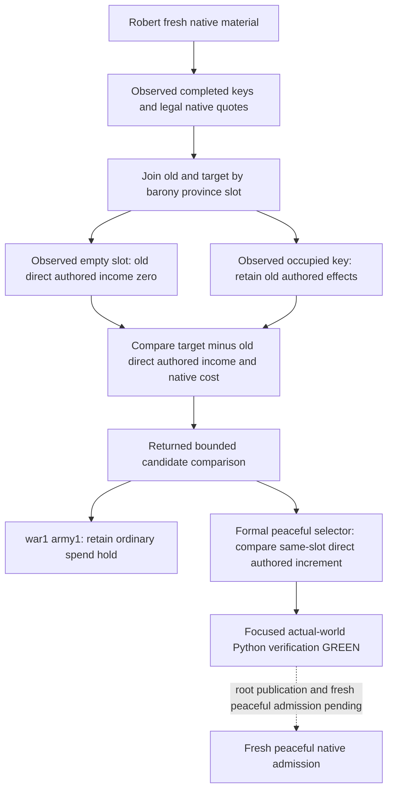

# CK3 1.20.0.2 玩家地产经济建设迁移

截至 2026-10-01，玩家直接持有地产、原生建筑定义、建设合法性、原生费用、实际建设状态和已有地产建筑提交均已迁移为新的 `xar::ck3_12002` provider。离线 ABI 校验与独立 MSVC fixture 为 GREEN；root 的 R2 已通过真实 paused held/world/legal/cost 查询，R4 只读指针诊断确认 completed inventory 的原生 Null 空槽缺口，R6 fresh native 查询已实测修正后的 completed inventory 与空槽有效报价，R9 已实测当前有限 19-key 范围完整合法性与 65 项有效费用。查询能力达到窄范围 **`production-live primitive`**；开工、扣款、自然完成和冷恢复循环仍待验。后台迁移执行者没有连接或操作本地 CK3，实机读数由 root 完成。

迁移输入为 [2026-09-30 非战争交接](../handover/2026-09-30-nonwar-maintainer-vacation-handoff.md)，对应 Git commit `46ca368cebfaff64cf09c29dd6d8b0de206c661c`，以及 [原生地产建设树](domain-construction-ai.md)。本次只替换 exact-build 查询与执行绑定，沿用现有预算、候选和正式回执语义。普通新地产、domicile、宗教通用系统和完整税收 ROI 没有扩入此次能力。

## 冻结版本与原生输入

冻结二进制为 `artifacts/migrations/2026-09-30/post-update-1.20.0.2/installation/binaries/ck3.exe`，版本 `1.20.0.2`，文件大小 `101039736`，SHA-256 `AE1BA6FF060BA603842F6F4A2DED0AF4B7D3666B3DD271F75FB01B0DA8E81B2D`。PE64 ImageBase 为 `0x140000000`，SizeOfImage 为 `0x61C5000`。

原版 AI 的已有地产建筑提交链闭合在 `0x1A7FF67..0x1A80011`：构造 `CAddConstructionCommand` → 原生 CanExecute → materializer → flags 7 的全局提交 wrapper。完整命令字节、RTTI、调用边见 [已有地产建筑命令专题](construction-submit-1.20.0.2.md)。该提交链没有证明完整的 AI 建筑收益排序；现有策略继续使用已著录的保守收入候选、原生最终合法性和实际费用。未采用的 AI 高阶预算、战争未来支出、税收归属及特殊建筑收益仍是待补输入，不作为独立和平建设的完整 ROI 前置条件。

| 读取/调用节点 | 1.20.0.2 绑定 | 原生证据与语义 |
|---|---|---|
| 本地玩家与 played Character | GameData `+0x222E8`，entries `+0x58` / count `+0x64` | 每帧玩家 CharacterID 完整 generation 校验；不以 GUI 当前角色替代玩家 |
| 玩家亲持 title | Character `+0x1C0` → land-state IDs `+0x1E0` / capacity `+0x1E8` / count `+0x1EC` | 原生 held-title 枚举 `0x2BB11E0`；输入 data/count 是直接 load，capacity 是原生 vector descriptor 布局推导 |
| 亲持 barony → Province | Title ID `+0x10`，holder `+0x128`，template `+0x48` → tier `+0x64`，Province `+0x338` | full-generation TitleID、holder == player、tier == 1；ProvinceID 与游戏 province-array 双向对应。county 有效 holder 不等于亲持 barony |
| Title storage | `0x5D1DAF8` / fallback `0x5D1DAE0` | 完整身份校验，保持同帧玩家作用域 |
| Building manager | global `0x5C67540`，getter `0x8D1670` | 原生命令调用 getter → definition lookup `0x29860B0` |
| Building definition vector | data `+0x50` / capacity `+0x58` / count `+0x5C` | lookup `0x2986163..0x2986180` 直接读 count/data；独立于 CHoldingView 缓存 |
| CBuildingType | primary vtable `0x48B6CC8`，TypeDescriptor `0x5586BB8` | exact RTTI 与 ctor vtable 写入；各定义 ID/key 校验 |
| 最终建设合法性 | `0x2C77D50` | 六参数：玩家 CharacterID、ProvinceID、definition、slot、true、null tooltip；命令 validator `0x29824C1` 直接调用 |
| 费用 | `0x2C247C0` | 五参数：output[10]、Province*、definition `+0x6F518`、`*(definition+0x6F510)`、同帧玩家 Character*；caller `0x29823EF` 明确写第五参数 |
| 玩家 gold | Character `+0x1B0` → extension `+0x100` | 原生 affordability `0x310E7D6` / `0x310E7F1`；scale `100000` |
| 地产 completed slots | Province `+0x620` → array `+0x10`，slot count `+0x1C`，stride `0x10` | 原生合法性遍历已建建筑 slot；读空 slot 与已建 ID，供候选及回执使用 |
| completed 空槽 | Null definition singleton global `0x5D1E320` | 原生清槽 `0x246712F..0x2467168` 写入非零 Null 指针；构造 `0x2FF079B..0x2FF07A9` 写 `+0x38 = 0x4E756C6C`。R4 实际首失败槽与此精确单例相等；不能把所有非 registry 指针当空槽 |
| active construction | holding `+0x68` definition、`+0x70` slot、`+0xD8` initiator | 原生开始建设 writer `0x24677D0`；不能以队列 ACK 替代 |
| progress | holding remaining work `+0x80`、divisor `+0xE0` | `0x2467D20` 读取 divisor 并减少 work；零与读取失败分开表达 |
| province monthly income | Province `+0x718` | CMonthlyIncomeTrigger getter `0x2B41FD0`；省份汇总 raw，不等于此建筑独占税收或玩家最终收入 |

旧版费用 adapter 的四参数声明不足以迁移新版调用现场：第五参数必须是同帧、完整身份解析的玩家 Character 指针，不能凭旧偏移猜测或省略。当前 [process adapter](../../ck3_autonomous_player/native_bridge/src/ck3_12002_construction_process.cpp) 已按上述真实原生调用实现；独立 fixture 在自有内存中实际调用新 binder，并检查所有六个合法性参数与五个费用参数。

## 决策树与策略边界



本次保留现有 19 个 tier-one 收入 key。新原版 `00_standard_economy_buildings.txt` SHA-256 为 `33A6253E89ACD0DA1C0242BD441987817DC5386325694F92BBE635F657FBD0E8`，见 [著录快照](../../ck3_autonomous_player/native_bridge/research/ck3_12002_construction_authored_income.json)。所有 19 个已有数值均与原版 1.20 著录一致，`farm_estates_01` authored monthly income 仍为 `0.70`。著录表不是玩家最终入账，也不是全原版正收入建筑目录；`positive_income_coverage_complete` 继承现有 wire 字段名，仅表示当前有限候选范围覆盖，不能据此声明特殊建筑与全部收益排序已完成。

交接中的 `farm_estates_01 / 180 gold / 0.70` 是 **1.19 的只读机会证据**，从未证明扣款、开工、完工或收入回流。新静态资产的 `normal_building_tier_1_cost` 是 `150`；它是 authored base，不能替代 1.20 的原生有效费用。1.20 每帧会调用新 cost binder 得到实际修正后的资源槽。战争 future-cash 与 shared commitment 继续保留未知状态，独立合法的和平建设无需等待全税收 ROI 闭合。

## 代码与接口

[construction.hpp](../../ck3_autonomous_player/native_bridge/src/ck3_12002_construction.hpp) 提供新 held/world reader 和新 cost/legal binder；[construction.cpp](../../ck3_autonomous_player/native_bridge/src/ck3_12002_construction.cpp) 负责版本绑定、有限候选、资源与状态读取；[construction_held.cpp](../../ck3_autonomous_player/native_bridge/src/ck3_12002_construction_held.cpp) 负责玩家亲持来源。对旧命名空间仅复用已经引入的 DTO 和纯语义候选函数，没有把 1.19 的地址用于新游戏。

[construction_mailbox.hpp](../../ck3_autonomous_player/native_bridge/src/ck3_12002_construction_mailbox.hpp) 的 `ConstructionMailboxContextV1` 包含旧 receipt DTO `query` 和新 `CoreBindings core`。入口是 `ExecuteConstructionMailboxV1`，serializer 为 `SerializeConstructionMailboxV1`。central bridge 在 1.20 选新入口，世界查询返回 `player_world_building_sources.status=source_available` 才算本能力成功。顶层历史 GUI `status=unavailable`、`player_model_sources=unavailable`、`gui_cache_sampled=false` 是未读取 GUI 的事实，不能把这些字段伪装成可用。

新 receipt 添加 `game_version=1.20.0.2`、`source_binding=direct-world-building-manager`，沿用 native cost 八槽 selected-row 投影与十个原始槽、玩家 gold、directly held provinces、active/completed 状态与候选；八槽投影仅供比较，不能把未闭合的资源意义当成已证实。`request_private_action` 保持原默认 OFF；显式私有 submit 的成功只进入 `pending_receipt` / `applied=false`。正式完成必须由 fresh world source、proof epoch 和原有回执/冷恢复协议确认。

## 实际查询与 Null 空槽修正

Root 的 `artifacts/g2-offline-2026-10-01/construction-live-next/root-readonly-query-03-material/` 冻结 R2 实际 paused 查询：actor `29829`、date `53169096`、native revision `6` / public revision `2`、proof epoch `175887`，Building registry 为 `989` 项，六个亲持领地均 inactive。原生最终合法性 `390` 次、有效费用 `64` 次；现有有限范围中的 64 个返回样本通过正收入、stock gold-only、idle 与既有预算过滤，但不是全局穷尽。`material_source` 下 `candidate=None` 正常，现有和平新支出门槛仍因一战、一军而不满足。

当时 completed inventory 为 false/null。R4 的 `construction-live-next/root-r4-completed-slot-vm-read-02/diagnosis.json`（SHA-256 `77333880ba0ecfb4c22c984615333d17d961673f20ae7075ded59612db074542`）通过指定 PID `121536` 的窄 `PROCESS_VM_READ` 诊断，前后同一 paused actor/date，实际读取 `9477` 字节。23 个槽位包含 16 个 registry occupant 与 7 个非零 Null 空槽。首失败为 barony `2103` / province `2635` / slot `3`，pointer `0x000001CE66BD0010` 与精确 Null 单例相等，ID `-1`、Null tag、非 registry；仅补 Null 识别即可使这些实际指针匹配成功。首个启动时 player 尚未注册的 attempt 保留为 harness RED，未再次执行相同诊断。

修正只在现有 paused callback 内读取 `module+0x5D1E320`，并在 completed registry 匹配前跳过零或这个精确单例。直接 `CBuildingType*`、array `+0x10`、stride `0x10`、费用、合法性、active/progress 与预算门槛不变；其它真实未知指针仍使 completed inventory unavailable。外部 VM_READ 诊断不是 application-main bridge 发布，修正后的 native completed publication 由下面 R6 独立 fresh 查询验收。

R2 依现有排序的只读机会是 `farm_estates_01` / type `596` / barony `2103` / province `2635` / slot `1`，实际费用 `150` 金币，余额 `457.90783`，假设支付后 `307.90783`。R4 同 actor/date 但另一游戏实例显示该 slot `1` 已有 type `597`，因此该机会不能当空槽或净收入增加，也不能跨实例沿用旧有效费用开工；slot `3` 的空槽只在 R4 指针观察中成立。R6 必须 fresh 读取实际空槽、合法报价、占用及排序再决策。著录 `0.70/月` 是目标省份收入，尚未证明当前建筑增量或玩家税收回流。

新增单项 production-reader fixture 位于 `ck3_12002_construction_exact_null_test.cpp`，只验证本次实证修复的零空槽、非零 exact Null、registry occupant 与真实未知指针；直接链接实际新版 construction / held reader，在 MSVC `/O2 /MD /W4 /WX` 下为 GREEN。结果为 `construction-live-next/exact-null-fixture/attempt-03/result.json`，SHA-256 `beb8a5b92e6a95192bd99c0159cd37334ce6ecc241770d4b5c6f798962bbc628`。单项重放入口是 `research/run_ck3_12002_construction_exact_null_test.py --build-root <new-Z-artifact-dir>`。旧 fixture 仅补新增 exact singleton 的场景输入，未重复旧矩阵。日志解码与新 fixture ADL 编译失败分别保留为 harness RED，生产 cpp / held 没有编译错误。完整后续 start/debit/next/cold 方案与实数见该目录上层 `actual-opportunity.json`、`actual-r4-completed-confirmation.json` 和 `actual-ooda-next.json`；没有提交建设或推进战争。

### R6 fresh native completed inventory 与真实空槽报价

Root 的 `artifacts/g2-offline-2026-10-01/construction-live-next/root-r6-fresh-material-02/` 通过既有 production factory 和 SDK 读取新 slot 42。`query-source.json` SHA-256 为 `c7e1b759a71e5677fc13264baf7c29fc9cb807b91e1c8a5f06858e18767775c6`，原始 `query-native-envelope.json` SHA-256 为 `2f7cfa1b0e5ac82c5fc062b7a97b3c23a2d34daabfc682e7a7c76e4fc9803ede`。实际 request `construction-read-90f8ce1a6e374dc1afc317434c2d0d7f` 返回 `ok=true`，executor invocation `1`、proof epoch `92928`；native revision `10` / public revision `2`、actor `29829`、date `53169336`，前后 paused 绑定一致且 event/interaction 均 null。包中仅有 ping 与只读 query step，没有 submit/action。

本次实际 `completed_buildings_observed=true`，正式 native 来源发布了 16 个已建 occupant；六个亲持 holding 仍均 inactive。定义 `989` 项、原生合法性 `390` 次、原生费用 `64` 次均成功。16 个 occupant 的全 tuple 与 R4 外部指针样本相符，合法样本中覆盖的 7 个实际空槽也与 R4 的 7 个非零 Null 记录相符。这次使用 native 当帧完整 completed inventory 和合法 slot 报价判定空槽，不再把“没有 active construction”当作空槽依据；跨实例相符只作互证，不替代 R6 fresh 数据。

返回样本中有 22 项实际空槽的正收益、stock gold-only、idle、预算合格报价。沿已有著录收入与费用排序，仅这些空槽样本的首项为 `cereal_fields_01` / type `604` / barony `2103` / province `2635` / slot `3`，十槽有效费用为 `[15000000,0,0,0,0,0,0,0,0,0]`。当帧余额 `457.90783` 金币，假设支付后 `307.90783`，满足原有 `200` 储备；authored target province income 为 `0.50/月`，并非已实现的玩家税收。原 `farm_estates_01` / slot `1` 在 R6 native inventory 中仍已有 type `597`，不能归入空槽报价。查询截断为 true，只能称返回范围内的排序，不能称全局最优或完整税收 ROI。

`material_source` 的 candidate 保持 null，本次已经观察到 64 项 native effective costs。后续生产路径核查纠正了初次报告的门禁说法：`cost_ready=false` / `construction_action_ready=false` 是 public-advertisement 占位值，当前 private Python/formal consumer 不读取它们。普通查询先选候选，有候选就返回 `selected`；只有无候选时才用 `positive_income_coverage_complete` 区分无机会与 `evidence_insufficient`。material 模式在选择以前直接返回来源，因此其 candidate null 也不是普通 selector 无候选的证据。当帧一战、一军仍使既有普通场景条件 held。

R6 的真实信息缺口是 `checks_truncated=true` / `positive_income_coverage_complete=false`：512 check / 64 sample 预算在第64个合法报价就停止后续原生判定与实际费用读取，当前23槽×19个有限正收入key上界437尚未全部观察。R9 仅将样本 admission 和 mailbox 预算提高到512，保留512 check、原计分、实际有效成本和所有正常场景门槛；下节实际查询已验证有限范围覆盖。准确分支与单项必要 fixture 见 [完整有限经济候选报价](ck3-1.20.0.2-construction-quote-coverage.md)。没有强行提交建设。

R6 首次附件 attempt 因实际 active event `14` 而在 Python SDK binding 前被拒绝，仅有 ping；外部 admission 已改为复用既有 `_binding`。Root 随后只尝试查询 event window context，查询被 service 拒绝，没有选择选项或解决事件。后续 fresh snapshot 自然发布为 event null，精确缓存或 lifecycle 原因未查明；不能将 no-event 成功包归因于 root 处理了该事件。该失败是附件预检漏项/实际 modal 状态，不是 completed reader 的 capability RED。后台评估与报告位于 `construction-live-next/actual-r6-completed-assessment.json`，没有重跑旧测试、额外 ABI 研究或逆向。

### R9 fresh native 有限正收入报价覆盖

Root 的 `construction-live-next/root-r9-fresh-material-01/` 已实测有限报价容量修正。`query-source.json` SHA-256 为 `f088d7b97b5e52b6d67ffd8b87ddb60ca9b67b1d5fa369a26e8d17a4c6207bb8`，`query-native-envelope.json` 为 `d3047e252d4d09dd6a3d40d68c355e21ff07bd1843706cdde6e25d9d55ffe435`。运行源码由 root 标记为 L9 `f54ad34` / 候选 `e467db`，PID `101408`、history `h98`；实际 actor `29829`、native revision `3` / public revision `2`、date `53169360`、epoch `21276`。前后 paused binding 相同，executor invocation `1`，无 action 请求或时间推进。

实际 989 个定义、512 次原生最终判定、65 次原生有效费用均成功，65 项全部为现有 19-key 范围的正收入报价，十槽费用均有当帧原生来源。有限 `positive_income_coverage_complete=true`；其余非估值 registry 的整体 `checks_truncated=true` 仍准确，不代表 989 项全部成本或全经济收益观察完成。`cost_ready=false` / `construction_action_ready=false` 继续保留 public placeholder 语义，`material_source` 的 candidate null 继续表示查询模式；coverage 只影响普通查询无候选时的 `evidence_insufficient` 分支。

新增第65项为 `hunting_grounds_01` / type `580` / barony `2175` / province `2625` / slot `2`，原生有效费用 100 金币（十槽 raw `[10000000,0,0,0,0,0,0,0,0,0]`）。当帧仍有 16 个 occupant、7 个实际空槽、零 active construction；空槽正收入/stock gold-only/idle/预算合格观察子集为23项，原先为22。按既有著录排序该子集首项仍为 `cereal_fields_01` / type `604` / barony `2103` / province `2635` / slot `3` / 150 金币，当帧余额 `457.90783`，假设支付后 `307.90783`。slot `1` 已建 type `597` 的事实保持；未将旧 `farm_estates_01` 机会当成可开工空槽。authored `0.50/月` 或新增 hunting 的 `0.25/月` 均未证明实际税收增量。

这次只读查询实现了完整有限报价观测，未执行普通 selector、提交 building、扣款、完成建设或取得实际收益，G2 状态没有变化。当前一战、一军仍由原普通场景条件处理，本包没有扩展战争动作或研究。详细每 key 数量与唯一新增 tuple 见 [完整有限经济候选报价](ck3-1.20.0.2-construction-quote-coverage.md)，doc-only receipt 位于 `construction-live-next/r9-finite-positive-doc-delivery.json`。

## 离线验证与下一次实机入口

新 [ABI 合同](../../ck3_autonomous_player/native_bridge/research/ck3_12002_construction_abi.json) 和 [verifier](../../ck3_autonomous_player/native_bridge/research/verify_ck3_12002_construction.py) 已一次校验冻结 EXE：11 个 exact spans、7 条原生调用边、10 个 held-layout 指令检查、manager global 和 definition RTTI。命令 verifier 另已通过 18 spans / 13 calls / 3 RTTI。已有失败尝试属于编译/fixture 修正记录，没有被描述为 capability live RED。

`run_ck3_12002_construction_tests.py` 在 MSVC `/W4 /WX /permissive-` 的 `/Od` 与 `/O2` 均 GREEN：query provider 使用自有稀疏内存，覆盖玩家/亲持来源、定义与 slot、原生合法性、费用、gold、construction progress 与 completed 状态；process fixture 使用自有 fake image 与函数 trampoline，实际验证五/六参数 binder。submit fixture 的两种构建均 GREEN，覆盖新 typed command、拒绝与回收、pending ACK 和 fresh 实际状态回执。没有读取或写入游戏进程。

`run_ck3_12002_construction_serializer_tests.py` 另在 `/Od` 和 `/O2` 实际调用新 producer serializer，输出 query-only 与 pending-action JSON。两种构建都验证：顶层历史 GUI unavailable、独立 world source available、8/10 资源槽长度、1.20 provenance、只读查询无 action、pending ACK 的 `applied=false`。未执行的 native/mailbox 入口仅有 link stub，测试断言 executor 调用次数为零。最初错误的“三槽”测试期望已作为 `attempt-01-result-red.json` 保留，它是 harness RED，实际生产 wire 一直为 8/10。

本轮结果与日志保存在 `artifacts/nonwar-12002-offline-2026-10-01/construction/`：`econ12002-tests/result.json` SHA-256 `70db5861df8fba823395baddab3d337f53d5007e35fe12d73a01a8f9f7dbe006`，`econ12002-tests/exact-binding-result.json` SHA-256 `ee482d3af9b40a10b1306e4fab403238e2133efbfbbd1f081dff4adbaf2a68a9`；`submit-test/standalone-result.json` SHA-256 `c95908f917be7e7146fd6570226a1ddf94454e4befd4ff14d9f1189e12195da0`。该目录的 `artifact-manifest.json` 列明全部结果、producer dump、日志与哈希。原始编译目录仍位于 `Z:/ck3_mod_rewrite/.task-tmp/nw12002/.task-tmp/`，长期保留证据使用上述 artifact 副本。

```text
python ck3_autonomous_player/native_bridge/research/verify_ck3_12002_construction.py --ck3-executable <frozen-exe> --output <Z-result.json>
python ck3_autonomous_player/native_bridge/research/run_ck3_12002_construction_tests.py --build-root <Z-build-dir>
python ck3_autonomous_player/native_bridge/research/run_ck3_12002_construction_serializer_tests.py --build-root <Z-build-dir>
```

R6 已完成 paused 玩家 native completed/cost/legal/gold/slot 观察，R9 已补齐当前有限正收入范围的原生合法性与有效报价；public placeholder 不另加 private 门禁。下一实机入口按既有正常场景条件是：fresh 普通查询 → 沿原分支选择符合储备规则的候选，无候选时核对有限coverage → 显式 submit → 独立 fresh active/initiator/progress 和 gold 差值回执 → 后续自然 completed 与收入观测。必须保留自然完工与实际收益不足的证据边界；现有 query primitive、旧 artifact、测试进程和自有 fixture ACK 均不能升级为 1.20 `production-live loop`。

## 2026-10-02：1.20.0.3 实际材料与 M4 窗口边界

Root 已在 `artifacts/g2-maintainer-2026-10-02/resume-12003/direct-c3cd08bc-01/companions/m4-construction/` 取得真实 `.3` paused source；EXE SHA-256 为 `94B55397ABB687A3DCD436805A5D885E6BE90FA6C693FEB44A9E3BBEEADE02A6`。同一 actor `29829`、date `53171328`、native revision `95` / public revision `2`、proof epoch `50272` 发布了 989 definitions、512 原生合法性判定、65 有效十槽费用、有限 19-key 完整覆盖、16 已建 occupant、7 空槽及零 active construction。当前仍一战、一军，既有普通和平建设 consumer 保持 hold；本次只读材料不证明新开工、扣款、完工或收入，readiness 仍限查询 primitive。详细离线评估见该 resume 包 `m4-construction/ACTUAL-12003-ASSESSMENT.json`。

[G2 机器需求](../autonomous-agent-progress/g2-requirements-v1.json) 的 `G2-M4.visible_outcome` 原文是 “within two game years perform and verify one construction, one council reassignment and one real vassal or faction intervention”。其既有建设输入引用 [R0080→R0081 物质合同](domain-construction-world-cost-to-action.md)：独立 native active tuple/initiator 与同日实际扣款、正式下一 turn 消费、成对 checkpoint 与新 PID 冷恢复。该合同未明确要求建筑自然完工及实际收入在两年内出现；旧 R0081 也不补齐当前 `.3` 或同窗口三动作信用。机器需求另有 `NW-ECON`，明确要求 “affordable construction and realized economic benefit”，并在旧开工/冷恢复以后仍记录 completion 与 realized income 未证。因此 M4 建设动作闭环和完整经济收益闭环须分别报告，不能将后者静默增加为前者的两年期限门禁，也不能用前者冒充经济项完成。下一和平 seed 的三项治理结果必须属于该 seed 的同一 actor/episode、同一已记录窗口，不跨 seed 合并。

现有世界查询已经读取 active `remaining_work_raw` / `progress_divisor_raw`，但没有发布开工前的 native effective duration/ETA；六个 inactive holding 的 work/divisor null 是合法状态。原版 `standard_construction_time` authored base 为 1095 天，不等于实际有效工期。当前 M4 合同不以自然完工为选项门禁，故这一预开工时长缺口没有阻断该项选择，不新增时长 reverse/字段/flags。`NW-ECON` 后续继续用实际开工工作量、既有 30 天回执观察、精确 completed slot 和真实省份/玩家收入；省份汇总或 target authored income 仍不能当作建筑独占的净收入证明。

和平 seed 的既有入口为 fresh `ck3_query_campaign_root_context_v1(expected_revision=<public revision>)`，再由同一个 root-owned driver 调用 `query_construction_private(expected_revision=<fresh public revision>, material_receipt=False, wartime_observation=False)`。目前没有 public MCP 建设工具。正常查询仍要求 paused/map-ready/alive、无 event/interaction、无 war/army，正式 consumer 用 `--nonwar-only --allow-private-construction-formal-trial` 沿既有优先级接入。当前 selector 以 target 著录收入排序，不筛空槽也不计算占用替换净增量；实际 selected 若占用且价值未查明，应保留有值动作资格不足，不人为指定旧 cereal_fields tuple。准确只读参数与窗口解释见 resume 包 `m4-construction/ROOT-PEACEFUL-SEED-READS.json`、`M4-WINDOW-CONTRACT.md`；准备工作没有执行查询、动作或重复测试。

### Murchad .3 实际开工、独立材料与新 PID 冷回执

Root 的 `resume-12003/m7-murchad/actual-v7-nonwar-16turns-01/native-auto-run-report.json` 已有真实一次 `construction-submit-f0ff9299cc8341af93cd62957c60ecbd`。标准封建 actor `31853`、episode `native-31853-af642d76cb41`、PID `101276` 在 raw date `53327160` 原生合法选择 `cereal_fields_01` / type `604` / barony `528` / Province `48` / slot `1`，十槽有效费用 `[15000000,0,0,0,0,0,0,0,0,0]`。独立 turn4 的 native `3→4`、proof epoch `1867→2413` 回执是 `applied/postcondition_verified=true`，匹配活动 tuple 与发起人，实际金币 `76862522→61862522` 正好扣除 150 金币。native remaining work `109500000`、divisor `0` 均为真实观测；divisor 零不能改写成缺字段或据此估计工期。原槽位已建 occupant 是 type `572`，并非空槽新增；当前 quoted samples 未发布该 occupant 的 key，target 著录 `0.50/月` 仍不能证明替换净价值或实际税收收益。

该批实际 5 attempted / 4 successful；所有 before/after raw-date 差值相加为 `0`，即 **0 游戏天**。turn5 虽有 `construction_receipt_consumed` 计划字段，但婚姻 lineage/outcome read 阻点使 `selected_step/result=null` 并 blocked，不能算成功的下一正式 turn 消费。保存动作后的 h1997、同日期 game SHA `541e17b231a8eb19bf7473550a4cc76eb350e9a88607bef0899d4228dcd78263`，使 root 得以读回同一动作，无需重提。原始 blocked 批次及其材料成功保留各自状态。

Root 随后从这对保存点完成真实新游戏冷恢复，在 `resume-12003/m7-murchad/material-cold-03/construction-receipt-02/` 调用现成 `query_construction_receipt(driver, pending=<原 ledger.applied>, expected_revision=<fresh public revision>)` 一次，没有 submit。新 PID **98664**、creation `20261002071432.517825+480` 在 native `3` / public revision `2`、proof epoch **61784**、原 actor/episode/date 返回同 action 的 `applied/postcondition_verified=true`；同 tuple、金币 `61862522`、work `109500000`、divisor `0` 和 `completion_status=in_progress` 再次读回。不同进程的 native revision 可从小值重新开始，不能要求它数值大于旧 PID 的 revision。冷回执 SHA-256 为 `68eddfd4c748253c60eed5b81afc439dc9d6e4920e6a7449f5cf787f1c7b6057`。

当前正常 ledger 的 `pending=null`，`applied` 已持久为新 PID98664/proof61784，并保留原 PID101276 的 `start_receipt`。随后正常 checkpoint 实际 `saved`，h**2001**、**105030396** bytes、game SHA-256 **22b95ec228d48b85eb1e8842f18dd07fecb94eeb5ce472caf213e15aafc306b9**，保持原日期和 episode。Root 记录的 `construction-receipt-01` 是新 client 首帧尚未连接即退出，无 query/action；`02` 使用既有 initial-ready 等待后取得上述实际材料，并非重放建筑动作。小证据包见 resume `m4-construction/ACTUAL-MURCHAD-COLD03-PROOF.json`。

截至该冷回执，`.3` 私有建设已证明**开工、独立物质后置与新 PID 冷回执**，当时成功的下一正式 turn 消费仍未证；下面的 formal-v8 实际轮次已补齐这项缺口。整个 M4 同窗口治理闭环、自然完工与实际净收益仍分开记录。不合并 rogue/original seed 的 Sway 或治理结果，不重复 submit，不将 NW-ECON 完工/收入增加为 M4 门禁。后台判读仅读取既有 artifact/ledger，没有操作 game/pipe/state/Git 或重复测试。

### Murchad formal-v8：成功下一正式 turn 消费，窄建设 production-live loop

Root 的 `resume-12003/m7-murchad/formal-v8-01/turn-005/result.json` 中，turn005 实际 `status=executed`、selected `private-query-player-construction-receipt-v1`，同原 action `construction-submit-f0ff9299cc8341af93cd62957c60ecbd` 再次返回 `applied/postcondition_verified=true`。PID **74800**、native revision **12** / public revision **11**、proof epoch **11372**、日期 **53327640**，仍是 actor31853 与同 episode、原 tuple528/48/604/1。真实工作量从初始 **109500000** 降为 **107277780**，真实 divisor 从初始 `0` 更新为 **90000**；这是自然推进后的实际 progress，不用 authored 工期推算。仍 `completion_status=in_progress`，玩家/省份汇总收入虽有不同读数，receipt 的 completed-income delta 仍 null，不能将其归因为未完工建筑收益。

下一 `turn-006/result.json` 的实际 `status=executed`、selected **life-advance**；其 `plan.construction_receipt_consumed` 正是 turn005 更新的同 ID/native12/proof11372 verified receipt，并实际将日期 **53327640→53328360** 推进 **30 天**。它与旧 v7 的 blocked planning-only 消费不同，现已证明成功下一正式循环消费，且整批 formal steps 没有再次选择建设 submit。结合原一次 150 金币独立扣款/开工及 PID98664 的真实冷回执，当前 `.3` 私有有界建设可记 **production-live loop**；不代表公共建设工具或完整治理/经济目标完成。

该批为 **5 个实际正式 turn + 1 个自然 modal**，窗口 **53327160→53328360** 差 **1200 raw 小时 = 50 游戏天**。最新成对 checkpoint 实际 saved，h**2013**、**111736694** bytes、game SHA-256 **47cada95586efa7092c74e402867b2bbb33c32afcda908c192c4cb77da299b09**；现有 driver 保留完整 **2013** 条历史，state SHA-256 `7ad53b2a1e764283d6882906805ca6305d849192684dbd93a0502f5f8fe25413`。只读判读字段、原 turn/checkpoint SHA 见 resume `m4-construction/ACTUAL-MURCHAD-V8-LOOP-PROOF.json`。M4 仍需同一窗口的全部治理结果，不能并入其他 seed 的干预；原槽位 occupant572、完工与净价值/收益边界保持，未为当前 M4 增加自然完工门禁。后台本轮只有离线判读及本专题增量，没有连接仍由 root 管理的游戏或修改四份共享报告。

### Murchad 建设经济观察：旧 occupant key 的最小发布缺口

Root 后续报告同 Murchad 已自然推进 **60 天/raw53328600**，当前 source `0ccc3f00` / native v10，建筑仍施工。真实经济问题是 type572 旧建筑究竟贡献了什么，以及目标 cereal_fields_01 将增加/移除哪些效果；不能继续以 target 著录0.50/月当净收益。实际 v10 167 项 MCP 工具没有建筑、Province、税收或经济专用查询。现有 `ck3_query_campaign_root_context_v1(expected_revision=<fresh public revision>)` 和 turn_bundle 同源玩家总收入为 Q100000；现有私有 `query_construction_province_income_private(driver, expected_revision=..., barony_title_id=528, province_id=48)` 只包装原 material world 的省份汇总，wire 未明确 scale。已有同帧完整 material source 时可直接复用对应 active/province 行，不重复查询汇总。当前原生 Income 调用没有已发布 breakdown 或替换上下文，不能从它的 nullable 参数自行宣称有现成 counterfactual 净收入查询。

实际 pre-submit completed tuple528/48/572/1 的 key 不在合法报价样本中。世界 reader 已把 completed definition pointer 匹配到同一原生 BuildingType registry，却仅发布四个数字。既有 `ReadBuildingKey` 已从 `CBuildingType+0x18` 的 MSVC string 读 canonical key，用于当前19-key分类与合法报价；不用新 ABI 即可把**同一个 completed definition 的 key**发布。Root 已授权仅三个 native 路径：completed DTO 追加 `optional<string> building_key`、新版 construction reader 对已匹配 occupant 复用该 getter、共享 serializer 总是输出 string 或显式 null。null 表示本字段读取不可用，旧包缺此属性另行识别；它不表示空槽，也不清除已实测四个 ID。当前 selector、预算、flags、service、动作和 receipt 均不修改。

为保持紧急婚姻 v11 的增量构建范围，三个增量先保存到 `resume-12003/m4-construction/economic-observation/BUILDING-KEY-SOURCE.patch` 和 `approved-native-files/`，canonical 仅撤回本包自己的 hunks；测试在独立 `native-scratch/` 进行。v11 strict/DLL 完成后，root 明确授权下一 bundle 投影，现三个 canonical 文件逐字等于已测 scratch；撤回所保存的本包 hunks 可逐字重建各自 baseline，未触及其他 owner 差异。稳定三 SHA 与投影结果落在 `economic-observation/CANONICAL-PROJECTED.json`，下一 commit/build/runtime 仍由 root 统一执行。新的生产 source 定向 fixture `/O2 /W4 /WX` 已验证无合法样本也能读到已占用 key、读不到 key 时四 ID 仍 observed且optional为空；实际 serializer 定向 fixture验证 string/明确null/整 inventory不可用以及零 executor。证据为该包 `focused-tests/attempt-02/result.json` 的 source GREEN 和 `attempt-04/result.json` 的 serializer GREEN。前三个保留失败是外置 fixture namespace/.3 link-only seam/header 问题，不是生产字段失败；没有重复已 GREEN source、原 ABI/receipt 或旧 baseline 矩阵。本新增字段目前仅 **static-ready**，没有实际旧 key 或净收益新信用。

当前 stock `cereal_fields_01` 的无条件省份基础收入为0.50，另有 coastal 条件 tax_mult0.02、文化条件军事/意见效果；没有 authored incoming `next_building` 边，因此不称原572→604普通链升级。并行原版效果包 `economic-observation/stock-effects/` 保留原文、script-value解析链与哈希；`lookup_completed_effects.py <root actual query-source.json>` 会从实际 keyed tuple528/48/572/1 读取旧 key，再按原版定义比较旧/新直接著录标量及完整 modifier块。旧 key 缺失时差值保持未知，不按 ordinal/相邻ID/文件顺序猜。即使所得直接著录差为正，它也不是 effective Province/玩家税收或已实现的因果收益；后续继续现有自然完成/实际收入观察，不催完工、不重新花钱、不额外扩大宗教或税收 reverse 范围。准确现成 readonly配置在 `economic-observation/ROOT-ECONOMIC-READS.json`，后台不连接 root 游戏、不写 state/Git 或四份共享报告。

### v13 实际旧 key 与经济材料：pastures_01 → cereal_fields_01

Root 的 source `176f0640` / v13（937 输入、63 ON/4 OFF）已在新版 1.20.0.3 实际 adopt。仅一次现有 driver material query 的 `m4-construction/murchad-v13-economic-material-01/material/query-source.json` 实际为 **material_source**：actor31853、原 episode `native-31853-af642d76cb41`、PID8600、raw53328600、native10/public2/proof184997；before/after 同暂停、map-ready 帧。completed tuple **528/48/type572/slot1** 的 `building_key` 明确为 **pastures_01**，不是按 ordinal 推断。本新增身份观测达到 **production-live primitive**，没有新增施工动作或推进天数。原 action `construction-submit-f0ff9299cc8341af93cd62957c60ecbd` 的已验证150gold原扣款不重发、不重新收费。

同地块 target **type604/slot1/init31853** 仍 `active=true`，实际剩余 work **102833340**，当帧 divisor **0** 原样保留；completed 旧牧场仍存在，尚未观测自然完工或旧效果退休。窗口 raw53327160→53328600 为 **60 个实际游戏天**，不能把这次零天查询当额外自然推进。正常 checkpoint 已 saved，h2056、111634324B、SHA `8c152490f5ddcd12f38bcc571418f32ba7080fa97a10c91e56868587e9e9e447`。完整小证明见 `economic-observation/ACTUAL-V13-ECONOMIC-PROOF.json`。

一次实际 keyed stock lookup 已闭合旧/目标直接著录标量：原版 economy 文件 SHA `33a6253e89acd0da1c0242bd441987817dc5386325694f92bbe635f657fbd0e8`，旧牧场定义4972–5047、直接省 modifier4989–4992，经 building-values1321→362→20 得 **0.35/月**；目标定义7107–7184、直接省 modifier7122–7124，经1331→371→21 得 **0.50/月**，因此直接省基础著录差为 **+0.15/月**。lookup 保留所有 modifier 原文与变量链；这是 authored 差，不是玩家实际月收益或原生 effective 净收入。

旧牧场还有无条件 **supply_limit200**，若替换完成会失去；`pastures_building_bonuses` 条件可能激活骑兵维护−0.01、防守优势2、tax_mult0.01、levy_size0.01。共享沿海农业条件下，旧 tax_mult0.01/levy_size0.01 与目标 tax_mult0.02 对比为条件税乘数差+0.01并失去原沿海兵源加成。目标另有不同文化条件的驻扎兵士伤害/坚韧各0.15、county_opinion_add2；0.15别名解析复用先前 stock 包的 pinned 链，通用 lookup 对该别名的 null 不作为原生缺字段。当前材料没有这些条件实际激活值，不能把各项无条件相加或称完整净价值已正。

同暂停日期现有 campaign root004（native7/public2，保留与 material native10 的帧差）读到玩家总月收入 **353565/100000 = 3.53565**；construction world 读到 province48 汇总 **63896**，该 wire 未发布 scale。两者只作整体观察，不归因为仍在施工的建筑；完工、原生 effective 净差和可归因已实现收益仍未闭合。既有建设窄 **production-live loop** 继续成立，M4 全部治理和 NW-ECON 仍未完成，不为 M4 新增完工/收入门禁。后续继续现有普通正式循环和自然完工观察；后台只离线解析此新包、更新本专题和外置字段，不运行游戏/SDK/pipe、不写 state/Git、不重复静态测试或四份共享报告。

### Robert v16 暂停资源与建设材料入口

用户释放控制后 root 恢复的是 Robert 原 ordinary episode `native-29829-2bc2d599f7f9`。实际 `m7-robert/robert-mainline-v16-fallback-review-01/paused-intent-01/first-paused-01/049-internal-before-government.json` 为 PID109676、actor29829、raw53220000、native2/public3，paused/map-ready/alive，stress0，gold **120659426/Q100000=1206.59426**，无 event/interaction。同一实际帧仍为 **war1/army1**，因此保留普通新建设支出 hold；金额充足不构成报价、预算后资格或建设价值证明。这里不复用 Murchad 的 tuple、旧572身份、收入或游戏天数；归档 h4031 的旧收入3.73295也不改称新 v16 实测。

现成 `root_capture.py::capture_baseline(driver, Path(new_external_dir))` 只需当前同 owner driver 和新的外置目录，没有新增 driver options、actor/slot/reserve override。其内 `query_construction_private(..., expected_revision=fresh公共revision, material_receipt=True)` 的既有 binding 允许在此 war/army 帧读取独立材料；`wartime_observation` 保持默认 false，读口不授权新支出。实际 govquery RED 另行保留，政府返回值不是该建设 material binding 条件。root 后续现成公共 root-income query 可作为独立收入 baseline；material world 自带 province aggregate，不另读重复 facade。本阶段只有实际资源输入和准确接线，当前 Robert completed-key/active/legal-cost/candidate 与省份收入仍待 root 一次新 material capture，不能增加建设动作或 G2 信用。外置证据与接线见 `m4-construction/robert-v16-current-preparation/`。

### Robert v19 SOURCE716：复用已有 key 读口，实际材料仍待首次读取

Root 后续给出的最新上下文为 raw53220456/full4075，v19 正在 official cold rebind。两路授权离线包一次核对冻结 `production-source-716acfec` 的三 key 文件，全部与前述已 GREEN 投影 SHA 相同；这里 **716 是 source 前缀，不是 building_type_id**。现有 native serializer 与 transport 已保留 completed tuple的 `building_key`、legal sample目标key/当前费用，以及 active行的 `active/native_remaining_work_raw/native_progress_divisor_raw/native_province_monthly_income_*`。本阶段没有新增原生字段或构建缺口，未重复 ABI、旧 fixture 或已闭合原版效果解析。

Root 已明确：此前 Robert 只完成公共资源 snapshot，未进行 private construction capture。自己的 v16 资源包也始终标记该材料 pending；因而 Robert 的旧/目标 tuple、所谓旧572 key、当前省收入和 quote 均不能引用 Murchad 来补。最后 owner 实际判读的资源仍为上一节 raw53220000，最新 raw53220456 是 root 上下文，两者不能混成同一次读口证据。

当前没有已注册的建设 world MCP tool。`m4-construction/robert-v19-readiness/consumer-baseline/ROOT-READONLY-CALLS.json` 默认 `calls=[]`，复用同轮 v19 root/finance 真实全玩家月收入 component；如果那一 component 没返回，另选 `ROOT-INCOME-IF-ABSENT-CALLS.json` 一次既有 `ck3_query_campaign_root_context_v1`，不把 expenses/net balance 当月收入。建设材料则用 `EXISTING-DRIVER-COMPANION.json` 所述同一 SDK owner 的 `capture_baseline(service.driver, Path(out))`：一次现有 material query，无第二 SDK/driver、重复 province facade 或新 registration。War/army 普通支出 hold保持。准确字段及 NULL/missing语义见该包 `native-source/NATIVE-FIELD-FACTS.json`，冻结比较见 `FROZEN-PROJECTION-COMPARISON.json`。收到 root 新的 Robert keyed材料后才计算同地块旧/目标著录增量；准备包不增加动作、游戏天数或 live/G2信用。

Root 后续要求落实可直接插入 official SDK owner 的最小外置 companion，且不得导出历史或替换 production `take_snapshot`。`robert-v19-readiness/root_construction_companion.py::capture_from_mcp_server(server, Path(out))` 选择现成 `create_server` 已建立的 normal service：从其已注册 `ck3_get_capabilities` 原函数 closure 仅读取 `GameplayBridgeService` 句柄（安装的 MCP2 `_tool_manager.get_tool(...).fn`），不执行该 tool、不动态 patch main/factory/任何函数、不添加注册或第二 driver。前后帧使用已有 `service.snapshot(include_native_command_history=False)`，写出时去掉历史集合；production private transport 原样调用同一 `service.driver` 一次，query-source/world/frame/proof原样保存。私有 transport 内部仍走其普通 snapshot 检查，但这些历史不导出，driver 也不由 companion关闭。代码首次 `py_compile` exit0，只是语法准备，没有 SDK或游戏执行；准确同owner插入点与异常保留见 `ROOT-COMPANION-INTEGRATION.md`。

两条独立离线前置也已完成：`consumer-baseline/parser/parse_baseline.py` 按实际 raw字段与槽位组合保留 source/proof/gold/quotes/oldkey/work/province收入，并可接入既有收入packet但不归因；`stock-effects/lookup_world_effects.py` 按未来实际 old/target canonical keys做同槽著录效果比较，不预填任何Robert type/tuple，也不借Murchad差值。同名 `@变量` 与 script_value 分表解析修正原通用 helper的真实alias NULL缺口；动态nested值继续未知而不误算零。两者仅首次语法检查，不重新解析旧 stock/旧Murchad档、不造Robert实机fixture。实际 Robert world、收入差和建设结果仍待 root 首次调用，零新动作/日数/live信用。

### Robert v19 首次实际 keyed baseline：同槽增量与已见空槽价值

Root 已通过同一 official MCP server/service/driver 调用现成 companion 一次；实际材料在 `artifacts/g2-maintainer-2026-10-02/resume-12003/m4-council/role-coverage/robert-v19-412-actual-01/construction/query-source.json`，SHA-256 **`4fd9fa8b7fb971b6473fd80f2beb3abccf12edfc63bb38f5f56dcc3360fcb662`**。这是 Robert 自己的首次私有材料，不借其他角色的建筑身份。Python412/native SOURCE716 是源码冻结编号；实际 frame 为 `.3`、EXE SHA `94B55397ABB687A3DCD436805A5D885E6BE90FA6C693FEB44A9E3BBEEADE02A6`、PID70968、actor29829、episode `native-29829-2bc2d599f7f9`、raw53220624、native16/public2、proof455606。before/after 与 source 的 frame 字段一致，实际日期增量0，paused/map-ready/alive，无 event/interaction；war1/army1 的普通新支出 hold 保留。

本次发布24条 completed rows，全部 old key 为真实 string；55条合法有效报价都观察到 native cost；8个 holding 全部 `active=false`，其 work/divisor NULL 表示无正在施工条目。按实际 barony/province/slot 连接，有36条占用报价和19条空槽报价。`completed_buildings_observed=true` 使已见槽位无 occupant 可判为空；`positive_income_coverage_complete=false`、`checks_truncated=true` 只限制55条集合的覆盖与最优性，不妨碍比较这些已见候选，也不形成新增全量门禁。

Gold **120659426/Q100000=1206.59426**；同 batch 既有 root query `002-ck3_query_campaign_root_context_v1.json`（SHA `8fe586ac1af4131295498ae3074c4268d99a4fa3489eb7cb99ee9090f2911a08`）给出 player monthly income **400971/100000=4.00971**，native16/public2/date/actor相同，但其 schema未发布 episode字段。该值是独立全玩家聚合 baseline；8个省份收入也是聚合且当前 scale 未发布，二者都不归因于未开始的建筑，不是 realised net benefit。

一次现成 stock helper 对 actual keys 做55组同槽著录比较，得到42正差、10负差、3零差。实际 old `farm_estates_02`（type597）在 **2103/2635/slot1** 直接 authored monthly income1.15；target `farm_estates_01`（type596）为0.70，当帧 native quote180 gold。因此这条合法替换的直接增量是 **−0.45/月**；target gross为正不能证明 replacement gain为正。同省 slot2 的 `curtain_walls_01`（type668，0.25）→ farm target 的直接增量为+0.45，但可能失去旧 fort+1、重骑 damage/toughness各+10%、travel danger−1。条件 modifier 当前激活状态未观察；这些是著录向量差，不声称实际效果已发生。

真实空槽 `cereal_fields_01`（type604）的直接 authored增量为+0.50/月：**2103/2635/slot3、slot4** 与 **2106/2644/slot2、slot3** 各需180 gold；**2143/2619/slot4** 为142.5 gold。最后一条支付后仍有1064.09426 gold，满足既有200 gold reserve；其 authored delta/cost=0.0035087719/月，是已返回55条范围内最高值之一，另一同值条目会替换 `military_camps_01`、损失旧非现金效果，因此该空槽有明确比较价值。这个比值和285月简单回本是著录基础值的比例，不是实测回报、effective完工期或全局最优。



实际 primitive 是独立 keyed material读口；没有选择、提交、扣款、开始或完成建设，新增游戏天/动作/G2信用均0。M4仍按同一episode两年窗口要求真实建设并验证，不添加完工或收入门禁；NW-ECON的 realised经济收益另待实际施工后观测。准确证明见 `m4-construction/robert-v19-readiness/consumer-baseline/parser/actual-01/ACTUAL-PROOF.json` 与 `stock-effects/actual-01/ACTUAL-STOCK-EFFECTS-PROOF.json`、`ACTUAL-AUTHORED-ROI.json`；完整 stock路径/行号/哈希/效果保留在 `WORLD-STOCK-EFFECTS.json`（SHA `2d2654abdcff34092be2ab7c0e486b991cab97bb6180644900111357915e8960`）。

对 frozen Python41291bf2 的 `_candidate(actual_world, exact_ck3_build="1.20.0.3")` 纯离线实际路径复现已确认缺陷：其139–148行仅按 `(-target_income,cost,tuple)` 排序、不读取 completed inventory，选中 **2103/2635/type596/slot1** 的 farm target，实际同槽 direct authored差为−0.45。该 transport源码 SHA `017f5a5e12a3fcba2ee2c937b11d0ce9fa916b406ae84530bd24e4611b684ef8` 与当时 canonical一致；证明在 `selector-quality/ACTUAL-PRODUCTION-REPRODUCTION.json`。这是纯函数的真实材料决策复现，没有 CK3 submit，也不绕过当前 war hold。原生已证明同槽 completed key 与 native有效费用可读，著录条件/实际税收仍未闭合；counter-policy的最小修复因此采用**同槽直接著录收入增量**并保留旧非现金效果差的边界，明确它尚不是条件总效用或实测净收益。以下记录implementation与新实际材料focused结果，不重复原 native/ABI/旧fixture验收。

Root 已授权并完成的最小 Python修复仅在 `bridge/construction_economic_value_v1.py` 与 `bridge/domain_construction_private_transport_v1.py`：保持19种 target资格表，另给 exact `.3` 实际观察旧key的直接收入值；按同槽计算 target−old，只对正直接增量排序，优先更高增量、较低当前native成本，在两者相同的情况下优先真实空槽以保留旧非现金效果。既有 `authored_monthly_income_hundredths` 仍是 target gross，新增 `authored_monthly_income_delta_hundredths`、`old_authored_monthly_income_hundredths`、`old_building_key`、`slot_was_empty` 明确区分含义。NULL/missing旧key是已占用且旧值未观测，不能误当空槽；其存在不阻止另一个已见空槽被选。没有新增coverage或自然完成门禁，没有改变war/army binding、native有效费用/合法性、200gold reserve、receipt、service或共享planner。

父统一 compose 的新 `test_construction_same_slot_value_v1.py` 一次运行 **5 tests/0 failures/0 errors**；同一 focused invocation 将原完整55报价 world 一次传入修改后的生产 `_candidate`，实际静态选择变为 **2143/2619/type604/slot4**，cost14250000、gross50/100、delta50/100、oldincome0、empty=true。证明在 `selector-quality/ACTUAL-PRODUCTION-FIX-VERIFIED.json`，日志在 `FOCUSED-TESTS.txt`。测试使用真实关键tuple/报价与明确标注的controlled value变体，没有重跑旧fixtures/ABI/stock解析。这是 **static-ready的策略质量修复**，目前尚待root Python-only发布与未来和平fresh frame正常资格复证；不是一次游戏建设动作，也不把+0.50著录增量称为真实aggregate净收益。
