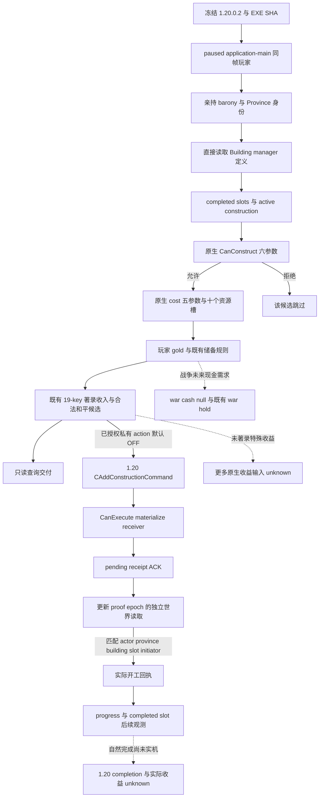

# CK3 1.20.0.2 玩家地产经济建设迁移

截至 2026-10-01，玩家直接持有地产、原生建筑定义、建设合法性、原生费用、实际建设状态和已有地产建筑提交均已迁移为新的 `xar::ck3_12002` provider。离线 ABI 校验与独立 MSVC fixture 为 GREEN，能力状态为 **`static-ready`，1.20 paused 实机待验**。本工作包没有启动、连接、注入、查看或操作本地 CK3。

迁移输入为 [2026-09-30 非战争交接](../handover/2026-09-30-nonwar-maintainer-vacation-handoff.md)，对应 Git commit `46ca368cebfaff64cf09c29dd6d8b0de206c661c`，以及 [原生地产建设树](domain-construction-ai.md)。本次只替换 exact-build 查询与执行绑定，沿用现有预算、候选和正式回执语义。普通新地产、domicile、宗教通用系统和完整税收 ROI 没有扩入此次能力。

## 冻结版本与原生输入

冻结二进制为 `artifacts/migrations/2026-09-30/post-update-1.20.0.2/installation/binaries/ck3.exe`，版本 `1.20.0.2`，文件大小 `101039736`，SHA-256 `AE1BA6FF060BA603842F6F4A2DED0AF4B7D3666B3DD271F75FB01B0DA8E81B2D`。PE64 ImageBase 为 `0x140000000`，SizeOfImage 为 `0x61C5000`。

原版 AI 的已有地产建筑提交链闭合在 `0x1A7FF67..0x1A80011`：构造 `CAddConstructionCommand` → 原生 CanExecute → materializer → flags 7 的全局提交 wrapper。完整命令字节、RTTI、调用边见 [已有地产建筑命令专题](construction-submit-1.20.0.2.md)。该提交链没有证明完整的 AI 建筑收益排序；现有策略继续使用已著录的保守收入候选、原生最终合法性和实际费用。未采用的 AI 高阶预算、战争未来支出、税收归属及特殊建筑收益仍是待补输入，不作为独立和平建设的完整 ROI 前置条件。

| 读取/调用节点 | 1.20.0.2 绑定 | 原生证据与语义 |
|---|---|---|
| 本地玩家与 played Character | GameData `+0x222E8`，entries `+0x58` / count `+0x64` | 每帧玩家 CharacterID 完整 generation 校验；不以 GUI 当前角色替代玩家 |
| 玩家亲持 title | Character `+0x1C0` → land-state IDs `+0x1E0` / capacity `+0x1E8` / count `+0x1EC` | 原生 held-title 枚举 `0x2BB11E0`；输入 data/count 是直接 load，capacity 是原生 vector descriptor 布局推导 |
| 亲持 barony → Province | Title ID `+0x10`，holder `+0x128`，template `+0x48` → tier `+0x64`，Province `+0x338` | full-generation TitleID、holder == player、tier == 1；ProvinceID 与游戏 province-array 双向对应。county 有效 holder 不等于亲持 barony |
| Title storage | `0x5D1DAF8` / fallback `0x5D1DAE0` | 完整身份校验，保持同帧玩家作用域 |
| Building manager | global `0x5C67540`，getter `0x8D1670` | 原生命令调用 getter → definition lookup `0x29860B0` |
| Building definition vector | data `+0x50` / capacity `+0x58` / count `+0x5C` | lookup `0x2986163..0x2986180` 直接读 count/data；独立于 CHoldingView 缓存 |
| CBuildingType | primary vtable `0x48B6CC8`，TypeDescriptor `0x5586BB8` | exact RTTI 与 ctor vtable 写入；各定义 ID/key 校验 |
| 最终建设合法性 | `0x2C77D50` | 六参数：玩家 CharacterID、ProvinceID、definition、slot、true、null tooltip；命令 validator `0x29824C1` 直接调用 |
| 费用 | `0x2C247C0` | 五参数：output[10]、Province*、definition `+0x6F518`、`*(definition+0x6F510)`、同帧玩家 Character*；caller `0x29823EF` 明确写第五参数 |
| 玩家 gold | Character `+0x1B0` → extension `+0x100` | 原生 affordability `0x310E7D6` / `0x310E7F1`；scale `100000` |
| 地产 completed slots | Province `+0x620` → array `+0x10`，slot count `+0x1C`，stride `0x10` | 原生合法性遍历已建建筑 slot；读空 slot 与已建 ID，供候选及回执使用 |
| active construction | holding `+0x68` definition、`+0x70` slot、`+0xD8` initiator | 原生开始建设 writer `0x24677D0`；不能以队列 ACK 替代 |
| progress | holding remaining work `+0x80`、divisor `+0xE0` | `0x2467D20` 读取 divisor 并减少 work；零与读取失败分开表达 |
| province monthly income | Province `+0x718` | CMonthlyIncomeTrigger getter `0x2B41FD0`；省份汇总 raw，不等于此建筑独占税收或玩家最终收入 |

旧版费用 adapter 的四参数声明不足以迁移新版调用现场：第五参数必须是同帧、完整身份解析的玩家 Character 指针，不能凭旧偏移猜测或省略。当前 [process adapter](../../ck3_autonomous_player/native_bridge/src/ck3_12002_construction_process.cpp) 已按上述真实原生调用实现；独立 fixture 在自有内存中实际调用新 binder，并检查所有六个合法性参数与五个费用参数。

## 决策树与策略边界



本次保留现有 19 个 tier-one 收入 key。新原版 `00_standard_economy_buildings.txt` SHA-256 为 `33A6253E89ACD0DA1C0242BD441987817DC5386325694F92BBE635F657FBD0E8`，见 [著录快照](../../ck3_autonomous_player/native_bridge/research/ck3_12002_construction_authored_income.json)。所有 19 个已有数值均与原版 1.20 著录一致，`farm_estates_01` authored monthly income 仍为 `0.70`。著录表不是玩家最终入账，也不是全原版正收入建筑目录；`positive_income_coverage_complete` 继承现有 wire 字段名，仅表示当前有限候选范围覆盖，不能据此声明特殊建筑与全部收益排序已完成。

交接中的 `farm_estates_01 / 180 gold / 0.70` 是 **1.19 的只读机会证据**，从未证明扣款、开工、完工或收入回流。新静态资产的 `normal_building_tier_1_cost` 是 `150`；它是 authored base，不能替代 1.20 的原生有效费用。1.20 每帧会调用新 cost binder 得到实际修正后的资源槽。战争 future-cash 与 shared commitment 继续保留未知状态，独立合法的和平建设无需等待全税收 ROI 闭合。

## 代码与接口

[construction.hpp](../../ck3_autonomous_player/native_bridge/src/ck3_12002_construction.hpp) 提供新 held/world reader 和新 cost/legal binder；[construction.cpp](../../ck3_autonomous_player/native_bridge/src/ck3_12002_construction.cpp) 负责版本绑定、有限候选、资源与状态读取；[construction_held.cpp](../../ck3_autonomous_player/native_bridge/src/ck3_12002_construction_held.cpp) 负责玩家亲持来源。对旧命名空间仅复用已经引入的 DTO 和纯语义候选函数，没有把 1.19 的地址用于新游戏。

[construction_mailbox.hpp](../../ck3_autonomous_player/native_bridge/src/ck3_12002_construction_mailbox.hpp) 的 `ConstructionMailboxContextV1` 包含旧 receipt DTO `query` 和新 `CoreBindings core`。入口是 `ExecuteConstructionMailboxV1`，serializer 为 `SerializeConstructionMailboxV1`。central bridge 在 1.20 选新入口，世界查询返回 `player_world_building_sources.status=source_available` 才算本能力成功。顶层历史 GUI `status=unavailable`、`player_model_sources=unavailable`、`gui_cache_sampled=false` 是未读取 GUI 的事实，不能把这些字段伪装成可用。

新 receipt 添加 `game_version=1.20.0.2`、`source_binding=direct-world-building-manager`，沿用 native cost 八槽 selected-row 投影与十个原始槽、玩家 gold、directly held provinces、active/completed 状态与候选；八槽投影仅供比较，不能把未闭合的资源意义当成已证实。`request_private_action` 保持原默认 OFF；显式私有 submit 的成功只进入 `pending_receipt` / `applied=false`。正式完成必须由 fresh world source、proof epoch 和原有回执/冷恢复协议确认。

## 离线验证与下一次实机入口

新 [ABI 合同](../../ck3_autonomous_player/native_bridge/research/ck3_12002_construction_abi.json) 和 [verifier](../../ck3_autonomous_player/native_bridge/research/verify_ck3_12002_construction.py) 已一次校验冻结 EXE：11 个 exact spans、7 条原生调用边、10 个 held-layout 指令检查、manager global 和 definition RTTI。命令 verifier 另已通过 18 spans / 13 calls / 3 RTTI。已有失败尝试属于编译/fixture 修正记录，没有被描述为 capability live RED。

`run_ck3_12002_construction_tests.py` 在 MSVC `/W4 /WX /permissive-` 的 `/Od` 与 `/O2` 均 GREEN：query provider 使用自有稀疏内存，覆盖玩家/亲持来源、定义与 slot、原生合法性、费用、gold、construction progress 与 completed 状态；process fixture 使用自有 fake image 与函数 trampoline，实际验证五/六参数 binder。submit fixture 的两种构建均 GREEN，覆盖新 typed command、拒绝与回收、pending ACK 和 fresh 实际状态回执。没有读取或写入游戏进程。

`run_ck3_12002_construction_serializer_tests.py` 另在 `/Od` 和 `/O2` 实际调用新 producer serializer，输出 query-only 与 pending-action JSON。两种构建都验证：顶层历史 GUI unavailable、独立 world source available、8/10 资源槽长度、1.20 provenance、只读查询无 action、pending ACK 的 `applied=false`。未执行的 native/mailbox 入口仅有 link stub，测试断言 executor 调用次数为零。最初错误的“三槽”测试期望已作为 `attempt-01-result-red.json` 保留，它是 harness RED，实际生产 wire 一直为 8/10。

本轮结果与日志保存在 `artifacts/nonwar-12002-offline-2026-10-01/construction/`：`econ12002-tests/result.json` SHA-256 `70db5861df8fba823395baddab3d337f53d5007e35fe12d73a01a8f9f7dbe006`，`econ12002-tests/exact-binding-result.json` SHA-256 `ee482d3af9b40a10b1306e4fab403238e2133efbfbbd1f081dff4adbaf2a68a9`；`submit-test/standalone-result.json` SHA-256 `c95908f917be7e7146fd6570226a1ddf94454e4befd4ff14d9f1189e12195da0`。该目录的 `artifact-manifest.json` 列明全部结果、producer dump、日志与哈希。原始编译目录仍位于 `Z:/ck3_mod_rewrite/.task-tmp/nw12002/.task-tmp/`，长期保留证据使用上述 artifact 副本。

```text
python ck3_autonomous_player/native_bridge/research/verify_ck3_12002_construction.py --ck3-executable <frozen-exe> --output <Z-result.json>
python ck3_autonomous_player/native_bridge/research/run_ck3_12002_construction_tests.py --build-root <Z-build-dir>
python ck3_autonomous_player/native_bridge/research/run_ck3_12002_construction_serializer_tests.py --build-root <Z-build-dir>
```

所有静态施工完成后的实机入口是：paused 玩家生产来源 → 读取真实 1.20 cost/legal/gold/slot → 选择符合原储备规则的一个和平经济建筑 → 显式 submit → 独立 fresh active/initiator/progress 和 gold 差值回执 → 后续 completed 与收入观测。实机矩阵必须保留自然完工与实际收益不足的证据边界；旧 artifact、测试进程、自有 fixture ACK 均不能升级为 1.20 `fixture-live` 或 `production-live loop`。
