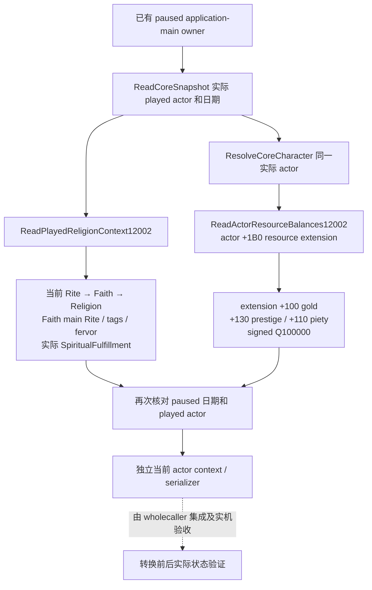

# 1.20.0.2 转换结果：当前玩家身份与资源独立观测

此组件为宗教转换后的独立结果查询提供当前玩家的宗教身份、精神满足度和余额。它也可用于转换前的独立采样；调用时不接收目标、费用报价或命令 ACK，不从这些信息推算花费或满足度变化。项目所有者已允许宗教研究并停止战争研究，本包没有战争依赖、转换动作或策略。

冻结版本为 **CK3 1.20.0.2 Crozier / Steam build 25588574**，EXE SHA-256 为 `AE1BA6FF060BA603842F6F4A2DED0AF4B7D3666B3DD271F75FB01B0DA8E81B2D`。组件状态为 **static-ready**；本包没有 CK3 paused artifact，不标记 `fixture-live`、`production-live primitive` 或完整转换循环。

## 实际读取路径

本包复用 [当前宗教 provider](ck3-1.20.0.2-religion-context.md) 与已有 Snapshot 资源叶 [ReadActorResourceBalances12002](../../ck3_autonomous_player/native_bridge/src/ck3_12002_actor_resources.cpp)，没有新定义一套资源布局。当前 Rite、Faith、Religion 是各自的 full ID；角色 `+0xB4` 的 Rite ID 不冒充 Faith ID。原生精神满足度 getter 的缓存与默认求值语义保持原样。



资源叶首先核对 `Character+0x18` 的完整 actor 身份，再读取 `Character+0x1B0` 的扩展指针。三个公开余额均为 `int64_t`、`raw_scale=100000`；负值保留。该已有叶还会读取扩展 `+0x2F8` 的 stress，但本包不公开 stress。扩展指针不存在时，已有资源叶返回实际合法零余额；读取失败返回 `resources_unavailable` 与三个 `null`，不伪装成零。

宗教 getter 与资源叶的旧 exact-build 证据直接复用，不重复旧组件矩阵。此次 [source contract](../../research/conversion_outcome12002_actor_source_contract.json) 固定既有代码、ABI manifest 和 receipt 的 SHA，同时记录新组件实际调用的复用入口；它不是新增资源 getter 的逆向证明。精神满足度与虔诚仍是独立资源。

## 接线接口与 wire

[header](../../ck3_autonomous_player/native_bridge/include/xar_bridge/conversion_outcome12002_actor.hpp) 和 [实际 reader / serializer](../../ck3_autonomous_player/native_bridge/src/conversion_outcome12002_actor.cpp) 位于 namespace `xar::ck3_12002::religion_conversion::outcome::actor`：

```cpp
Bindings BindConversionOutcomeActorImage12002(uintptr_t module_base, string_view exe_sha);
bool ReadPlayedConversionOutcomeActor12002(const Bindings&, uint64_t capture_epoch, Context&);
string SerializeConversionOutcomeActor12002(const Context&);
```

`Bindings` 含已有 `religion::Bindings current_religion`、`ActorResourceReadMemory12002 read_memory` 和 `void* memory_context`。binder 通过既有宗教 exact-build binder 决定可用性；资源 callback 是当前模块内的只读复制，没有进程发现或附加。fixture 可注入上述原生 getter 与资源复制 callback，实际 reader 保持不变。

`Context` 公开 `available`、`failure`、`capture_epoch`、`date_raw`、`played_character_id`、完整 `religion::Context current_religion`，以及可选 `piety_raw`、`gold_raw`、`prestige_raw`。它先采样当前宗教，再采样资源，最后复用 core 核对相同 paused 日期、played actor 与 actor 对象。读失败保留实际 failure；如果宗教已成功、资源失败，嵌套宗教结果仍保留，并明确整个 actor context 不可用。

actor serializer 的 schema 为 `ck3_12002_conversion_outcome_actor_v1`，保留以上内容，嵌套既有 `ck3_12002_religion_context_v1`。它同时输出 exact build、`read_only=true`、`raw_scale=100000`、`conversion_causality_inferred=false`。`capture_epoch` 是 owner capture epoch，不替代 public snapshot revision。这个组件不拥有独立 MCP selector；wholecaller 负责同帧目标核对、knowledge / flags、domain runtime 与完整 command-result。

结果样本可以记录真实前后余额和身份，但单靠两个数值或 ACK 不能把全部差额归因于转换。该 provider 没有 delta、quote、ACK 输入，不输出“已扣除报价”或固定精神满足度增量。实际转换动作及其前后实机验收由独立工作包完成。

## 一次必要组件验证

[新 C++ fixture](../../ck3_autonomous_player/native_bridge/src/conversion_outcome12002_actor_test.cpp) 通过 [新 runner](../../research/conversion_outcome12002_actor_tests.py) 链接实际 core、宗教 provider、资源叶、新 actor reader 与新 serializer。MSVC `/W4 /WX /Od`、`/O2` 各通过 **15 checks / 8 cases**，每种模式输出 **4 份实际 serializer JSON**，均由 Python 解析。

覆盖前后独立当前样本、Rite 合法零和高位 generation、signed piety / gold / prestige、独立精神满足度、旧样本拥有值、合法不存在资源扩展、资源读失败、宗教 getter 失败、读取期间日期变化、非暂停帧与 exact-build binder。前样本为 `piety_raw=0`、`gold_raw=-123456`、`prestige_raw=-7654321`；后样本为 `piety_raw=-17012345`、`gold_raw=9876543`、`prestige_raw=3456789`、`spiritual_fulfillment_raw=-223456`，直接来自夹具的当前对象状态，没有转换报价或固定增量。

夹具中的宗教 getter 和对象来自测试进程，没有调用游戏 EXE 内函数。成功 receipt 为 `Z:/ck3_mod_rewrite/artifacts/g2-offline-2026-10-01/religion-conversion-outcome/actor/fixture/attempt-2/result.json`。首次 `attempt-1` 保留为 **harness compile RED**：新测试将 unsigned Rite optional 与 signed `0` 比较，在 `/WX` 下触发 C4389；只将该测试字面量改为 `0u` 后完成上述首次有效矩阵。没有改旧源、重跑旧资源 / 宗教 fixture 或发生 capability/live RED。

本包 delivery 与 source SHA 位于 `Z:/ck3_mod_rewrite/artifacts/g2-offline-2026-10-01/religion-conversion-outcome/actor/delivery-result.json`。剩余工作是 wholecaller 首次接线验证和 root 的实际 paused 查询；在实际前后 snapshot 出现前，不把本包静态样本记成 live 结果。
